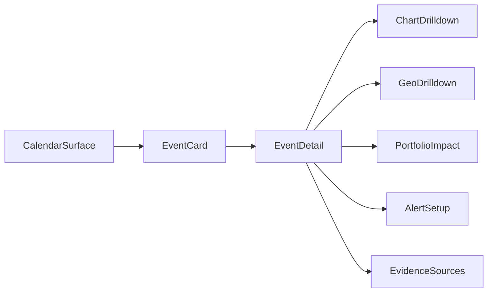

# FRONTEND_INTELLIGENCE_CALENDAR

> Stand: 16 Mar 2026  
> Rolle: Frontend owner doc for Event Intelligence Calendar surface  
> Quelle: Extracted from `docs/MRKTEDGE.AI-deep research chatgptp2.md` (frontend-focused transfer)

---

## 1. Purpose and Product Role

This document defines the frontend contract for an intelligence-grade calendar, not a simple date list.

Core objective:

- convert macro/event releases into decision-ready UI objects
- show expectation range, surprise context, impact potential, and action drilldowns
- keep one shared context model across `ResearchHome`, `Calendar`, and `Workspace`
- make the calendar operational: pre-event preparation, post-event surprise interpretation, and one-click drilldown

---

## 2. Scope and Non-Scope

## 2.1 In scope

- calendar surface IA and UX flows
- event card anatomy and detail panel behavior
- surprise/impact visualization in frontend
- links to chart, geo, portfolio, alerts, and evidence
- frontend state ownership and caching strategy
- frontend acceptance gates

## 2.2 Out of scope

- provider ingestion internals
- backend risk/policy engine internals
- queue/workflow implementation details
- security authority ownership (owned in security/spec docs)

---

## 3. Surface Architecture

Primary routes:

- `/calendar` or calendar module within `ResearchHome`
- `/event/:eventId` for deep event detail
- deep links from notifications to event detail

Interaction model:

- list/timeline view for scanning
- detail drawer/panel for quick decision context
- full detail page for evidence-rich investigation
- calendar is an operational entry surface, while `ResearchHome` remains the broader context-first entry

Placement note:

- Final placement must be evaluated in global app context (navigation, shell boundaries, existing surface ownership, and rollout risks), not treated as fixed from this doc alone.



---

## 4. Event UI Model (Frontend Contract)

Minimum frontend-consumed event object:

```ts
type EventIntelligence = {
  eventId: string;
  title: string;
  region: string;
  category: "macro" | "central_bank" | "earnings" | "geopolitical" | "other";
  scheduledAt: string;
  expectedRange?: { min?: number; consensus?: number; max?: number };
  actual?: number | string | null;
  surpriseScore?: number | null;
  impactScore?: number;
  impactBand?: "low" | "medium" | "high" | "critical";
  affectedAssets: string[];
  playbook: Array<{
    scenario: string;
    bias: string;
    note?: string;
  }>;
  confidence?: number;
  freshnessTs?: string;
  sources: Array<{ name: string; url: string }>;
};
```

Frontend hard requirements:

- never render impact/bias claims without confidence and source links
- always show freshness/staleness state
- mark unknowns explicitly (do not imply certainty)
- if expectation data exists, render `min / consensus / max` before any editorial interpretation
- if actual data arrives, render surprise context before generalized summary copy

---

## 5. Component Inventory

Required components:

- `CalendarToolbar`
  - date range, asset class, region, impact filters
- `EventList` / `EventTimeline`
  - dense scan mode, keyboard navigable
- `EventCard`
  - title, time, expected range, impact band, affected assets
- `EventPlaybookPanel`
  - scenario cards with expected market reactions
- `EventEvidencePanel`
  - source links, confidence, data freshness
- `EventDrilldownActions`
  - chart, geo, portfolio, alerts
- `EventRangeRow`
  - min, consensus, max, previous, actual where available
- `EventSurpriseState`
  - explain whether the result is in-range, above-range, or below-range

Optional (phase 2+):

- `WhatMattersNowStrip`
- volatility cluster panel
- replay of historical similar releases

---

## 6. UX Rules and Decision Clarity

Mandatory UX rules:

- range over point estimate (min/consensus/max visible where available)
- explicit surprise zones
- visual separation of `fact`, `model output`, `editorial note`
- "why this matters" copy block must map to evidence and scenario
- one-click path to affected symbols/charts
- pre-event and post-event states must look intentionally different
- playbook hints should stay concise and action-oriented rather than editorially verbose

Color semantics:

- high/critical impact must be consistent across all surfaces
- avoid color-only semantics; include text badges for accessibility

---

## 7. Frontend State and Data Flow

Recommended split:

- server state: `@tanstack/react-query`
- local UI interaction state: `zustand` or `jotai`
- runtime schema validation: `zod`

Caching guidance:

- event list: short TTL (fast-changing)
- event detail: moderate TTL + stale indicator
- evidence links: long TTL unless source health changes
- when the data path is still `local`/`fallback`, the UI should expose that mode rather than pretending full live coverage

Realtime updates:

- SSE or websocket updates merged into query cache
- deterministic dedupe by `eventId` + update timestamp

---

## 8. Backend Dependencies (Needed for This Frontend to Work)

The calendar frontend depends on backend contracts, even though this doc is frontend-owned.

Required backend capabilities:

- canonical `EventIntelligence` payloads with versioned schema
- normalized expected range fields (min/consensus/max)
- impact score and impact band calculation
- scenario/playbook field support
- confidence + source provenance
- freshness metadata and staleness reason codes

Recommended endpoints (contract-level expectation):

- `GET /api/v1/events`
- `GET /api/v1/events/:id`
- `GET /api/v1/events/:id/related`
- `POST /api/v1/alerts/subscriptions` (policy-gated)

Failure behavior requirements:

- partial data must be renderable with explicit unknown states
- backend must send degradation reason enum, not silent nulls

Required degradation enums (minimum):

- `NO_PROVIDER_DATA`
- `STALE_DATA`
- `MISSING_EXPECTED_RANGE`
- `LOW_CONFIDENCE`
- `SERVICE_DEGRADED`

---

## 9. Package and Library Recommendations

Now (high value):

- `@tanstack/react-query`
- `zod`
- `date-fns` (or `dayjs`)
- `clsx`/utility style helpers already in stack
- `radix-ui` primitives for a11y-safe interactions

Later (only if needed):

- `fuse.js` for local fuzzy search in medium event lists
- advanced charting adapters for event overlays
- command palette linking via `cmdk`

Avoid now:

- heavy client-only analytics/replay SDKs in sensitive views
- multiple competing state libraries

---

## 10. Acceptance Gates

Must pass before rollout:

- event card latency budget met on standard datasets
- drilldown links all functional (`chart`, `geo`, `portfolio`, `alerts`)
- confidence and source panel present for all non-trivial model claims
- no uncategorized null-state rendering
- notification deep-link opens matching event detail reliably
- keyboard navigation and screen-reader basics validated
- expectation ranges and surprise states remain readable at a glance
- event detail stays useful in both pre-release and post-release modes

Global-context placement gate:

- route and surface placement is reviewed against global shell navigation and cross-surface coherence before shipping (`GlobalTopBar`, route ownership, and default landing behavior).

---

## 11. Delivery Phases (Frontend)

Phase 1:

- list/timeline + detail panel + evidence basics

Phase 2:

- playbook scenarios + impact zone visualizations

Phase 3:

- what-matters-now ranking strip + richer cross-surface links

Phase 4:

- historical comparables and power-user interaction layers

---

## 12. Ownership and Cross-Doc Links

Primary ownership:

- this doc owns frontend calendar behavior and UX contract

Related docs:

- `docs/FRONTEND_RESEARCH_HOME.md`
- `docs/specs/FRONTEND_ARCHITECTURE.md`
- `docs/specs/API_CONTRACTS.md`
- `docs/UNIFIED_INGESTION_LAYER.md`
- `docs/specs/AUTH_SECURITY.md`

---

## 13. MRKT Carryover Checklist (Must Stay Included)

These points are explicitly carried over from the benchmark and must remain in implementation scope:

- confidence + source evidence visible on every non-trivial event interpretation
- explicit `verified` vs `inferred` vs `unknown` rendering discipline in UI copy
- surprise and impact are first-class, not hidden secondary fields
- event-to-decision drilldown path remains one-click to chart/geo/portfolio/alerts
- notification behavior includes deep-link correctness and stale-state handling
- no "certainty wording" when confidence is low or source coverage is incomplete
- expectation range (`min / consensus / max`) is first-class when available
- calendar stays coupled to research context instead of becoming a standalone date grid product
