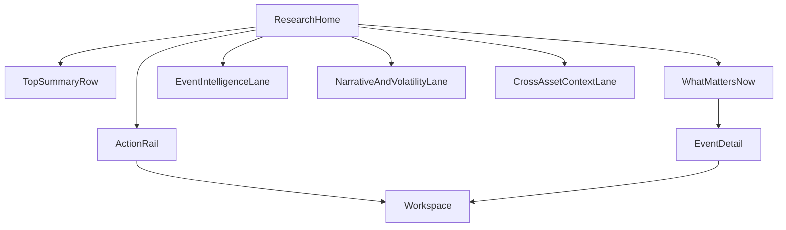

# FRONTEND_RESEARCH_HOME

> Stand: 16 Mar 2026  
> Rolle: Frontend owner doc for the Research/Decision Home surface  
> Quelle: Extracted from `docs/MRKTEDGE.AI-deep research chatgptp2.md` (frontend-focused transfer)

---

## 1. Purpose and Product Role

This document defines the frontend contract for `ResearchHome` as the primary decision entry.

Product intent:

- users should understand market context before execution
- users should move frictionlessly from context to action
- `ResearchHome` and `Workspace` must behave as one connected system, not two products
- `ResearchHome` and `Calendar` are two entry surfaces into the same decision system, not competing destinations

---

## 2. Scope and Non-Scope

## 2.1 In scope

- information architecture of `ResearchHome`
- module hierarchy and prioritization logic
- cross-surface navigation contracts
- personalization and relevance ranking UX
- frontend acceptance and quality gates

## 2.2 Out of scope

- workspace chart/order internals
- backend ranking algorithm implementation details
- data-provider onboarding mechanics
- auth/security policy ownership (referenced only)

---

## 3. IA Blueprint

Recommended top-level layout:

- `TopSummaryRow`
  - market regime snapshot
  - current risk pulse
- `WhatMattersNow`
  - ranked events/headlines by impact x confidence x user relevance
  - explicit "why this matters now" explanation on every non-trivial card
- `EventIntelligenceLane`
  - upcoming releases with playbook hints
  - calendar-driven operational entry into event detail
- `NarrativeAndVolatilityLane`
  - actor/narrative/event volatility cards
- `CrossAssetContextLane`
  - flows/sentiment/high-impact movers
- `ActionRail`
  - quick links to workspace, event detail, alerts, geo, portfolio view

Placement note:

- Final route placement and landing behavior must be evaluated in global app context (surface navigation, shell ownership, and rollout sequencing), not fixed unilaterally in this doc.



---

## 4. Frontend Data Contract Expectations

Minimum `ResearchHome` payload sections:

```ts
type ResearchHomePayload = {
  marketSummary: {
    regime: string;
    confidence: number;
    freshnessTs: string;
  };
  mattersNow: Array<{
    id: string;
    type: "event" | "headline" | "narrative";
    title: string;
    score: number;
    confidence: number;
    reason: string;
    linkedEntityId?: string;
  }>;
  eventLane: EventIntelligence[];
  volatilityLane: Array<{
    id: string;
    kind: "actor" | "narrative" | "event";
    title: string;
    volProbability: number;
    affectedAssets: string[];
    confidence: number;
  }>;
};
```

Hard frontend requirements:

- every ranked card must include reason + confidence
- no opaque scoring labels without explanation text
- stale payloads must show freshness warning state
- event-oriented cards should prefer a canonical event-detail route, not ad hoc deep links
- local/fallback/gateway source mode must remain visible in debug/degraded states until product data path is finalized

---

## 5. UX Behavior Rules

Decision quality rules:

- always separate `signal`, `interpretation`, and `recommendation hint`
- do not phrase uncertainty as certainty
- preserve path memory when user jumps to workspace and back
- keep top-ranked cards explainable ("why this is ranked")
- when an item is event-driven, users should understand both "what changed" and "how to investigate it next"

Interaction rules:

- keyboard-first quick jump to top cards
- one-click drilldown from card to deep context
- persistent "return to previous context" affordance

---

## 6. Personalization and Ranking Presentation

Personalization input examples:

- watchlist symbols
- preferred regions/asset classes
- subscribed alert themes

Frontend responsibility:

- present relevance-adapted order without hiding global critical items
- visually mark why an item is personalized vs globally critical
- never let personalization suppress globally important macro or geopolitical catalysts

Ranking transparency:

- show compact reason chips:
  - `high impact`
  - `watchlist overlap`
  - `fresh headline cluster`
  - `policy event incoming`
  - `range break risk`
  - `geo spillover`

---

## 7. Backend Dependencies (Required for Frontend Reality)

`ResearchHome` depends on backend intelligence services:

- ranked feed endpoint with confidence and reason codes
- event and narrative linking graph
- cross-asset impact inference exposure
- freshness metadata and degradation reason enum

Required backend behaviors:

- deterministic fallback when ranking service is degraded
- stable entity IDs for cross-surface navigation
- explicit nullability semantics for partially available modules
- explicit degradation reason enums for each module block

Suggested endpoint family:

- `GET /api/v1/research/home`
- `GET /api/v1/research/matters-now`
- `GET /api/v1/research/narratives`

---

## 8. Frontend Tech Recommendations

Now:

- `@tanstack/react-query` for server-state modules
- `zod` for payload runtime checks
- `zustand`/`jotai` for transient local interaction state
- suspense-friendly skeleton architecture for multi-module loading

Optional:

- `cmdk` for power-user quick actions
- lightweight virtualization for dense lanes

Avoid now:

- over-fragmenting modules into micro-frontend complexity
- heavy replay tooling before masking/privacy controls are finalized

---

## 9. Reliability and UX Gates

Must pass:

- home load remains usable under partial module failures
- all "WhatMattersNow" items have reason + confidence
- deep links preserve context and route correctly
- stale data indicators show correctly
- keyboard navigation and reduced-motion behavior verified
- local and fallback modes remain intelligible until gateway mode replaces them
- research-to-event drilldowns must preserve a return path into the originating research context

Global-context placement gate:

- before rollout, validate placement against global surfaces (`Trading`, `Map`, `Control`, `Files`) and decide whether/when `Research` becomes a top-level surface and/or default landing route.

Nice-to-have before broad rollout:

- per-module latency telemetry in UI debug mode
- user feedback channel on ranking quality

---

## 10. Delivery Phases (Frontend)

Phase 1:

- baseline IA + matters-now cards + basic drilldowns

Phase 2:

- narrative/volatility lane + improved personalization markers

Phase 3:

- ranking explanation UX hardening + resilience states

Phase 4:

- power-user controls and advanced cross-surface shortcuts

---

## 11. Ownership and Cross-Doc Links

Primary ownership:

- this doc owns `ResearchHome` frontend IA and behavior

Related docs:

- `docs/FRONTEND_INTELLIGENCE_CALENDAR.md`
- `docs/specs/FRONTEND_ARCHITECTURE.md`
- `docs/FRONTEND_COMPONENTS.md`
- `docs/specs/API_CONTRACTS.md`
- `docs/specs/AUTH_SECURITY.md`

---

## 12. MRKT Carryover Checklist (Must Stay Included)

These benchmark-derived requirements must remain explicit:

- each ranked card shows reason + confidence + freshness
- UI distinguishes `fact`, `model output`, and interpretation text
- uncertain states are explicit (`unknown`/low confidence), never hidden
- ranking transparency survives personalization (global critical items stay visible)
- context continuity is preserved (`ResearchHome -> Event -> Workspace -> back`)
- no opaque score labels without short explainability text
- event-driven cards explain both "why now" and "where next"
- calendar and research remain one shared decision system with separate entry surfaces
