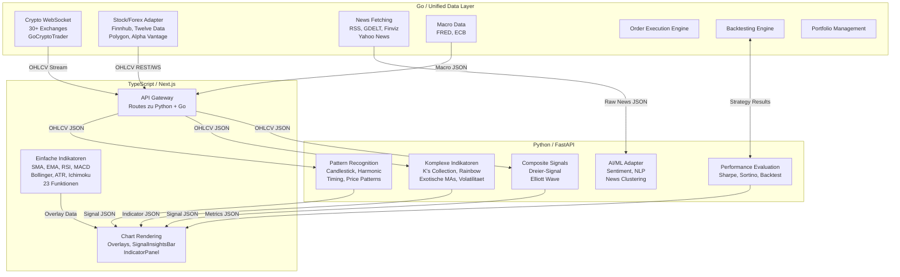

# Indikator-Architektur Blueprint

> **Stand:** 14. Februar 2026
> **Scope:** Funktionale Grenzen TS/Python/Go, Buch-Referenzen mit Zeilennummern, Composite Signal, Elliott Wave, ~32 Implementierungs-Todos
> **Buch-Pfad:** `docs/books/mastering-finance-python.md` (6469 Zeilen)
> **Primaere Indikator-Datei:** `src/lib/indicators/index.ts` (1121 Zeilen, 23 Funktionen)

---

## Inhaltsverzeichnis

1. [Architektur-Uebersicht](#1-architektur-uebersicht)
2. [Funktionale Grenze: TS vs Python vs Go](#2-funktionale-grenze-ts-vs-python-vs-go)
3. [Composite Signal: Dreier-Signal](#3-composite-signal-dreier-signal)
4. [Elliott Wave: Sonderbehandlung](#4-elliott-wave-sonderbehandlung)
5. [Buch-Referenz-Index: Kapitel fuer Kapitel](#5-buch-referenz-index-kapitel-fuer-kapitel)
6. [Legacy Cleanup Status](#6-legacy-cleanup-status)
7. [Python Indicator Service: Architektur](#7-python-indicator-service-architektur)
8. [Implementierungs-Todos (~32 Items)](#8-implementierungs-todos-32-items)

---

## 1. Architektur-Uebersicht

Drei Schichten, jede in ihrem Staerkebereich:



**Datenfluss:**
- **ALLE OHLCV-Daten kommen von der Go-Schicht:** Crypto via GoCryptoTrader WebSocket, Stocks/Forex/Macro via eigene Go-Adapter
- **News-Rohdaten** werden von Go geholt (RSS, GDELT, Finviz) und direkt an Python (AI/ML Adapter) zur Verarbeitung gesendet
- TypeScript berechnet einfache Indikatoren lokal fuer <50ms Rendering (Overlays auf dem Chart)
- Python berechnet komplexe Indikatoren, Pattern Recognition und Composite Signals (<500ms Batch)
- Ergebnisse kommen als JSON zurueck und werden im UI gerendert (SignalInsightsBar, IndicatorPanel, Alerts)

**Latenz-Anforderungen:**
- TS-Indikatoren: <50ms (interaktive Chart-Overlays, muss bei jedem Scroll/Zoom neu berechnen)
- Python-Indikatoren: <500ms (auf Anfrage oder per Schedule, nicht bei jedem Frame)
- Go-Daten: <100ms WebSocket Latenz (Echtzeit-Marktdaten)

---

## 2. Funktionale Grenze: TS vs Python vs Go

### 2.1 TypeScript -- BLEIBT in `src/lib/indicators/index.ts`

Alle 23 bestehenden Funktionen bleiben in TypeScript. Sie sind fuer latenz-kritische Overlay-Darstellung optimiert.

| # | Indikator | Funktion | Zeile | Status | Anmerkung |
|---|-----------|----------|-------|--------|-----------|
| 1 | SMA | `calculateSMA()` | L22 | KEEP TS | Standard, UI-Overlay |
| 2 | EMA | `calculateEMA()` | L40 | KEEP TS | Standard, UI-Overlay |
| 3 | WMA | `calculateWMA()` | L69 | KEEP TS | Standard, UI-Overlay |
| 4 | RSI | `calculateRSI()` | L98 | KEEP TS | Standard, Sub-Chart |
| 5 | Stochastic | `calculateStochastic()` | L144 | KEEP TS | Standard, Sub-Chart |
| 6 | MACD | `calculateMACD()` | L191 | KEEP TS | Standard, Sub-Chart |
| 7 | Bollinger Bands | `calculateBollingerBands()` | L264 | KEEP TS | Standard, Overlay |
| 8 | ATR | `calculateATR()` | L302 | KEEP TS | Standard, SignalInsights |
| 9 | HMA | `calculateHMA()` | L341 | KEEP TS | Standard, Overlay |
| 10 | ADX | `calculateADX()` | L393 | KEEP TS | Standard, Sub-Chart |
| 11 | Ichimoku | `calculateIchimoku()` | L472 | KEEP TS | Standard, Overlay |
| 12 | Parabolic SAR | `calculateParabolicSAR()` | L534 | KEEP TS | Standard, Overlay |
| 13 | Keltner Channels | `calculateKeltnerChannels()` | L606 | KEEP TS | Standard, Overlay |
| 14 | Volume Profile | `calculateVolumeProfile()` | L645 | KEEP TS | Braucht noch UI-Anbindung |
| 15 | VWAP | `calculateVWAP()` | L693 | KEEP TS | Standard, Overlay |
| 16 | VWMA | `calculateVWMA()` | L712 | KEEP TS | Standard, Overlay |
| 17 | SMA-ATR Channel | `calculateSMAATRChannel()` | L741 | KEEP TS | Custom, Overlay |
| 18 | SMA Cross Events | `detectSMACrossEvents()` | L791 | KEEP TS + Python | Ergebnisse an Python fuer Composite Signal |
| 19 | RVOL | `calculateRVOL()` | L848 | KEEP TS + Python | Ergebnisse an Python fuer Composite Signal |
| 20 | OBV | `calculateOBV()` | L867 | KEEP TS + Python | Ergebnisse an Python fuer Composite Signal |
| 21 | CMF | `calculateCMF()` | L893 | KEEP TS + Python | Ergebnisse an Python fuer Composite Signal |
| 22 | Heartbeat Pattern | `analyzeHeartbeatPattern()` | L936 | MIGRATE -> Python | Kern des Composite Signals, bleibt vorerst auch in TS |
| 23 | Support/Resistance | `findSupportResistance()` | L1044 | KEEP TS | Lokale Berechnung genuegt |

**Hinweis:** Indikatoren #18-21 bleiben in TS fuer lokale UI-Darstellung, senden ihre Ergebnisse aber AUCH an Python fuer die Composite-Signal-Berechnung. #22 (Heartbeat) wird nach Python migriert, weil die Kombinations-Logik dort laeuft. Die TS-Version kann vorerst bleiben fuer die SignalInsightsBar.

### 2.2 Python -- NEUER FastAPI Service

Alles Folgende wird NEU im Python Indicator Service implementiert. Organisiert nach Buch-Kapitel:

**Nicht aus dem Buch:**
- Composite Signal (Dreier-Signal): 50-Day + Heartbeat + Volume -- siehe Sektion 3
- Elliott Wave Detection: Eigene Implementierung -- siehe Sektion 4

**Aus dem Buch (Kapitel 3 -- Moderne Indikatoren):**
- Exotische Moving Averages: KAMA (L1795), ALMA (L1870), IWMA (L1675), OLS MA (L1587)
- Generalisierte `moving_average()` Funktion mit SMA/EMA/SMMA Selektor (L2001)
- Erweiterte Bollinger Band Techniken (L2027-2281)
- Erweiterte RSI Techniken inkl. ATR-adjusted RSI (L2282-2458)
- Rainbow Collection: 7 neue Indikatoren (L2459-2931)

**Aus dem Buch (Kapitel 4 -- Alternative Charting):**
- Heikin-Ashi Transformation (L3015)
- Volume Candlesticks (L2948)
- K's Candlesticks (L3077)
- CARSI -- Candlestick RSI (L3129)

**Aus dem Buch (Kapitel 5 -- Fibonacci):**
- `swing_detect()` -- FUNDAMENTAL fuer alle Pattern Recognition (L3370)
- Fibonacci Retracements & Projections (L3255)
- 23.6% Reintegration Technique (L3400)
- 61.8% Reactionary Technique (L3481)

**Aus dem Buch (Kapitel 6 -- Volatilitaet):**
- Spike-Weighted Volatility (L3725) -- neuartig
- Volatility Index (L3800)
- Exponentially Weighted StdDev (L3634)

**Aus dem Buch (Kapitel 7 -- Candlestick Patterns):**
- Doji (L3870), R Pattern (L3934), Bottle (L4005)
- Double Trouble (L4058), Extreme Euphoria (L4119)
- CARSI Patterns (L4178)

**Aus dem Buch (Kapitel 8 -- Harmonic Patterns):**
- ABCD (L4342), Gartley (L4477), Crab (L4579)
- Failed Extreme Impulsive Wave / FEIW (L4661)
- Harmonic Potential & Invalidation Scoring (L4696)

**Aus dem Buch (Kapitel 9 -- Timing Patterns):**
- Tom DeMark TD Setup (L4792)
- Fibonacci Timing Pattern (L4859)
- Pattern + Chart Kombinationen (L4923)

**Aus dem Buch (Kapitel 10 -- Price Patterns):**
- Double Top / Double Bottom (L4968)
- Head and Shoulders (L5071)
- Gap Pattern (L5121)

**Aus dem Buch (Kapitel 11 -- K's Collection):**
- K's Reversal Indicator I (L5260)
- K's Reversal Indicator II (L5370)
- K's ATR-Adjusted RSI (L5434)
- K's RSI-squared (L5471)
- K's MARSI (L5544)
- K's Fibonacci Moving Average (L5605)

**Aus dem Buch (Kapitel 12 -- Performance Evaluation):**
- Net Return (L5694), Hit Ratio (L5713)
- Risk-Reward Ratio (L5730), Expectancy (L5756)
- Profit Factor (L5773), Sharpe/Sortino Ratios (L5786)
- Backtesting Framework + 3 Beispiel-Evaluierungen (L5813-6067)

### 2.3 Go -- GoCryptoTrader

- GCT hat Standard-Indikatoren (SMA, EMA, RSI, MACD etc.) in seinem `indicators/` Package
- **Regel:** Keine Duplikation in Go. GCT's eigene Indikatoren werden fuer GCT-internes Backtesting genutzt
- Wenn GCT's Backtesting einen Custom-Indikator braucht, liefert der Python Service ihn via REST
- Fuer unser Projekt: GCT liefert OHLCV-Daten, Python berechnet, TS rendert

---

## 3. Composite Signal: Dreier-Signal

Das primaere Trading-Signal basiert auf drei Komponenten die zusammen ein "Ultimate Signal" ergeben.

### 3.1 Komponente 1: 50-Day SMA ("Line in the Sand")

- **Bestehend in TS:** `calculateSMA(data, 50)` Zeile L22 in `src/lib/indicators/index.ts`
- **Cross Detection:** `detectSMACrossEvents(data, 50)` Zeile L791
- **Aktiv im UI:** `src/app/page.tsx` Zeile 681 (`calculateSMA(lineData, 50)`) und Zeile 687 (`detectSMACrossEvents`)
- **Darstellung:** SignalInsightsBar zeigt "Line (Daily SMA50): above/below" + "Last Cross"
- **Python ergaenzt:** Slope Detection -- nicht nur ob Preis ueber/unter SMA50, sondern ob SMA50 SELBST steigt oder faellt
  - SMA50 flach -> beginnt zu steigen = bullisches Signal
  - SMA50 flach -> beginnt zu fallen = baerisches Signal
  - Berechnung: Differenz der letzten N SMA50-Werte, normalisiert

### 3.2 Komponente 2: Heartbeat Pattern ("Rhythm of Money")

- **Bestehend in TS:** `analyzeHeartbeatPattern()` Zeile L936 in `src/lib/indicators/index.ts`
- **Algorithmus:** Pivot-Detection + Coefficient-of-Variation (CV) fuer Period/Amplitude Stability
- **Output:** `HeartbeatAnalysis { score, cycleBars, swings, amplitudeStability, periodStability }`
- **Aktiv im UI:** `src/app/page.tsx` Zeile 696 (`analyzeHeartbeatPattern(viewCandleData, 0.02)`)
- **Darstellung:** SignalInsightsBar zeigt "Rhythm: X% (~Y bars)" mit Farbkodierung (gruen >70%, gelb >40%)
- **Python:** Kernlogik migrieren + verbessern mit `swing_detect` aus Buch Kapitel 5 (L3370) fuer praezisere Pivot-Detection
- **Schwelle:** Score > 0.7 = Seitwaerts-Konsolidierung bestaetigt (Kampf, keiner gewinnt)

### 3.3 Komponente 3: Volume = Power ("Smart Money")

- **Bestehend in TS:**
  - RVOL (Relative Volume): `calculateRVOL()` Zeile L848 -- zeigt ob Volume ueberdurchschnittlich
  - OBV (On-Balance Volume): `calculateOBV()` Zeile L867 -- kumulativer Kauf/Verkaufsdruck
  - CMF (Chaikin Money Flow): `calculateCMF()` Zeile L893 -- Geldfluss-Indikator
- **Aktiv im UI:** Alle drei im SignalInsightsBar sichtbar
- **Python ergaenzt:** Aggregation zu einem einzigen "Smart Money Score"
  - RVOL > 1.5 (Volume-Spike) + OBV steigend + CMF > 0 = bullische Power bestaetigt
  - RVOL > 1.5 + OBV fallend + CMF < 0 = baerische Power bestaetigt

### 3.4 Kombinations-Logik (NEU, nur Python)

```
BULLISH Ultimate Signal:
  SMA50 Slope steigend
  + Heartbeat Score > 0.7 (Konsolidierung endet)
  + Volume Smart Money Score bullisch
  = KAUFSIGNAL mit Konfidenz-Score

BEARISH Ultimate Signal:
  SMA50 Slope fallend
  + Heartbeat Score > 0.7 (Konsolidierung endet)
  + Volume Smart Money Score baerisch
  = VERKAUFSIGNAL mit Konfidenz-Score
```

**Output:** JSON Signal mit Konfidenz (0-1), Richtung (buy/sell), Komponenten-Breakdown, Timestamp

**Anwendbarkeit:** Auf alle Aktien weltweit anwendbar, potenziell auch Crypto. Zeitrahmen: Daily (primaer), Weekly (Bestaetigung).

---

## 4. Elliott Wave: Sonderbehandlung

### 4.1 Status Quo

- **Alte Implementierung:** `detectElliottWaves()` war in `src/chart/indicators/advanced.ts` Zeilen 27-102
- **Status:** Datei GELOESCHT (gesamtes `src/chart/indicators/` Verzeichnis wurde entfernt)
- **Bewertung der alten Implementierung:** Rudimentaer -- nur Swing Detection, keine echte 5+3 Wave-Zaehlung, keine Fibonacci-Validation zwischen Wellen, kein Degree-Labeling
- **Buch-Abdeckung:** Das Buch "Mastering Financial Markets with Python" deckt Elliott Wave NICHT ab -- nur eine Fussnote bei Zeile 751 ("Elliott wave theory is a technical analysis framework...")

### 4.2 Warum Python?

Elliott Wave ist zu komplex fuer TypeScript:
- Benoetigt rekursive Wave-Zaehlung ueber multiple Timeframes
- Fibonacci-Ratio-Validation zwischen Wellen (0.382, 0.500, 0.618, 1.618)
- Degree-Labeling (Grand Supercycle bis Subminuette)
- Alternation-Regel (Welle 2 und 4 muessen unterschiedlichen Charakter haben)
- Wave Completion Scoring (wie weit ist ein Muster abgeschlossen?)

### 4.3 Implementierungsplan

1. **Basis:** `swing_detect()` aus Buch Kapitel 5 (L3370) als Pivot-Detection Foundation
2. **Wave Counting:** 5 Impulse-Wellen (1-2-3-4-5) + 3 Corrective-Wellen (A-B-C) erkennen
3. **Fibonacci Validation:** Wellen-Ratios pruefen:
   - Welle 2 retraciert 50-61.8% von Welle 1
   - Welle 3 ist mindestens 100% von Welle 1 (oft 161.8%)
   - Welle 4 retraciert 23.6-38.2% von Welle 3
   - Welle 5 ist oft 61.8-100% von Welle 1
   - Fibonacci Levels aus Buch Kapitel 5 (L3255-3481) verwenden
4. **Output:** Wave Labels, Degree, Completion Percentage, Projected Targets
5. **Prioritaet:** HOCH -- eigenstaendige Python-Implementierung

---

## 5. Buch-Referenz-Index: Kapitel fuer Kapitel

**Buch:** "Mastering Financial Markets with Python" von Sofien Kaabar, CFA
**Datei:** `docs/books/mastering-finance-python.md` (6469 Zeilen)
**Hinweis fuer Codex:** Alle Zeilenangaben beziehen sich auf diese Datei. Lies die angegebenen Zeilen um den Python-Code und die Algorithmus-Beschreibung zu finden.

### Kapitel 1: Classic vs Modern Technical Analysis (L330-762)

**Typ:** Theorie, kein Code
**Relevanz:** Hintergrund -- erklaert warum moderne Indikatoren klassischen ueberlegen sind

| Abschnitt | Zeilen | Inhalt |
|-----------|--------|--------|
| Indicator Analysis | L494-594 | Grundlagen: Moving Averages, RSI Erklaerung |
| Modern Technical Analysis | L595-762 | Warum klassische Analyse veraltet ist, Hindsight Bias, Subjektivitaet |

**Fuer Implementierung:** Nicht direkt, aber wichtiger Kontext fuer Design-Entscheidungen.

### Kapitel 2: Exploring Time Series Analysis with Python (L762-1558)

**Typ:** Python-Grundlagen und Daten-Import
**Relevanz:** Setup-Referenz fuer den Python Indicator Service

| Abschnitt | Zeilen | Inhalt | Prioritaet |
|-----------|--------|--------|------------|
| Python Syntax & Operators | L828-899 | Grundlagen (skip fuer erfahrene Devs) | NIEDRIG |
| Variables & Data Structures | L900-1036 | pandas DataFrames, numpy Arrays | NIEDRIG |
| Control Flow & Functions | L1037-1132 | Loops, if/else, Funktionsdefinition | NIEDRIG |
| Libraries | L1133-1178 | `import pandas`, `import numpy`, `import matplotlib` | MITTEL |
| Time Series Plotting | L1179-1318 | `mplfinance` Candlestick Charts, Sampling Windows | MITTEL |
| **Historical Data Import** | **L1319-1394** | **`import_data()` Funktion -- Yahoo Finance, MetaTrader5, FRED, Manual CSV/XLSX** | **HOCH** |
| Error Handling | L1395-1558 | Try/Except, Common Errors | NIEDRIG |

**Schluessel-Funktion:** `import_data()` ab Zeile L1319 -- zeigt wie man OHLC-Daten aus verschiedenen Quellen importiert. Fuer unseren Service relevant weil wir OHLCV-Daten von GoCryptoTrader/REST-Providern empfangen.

### Kapitel 3: Modern Technical Analysis Techniques and Indicators (L1558-2939)

**Typ:** Indikatoren -- das groesste Kapitel
**Relevanz:** HOCH -- liefert 15+ neue Indikatoren die wir nicht haben

#### 3a: Exotic Moving Averages (L1574-1965)

| Indikator | Zeilen | Algorithmus | Haben wir in TS? | Aktion |
|-----------|--------|-------------|-------------------|--------|
| Weighted MA (WMA) | L1590-1674 | Gewichtete Summe, neuere Daten staerker | JA (`calculateWMA` L69) | Nur in Python wenn als Baustein noetig |
| Inverse Weighted MA (IWMA) | L1675-1754 | Umgekehrte Gewichtung, aeltere Daten staerker | NEIN | **NEU in Python** |
| Hull MA (HMA) | L1755-1794 | `WMA(2*WMA(n/2) - WMA(n), sqrt(n))` | JA (`calculateHMA` L341) | Nur in Python wenn als Baustein noetig |
| Kaufman Adaptive MA (KAMA) | L1795-1869 | Adaptiv: schnell bei Trend, langsam bei Noise, Efficiency Ratio | NEIN | **NEU in Python -- HOCH** |
| Arnaud Legoux MA (ALMA) | L1870-1965 | Gauss-gewichtet, Offset-Parameter | NEIN | **NEU in Python -- HOCH** |
| Ordinary Least Squares MA | L1587 | Lineare Regression als MA | NEIN | **NEU in Python -- MITTEL** |

#### 3b: Honorable Mentions -- Generalisierte MA Funktion (L1966-2025)

| Funktion | Zeilen | Beschreibung | Aktion |
|----------|--------|-------------- |--------|
| `moving_average()` | L2001-2017 | Generalisierte Funktion: SMA, EMA, SMMA per Parameter waehlbar | **NEU in Python** -- Basis fuer viele andere Indikatoren |
| SMMA Erklaerung | L1991-1996 | Smoothed MA = EMA mit doppeltem Lookback | Referenz |

#### 3c: New Techniques on Bollinger Bands (L2027-2281)

| Technik | Zeilen | Key Code | Haben wir? | Aktion |
|---------|--------|----------|------------|--------|
| Enhanced BB mit StdDev Rolling | L2057-2060 | Berechnung `upper_band`, `lower_band` | Ja (Basis) | Python: erweiterte Signale |
| BB Bullish/Bearish Signal Variants | L2088-2281 | 5+ verschiedene Signal-Generierungs-Methoden | NEIN | **NEU in Python** |

**Detail:** Das Buch zeigt 5 verschiedene Methoden Bollinger Bands fuer Signale zu nutzen -- nicht nur "Preis durchbricht Band" sondern auch Squeeze-Detection, Band-Width-Signale und Kombination mit anderen Indikatoren. Jede Methode hat eigene bullish/bearish Signal-Logik (L2088, L2092, L2165, L2172, L2221, L2226, L2257, L2261).

#### 3d: New Techniques on RSI (L2282-2458)

| Technik | Zeilen | Key Code | Haben wir? | Aktion |
|---------|--------|----------|------------|--------|
| ATR-adjusted RSI Signals | L2221-2261 | RSI + ATR Kombination fuer bessere Signale | NEIN | **NEU in Python -- HOCH** |
| Bollinger-on-RSI Signals | L2257-2310 | Bollinger Bands auf RSI-Werte anwenden | NEIN | **NEU in Python -- HOCH** |
| Multiple RSI Signal Approaches | L2304-2458 | Verschiedene Entry/Exit Logiken mit RSI | NEIN | **NEU in Python** |

#### 3e: Rainbow Collection -- 7 Indikatoren (L2459-2931)

Sieben eigenstaendige Indikatoren des Autors, jeder mit eigener Berechnungslogik und Signal-Generierung:

| Indikator | Zeilen | Bullish Signal | Bearish Signal | Prioritaet |
|-----------|--------|---------------|----------------|------------|
| Red Indicator | L2486-2572 | L2523 | L2532 | LOW |
| Orange Indicator | L2573-2708 | L2609 | L2618 | LOW |
| Yellow Indicator | (zwischen Orange und Green) | -- | -- | LOW |
| Green Indicator | L2709-2813 | L2741 | L2746 | LOW |
| Blue Indicator | (zwischen Green und Indigo) | -- | -- | LOW |
| Indigo Indicator | L2814-2866 | L2835 | L2848 | LOW |
| Violet Indicator | L2867-2931 | L2891 | L2901 | LOW |

**Empfehlung:** Niedrige Prioritaet, aber als Paket interessant. Alle 7 zusammen ergeben ein "Rainbow Dashboard". Implementierung als Batch sinnvoll.

### Kapitel 4: Alternative Charting Systems (L2939-3160)

**Typ:** Chart-Daten-Transformationen
**Relevanz:** MITTEL -- erzeugt alternative Darstellungsformen die Pattern-Erkennung verbessern

| System | Zeilen | Key Code | Beschreibung | Prioritaet |
|--------|--------|----------|-------------- |------------|
| Volume Candlesticks | L2948-3014 | Kerzenbreite ~ Volume | Kerzen werden breiter bei hoeherem Volume. Visuell sofort erkennbar. | MITTEL |
| Heikin-Ashi | L3015-3076 | Close/Open/High/Low Glaettung (L3047-3061) | Geglaettete Kerzen fuer bessere Trend-Erkennung. Reduziert Noise. | HOCH |
| K's Candlestick System | L3077-3128 | EMA-geglaettete OHLC (L3098) | Autor's eigene Glaettungs-Methode per EMA auf OHLC-Daten | MITTEL |
| Candlestick RSI (CARSI) | L3129-3160 | RSI-Werte als Kerzen dargestellt | RSI wird nicht als Linie sondern als Candlestick-Chart gerendert | MITTEL |

**Wichtig:** Heikin-Ashi wird in Kapitel 9 (L4923) nochmals aufgegriffen fuer Pattern-Kombination mit alternativen Charts. CARSI wird in Kapitel 7 (L4178) fuer Pattern Recognition auf RSI-Candlesticks verwendet.

### Kapitel 5: Advanced Fibonacci Analysis (L3160-3538)

**Typ:** Fibonacci + Swing Detection
**Relevanz:** KRITISCH -- `swing_detect()` ist die Basis fuer ALLE Pattern Recognition

| Abschnitt | Zeilen | Key Code | Prioritaet |
|-----------|--------|----------|------------|
| Fibonacci Retracements & Projections | L3255-3318 | Standard Fibonacci Levels (23.6%, 38.2%, 50%, 61.8%, 78.6%) | HOCH |
| **Swing Detection (FUNDAMENTAL)** | **L3319-3399** | **`swing_detect()` Funktion bei L3370** | **KRITISCH** |
| 23.6% Reintegration Technique | L3400-3480 | Support/Resistance via 23.6% Level (L3461-3463) | HOCH |
| 61.8% Reactionary Technique | L3481-3538 | Deep Retracement Detection | HOCH |

**`swing_detect()` bei Zeile L3370:**
```python
def swing_detect(my_time_series, swing_lookback=20):
    my_time_series['swing_low'] = my_time_series['low'].rolling(
        window=swing_lookback, min_periods=1, ...
    )
```
Diese Funktion ist der WICHTIGSTE Baustein des gesamten Buchs. Sie erkennt lokale Hochs und Tiefs (Swing Highs/Lows) und wird von allen Pattern-Recognition-Kapiteln (7, 8, 9, 10) als Eingabe verwendet. **MUSS ZUERST implementiert werden.**

### Kapitel 6: Advanced Volatility Indicators (L3539-3850)

**Typ:** Volatilitaets-Indikatoren
**Relevanz:** MITTEL -- erweitert unsere bestehende ATR-Basis

| Indikator | Zeilen | Key Code | Haben wir? | Aktion |
|-----------|--------|----------|------------|--------|
| Standard Deviation (Rolling) | L3576-3633 | Basis-Volatilitaet | Ja (in Bollinger Bands) | Referenz |
| Exponentially Weighted StdDev | L3634-3673 | Recency-Bias Volatilitaet | NEIN | **NEU in Python -- MITTEL** |
| Average True Range (ATR) | L3674-3724 | ATR Berechnung (L3702-3714) | Ja (`calculateATR` L302) | Referenz |
| **Spike-Weighted Volatility (SWV)** | **L3725-3799** | **Z-Score gewichtete Volatilitaet (L3727)** | **NEIN** | **NEU in Python -- HOCH** |
| Volatility Index | L3800-3850 | Composite Volatilitaets-Mass | NEIN | **NEU in Python -- MITTEL** |

**SWV ist besonders interessant:** Kombiniert Rolling StdDev mit einem Spike-Sensitivity-Faktor basierend auf Z-Scores. Reagiert dynamisch auf Markt-Turbulenzen ohne bei normalen Schwankungen ueberzureagieren.

### Kapitel 7: Candlestick Pattern Recognition (L3849-4314)

**Typ:** Mustererkennung auf Kerzencharts
**Relevanz:** HOCH -- automatische Pattern-Erkennung fehlt komplett

| Pattern | Zeilen | Bullish Signal | Bearish Signal | Beschreibung | Prioritaet |
|---------|--------|---------------|----------------|-------------- |------------|
| Doji | L3870-3933 | L3907 | L3912 | Open ≈ Close, Unentschlossenheit | HOCH |
| R Pattern | L3934-4004 | L3971 | L3983 | RSI-basiertes Reversal (exogen) | HOCH |
| Bottle Pattern | L4005-4057 | L4034 | L4040 | Body/Shadow Ratio Analyse | MITTEL |
| Double Trouble | L4058-4118 | L4090 | L4097 | Zwei-Kerzen Reversal | MITTEL |
| Extreme Euphoria | L4119-4177 | L4146 | L4157 | Erschoepfungs-Erkennung | HOCH |
| CARSI Patterns | L4178-4314 | L4219/L4262 | L4226/L4270 | Pattern Recognition auf RSI-Candlesticks | MITTEL |

**Hinweis:** Alle Patterns verwenden `swing_detect()` aus Kapitel 5 als Grundlage. CARSI Patterns setzen zusaetzlich die CARSI-Transformation aus Kapitel 4 (L3129) voraus.

### Kapitel 8: Harmonic Pattern Recognition (L4314-4754)

**Typ:** Fibonacci-basierte Muster
**Relevanz:** HOCH -- komplexeste und praeziseste Patterns

| Pattern | Zeilen | Key Code | Fibonacci Ratios | Prioritaet |
|---------|--------|----------|-----------------|------------|
| ABCD Pattern | L4342-4476 | Detection ab L4378, Labeling L4382-4409 | AB=CD, BC retraces 38.2-88.6% | HOCH |
| Gartley Pattern | L4477-4578 | 4-Leg Harmonic Structure | XA->B 61.8%, BC 38.2-88.6%, CD 127.2-161.8% | HOCH |
| Crab Pattern | L4579-4660 | Extended Harmonic | XA->B 38.2-61.8%, CD 224-361.8% | HOCH |
| Failed Extreme Impulsive Wave (FEIW) | L4661-4695 | Trend-Continuation Filter (L4663-4676) | XA->B 113-161.8%, AB->C 161.8-224% | MITTEL |
| Harmonic Potential & Invalidation | L4696-4754 | Probability Scoring + Invalidation Rules | Wann ein Pattern "ungueltig" wird | HOCH |

**Implementierungs-Reihenfolge:** ABCD zuerst (einfachstes), dann Gartley, dann Crab. FEIW und Invalidation als Erweiterung. Alle basieren auf `swing_detect()` + Fibonacci Levels.

### Kapitel 9: Timing Pattern Recognition (L4753-4958)

**Typ:** Zeitbasierte Muster (brauchen Zeit UND Preis)
**Relevanz:** HOCH -- Tom DeMark ist ein bekannter Indikator

| Pattern | Zeilen | Key Code | Beschreibung | Prioritaet |
|---------|--------|----------|-------------- |------------|
| Tom DeMark TD Setup | L4792-4858 | 9-Bar Reversal Count (L4816-4824, Bearish Setup L4893) | 9 aufeinanderfolgende Bars die eine Bedingung erfuellen = Trend-Erschoepfung | HOCH |
| Fibonacci Timing Pattern | L4859-4922 | Zeitbasierte Fibonacci | Fibonacci-Zahlen auf Zeitachse anwenden (nicht nur Preis) | MITTEL |
| Pattern + Alt Chart Kombination | L4923-4958 | Multi-Layer Confirmation | Patterns auf Heikin-Ashi anwenden fuer weniger False Positives | MITTEL |

**TD Setup Detail:** Unterscheidet zwischen "Perfected" (Bars 8/9 erfuellen Zusatzbedingung) und "Unperfected" Setup. Kapitel 12 (L5927) evaluiert die Performance beider Varianten.

### Kapitel 10: Price Pattern Recognition (L4957-5242)

**Typ:** Klassische Preis-Muster
**Relevanz:** HOCH -- grundlegende Patterns die jeder Trader kennt

| Pattern | Zeilen | Key Code | Beschreibung | Prioritaet |
|---------|--------|----------|-------------- |------------|
| Double Top / Double Bottom | L4968-5070 | Zwei gleich hohe Gipfel/Taeler | Klassisches Reversal-Pattern | HOCH |
| Head and Shoulders | L5071-5120 | Drei Gipfel, mittlerer am hoechsten | Starkes Reversal-Signal | HOCH |
| Gap Pattern | L5121-5242 | Bullish Gap (L5202), Bearish Gap (L5207) | Luecken im Chart als Signal | MITTEL |

**Alle basieren auf `swing_detect()`** fuer die Erkennung der Gipfel und Taeler.

### Kapitel 11: K's Collection -- Neue Indikatoren (L5241-5682)

**Typ:** Eigenentwicklungen des Autors
**Relevanz:** HOCH -- neuartige Indikatoren die nirgends sonst verfuegbar sind

| Indikator | Zeilen | Key Code | Beschreibung | Prioritaet |
|-----------|--------|----------|-------------- |------------|
| K's Reversal Indicator I | L5260-5369 | MACD + Bollinger Kombination (L5285-5288) | Kombiniert MACD-Linien mit Bollinger Bands fuer Reversal-Signale | HOCH |
| K's Reversal Indicator II | L5370-5433 | BB + Trend Filter (L5332-5337, L5398) | Erweitert Rev I mit strengerem Trend-Filter | HOCH |
| K's ATR-Adjusted RSI | L5434-5470 | RSI normalisiert durch ATR | RSI der sich an Volatilitaet anpasst | HOCH |
| K's RSI-squared (RSI^2) | L5471-5543 | RSI des RSI (L5567-5573) | Divergenz-Detection durch doppelten RSI | MITTEL |
| K's MARSI | L5544-5604 | Moving Average des RSI Kombination | Glaettet RSI-Signale | MITTEL |
| K's Fibonacci Moving Average | L5605-5682 | Fibonacci-gewichteter MA | Fibonacci-Zahlen als MA-Gewichte | MITTEL |

**Implementierungs-Empfehlung:** K's Reversal I+II und ATR-Adjusted RSI zuerst (hoechster praktischer Nutzen). RSI^2, MARSI und Fib MA als Erweiterung.

### Kapitel 12: Performance Evaluation (L5681-6067)

**Typ:** Metriken + Backtesting
**Relevanz:** HOCH -- ohne Performance-Evaluation sind Indikatoren wertlos

| Abschnitt | Zeilen | Beschreibung | Prioritaet |
|-----------|--------|-------------- |------------|
| Net Return | L5694-5712 | Grundlegende P&L Berechnung | HOCH |
| Hit Ratio | L5713-5729 | Trefferquote (gewonnene Trades / alle Trades) | HOCH |
| Risk-Reward Ratio | L5730-5755 | Durchschnittlicher Gewinn / durchschnittlicher Verlust (L5732) | HOCH |
| Expectancy | L5756-5772 | Erwartungswert pro Trade (L5758-5764). Positiv = profitable Strategie | HOCH |
| Profit Factor | L5773-5785 | Brutto-Gewinn / Brutto-Verlust | HOCH |
| Sharpe Ratio | L5786-5812 | Risiko-adjustierte Rendite | HOCH |
| Sortino Ratio | L5786-5812 | Wie Sharpe, aber nur Downside-Volatilitaet | HOCH |
| **Backtesting Best Practices** | **L5813-5843** | **Methodologie-Richtlinien fuer zuverlaessige Backtests** | **HOCH** |
| Eval: SMA Cross Strategy | L5844-5926 | Komplettes Backtest-Beispiel (Signal-Logik L5876-5880) | HOCH |
| Eval: TD Setup Comparison | L5927-5964 | Perfected vs Unperfected TD Setup Performance | MITTEL |
| Eval: Reversal Indicator | L5965-6067 | K's Reversal Indikator Backtest (L6033) | MITTEL |

**Wichtig:** Dieses Kapitel liefert nicht nur Metriken, sondern auch drei vollstaendige Backtest-Beispiele die als Vorlage fuer unser eigenes Backtesting dienen. Die Metriken muessen fuer JEDEN implementierten Indikator/Pattern berechenbar sein.

---

## 6. Legacy Cleanup Status

| Datei | Zeilen | Status | Aktion |
|-------|--------|--------|--------|
| `src/chart/indicators/advanced.ts` | 616 | GELOESCHT | Enthielt Elliott Wave Stub + 8 Indikatoren. Alles weg. |
| `src/chart/indicators/index.ts` | 1033 | GELOESCHT | Reimplementierung aller Indikatoren mit eigenem Typ-System. Registry-Pattern (L841) war gut. |
| `src/lib/chartData.ts` | ~80 (Indikatoren) | **EXISTIERT NOCH** | **TODO: Duplikat SMA/EMA/RSI entfernen**, durch `lib/indicators/` ersetzen |
| `src/lib/indicators/index.ts` | 1121 | AKTIV | Primaere Quelle. BLEIBT. |

**Registry-Pattern:** Das geloeschte `chart/indicators/index.ts` hatte ein `INDICATORS[]` Array mit `IndicatorDefinition` Objekten und eine `calculateIndicator()` Dispatcher-Funktion bei ~L841. Dieses Pattern ist architektonisch gut und sollte in `lib/indicators/` uebernommen werden -- ermoeglicht dynamisches Laden von Indikatoren per Name.

---

## 7. Python Indicator Service: Architektur

### 7.1 Projekt-Struktur

```
services/indicator-service/
  main.py                    -- FastAPI App, CORS, Health-Check
  requirements.txt           -- pandas, numpy, scipy, fastapi, uvicorn
  config.py                  -- Ports, Timeouts, Feature Flags

  indicators/
    moving_averages.py       -- KAMA, ALMA, IWMA, OLS, generalisierte moving_average()
    oscillators.py           -- K's RSI-Varianten (ATR-adjusted, RSI^2, MARSI)
    volatility.py            -- SWV, Volatility Index, Exp-Weighted StdDev
    bollinger_enhanced.py    -- 5+ Bollinger Signal-Techniken
    rsi_enhanced.py          -- Erweiterte RSI Techniken
    rainbow.py               -- Rainbow Collection (7 Indikatoren)
    fibonacci.py             -- Retracements, Extensions, Fib MA
    ks_collection.py         -- K's Reversal I+II, zusammengefasst

  patterns/
    swing_detect.py          -- FUNDAMENTAL: Pivot Detection (Buch Ch.5 L3370)
    candlestick.py           -- Doji, R, Bottle, Double Trouble, Euphoria, CARSI (Ch.7)
    harmonic.py              -- ABCD, Gartley, Crab, FEIW (Ch.8)
    timing.py                -- TD Setup, Fibonacci Timing (Ch.9)
    price.py                 -- Double Top/Bottom, H&S, Gaps (Ch.10)
    elliott_wave.py          -- 5+3 Wave Counting (eigene Implementierung)

  signals/
    composite.py             -- Dreier-Signal (50-Day + Heartbeat + Volume)
    heartbeat.py             -- Migriert von TS analyzeHeartbeatPattern()

  charting/
    heikin_ashi.py           -- Heikin-Ashi Transformation (Ch.4 L3015)
    volume_candles.py        -- Volume-gewichtete Kerzenbreite (Ch.4 L2948)
    k_candles.py             -- K's Candlesticks (Ch.4 L3077)
    carsi.py                 -- Candlestick RSI (Ch.4 L3129)

  evaluation/
    metrics.py               -- Sharpe, Sortino, Profit Factor, Expectancy, Hit Ratio, RRR
    backtest.py              -- Strategy Evaluation Framework (Ch.12 L5813)
```

### 7.2 API Endpoints

| Endpoint | Methode | Input | Output | Kapitel |
|----------|---------|-------|--------|---------|
| `/api/v1/indicators/exotic-ma` | POST | OHLCV[] + params | IndicatorData[] | Ch.3 |
| `/api/v1/indicators/ks-collection` | POST | OHLCV[] + params | SignalData[] | Ch.11 |
| `/api/v1/indicators/rainbow` | POST | OHLCV[] | 7x SignalData[] | Ch.3 |
| `/api/v1/indicators/volatility` | POST | OHLCV[] + params | IndicatorData[] | Ch.6 |
| `/api/v1/indicators/bollinger-enhanced` | POST | OHLCV[] + params | SignalData[] | Ch.3 |
| `/api/v1/indicators/rsi-enhanced` | POST | OHLCV[] + params | SignalData[] | Ch.3 |
| `/api/v1/patterns/candlestick` | POST | OHLCV[] | PatternData[] | Ch.7 |
| `/api/v1/patterns/harmonic` | POST | OHLCV[] | PatternData[] | Ch.8 |
| `/api/v1/patterns/timing` | POST | OHLCV[] | PatternData[] | Ch.9 |
| `/api/v1/patterns/price` | POST | OHLCV[] | PatternData[] | Ch.10 |
| `/api/v1/patterns/elliott-wave` | POST | OHLCV[] | WaveData[] | Eigene Impl. |
| `/api/v1/signals/composite` | POST | OHLCV[] | CompositeSignal | Eigene Impl. |
| `/api/v1/charting/transform` | POST | OHLCV[] + type | TransformedOHLCV[] | Ch.4 |
| `/api/v1/fibonacci/levels` | POST | OHLCV[] + params | FibLevel[] | Ch.5 |
| `/api/v1/evaluate/strategy` | POST | Trades[] + OHLCV[] | PerformanceMetrics | Ch.12 |

### 7.3 Daten-Formate

**Input:**
```json
{
  "ohlcv": [
    {"time": 1707868800, "open": 150.0, "high": 152.5, "low": 149.0, "close": 151.5, "volume": 1000000},
    ...
  ],
  "params": {
    "period": 20,
    "type": "KAMA"
  }
}
```

**Output (Indikator):**
```json
{
  "data": [{"time": 1707868800, "value": 150.5}, ...],
  "metadata": {"indicator": "KAMA", "period": 20, "points": 250}
}
```

**Output (Pattern):**
```json
{
  "patterns": [
    {"type": "gartley", "direction": "bullish", "start_time": 1707000000, "end_time": 1707800000, "confidence": 0.85, "fibonacci_valid": true, "projected_target": 155.0}
  ],
  "metadata": {"scanned_bars": 500, "patterns_found": 3}
}
```

**Output (Composite Signal):**
```json
{
  "signal": "buy",
  "confidence": 0.87,
  "components": {
    "sma50_slope": {"value": 0.15, "direction": "rising", "score": 0.8},
    "heartbeat": {"score": 0.75, "cycle_bars": 12, "swings": 8},
    "volume_power": {"rvol": 1.8, "obv_trend": "up", "cmf": 0.12, "score": 0.9}
  },
  "timestamp": 1707868800
}
```

### 7.4 Dependencies

```
# requirements.txt
fastapi>=0.109.0
uvicorn>=0.27.0
pandas>=2.2.0
numpy>=1.26.0
scipy>=1.12.0
pydantic>=2.5.0
```

---

## 8. Implementierungs-Todos (~32 Items)

Organisiert in 5 Phasen. Jedes Todo hat Datei-Referenzen und Buch-Zeilen.

### Phase A: Foundation (Python Service Scaffold + Swing Detection)

| # | Todo | Buch-Referenz | Aufwand | Abhaengigkeit |
|---|------|--------------|---------|--------------|
| 1 | `services/indicator-service/` Projekt erstellen: FastAPI App, requirements.txt, Projekt-Struktur | Ch.2 L1319 (Data Import Patterns) | 0.5 Tage | -- |
| 2 | `swing_detect()` implementieren -- FUNDAMENT fuer alle Pattern Recognition | Ch.5 L3370 | 0.5 Tage | #1 |
| 3 | Fibonacci Retracements/Projections implementieren (23.6%, 38.2%, 50%, 61.8%, 78.6%) | Ch.5 L3255-3481 | 1 Tag | #2 |
| 4 | `analyzeHeartbeatPattern()` von TS nach Python migrieren + mit swing_detect verbessern | TS L936 + Ch.5 L3370 | 1 Tag | #2 |
| 5 | `src/lib/chartData.ts` aufraumen -- duplikat SMA/EMA/RSI entfernen | -- | 0.5 Tage | -- |

### Phase B: Composite Signal + Kern-Indikatoren

| # | Todo | Buch-Referenz | Aufwand | Abhaengigkeit |
|---|------|--------------|---------|--------------|
| 6 | Composite Signal Logik bauen (50-Day Slope + Heartbeat + Volume Aggregation) | Eigene Architektur (Sektion 3) | 2 Tage | #4 |
| 7 | Composite Signal API an Next.js Frontend anbinden (API Route + SignalInsightsBar) | -- | 1 Tag | #6 |
| 8 | KAMA implementieren | Ch.3 L1795-1869 | 0.5 Tage | #1 |
| 9 | ALMA implementieren | Ch.3 L1870-1965 | 0.5 Tage | #1 |
| 10 | IWMA + OLS MA implementieren | Ch.3 L1675-1754, L1587 | 0.5 Tage | #1 |
| 11 | Generalisierte `moving_average()` mit SMA/EMA/SMMA Selektor | Ch.3 L2001-2017 | 0.5 Tage | #1 |
| 12 | Erweiterte Bollinger Band Techniken (5+ Signal-Methoden) | Ch.3 L2027-2281 | 1 Tag | #1 |
| 13 | Erweiterte RSI Techniken (ATR-adjusted, Bollinger-on-RSI) | Ch.3 L2282-2458 | 1 Tag | #1 |

### Phase C: Pattern Recognition (4 Kapitel)

| # | Todo | Buch-Referenz | Aufwand | Abhaengigkeit |
|---|------|--------------|---------|--------------|
| 14 | Candlestick Patterns: Doji, R Pattern, Bottle, Double Trouble, Extreme Euphoria, CARSI | Ch.7 L3851-4314 | 3 Tage | #2 |
| 15 | Harmonic Patterns: ABCD, Gartley, Crab | Ch.8 L4342-4660 | 3 Tage | #2, #3 |
| 16 | Harmonic Potential & Invalidation Scoring | Ch.8 L4696-4754 | 1 Tag | #15 |
| 17 | Failed Extreme Impulsive Wave (FEIW) | Ch.8 L4661-4695 | 0.5 Tage | #15 |
| 18 | Tom DeMark TD Setup + Fibonacci Timing | Ch.9 L4792-4922 | 2 Tage | #2 |
| 19 | Pattern + Chart Kombinationen (Patterns auf Heikin-Ashi) | Ch.9 L4923-4958 | 1 Tag | #18, #25 |
| 20 | Double Top/Bottom, Head & Shoulders, Gap Pattern | Ch.10 L4968-5242 | 2 Tage | #2 |
| 21 | Elliott Wave Detection: swing_detect -> 5+3 Wave Counting -> Fibonacci Validation | Eigene Impl. + Ch.5 | 3-5 Tage | #2, #3 |

### Phase D: K's Collection + Volatilitaet + Evaluation + Charting

| # | Todo | Buch-Referenz | Aufwand | Abhaengigkeit |
|---|------|--------------|---------|--------------|
| 22 | K's Reversal I + K's Reversal II | Ch.11 L5260-5433 | 1 Tag | #1 |
| 23 | K's ATR-Adjusted RSI + K's RSI^2 | Ch.11 L5434-5543 | 1 Tag | #1 |
| 24 | K's MARSI + K's Fibonacci MA | Ch.11 L5544-5682 | 1 Tag | #1 |
| 25 | Heikin-Ashi + Volume Candlesticks + K's Candles + CARSI Charting | Ch.4 L2948-3160 | 2 Tage | #1 |
| 26 | Rainbow Collection (7 Indikatoren als Batch) | Ch.3 L2459-2931 | 2 Tage | #1 |
| 27 | Spike-Weighted Volatility + Volatility Index + Exp-Weighted StdDev | Ch.6 L3634-3850 | 1 Tag | #1 |
| 28 | Performance Metriken: Net Return, Hit Ratio, RRR, Expectancy, Profit Factor, Sharpe, Sortino | Ch.12 L5694-5812 | 1-2 Tage | #1 |
| 29 | Backtesting Framework + SMA Cross Eval + TD Setup Eval + Reversal Eval | Ch.12 L5813-6067 | 2-3 Tage | #28 |

### Phase E: Integration + Querschnitt

| # | Todo | Referenz | Aufwand | Abhaengigkeit |
|---|------|---------|---------|--------------|
| 30 | Python Indicator Service an GoCryptoTrader anbinden (OHLCV via REST) | project_audit2.md Sektion 9 | 1 Tag | #1 + GCT Fork |
| 31 | Next.js API Routes als Proxy zu Python Endpoints bauen | -- | 1-2 Tage | #1 |
| 32 | IndicatorPanel UI-Eintraege fuer Python-berechnete Indikatoren | `src/components/IndicatorPanel.tsx` | 1-2 Tage | #31 |
| 33 | SignalInsightsBar Eintraege fuer Composite Signal + Pattern Alerts | `src/features/trading/SignalInsightsBar.tsx` | 1 Tag | #31 |
| 34 | Registry-Pattern aus geloeschtem `chart/indicators/index.ts` (~L841) in `lib/indicators/` uebernehmen | -- | 0.5 Tage | -- |

---

## Querverweis-Tabelle

| Wenn du an ... arbeitest | Lies in ... |
|--------------------------|-------------|
| Python Service Setup | Dieses Dokument Sektion 7 |
| Composite Signal (Dreier-Signal) | Dieses Dokument Sektion 3 |
| Elliott Wave | Dieses Dokument Sektion 4 |
| Pattern Recognition allgemein | Dieses Dokument Sektion 5, Kapitel 7-10 |
| GoCryptoTrader Integration | `project_audit2.md` Sektion 9 |
| Externe Projekte / Libraries | `REFERENCE_PROJECTS.md` |
| TS Indikator Cleanup | Dieses Dokument Sektion 6 + `project_audit2.md` Sektion 2 |
| Backtesting + Performance | Dieses Dokument Sektion 5, Kapitel 12 |

