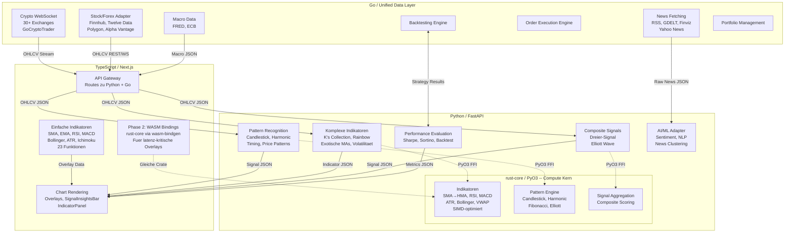

# Indikator-Architektur Blueprint

> **Stand:** 19. Februar 2026
> **Scope:** Funktionale Grenzen TS/Python/Rust/Go, Buch-Referenzen mit Zeilennummern (3+ Buecher), Composite Signal, Elliott Wave, Regime Detection, Walk-Forward, Position Sizing, Alternative Bars, Monte Carlo, HRP, VPIN, **Portfolio Analytics (Korrelation, Rolling Metriken, Drawdown, Regime-Sizing, Kelly Multi-Asset)**, ~57 Implementierungs-Todos
> **Buch-Pfad:** `docs/books/mastering-finance-python.md` (6469 Zeilen)
> **Ergaenzende Quant-Buecher:** `advanced-in-financial-markets-ml.md` (AFML), `quantitative-trading.md` (QT), `python-for-finance-(quant-extension).md` (PfF)
> **Primaere Indikator-Datei:** `src/lib/indicators/index.ts` (1121 Zeilen, 23 Funktionen)
> **Rust-Strategie:** [`docs/RUST_LANGUAGE_IMPLEMENTATION.md`](./RUST_LANGUAGE_IMPLEMENTATION.md) -- Rust als Acceleration Layer unter dem Python-Service via PyO3
>
> **Fortschritt (15. Februar 2026):**
> - `python-backend/services/indicator-service/app.py` ist als baseline vertical slice umgesetzt.
> - Baseline-Endpunkte fuer `signals/composite`, `patterns/*`, `indicators/exotic-ma`, `indicators/ks-collection`, `fibonacci/levels`, `charting/transform`, `evaluate/strategy` sind live.
> - Smoke-Runner vorhanden: `bun run smoke:indicator-service`.
>
> **Update (18. Februar 2026):**
> - Rust-Evaluierung abgeschlossen: Rust/PyO3 ersetzt ta-lib + numba als Compute-Beschleuniger (siehe Sektion 0.8).
> - [Kand](https://github.com/kand-ta/kand) als potentielle Basis-Library identifiziert (Rust TA-Lib mit PyO3 + WASM Bindings).
> - Alle Endpoints, Phasen und Todos bleiben unveraendert -- Rust geht UNTER den Python-Service, nicht daneben.

---

## Inhaltsverzeichnis

0. [Heavy Indicators & ML/AI -- SOTA 2026](#0-heavy-indicators--mlai----sota-2026)
    - 0.1-0.7: Sync/Async, Caching, ML/AI, Skalierung, Dependencies
    - [0.8 Rust Acceleration Layer (PyO3)](#08-rust-acceleration-layer-pyo3)
1. [Architektur-Uebersicht](#1-architektur-uebersicht)
2. [Funktionale Grenze: TS vs Python (Rust) vs Go](#2-funktionale-grenze-ts-vs-python-vs-go)
3. [Composite Signal: Dreier-Signal](#3-composite-signal-dreier-signal) (inkl. 3.5 Multimodale Fusion, 3.6 Bias-Validierung)
4. [Elliott Wave: Sonderbehandlung](#4-elliott-wave-sonderbehandlung)
5. [Buch-Referenz-Index: Kapitel fuer Kapitel](#5-buch-referenz-index-kapitel-fuer-kapitel)
    - inkl. 5q: [Markov Chain Patterns](#5q-markov-chain-patterns--stochastische-zustands-modelle-todo-60) (Regime HMM, Signal Chain, MCMC, Order Flow)
6. [Legacy Cleanup Status](#6-legacy-cleanup-status)
7. [Python Indicator Service: Architektur](#7-python-indicator-service-architektur)
8. [Implementierungs-Todos (~50 Items)](#8-implementierungs-todos-50-items)

---

## 0. Heavy Indicators & ML/AI -- SOTA 2026

> **Kontext:** Das Buch "Mastering Financial Markets with Python" liefert 30+ Indikatoren und Patterns.
> Viele davon sind **rechenintensiv** (Harmonic Pattern Scan ueber 1000+ Bars, Elliott Wave mit rekursiver
> Fibonacci-Validation, Hurst Exponent, Entropy-Berechnungen). Diese Sektion definiert die Architektur-
> Regeln fuer Heavy Compute und die Erweiterung Richtung ML/AI-Modelle.

### 0.1 Synchron vs. Asynchron -- Entscheidungsmatrix

| Berechnungsdauer | Pattern | Architektur | Beispiele |
|------------------|---------|-------------|-----------|
| **< 200ms** | Einfache Indikatoren | **Synchron** im HTTP-Request | KAMA, ALMA, exotic MAs, einzelne Candlestick Patterns |
| **200ms - 2s** | Mittelschwere Indikatoren | **Synchron mit Timeout** (2s hard limit) | Harmonic Pattern Scan, K's Collection Batch, Rainbow (7x), Composite Signal |
| **> 2s** | Schwere Berechnungen | **Asynchron mit Job-Queue** | Elliott Wave (rekursiv, multi-timeframe), Full Backtest ueber 5+ Jahre, ML Feature Engineering |

### 0.2 Synchrones Pattern (< 2s) -- Was wir heute haben

```python
@app.post("/api/v1/indicators/exotic-ma")
async def exotic_ma(payload: OHLCVRequest) -> IndicatorResponse:
    return compute_exotic_ma(payload.ohlcv, payload.params)
```

**Best Practices fuer synchrone Heavy-Berechnungen:**
- Numpy/Pandas **vectorized operations** -- NIEMALS Python for-Loops ueber Candles
- **Rust/PyO3** (`rust-core`) fuer Standard-Indikatoren und CPU-intensive Berechnungen (10-100x schneller als Pure Python, ersetzt bisherigen ta-lib + numba Ansatz -- Details siehe [Sektion 0.8](#08-rust-acceleration-layer-pyo3))
- Ergebnisse **cachen** wenn dasselbe Symbol + Timeframe + Parameter innerhalb TTL angefragt wird
- Input-Limit: max 2000 Candles pro Request (reicht fuer 8 Jahre Daily, 3 Monate 1h)

### 0.3 Asynchrones Pattern (> 2s) -- Job-Queue Architektur

```
Client                     Indicator Service                  Worker (Celery/ARQ)
  |                              |                                  |
  |-- POST /jobs/elliott-wave -->|                                  |
  |<-- 202 {"jobId":"abc123"} --|-- enqueue(elliott_wave, data) -->|
  |                              |                                  |-- compute...
  |-- GET /jobs/abc123 -------->|                                  |    (5-30s)
  |<-- 200 {"status":"pending"}-|                                  |
  |                              |                                  |
  |-- GET /jobs/abc123 -------->|<-- result ----------------------|
  |<-- 200 {"status":"done",    |                                  |
  |         "result":{...}} ----|                                  |
```

**Implementierung (wenn noetig, Phase E+):**

```python
# Job-Submission Endpoint
@app.post("/api/v1/jobs/{indicator_type}", status_code=202)
async def submit_job(indicator_type: str, payload: OHLCVRequest) -> JobResponse:
    job_id = str(uuid4())
    await job_queue.enqueue(indicator_type, job_id, payload)
    return JobResponse(jobId=job_id, status="pending", pollUrl=f"/api/v1/jobs/{job_id}")

# Job-Status Endpoint
@app.get("/api/v1/jobs/{job_id}")
async def get_job(job_id: str) -> JobStatusResponse:
    return await job_store.get(job_id)  # Redis-backed
```

**Job-Queue Technologie-Wahl:**

| Option | Pro | Contra | Empfehlung |
|--------|-----|--------|------------|
| **ARQ** (async Redis queue) | Leichtgewichtig, async-native, Python | Weniger Features als Celery | **EMPFOHLEN fuer uns** -- passt zu FastAPI async |
| Celery + Redis | Industriestandard, sehr stabil | Schwerer, nicht async-native | Overkill fuer unseren Scale |
| Dramatiq | Modern, einfach, reliable delivery | Kleinere Community | Gute Alternative zu ARQ |

### 0.4 Caching-Strategie

```
┌──────────────┐     ┌──────────────┐     ┌──────────────┐
│   Request    │────>│  Redis Cache │────>│   Compute    │
│              │     │  (TTL-based) │     │              │
│ symbol=AAPL  │     │              │     │ vectorized   │
│ tf=1d        │<────│  HIT: return │     │ numpy/pandas │
│ ind=KAMA     │     │  MISS: calc  │<────│              │
└──────────────┘     └──────────────┘     └──────────────┘
```

| Indikator-Typ | Cache TTL | Begruendung |
|---------------|-----------|-------------|
| Daily Indikatoren (KAMA, ALMA, Bollinger) | **5 min** | Aendert sich nur bei neuer Daily Candle |
| Intraday (1h, 15m) | **60s** | Muss nah an Echtzeit sein |
| Patterns (Harmonic, Elliott) | **15 min** | Teure Berechnung, aendert sich selten |
| Composite Signal | **60s** | Trading-relevant, darf nicht zu stale sein |
| Backtest-Ergebnisse | **1h** | Historische Daten aendern sich nicht |

**Cache-Key Format:** `ind:{symbol}:{timeframe}:{indicator}:{params_hash}`

### 0.5 ML/AI-Modelle -- Erweiterungspfad

Das Buch liefert die **klassische** Seite (regelbasierte Indikatoren). ML/AI ergaenzt dies:

#### Stufe 1: Feature Engineering (kein eigenes Modell noetig)

Buch-Indikatoren als **ML-Features** nutzen -- das Buch liefert den perfekten Feature-Vektor:

```python
feature_vector = {
    # Aus dem Buch (Kapitel 3-11):
    "kama_slope": compute_kama_slope(ohlcv),
    "alma_distance": compute_alma_distance(ohlcv),
    "rsi_atradj": compute_atr_adjusted_rsi(ohlcv),
    "bb_squeeze": compute_bb_squeeze_score(ohlcv),
    "harmonic_conf": scan_harmonic_confidence(ohlcv),
    "td_setup_count": compute_td_setup(ohlcv),
    "heartbeat_score": compute_heartbeat(ohlcv),
    "swv": compute_spike_weighted_vol(ohlcv),
    # Aus Soft-Signals:
    "geopolitical_risk": game_theory_impact_score,
    "news_sentiment": sentiment_model_score,  # FinBERT / Alternativen, siehe GeoMap Sek. 18.2
}
```

> **Schluessel-Einsicht:** Die ~32 Buch-Indikatoren liefern einen 30+ dimensionalen Feature-Vektor
> der JEDE ML-Pipeline dramatisch verbessert. Das ist der groesste Wert des Buchs fuer ML.

#### Stufe 2: Klassische ML-Modelle (mittelfristig)

| Modell | Einsatz | Library | Latenz |
|--------|---------|---------|--------|
| **XGBoost / LightGBM** | Signal-Klassifikation (buy/sell/hold) | `xgboost`, `lightgbm` | < 50ms inference |
| **Random Forest** | Feature Importance Ranking | `scikit-learn` | < 50ms inference |
| **Isolation Forest** | Anomalie-Erkennung (Flash Crash, Pump & Dump) | `scikit-learn` | < 100ms inference |

**Pattern:** Trainiere offline, serve online:

```python
# Offline (Notebook / Scheduled Job):
model = xgb.XGBClassifier()
model.fit(X_train_features, y_train_labels)
model.save_model("models/signal_classifier_v1.json")

# Online (Indicator Service):
model = xgb.XGBClassifier()
model.load_model("models/signal_classifier_v1.json")

@app.post("/api/v1/ml/classify-signal")
async def classify(payload: OHLCVRequest) -> MLSignalResponse:
    features = build_feature_vector(payload.ohlcv)  # Buch-Indikatoren!
    prediction = model.predict_proba([features])
    return MLSignalResponse(signal="buy", confidence=prediction[0][1])
```

#### Stufe 3: Deep Learning (langfristig, optional)

| Modell | Einsatz | Library | Infrastruktur |
|--------|---------|---------|---------------|
| **LSTM / GRU** | Sequenz-Vorhersage (naechste N Candles) | PyTorch | GPU empfohlen |
| **Temporal Fusion Transformer** | Multi-Horizon Forecasting | `pytorch-forecasting` | GPU empfohlen |
| **Autoencoder** | Regime Detection (Trend/Range/Volatile) | PyTorch | GPU empfohlen |

> **Regel:** Deep-Learning-Modelle laufen in einem **separaten Service** (`ml-inference-service`),
> NICHT im Indicator Service. Getrennte Skalierung, getrennte GPU-Anforderungen.

### 0.6 Skalierung bei steigender Last

```
                    ┌─────────────────────┐
                    │   Go Gateway        │
                    │   (Load Balancer)   │
                    └──────┬──────────────┘
                           │
              ┌────────────┼────────────┐
              v            v            v
   ┌──────────────┐ ┌──────────────┐ ┌──────────────┐
   │ Indicator    │ │ Indicator    │ │ Indicator    │
   │ Service #1   │ │ Service #2   │ │ Service #3   │
   │ (Port 9061)  │ │ (Port 9062)  │ │ (Port 9063)  │
   └──────┬───────┘ └──────┬───────┘ └──────┬───────┘
          │                │                │
          └────────────────┼────────────────┘
                           v
                  ┌──────────────┐
                  │    Redis     │
                  │  Cache + Q   │
                  └──────────────┘
```

**Horizontal skalierbar:** Indicator Service Replicas sind stateless (kein lokaler State).
Redis dient als shared Cache UND Job-Queue Backend. Go Gateway verteilt Requests per Round-Robin.

### 0.8 Rust Acceleration Layer (PyO3)

> **Vollstaendige Dokumentation:** [`docs/RUST_LANGUAGE_IMPLEMENTATION.md`](./RUST_LANGUAGE_IMPLEMENTATION.md)

Rust ist **kein eigener Service** und **kein Ersatz** fuer den Python Indicator Service. Stattdessen liegt Rust **unter** Python als nativer Compute-Kern:

```
                  Python Indicator Service (FastAPI)
                  ┌─────────────────────────────────────┐
                  │  Endpoints bleiben 1:1 wie bisher   │
                  │  /api/v1/indicators/exotic-ma       │
                  │  /api/v1/patterns/harmonic          │
                  │  /api/v1/signals/composite          │
                  │           ...                       │
                  ├─────────────────────────────────────┤
                  │  Python Orchestration Layer          │
                  │  - Request Validation (Pydantic)     │
                  │  - Caching (Redis)                   │
                  │  - Job Queue (ARQ)                   │
                  │  - ML/AI Pipeline (scikit, xgboost)  │
                  ├═════════════════════════════════════╡  <-- PyO3 FFI Grenze
                  │  rust-core (cdylib via PyO3)         │
                  │  - Moving Averages (SMA → HMA)       │
                  │  - Oscillators (RSI, Stochastic)     │
                  │  - Volatility (ATR, Bollinger)       │
                  │  - Pattern Recognition (Harmonic)    │
                  │  - Fibonacci, Elliott Wave            │
                  │  - Composite Signal Aggregation       │
                  │  SIMD-optimiert, O(1) incremental     │
                  └─────────────────────────────────────┘
```

**Was sich aendert:**

| Aspekt | Vorher (ta-lib + numba) | Nachher (rust-core/PyO3) |
|--------|------------------------|--------------------------|
| `compute_exotic_ma()` Innenleben | numpy + numba JIT | `rust_core.exotic_ma()` via PyO3 |
| `scan_harmonic_patterns()` Innenleben | Pure Python + numpy | `rust_core.scan_harmonics()` via PyO3 |
| Endpoints / API | Unver&auml;ndert | Unveraendert |
| Pydantic Models | Unveraendert | Unveraendert |
| Caching-Logik | Unveraendert | Unveraendert |
| Job-Queue (ARQ) | Unveraendert | Unveraendert |
| ML/AI Pipeline | Unveraendert | Unveraendert |

**Was sich NICHT aendert:**
- Keiner der ~32 Todos aendert sich
- Kein Endpoint wird umbenannt
- Die 5 Implementierungs-Phasen bleiben identisch
- Alle Buch-Referenzen bleiben gueltig (Rust implementiert dieselben Formeln)

**Python-Code Beispiel -- vorher/nachher:**

```python
# VORHER (ta-lib / numba):
import talib
result = talib.KAMA(close_array, timeperiod=30)

# NACHHER (rust-core / PyO3):
from rust_core import indicators
result = indicators.kama(close_array, period=30)
```

Die FastAPI-Endpoints merken davon nichts -- sie rufen weiterhin eine Python-Funktion auf, die intern Rust nutzt.

**Phase 2 Bonus -- WASM Bindings:**

Dieselbe `rust-core` Crate kann zusaetzlich als WASM kompiliert werden fuer leichte Client-seitige Indikatoren (SMA, EMA, RSI) im Frontend. Details in `RUST_LANGUAGE_IMPLEMENTATION.md`, Sektion "Phase 2".

### 0.7 Dependency-Liste fuer Heavy Compute + ML

```
# Indicator Service -- erweiterte Dependencies
fastapi>=0.109.0
uvicorn>=0.27.0
pandas>=2.2.0
numpy>=1.26.0
scipy>=1.12.0
pydantic>=2.5.0

# Heavy Compute -- Rust-Beschleunigung (ersetzt ta-lib + numba)
rust-core-python        # Eigenes PyO3-Paket aus rust-core/ (cdylib, pip install -e)
                        # Enthaelt: Indikatoren (SMA-HMA, RSI, MACD, ATR, Bollinger, ...),
                        # Pattern Recognition, Fibonacci, Composite Signal Engine
                        # SIMD-optimiert, O(1) incremental updates moeglich
                        # Siehe RUST_LANGUAGE_IMPLEMENTATION.md fuer Crate-Struktur
redis>=5.0.0            # Caching + Job-Queue Backend
arq>=0.26.0             # Async Redis Queue (Job Worker)

# NICHT MEHR NOETIG (ersetzt durch rust-core-python):
# ta-lib>=0.4.28        # War: C-Backend fuer Standard-Indikatoren -- Rust/PyO3 ist schneller,
#                        # portabler (kein C-Header-Install), und liefert gleiche API
# numba>=0.59.0         # War: JIT-Compiler -- Rust kompiliert AOT, deterministische Performance

# ML/AI -- Stufe 2 (mittelfristig)
scikit-learn>=1.4.0     # Random Forest, Isolation Forest, Preprocessing
xgboost>=2.0.0          # Gradient Boosting fuer Signal-Klassifikation
lightgbm>=4.3.0         # Alternative zu XGBoost, schneller bei grossen Datasets
joblib>=1.3.0           # Model Serialization

# ML/AI -- Stufe 3 (langfristig, optional)
# torch>=2.2.0          # PyTorch fuer LSTM, Transformer, Autoencoder
# pytorch-forecasting   # Temporal Fusion Transformer
```

**Warum Rust/PyO3 statt ta-lib + numba?**

| Kriterium | ta-lib (C) | numba (JIT) | rust-core (PyO3) |
|-----------|-----------|-------------|-----------------|
| Install-Aufwand | Hoch (C-Header, OS-abhaengig) | Mittel (LLVM noetig) | `pip install` (manylinux wheel) |
| Kaltstart-Latenz | Keine | 2-5s JIT warmup | Keine (AOT kompiliert) |
| Incremental Updates | Nein (full recompute) | Nein | Ja (O(1) bei Kand-Architektur) |
| SIMD-Nutzung | Teilweise | Auto-vectorize | Explizit (packed_simd / std::simd) |
| Gleicher Code im WASM | Nein | Nein | Ja (wasm-bindgen aus selber Crate) |
| Memory Safety | C-typisch | Python GIL | Compile-time garantiert |

---

## 0.9 Signal-Formel-Kurzreferenz (Line / Power / Rhythm)

> Konsolidiert aus `SIGNAL_FORMULAS.md` (archiviert in `archive/SUPERSEDED_CODEX_DOCS.md`).
> Details zu den einzelnen Indikatoren: Sektion 2.1 (TS), Sektion 3 (Composite Signal).

| Signal | Indikator | Formel | TS-Funktion | Zeile |
|--------|-----------|--------|-------------|-------|
| **Line** | SMA(50) | `SMA_n(t) = sum(close_t...close_(t-n+1)) / n` | `calculateSMA()` | L22 |
| **Line** | SMA Cross | prev close ≶ prev SMA && curr close ≷ curr SMA | `detectSMACrossEvents()` | L791 |
| **Power** | VWMA | `sum(close_i * vol_i) / sum(vol_i)` ueber n Bars | `calculateVWMA()` | L712 |
| **Power** | RVOL | `volume_t / avg(volume, n)` | `calculateRVOL()` | L848 |
| **Power** | OBV | kumulativ: `+vol` bei close up, `-vol` bei close down | `calculateOBV()` | L867 |
| **Power** | CMF | `sum(MFV) / sum(vol)` mit MFM = `((C-L)-(H-C))/(H-L)` | `calculateCMF()` | L893 |
| **Rhythm** | Heartbeat | ZigZag-Pivots → `score = (periodStability + ampStability) / 2` | `analyzeHeartbeatPattern()` | L936 |
| **Channel** | SMA±ATR | `middle = SMA(close)`, `upper/lower = middle ± ATR * mult` | `calculateSMAATRChannel()` | L741 |

**UI Binding:**
- Signal strip rendering: `src/features/trading/SignalInsightsBar.tsx`
- Data selection + per-symbol/per-timeframe updates: `src/app/page.tsx` (`signalSnapshot` memo)

---

## 1. Architektur-Uebersicht

Vier Schichten (Rust liegt INNERHALB der Python-Schicht, nicht daneben):



**Datenfluss:**
- **ALLE OHLCV-Daten kommen von der Go-Schicht:** Crypto via GoCryptoTrader WebSocket, Stocks/Forex/Macro via eigene Go-Adapter
- **News-Rohdaten** werden von Go geholt (RSS, GDELT, Finviz) und direkt an Python (AI/ML Adapter) zur Verarbeitung gesendet
- TypeScript berechnet einfache Indikatoren lokal fuer <50ms Rendering (Overlays auf dem Chart)
- Python berechnet komplexe Indikatoren, Pattern Recognition und Composite Signals -- **intern via Rust/PyO3** fuer native Geschwindigkeit
- Phase 2: Dieselbe `rust-core` Crate kann als WASM im Frontend laufen fuer noch schnellere Overlays
- Ergebnisse kommen als JSON zurueck und werden im UI gerendert (SignalInsightsBar, IndicatorPanel, Alerts)

**Latenz-Anforderungen:**
- TS-Indikatoren: <50ms (interaktive Chart-Overlays, muss bei jedem Scroll/Zoom neu berechnen)
- Python+Rust-Indikatoren: <200ms (vorher <500ms -- Rust beschleunigt den compute-Teil um 5-50x)
- Go-Daten: <100ms WebSocket Latenz (Echtzeit-Marktdaten)

---

## 2. Funktionale Grenze: TS vs Python vs Go

### 2.1 TypeScript -- BLEIBT in `src/lib/indicators/index.ts`

Alle 23 bestehenden Funktionen bleiben in TypeScript. Sie sind fuer latenz-kritische Overlay-Darstellung optimiert.

| # | Indikator | Funktion | Zeile | Status | Anmerkung |
|---|-----------|----------|-------|--------|-----------|
| 1 | SMA | `calculateSMA()` | L22 | KEEP TS | Standard, UI-Overlay |
| 2 | EMA | `calculateEMA()` | L40 | KEEP TS | Standard, UI-Overlay |
| 3 | WMA | `calculateWMA()` | L69 | KEEP TS | Standard, UI-Overlay |
| 4 | RSI | `calculateRSI()` | L98 | KEEP TS | Standard, Sub-Chart |
| 5 | Stochastic | `calculateStochastic()` | L144 | KEEP TS | Standard, Sub-Chart |
| 6 | MACD | `calculateMACD()` | L191 | KEEP TS | Standard, Sub-Chart |
| 7 | Bollinger Bands | `calculateBollingerBands()` | L264 | KEEP TS | Standard, Overlay |
| 8 | ATR | `calculateATR()` | L302 | KEEP TS | Standard, SignalInsights |
| 9 | HMA | `calculateHMA()` | L341 | KEEP TS | Standard, Overlay |
| 10 | ADX | `calculateADX()` | L393 | KEEP TS | Standard, Sub-Chart |
| 11 | Ichimoku | `calculateIchimoku()` | L472 | KEEP TS | Standard, Overlay |
| 12 | Parabolic SAR | `calculateParabolicSAR()` | L534 | KEEP TS | Standard, Overlay |
| 13 | Keltner Channels | `calculateKeltnerChannels()` | L606 | KEEP TS | Standard, Overlay |
| 14 | Volume Profile | `calculateVolumeProfile()` | L645 | KEEP TS | Braucht noch UI-Anbindung |
| 15 | VWAP | `calculateVWAP()` | L693 | KEEP TS | Standard, Overlay |
| 16 | VWMA | `calculateVWMA()` | L712 | KEEP TS | Standard, Overlay |
| 17 | SMA-ATR Channel | `calculateSMAATRChannel()` | L741 | KEEP TS | Custom, Overlay |
| 18 | SMA Cross Events | `detectSMACrossEvents()` | L791 | KEEP TS + Python | Ergebnisse an Python fuer Composite Signal |
| 19 | RVOL | `calculateRVOL()` | L848 | KEEP TS + Python | Ergebnisse an Python fuer Composite Signal |
| 20 | OBV | `calculateOBV()` | L867 | KEEP TS + Python | Ergebnisse an Python fuer Composite Signal |
| 21 | CMF | `calculateCMF()` | L893 | KEEP TS + Python | Ergebnisse an Python fuer Composite Signal |
| 22 | Heartbeat Pattern | `analyzeHeartbeatPattern()` | L936 | MIGRATE -> Python | Kern des Composite Signals, bleibt vorerst auch in TS |
| 23 | Support/Resistance | `findSupportResistance()` | L1044 | KEEP TS | Lokale Berechnung genuegt |

**Hinweis:** Indikatoren #18-21 bleiben in TS fuer lokale UI-Darstellung, senden ihre Ergebnisse aber AUCH an Python fuer die Composite-Signal-Berechnung. #22 (Heartbeat) wird nach Python migriert, weil die Kombinations-Logik dort laeuft. Die TS-Version kann vorerst bleiben fuer die SignalInsightsBar.

**Offener Punkt: PineTS (aus project_audit2, 22c):**
[PineTS](https://github.com/QuantForgeOrg/PineTS) ist eine Pine-Script-kompatible Indikator-Bibliothek in TypeScript die als optionaler Playground fuer Frontend-Prototyping evaluiert wird. **Lizenz-Gate: AGPL-3.0** -- vor produktivem Einsatz muss die Lizenz-Kompatibilitaet geklaert werden. Bis dahin: keine Integration, nur als Referenz in [`REFERENCE_PROJECTS.md`](./REFERENCE_PROJECTS.md) Sektion 6. Falls AGPL inkompatibel: nur als Code-Referenz fuer Algorithmen nutzen, nicht als Dependency.

### 2.2 Python (+ Rust/PyO3) -- NEUER FastAPI Service

Alles Folgende wird NEU im Python Indicator Service implementiert. Organisiert nach Buch-Kapitel. Die Python-Funktionen dienen als **oeffentliche API** -- intern nutzen sie `rust-core` via PyO3 fuer die numerische Berechnung (siehe [Sektion 0.8](#08-rust-acceleration-layer-pyo3)). Das bedeutet: die Formeln aus dem Buch werden in Rust implementiert, die Endpoints/Validation/Caching bleiben Python.

**Nicht aus dem Buch:**
- Composite Signal (Dreier-Signal): 50-Day + Heartbeat + Volume -- siehe Sektion 3
- Elliott Wave Detection: Eigene Implementierung -- siehe Sektion 4

**Aus dem Buch (Kapitel 3 -- Moderne Indikatoren):**
- Exotische Moving Averages: KAMA (L1795), ALMA (L1870), IWMA (L1675), OLS MA (L1587)
- Generalisierte `moving_average()` Funktion mit SMA/EMA/SMMA Selektor (L2001)
- Erweiterte Bollinger Band Techniken (L2027-2281)
- Erweiterte RSI Techniken inkl. ATR-adjusted RSI (L2282-2458)
- Rainbow Collection: 7 neue Indikatoren (L2459-2931)

**Aus dem Buch (Kapitel 4 -- Alternative Charting):**
- Heikin-Ashi Transformation (L3015)
- Volume Candlesticks (L2948)
- K's Candlesticks (L3077)
- CARSI -- Candlestick RSI (L3129)

**Aus dem Buch (Kapitel 5 -- Fibonacci):**
- `swing_detect()` -- FUNDAMENTAL fuer alle Pattern Recognition (L3370)
- Fibonacci Retracements & Projections (L3255)
- 23.6% Reintegration Technique (L3400)
- 61.8% Reactionary Technique (L3481)

**Aus dem Buch (Kapitel 6 -- Volatilitaet):**
- Spike-Weighted Volatility (L3725) -- neuartig
- Volatility Index (L3800)
- Exponentially Weighted StdDev (L3634)

**Aus dem Buch (Kapitel 7 -- Candlestick Patterns):**
- Doji (L3870), R Pattern (L3934), Bottle (L4005)
- Double Trouble (L4058), Extreme Euphoria (L4119)
- CARSI Patterns (L4178)

**Aus dem Buch (Kapitel 8 -- Harmonic Patterns):**
- ABCD (L4342), Gartley (L4477), Crab (L4579)
- Failed Extreme Impulsive Wave / FEIW (L4661)
- Harmonic Potential & Invalidation Scoring (L4696)

**Aus dem Buch (Kapitel 9 -- Timing Patterns):**
- Tom DeMark TD Setup (L4792)
- Fibonacci Timing Pattern (L4859)
- Pattern + Chart Kombinationen (L4923)

**Aus dem Buch (Kapitel 10 -- Price Patterns):**
- Double Top / Double Bottom (L4968)
- Head and Shoulders (L5071)
- Gap Pattern (L5121)

**Aus dem Buch (Kapitel 11 -- K's Collection):**
- K's Reversal Indicator I (L5260)
- K's Reversal Indicator II (L5370)
- K's ATR-Adjusted RSI (L5434)
- K's RSI-squared (L5471)
- K's MARSI (L5544)
- K's Fibonacci Moving Average (L5605)

**Aus dem Buch (Kapitel 12 -- Performance Evaluation):**
- Net Return (L5694), Hit Ratio (L5713)
- Risk-Reward Ratio (L5730), Expectancy (L5756)
- Profit Factor (L5773), Sharpe/Sortino Ratios (L5786)
- Backtesting Framework + 3 Beispiel-Evaluierungen (L5813-6067)

### 2.3 Go -- GoCryptoTrader

- GCT hat Standard-Indikatoren (SMA, EMA, RSI, MACD etc.) in seinem `indicators/` Package
- **Regel:** Keine Duplikation in Go. GCT's eigene Indikatoren werden fuer GCT-internes Backtesting genutzt
- Wenn GCT's Backtesting einen Custom-Indikator braucht, liefert der Python Service ihn via REST
- Fuer unser Projekt: GCT liefert OHLCV-Daten, Python berechnet, TS rendert

---

## 3. Composite Signal: Dreier-Signal

Das primaere Trading-Signal basiert auf drei Komponenten die zusammen ein "Ultimate Signal" ergeben.

> **Inspirationsquelle: Felix Prehn / Goat Academy** ([YouTube: @FelixFriends](https://www.youtube.com/@FelixFriends))
> Die Grundidee fuer die Dreier-Kombination (50-Day SMA + Volume Confirmation + Kerzen-Rhythmik) stammt von Felix Prehns Trading-Methodik. Er lehrt: "Preis ueber 50-SMA + steigendes Volume + gesunde Kerzenstruktur (gruene Kerzen werden groesser) = starker Trend". Sein Ansatz ist visuell/intuitiv -- er beschreibt es als "reading the rhythm of candles".
>
> **Unsere Eigenleistung:** Die algorithmische Formalisierung ist Eigenentwicklung:
> - "Kerzen-Rhythmik" → **Heartbeat Score** (ZigZag-Pivot-Detection + Coefficient-of-Variation fuer Perioden-/Amplituden-Stabilitaet)
> - "Volume Confirmation" → **Smart Money Score** (RVOL + OBV + CMF aggregiert zu einem einzigen Score)
> - "50-Day als Trend-Filter" → **SMA50 Slope Detection** (nicht nur ueber/unter, sondern Steigung der SMA selbst)
> - Alle drei → **Composite Confidence Score** mit gewichteter Aggregation
>
> Felix hat auch ein kommerzielles Produkt (**TradeVision** -- AI-gesteuertes Alert-Tool), das ist aber Closed Source und fuer uns nur als Konzept-Referenz relevant, nicht als Code-Quelle. Sein Team umfasst 3 ex-Market-Makers (LME, Bear Stearns/Merrill Lynch, CBOE), was die Praxis-Validierung der Strategie unterstreicht.
>
> Details: [`REFERENCE_PROJECTS.md`](./REFERENCE_PROJECTS.md) (YouTube-Kanaele), [`UNIFIED_INGESTION_LAYER.md`](./UNIFIED_INGESTION_LAYER.md) Sek. 2.1 (Kanal-Tabelle)

> **Design-Prinzip: Dekorrelierte Indikatoren (Ch.1 L638-689)**
> Das Buch argumentiert: "uncorrelated indicators with accuracy greater than 50%" haben marginalen Vorhersagewert -- korrelierte nicht. Klassische Indikatoren (RSI, MACD, Stochastic) sind stark korreliert und liefern dieselben Signale zur selben Zeit (L639-648). Unser Composite Signal adressiert das bewusst durch drei **dekorrelierte Dimensionen**:
> - **Preis-Trend** (SMA50 Slope) -- Richtung
> - **Rhythmus** (Heartbeat) -- Zeitstruktur / Zyklizitaet
> - **Volumen** (Smart Money Score) -- Kraefteverhaeltnis
>
> Diese drei messen fundamental unterschiedliche Markteigenschaften und sind per Konstruktion niedrig korreliert (L676-689). Jede neue Dimension muss diesen Test bestehen: "Liefert sie Information die die anderen zwei nicht schon enthalten?"

### 3.1 Komponente 1: 50-Day SMA ("Line in the Sand")

- **Bestehend in TS:** `calculateSMA(data, 50)` Zeile L22 in `src/lib/indicators/index.ts`
- **Cross Detection:** `detectSMACrossEvents(data, 50)` Zeile L791
- **Aktiv im UI:** `src/app/page.tsx` Zeile 681 (`calculateSMA(lineData, 50)`) und Zeile 687 (`detectSMACrossEvents`)
- **Darstellung:** SignalInsightsBar zeigt "Line (Daily SMA50): above/below" + "Last Cross"
- **Python ergaenzt:** Slope Detection -- nicht nur ob Preis ueber/unter SMA50, sondern ob SMA50 SELBST steigt oder faellt
  - SMA50 flach -> beginnt zu steigen = bullisches Signal
  - SMA50 flach -> beginnt zu fallen = baerisches Signal
  - Berechnung: Differenz der letzten N SMA50-Werte, normalisiert

### 3.2 Komponente 2: Heartbeat Pattern ("Rhythm of Money")

- **Bestehend in TS:** `analyzeHeartbeatPattern()` Zeile L936 in `src/lib/indicators/index.ts`
- **Algorithmus:** Pivot-Detection + Coefficient-of-Variation (CV) fuer Period/Amplitude Stability
- **Output:** `HeartbeatAnalysis { score, cycleBars, swings, amplitudeStability, periodStability }`
- **Aktiv im UI:** `src/app/page.tsx` Zeile 696 (`analyzeHeartbeatPattern(viewCandleData, 0.02)`)
- **Darstellung:** SignalInsightsBar zeigt "Rhythm: X% (~Y bars)" mit Farbkodierung (gruen >70%, gelb >40%)
- **Python:** Kernlogik migrieren + verbessern mit `swing_detect` aus Buch Kapitel 5 (L3370) fuer praezisere Pivot-Detection
- **Schwelle:** Score > 0.7 = Seitwaerts-Konsolidierung bestaetigt (Kampf, keiner gewinnt)

### 3.3 Komponente 3: Volume = Power ("Smart Money")

- **Bestehend in TS:**
  - RVOL (Relative Volume): `calculateRVOL()` Zeile L848 -- zeigt ob Volume ueberdurchschnittlich
  - OBV (On-Balance Volume): `calculateOBV()` Zeile L867 -- kumulativer Kauf/Verkaufsdruck
  - CMF (Chaikin Money Flow): `calculateCMF()` Zeile L893 -- Geldfluss-Indikator
- **Aktiv im UI:** Alle drei im SignalInsightsBar sichtbar
- **Python ergaenzt:** Aggregation zu einem einzigen "Smart Money Score"
  - RVOL > 1.5 (Volume-Spike) + OBV steigend + CMF > 0 = bullische Power bestaetigt
  - RVOL > 1.5 + OBV fallend + CMF < 0 = baerische Power bestaetigt

> **v2-Erweiterung: Dark Pool als vierte Dimension (Todo #58)**
> Institutionelles Volumen laesst sich nicht vollstaendig aus Exchange-Daten ablesen -- grosse Orders werden off-exchange in Dark Pools ausgefuehrt (FINRA ATS). Dark Pool Volumen ist ein **dekorreliertes Signal** gegenueber RVOL/OBV/CMF: es misst Aktivitaet *ausserhalb* oeffentlicher Orderbooks.
>
> - FINRA ATS (Kuerzel-Volumen, woechentlich, kostenlos) als Basisquelle
> - Polygon Options-Flow (Ungewoehnliche Optionskaeufe) als ergaenzende Dimension
> - Wenn Dark Pool Volumen > X% des Gesamt-Volumens steigt: institutionelle Akkumulation/Distribution wahrscheinlich
> - Details zu Datenquellen: [`go-research-financial-data-aggregation-2025-2026.md`](./go-research-financial-data-aggregation-2025-2026.md) Sek. 11

### 3.4 Kombinations-Logik (NEU, nur Python)

```
BULLISH Ultimate Signal:
  SMA50 Slope steigend
  + Heartbeat Score > 0.7 (Konsolidierung endet)
  + Volume Smart Money Score bullisch
  = KAUFSIGNAL mit Konfidenz-Score

BEARISH Ultimate Signal:
  SMA50 Slope fallend
  + Heartbeat Score > 0.7 (Konsolidierung endet)
  + Volume Smart Money Score baerisch
  = VERKAUFSIGNAL mit Konfidenz-Score
```

**Output:** JSON Signal mit Konfidenz (0-1), Richtung (buy/sell), Komponenten-Breakdown, Timestamp

**Anwendbarkeit:** Auf alle Aktien weltweit anwendbar, potenziell auch Crypto. Zeitrahmen: Daily (primaer), Weekly (Bestaetigung).

### 3.5 Multimodale Fusion -- Architektur-Pattern

> **Buch-Referenz (Emotion AI):** "Emotion and Facial Recognition in AI" (Slimani et al., Springer 2026), Kapitel zu Multimodal Fusion. Das Buch beschreibt drei Fusionstypen: **Early Fusion** (Feature-Level: alle Modalitaeten vor dem Modell konkatenieren), **Late Fusion** (Decision-Level: jede Modalitaet hat eigenes Modell, Ergebnisse werden kombiniert), **Hybrid Fusion** (beides). In der Emotion-AI-Forschung erreicht Hybrid Fusion die hoechste Accuracy weil verschiedene Modalitaeten (Gesicht, Stimme, Text) komplementaere Information liefern.
> **Agent-Architektur:** Fuer die konkrete Implementierung von Multimodaler Fusion (Text + Audio + Prosody) in einem Agent-Workflow inkl. Stimmanalyse und Live-Dashboard siehe [`AGENT_ARCHITECTURE.md`](./AGENT_ARCHITECTURE.md) Sek. 5-6.

**Warum das strukturell identisch zu unserem Composite Signal ist:**

| Emotion-AI | Unser System | Fusion-Typ |
|---|---|---|
| Gesichtsausdruck → CNN | Preis-Trend (SMA50 Slope) → Slope Detection | Feature |
| Stimmton → Spectral Features | Rhythmus (Heartbeat) → CV Analyse | Feature |
| Text-Sentiment → NLP Model | Volume (Smart Money Score) → RVOL+OBV+CMF | Feature |
| **Fusion** → Gewichtetes Ensemble | **Composite Confidence** → Gewichtete Aggregation | **Late Fusion** |

**Was wir heute machen:** Late Fusion (Sek. 3.4) -- jede Komponente hat ihren eigenen Score, die werden gewichtet kombiniert.

**Was Hybrid Fusion fuer uns bedeuten wuerde (Stufe 2+):**

```
CURRENT (Late Fusion):
  SMA50_Score ──────┐
  Heartbeat_Score ──┼── weighted_avg() ──→ Composite Signal
  SmartMoney_Score ─┘

HYBRID (v2, wenn ML-Pipeline steht):
  Feature-Level:
    [sma50_slope, sma50_dist, heartbeat_cv, heartbeat_period,
     rvol, obv_slope, cmf, volume_ratio]  ──→ XGBoost/LightGBM ──→ ML_Signal_Score
                                                                          │
  Decision-Level:                                                         │
    Rule-Based Composite (Sek. 3.4 wie heute) ──→ Rule_Signal_Score      │
                                                                          │
  Meta-Fusion:                                                            │
    [ML_Signal_Score, Rule_Signal_Score] ──→ Meta-Labeler (AFML Ch.3) ──→ Final Signal + Bet Size
```

**Vorteil von Hybrid:** Das regelbasierte Signal (human-interpretable) und das ML-Signal (datengetrieben) werden nicht einfach ersetzt, sondern der Meta-Labeler lernt wann welches Signal besser ist. Das ist exakt das Pattern aus dem Emotion-AI-Buch: "Hybrid Fusion nutzt die Staerken beider Ansaetze".

**Verbindung:** [`Future-Quant-trading.md`](./Future-Quant-trading.md) Sek. 1.1 (Meta-Labeling), [`Advanced-architecture-for-the-future.md`](./Advanced-architecture-for-the-future.md) Sek. 6 (XAI), Sek. 8.3 (Continual Learning bei Concept Drift).

### 3.6 Bias-Validierung fuer das Composite Signal

> **Buch-Referenz (Emotion AI):** Kapitel "Challenges, Opportunities, and the Road Ahead" -- Geographic Bias, Confirmation Bias, und die Warnung vor "systemic bias in training data that propagates through model outputs".

**Problem:** Das Composite Signal kann systematische Verzerrungen enthalten die sich durch ML-Training verstaerken:

| Bias-Typ | Risiko im Composite Signal | Pruefung |
|---|---|---|
| **Survivorship Bias** | Backtesting nur auf Assets die es heute noch gibt (delistete Firmen fehlen) | Include-Delisted-Flag in Backtest-Datenbank (Todo #44 Triple-Barrier) |
| **Look-Ahead Bias** | Feature-Berechnung nutzt Daten die zum Signal-Zeitpunkt noch nicht verfuegbar waren | Purged K-Fold Cross-Validation (AFML Ch.7, Sek. 5b) |
| **Overfitting Bias** | Zu viele Features fuer zu wenig Daten → Modell memoriert statt generalisiert | Deflated Sharpe Ratio (Sek. 5j, Todo #47) als Reality-Check |
| **Market Regime Bias** | Modell trainiert in Bull-Market, deployed in Bear-Market | Regime Detection (Sek. 5f, Todo #43) als Kontext-Feature |
| **Source Bias** (Soft Signals) | Sentiment-Modelle (FinBERT etc.) primaer auf EN Bloomberg-Headlines trainiert. Modell-Optionen + Ensemble-Strategie: [`GEOPOLITICAL_MAP_MASTERPLAN.md`](./GEOPOLITICAL_MAP_MASTERPLAN.md) Sek. 18.2 | Language-Kalibrierung in UIL (Sek. 4.5.1), Cross-Source Confidence. Langfristig: sprachspezifische Modelle (FinBERT2-CN, XLM-R) |

**Continuous Bias Monitoring (ab Stufe 2):**

```python
class BiasMonitor:
    def check_signal_distribution(self, signals: list[Signal], period: str):
        # 1. Geographische Verteilung: sind nur US-Stocks repraesentiert?
        geo_dist = Counter(s.asset_region for s in signals)
        if geo_dist["US"] / len(signals) > 0.8:
            alert("Geographic concentration >80% US -- signals may not generalize")

        # 2. Regime-Balance: wie performt das Signal in verschiedenen Regimen?
        regime_perf = {regime: calc_sharpe(s for s in signals if s.regime == regime)
                       for regime in ["bull", "bear", "sideways"]}
        if max(regime_perf.values()) / min(regime_perf.values()) > 3.0:
            alert("Signal performance varies >3x across regimes -- regime bias likely")

        # 3. Confirmation: stimmen Rule-Based und ML-Signal zu oft ueberein?
        agreement_rate = sum(1 for s in signals if s.rule_dir == s.ml_dir) / len(signals)
        if agreement_rate > 0.95:
            alert("Rule/ML agreement >95% -- ML may just be copying rules, not adding value")
```

**Verbindung:** [`UNIFIED_INGESTION_LAYER.md`](./UNIFIED_INGESTION_LAYER.md) Sek. 4.5 (Bias-Awareness fuer Soft Signals), [`Advanced-architecture-for-the-future.md`](./Advanced-architecture-for-the-future.md) Sek. 4.3-4.7 (Training Pipeline Guardrails).

---

## 4. Elliott Wave: Sonderbehandlung

### 4.1 Status Quo

- **Alte Implementierung:** `detectElliottWaves()` war in `src/chart/indicators/advanced.ts` Zeilen 27-102
- **Status:** Datei GELOESCHT (gesamtes `src/chart/indicators/` Verzeichnis wurde entfernt)
- **Bewertung der alten Implementierung:** Rudimentaer -- nur Swing Detection, keine echte 5+3 Wave-Zaehlung, keine Fibonacci-Validation zwischen Wellen, kein Degree-Labeling
- **Buch-Abdeckung:** Das Buch "Mastering Financial Markets with Python" deckt Elliott Wave NICHT ab -- nur eine Fussnote bei Zeile 751 ("Elliott wave theory is a technical analysis framework...")

### 4.2 Warum Python?

Elliott Wave ist zu komplex fuer TypeScript:
- Benoetigt rekursive Wave-Zaehlung ueber multiple Timeframes
- Fibonacci-Ratio-Validation zwischen Wellen (0.382, 0.500, 0.618, 1.618)
- Degree-Labeling (Grand Supercycle bis Subminuette)
- Alternation-Regel (Welle 2 und 4 muessen unterschiedlichen Charakter haben)
- Wave Completion Scoring (wie weit ist ein Muster abgeschlossen?)

### 4.3 Praxis-Referenz: HKCM-Methodik (Elliott + Fibonacci + Kontext)

> **Hintergrund:** HKCM (Hopf-Klinkmueller Capital Management) ist einer der bekanntesten deutschsprachigen
> Elliott-Wellen-Analysten (YouTube 130k+, Investing.com). Ihre Methodik zeigt wie Elliott in der Praxis
> nie isoliert sondern immer als Kombination mehrerer Werkzeuge genutzt wird.

**Was HKCM kombiniert (und was wir implementieren sollten):**

| Werkzeug | Rolle | Unser Implementierungsplan |
|---|---|---|
| **Elliott-Wellen-Zaehlung** | Hauptstruktur: 5-Wellen-Impulse + 3-Wellen-Korrekturen (ABC) | Sek. 4.4 Wave Counting Engine |
| **Fibonacci Retracements** | Korrektur-Zonen: W2=50-61.8%, W4=23.6-38.2% | Buch Kap. 5 (L3255-3481) -- bereits als Endpoint `fibonacci/levels` |
| **Fibonacci Extensions** | Impuls-Ziele: W3=161.8% von W1, W5=61.8-100% von W1 | NEU: Extension-Berechnung + Overlay |
| **Trendlinien + Kanaele** | Impulskanal, Korrekturkanal, Parallelverschiebungen | Chart-Drawing-Layer (TS Frontend) |
| **Support/Resistance** | Horizontale Preisbereiche als Konfluenz-Zonen | Buch Kap. 5 `swing_detect()` (L3370) |
| **Szenarioanalyse** | Primaer-, Alternativ-, Invalidierungsszenario pro Setup | NEU: Multi-Scenario Wave Output |
| **Marktstruktur** | Trendmarkt vs. Seitwärtsmarkt (impulsiv vs. korrektiv) | Regime Detection (Sek. 13/15) |

**Zusaetzliche Indikatoren die professionelle Elliott-Analysten implizit nutzen:**

| Indikator | Zweck bei Elliott | Haben wir? |
|---|---|---|
| **RSI** | Divergenz-Bestaetigung: W5 bildet oft negative RSI-Divergenz zum W3-Hoch | JA (`calculateRSI` in TS + Python) |
| **MACD** | Momentum-Bestaetigung: Impuls vs. Korrektur | JA (`calculateMACD` in TS) |
| **Volumen** | W3 hat typisch hoechstes Volumen, W5 oft abnehmend (Distribution) | JA (VWAP, OBV) |
| **Stochastik** | Overbought/Oversold als Timing fuer Wave-Completion | JA (`calculateStochastic` in TS) |
| **Fibonacci Timing** | Zeitliche Projektion: wann endet ein Pattern? | Buch Kap. 9 (L4859) -- `fibonacci_timing_pattern()` |

**Kritische Einordnung:**

Fibonacci-Proportionen in Maerkten sind **nicht mathematisch bewiesen** sondern statistisch beobachtet.
Der Effekt ist teilweise self-fulfilling (genug Marktteilnehmer beobachten dieselben Level).
Fuer unsere Implementierung heisst das: Elliott+Fibonacci ist ein **strukturiertes Framework fuer
Erwartungszonen**, kein deterministisches Vorhersagemodell. Deshalb:
- Wave Counts liefern immer **Primaer + Alternativ + Invalidierung** (drei Szenarien)
- Fibonacci-Level sind **Konfluenz-Zonen** (mehrere Level uebereinander = staerker)
- Kein automatisches Trading-Signal -- Elliott ist ein Analyse-Werkzeug fuer den Analysten

### 4.4 Implementierungsplan

1. **Basis:** `swing_detect()` aus Buch Kapitel 5 (L3370) als Pivot-Detection Foundation
2. **Wave Counting Engine:** 5 Impulse-Wellen (1-2-3-4-5) + 3 Corrective-Wellen (A-B-C) erkennen
3. **Hard Rules (NeoWave-kompatibel):**
   - W2 darf nicht 100% von W1 retracieren
   - W3 ist nie die kuerzeste Impulswelle
   - W4 darf nicht in W1-Territorium eindringen (ausser Diagonale)
4. **Fibonacci Validation:** Wellen-Ratios pruefen:
   - Welle 2 retraciert 50-61.8% von Welle 1
   - Welle 3 ist mindestens 100% von Welle 1 (oft 161.8%)
   - Welle 4 retraciert 23.6-38.2% von Welle 3
   - Welle 5 ist oft 61.8-100% von Welle 1
   - Fibonacci Levels aus Buch Kapitel 5 (L3255-3481) verwenden
5. **Fibonacci Extensions (NEU):** Zielberechnung fuer Impulswellen:
   - Typische Extension-Ratios: 100%, 161.8%, 261.8%
   - Basis: W1-Laenge projiziert ab W2-Ende (fuer W3-Ziel) bzw. ab W4-Ende (fuer W5-Ziel)
6. **Multi-Scenario Output (NEU, HKCM-Pattern):**
   - `primary`: Wahrscheinlichstes Szenario mit Fibonacci-Targets
   - `alternative`: Zweitwahrscheinlichstes Szenario (andere Wave-Zaehlung)
   - `invalidation`: Preisniveau bei dem das Primaer-Szenario ungueltig wird
7. **Degree-Labeling:** Grand Supercycle bis Subminuette (fuer Multi-Timeframe)
8. **Confluence Detection (NEU):** Wo ueberlagern sich mehrere Fibonacci-Level?
   Cluster von 2+ Fibonacci-Leveln innerhalb 0.5% Range = "Konfluenz-Zone"
9. **Output:** Wave Labels, Degree, Completion %, Projected Targets, Invalidation Level, Confluence Zones
10. **Prioritaet:** HOCH -- eigenstaendige Python-Implementierung
11. **Rust-Phase (spaeter):** Inference-kritische Teile (Wave-Zaehlung ueber grosse Historien) via `tch-rs` oder reines Rust. Siehe [`RUST_LANGUAGE_IMPLEMENTATION.md`](./RUST_LANGUAGE_IMPLEMENTATION.md)

---

## 5. Buch-Referenz-Index: Kapitel fuer Kapitel

**Buch:** "Mastering Financial Markets with Python" von Sofien Kaabar, CFA
**Datei:** `docs/books/mastering-finance-python.md` (6469 Zeilen)
**Hinweis fuer Codex:** Alle Zeilenangaben beziehen sich auf diese Datei. Lies die angegebenen Zeilen um den Python-Code und die Algorithmus-Beschreibung zu finden.

### Kapitel 1: Classic vs Modern Technical Analysis (L330-762)

**Typ:** Theorie, kein Code
**Relevanz:** Hintergrund -- erklaert warum moderne Indikatoren klassischen ueberlegen sind

| Abschnitt | Zeilen | Inhalt |
|-----------|--------|--------|
| Indicator Analysis | L494-594 | Grundlagen: Moving Averages, RSI Erklaerung |
| Modern Technical Analysis | L595-762 | Warum klassische Analyse veraltet ist, Hindsight Bias, Subjektivitaet |

**Fuer Implementierung:** Nicht direkt, aber wichtiger Kontext fuer Design-Entscheidungen.

### Kapitel 2: Exploring Time Series Analysis with Python (L762-1558)

**Typ:** Python-Grundlagen und Daten-Import
**Relevanz:** Setup-Referenz fuer den Python Indicator Service

| Abschnitt | Zeilen | Inhalt | Prioritaet |
|-----------|--------|--------|------------|
| Python Syntax & Operators | L828-899 | Grundlagen (skip fuer erfahrene Devs) | NIEDRIG |
| Variables & Data Structures | L900-1036 | pandas DataFrames, numpy Arrays | NIEDRIG |
| Control Flow & Functions | L1037-1132 | Loops, if/else, Funktionsdefinition | NIEDRIG |
| Libraries | L1133-1178 | `import pandas`, `import numpy`, `import matplotlib` | MITTEL |
| Time Series Plotting | L1179-1318 | `mplfinance` Candlestick Charts, Sampling Windows | MITTEL |
| **Historical Data Import** | **L1319-1394** | **`import_data()` Funktion -- Yahoo Finance, MetaTrader5, FRED, Manual CSV/XLSX** | **HOCH** |
| Error Handling | L1395-1558 | Try/Except, Common Errors | NIEDRIG |

**Schluessel-Funktion:** `import_data()` ab Zeile L1319 -- zeigt wie man OHLC-Daten aus verschiedenen Quellen importiert. Fuer unseren Service relevant weil wir OHLCV-Daten von GoCryptoTrader/REST-Providern empfangen.

### Kapitel 3: Modern Technical Analysis Techniques and Indicators (L1558-2939)

**Typ:** Indikatoren -- das groesste Kapitel
**Relevanz:** HOCH -- liefert 15+ neue Indikatoren die wir nicht haben

#### 3a: Exotic Moving Averages (L1574-1965)

| Indikator | Zeilen | Algorithmus | Haben wir in TS? | Aktion |
|-----------|--------|-------------|-------------------|--------|
| Weighted MA (WMA) | L1590-1674 | Gewichtete Summe, neuere Daten staerker | JA (`calculateWMA` L69) | Nur in Python wenn als Baustein noetig |
| Inverse Weighted MA (IWMA) | L1675-1754 | Umgekehrte Gewichtung, aeltere Daten staerker | NEIN | **NEU in Python** |
| Hull MA (HMA) | L1755-1794 | `WMA(2*WMA(n/2) - WMA(n), sqrt(n))` | JA (`calculateHMA` L341) | Nur in Python wenn als Baustein noetig |
| Kaufman Adaptive MA (KAMA) | L1795-1869 | Adaptiv: schnell bei Trend, langsam bei Noise, Efficiency Ratio | NEIN | **NEU in Python -- HOCH** |
| Arnaud Legoux MA (ALMA) | L1870-1965 | Gauss-gewichtet, Offset-Parameter | NEIN | **NEU in Python -- HOCH** |
| Ordinary Least Squares MA | L1587 | Lineare Regression als MA | NEIN | **NEU in Python -- MITTEL** |

#### 3b: Honorable Mentions -- Generalisierte MA Funktion (L1966-2025)

| Funktion | Zeilen | Beschreibung | Aktion |
|----------|--------|-------------- |--------|
| `moving_average()` | L2001-2017 | Generalisierte Funktion: SMA, EMA, SMMA per Parameter waehlbar | **NEU in Python** -- Basis fuer viele andere Indikatoren |
| SMMA Erklaerung | L1991-1996 | Smoothed MA = EMA mit doppeltem Lookback | Referenz |

#### 3c: New Techniques on Bollinger Bands (L2027-2281)

| Technik | Zeilen | Key Code | Haben wir? | Aktion |
|---------|--------|----------|------------|--------|
| Enhanced BB mit StdDev Rolling | L2057-2060 | Berechnung `upper_band`, `lower_band` | Ja (Basis) | Python: erweiterte Signale |
| BB Bullish/Bearish Signal Variants | L2088-2281 | 5+ verschiedene Signal-Generierungs-Methoden | NEIN | **NEU in Python** |

**Detail:** Das Buch zeigt 5 verschiedene Methoden Bollinger Bands fuer Signale zu nutzen -- nicht nur "Preis durchbricht Band" sondern auch Squeeze-Detection, Band-Width-Signale und Kombination mit anderen Indikatoren. Jede Methode hat eigene bullish/bearish Signal-Logik (L2088, L2092, L2165, L2172, L2221, L2226, L2257, L2261).

#### 3d: New Techniques on RSI (L2282-2458)

| Technik | Zeilen | Key Code | Haben wir? | Aktion |
|---------|--------|----------|------------|--------|
| ATR-adjusted RSI Signals | L2221-2261 | RSI + ATR Kombination fuer bessere Signale | NEIN | **NEU in Python -- HOCH** |
| Bollinger-on-RSI Signals | L2257-2310 | Bollinger Bands auf RSI-Werte anwenden | NEIN | **NEU in Python -- HOCH** |
| Multiple RSI Signal Approaches | L2304-2458 | Verschiedene Entry/Exit Logiken mit RSI | NEIN | **NEU in Python** |

#### 3e: Rainbow Collection -- 7 Indikatoren (L2459-2931)

Sieben eigenstaendige Indikatoren des Autors, jeder mit eigener Berechnungslogik und Signal-Generierung:

| Indikator | Zeilen | Bullish Signal | Bearish Signal | Prioritaet |
|-----------|--------|---------------|----------------|------------|
| Red Indicator | L2486-2572 | L2523 | L2532 | LOW |
| Orange Indicator | L2573-2708 | L2609 | L2618 | LOW |
| Yellow Indicator | (zwischen Orange und Green) | -- | -- | LOW |
| Green Indicator | L2709-2813 | L2741 | L2746 | LOW |
| Blue Indicator | (zwischen Green und Indigo) | -- | -- | LOW |
| Indigo Indicator | L2814-2866 | L2835 | L2848 | LOW |
| Violet Indicator | L2867-2931 | L2891 | L2901 | LOW |

**Empfehlung:** Niedrige Prioritaet, aber als Paket interessant. Alle 7 zusammen ergeben ein "Rainbow Dashboard". Implementierung als Batch sinnvoll.

### Kapitel 4: Alternative Charting Systems (L2939-3160)

**Typ:** Chart-Daten-Transformationen
**Relevanz:** MITTEL -- erzeugt alternative Darstellungsformen die Pattern-Erkennung verbessern

| System | Zeilen | Key Code | Beschreibung | Prioritaet |
|--------|--------|----------|-------------- |------------|
| Volume Candlesticks | L2948-3014 | Kerzenbreite ~ Volume | Kerzen werden breiter bei hoeherem Volume. Visuell sofort erkennbar. | MITTEL |
| Heikin-Ashi | L3015-3076 | Close/Open/High/Low Glaettung (L3047-3061) | Geglaettete Kerzen fuer bessere Trend-Erkennung. Reduziert Noise. | HOCH |
| K's Candlestick System | L3077-3128 | EMA-geglaettete OHLC (L3098) | Autor's eigene Glaettungs-Methode per EMA auf OHLC-Daten | MITTEL |
| Candlestick RSI (CARSI) | L3129-3160 | RSI-Werte als Kerzen dargestellt | RSI wird nicht als Linie sondern als Candlestick-Chart gerendert | MITTEL |

**Wichtig:** Heikin-Ashi wird in Kapitel 9 (L4923) nochmals aufgegriffen fuer Pattern-Kombination mit alternativen Charts. CARSI wird in Kapitel 7 (L4178) fuer Pattern Recognition auf RSI-Candlesticks verwendet.

### Kapitel 5: Advanced Fibonacci Analysis (L3160-3538)

**Typ:** Fibonacci + Swing Detection
**Relevanz:** KRITISCH -- `swing_detect()` ist die Basis fuer ALLE Pattern Recognition

| Abschnitt | Zeilen | Key Code | Prioritaet |
|-----------|--------|----------|------------|
| Fibonacci Retracements & Projections | L3255-3318 | Standard Fibonacci Levels (23.6%, 38.2%, 50%, 61.8%, 78.6%) | HOCH |
| **Swing Detection (FUNDAMENTAL)** | **L3319-3399** | **`swing_detect()` Funktion bei L3370** | **KRITISCH** |
| 23.6% Reintegration Technique | L3400-3480 | Support/Resistance via 23.6% Level (L3461-3463) | HOCH |
| 61.8% Reactionary Technique | L3481-3538 | Deep Retracement Detection | HOCH |

**`swing_detect()` bei Zeile L3370:**
```python
def swing_detect(my_time_series, swing_lookback=20):
    my_time_series['swing_low'] = my_time_series['low'].rolling(
        window=swing_lookback, min_periods=1, ...
    )
```
Diese Funktion ist der WICHTIGSTE Baustein des gesamten Buchs. Sie erkennt lokale Hochs und Tiefs (Swing Highs/Lows) und wird von allen Pattern-Recognition-Kapiteln (7, 8, 9, 10) als Eingabe verwendet. **MUSS ZUERST implementiert werden.**

### Kapitel 6: Advanced Volatility Indicators (L3539-3850)

**Typ:** Volatilitaets-Indikatoren
**Relevanz:** MITTEL -- erweitert unsere bestehende ATR-Basis

| Indikator | Zeilen | Key Code | Haben wir? | Aktion |
|-----------|--------|----------|------------|--------|
| Standard Deviation (Rolling) | L3576-3633 | Basis-Volatilitaet | Ja (in Bollinger Bands) | Referenz |
| Exponentially Weighted StdDev | L3634-3673 | Recency-Bias Volatilitaet | NEIN | **NEU in Python -- MITTEL** |
| Average True Range (ATR) | L3674-3724 | ATR Berechnung (L3702-3714) | Ja (`calculateATR` L302) | Referenz |
| **Spike-Weighted Volatility (SWV)** | **L3725-3799** | **Z-Score gewichtete Volatilitaet (L3727)** | **NEIN** | **NEU in Python -- HOCH** |
| Volatility Index | L3800-3850 | Composite Volatilitaets-Mass | NEIN | **NEU in Python -- MITTEL** |

**SWV ist besonders interessant:** Kombiniert Rolling StdDev mit einem Spike-Sensitivity-Faktor basierend auf Z-Scores. Reagiert dynamisch auf Markt-Turbulenzen ohne bei normalen Schwankungen ueberzureagieren.

### Kapitel 7: Candlestick Pattern Recognition (L3849-4314)

**Typ:** Mustererkennung auf Kerzencharts
**Relevanz:** HOCH -- automatische Pattern-Erkennung fehlt komplett

| Pattern | Zeilen | Bullish Signal | Bearish Signal | Beschreibung | Prioritaet |
|---------|--------|---------------|----------------|-------------- |------------|
| Doji | L3870-3933 | L3907 | L3912 | Open ≈ Close, Unentschlossenheit | HOCH |
| R Pattern | L3934-4004 | L3971 | L3983 | RSI-basiertes Reversal (exogen) | HOCH |
| Bottle Pattern | L4005-4057 | L4034 | L4040 | Body/Shadow Ratio Analyse | MITTEL |
| Double Trouble | L4058-4118 | L4090 | L4097 | Zwei-Kerzen Reversal | MITTEL |
| Extreme Euphoria | L4119-4177 | L4146 | L4157 | Erschoepfungs-Erkennung | HOCH |
| CARSI Patterns | L4178-4314 | L4219/L4262 | L4226/L4270 | Pattern Recognition auf RSI-Candlesticks | MITTEL |

**Hinweis:** Alle Patterns verwenden `swing_detect()` aus Kapitel 5 als Grundlage. CARSI Patterns setzen zusaetzlich die CARSI-Transformation aus Kapitel 4 (L3129) voraus.

### Kapitel 8: Harmonic Pattern Recognition (L4314-4754)

**Typ:** Fibonacci-basierte Muster
**Relevanz:** HOCH -- komplexeste und praeziseste Patterns

| Pattern | Zeilen | Key Code | Fibonacci Ratios | Prioritaet |
|---------|--------|----------|-----------------|------------|
| ABCD Pattern | L4342-4476 | Detection ab L4378, Labeling L4382-4409 | AB=CD, BC retraces 38.2-88.6% | HOCH |
| Gartley Pattern | L4477-4578 | 4-Leg Harmonic Structure | XA->B 61.8%, BC 38.2-88.6%, CD 127.2-161.8% | HOCH |
| Crab Pattern | L4579-4660 | Extended Harmonic | XA->B 38.2-61.8%, CD 224-361.8% | HOCH |
| Failed Extreme Impulsive Wave (FEIW) | L4661-4695 | Trend-Continuation Filter (L4663-4676) | XA->B 113-161.8%, AB->C 161.8-224% | MITTEL |
| Harmonic Potential & Invalidation | L4696-4754 | Probability Scoring + Invalidation Rules | Wann ein Pattern "ungueltig" wird | HOCH |

**Implementierungs-Reihenfolge:** ABCD zuerst (einfachstes), dann Gartley, dann Crab. FEIW und Invalidation als Erweiterung. Alle basieren auf `swing_detect()` + Fibonacci Levels.

> **Multi-Timeframe Hinweis (Ch.8 L4328-4331):** Das Buch beschreibt die **fraktale Eigenschaft** von Harmonic Patterns: "The patterns observed in small time frames can also be found in larger time frames, albeit in a more complex form. This fractal nature allows harmonic patterns to be applied across different markets and time frames." Konsequenz fuer unsere Implementierung: Der `/api/v1/patterns/harmonic` Endpoint sollte fuer mehrere Timeframes aufgerufen werden (z.B. 1H, 4H, Daily). Ein Pattern das auf mehreren Timeframes gleichzeitig auftritt hat hoehere Konfidenz. Das Multi-Timeframe-Scoring kann spaeter als optionaler `timeframes[]` Parameter ergaenzt werden.

### Kapitel 9: Timing Pattern Recognition (L4753-4958)

**Typ:** Zeitbasierte Muster (brauchen Zeit UND Preis)
**Relevanz:** HOCH -- Tom DeMark ist ein bekannter Indikator

| Pattern | Zeilen | Key Code | Beschreibung | Prioritaet |
|---------|--------|----------|-------------- |------------|
| Tom DeMark TD Setup | L4792-4858 | 9-Bar Reversal Count (L4816-4824, Bearish Setup L4893) | 9 aufeinanderfolgende Bars die eine Bedingung erfuellen = Trend-Erschoepfung | HOCH |
| Fibonacci Timing Pattern | L4859-4922 | Zeitbasierte Fibonacci | Fibonacci-Zahlen auf Zeitachse anwenden (nicht nur Preis) | MITTEL |
| Pattern + Alt Chart Kombination | L4923-4958 | Multi-Layer Confirmation | Patterns auf Heikin-Ashi anwenden fuer weniger False Positives | MITTEL |

**TD Setup Detail:** Unterscheidet zwischen "Perfected" (Bars 8/9 erfuellen Zusatzbedingung) und "Unperfected" Setup. Kapitel 12 (L5927) evaluiert die Performance beider Varianten.

### Kapitel 10: Price Pattern Recognition (L4957-5242)

**Typ:** Klassische Preis-Muster
**Relevanz:** HOCH -- grundlegende Patterns die jeder Trader kennt

| Pattern | Zeilen | Key Code | Beschreibung | Prioritaet |
|---------|--------|----------|-------------- |------------|
| Double Top / Double Bottom | L4968-5070 | Zwei gleich hohe Gipfel/Taeler | Klassisches Reversal-Pattern | HOCH |
| Head and Shoulders | L5071-5120 | Drei Gipfel, mittlerer am hoechsten | Starkes Reversal-Signal | HOCH |
| Gap Pattern | L5121-5242 | Bullish Gap (L5202), Bearish Gap (L5207) | Luecken im Chart als Signal | MITTEL |

**Alle basieren auf `swing_detect()`** fuer die Erkennung der Gipfel und Taeler.

### Kapitel 11: K's Collection -- Neue Indikatoren (L5241-5682)

**Typ:** Eigenentwicklungen des Autors
**Relevanz:** HOCH -- neuartige Indikatoren die nirgends sonst verfuegbar sind

| Indikator | Zeilen | Key Code | Beschreibung | Prioritaet |
|-----------|--------|----------|-------------- |------------|
| K's Reversal Indicator I | L5260-5369 | MACD + Bollinger Kombination (L5285-5288) | Kombiniert MACD-Linien mit Bollinger Bands fuer Reversal-Signale | HOCH |
| K's Reversal Indicator II | L5370-5433 | BB + Trend Filter (L5332-5337, L5398) | Erweitert Rev I mit strengerem Trend-Filter | HOCH |
| K's ATR-Adjusted RSI | L5434-5470 | RSI normalisiert durch ATR | RSI der sich an Volatilitaet anpasst | HOCH |
| K's RSI-squared (RSI^2) | L5471-5543 | RSI des RSI (L5567-5573) | Divergenz-Detection durch doppelten RSI | MITTEL |
| K's MARSI | L5544-5604 | Moving Average des RSI Kombination | Glaettet RSI-Signale | MITTEL |
| K's Fibonacci Moving Average | L5605-5682 | Fibonacci-gewichteter MA | Fibonacci-Zahlen als MA-Gewichte | MITTEL |

**Implementierungs-Empfehlung:** K's Reversal I+II und ATR-Adjusted RSI zuerst (hoechster praktischer Nutzen). RSI^2, MARSI und Fib MA als Erweiterung.

### Kapitel 12: Performance Evaluation (L5681-6067)

**Typ:** Metriken + Backtesting
**Relevanz:** HOCH -- ohne Performance-Evaluation sind Indikatoren wertlos

| Abschnitt | Zeilen | Beschreibung | Prioritaet |
|-----------|--------|-------------- |------------|
| Net Return | L5694-5712 | Grundlegende P&L Berechnung | HOCH |
| Hit Ratio | L5713-5729 | Trefferquote (gewonnene Trades / alle Trades) | HOCH |
| Risk-Reward Ratio | L5730-5755 | Durchschnittlicher Gewinn / durchschnittlicher Verlust (L5732) | HOCH |
| Expectancy | L5756-5772 | Erwartungswert pro Trade (L5758-5764). Positiv = profitable Strategie | HOCH |
| Profit Factor | L5773-5785 | Brutto-Gewinn / Brutto-Verlust | HOCH |
| Sharpe Ratio | L5786-5812 | Risiko-adjustierte Rendite | HOCH |
| Sortino Ratio | L5786-5812 | Wie Sharpe, aber nur Downside-Volatilitaet | HOCH |
| **Backtesting Best Practices** | **L5813-5843** | **Methodologie-Richtlinien fuer zuverlaessige Backtests** | **HOCH** |
| Eval: SMA Cross Strategy | L5844-5926 | Komplettes Backtest-Beispiel (Signal-Logik L5876-5880) | HOCH |
| Eval: TD Setup Comparison | L5927-5964 | Perfected vs Unperfected TD Setup Performance | MITTEL |
| Eval: Reversal Indicator | L5965-6067 | K's Reversal Indikator Backtest (L6033) | MITTEL |

**Wichtig:** Dieses Kapitel liefert nicht nur Metriken, sondern auch drei vollstaendige Backtest-Beispiele die als Vorlage fuer unser eigenes Backtesting dienen. Die Metriken muessen fuer JEDEN implementierten Indikator/Pattern berechenbar sein.

### Erweiterte Konzepte: Regime Detection, Walk-Forward, Slippage (Buch-Referenzen)

Das Buch erwaehnt drei Bereiche die ueber reine Metriken hinausgehen, aber **keinen fertigen Code** liefern. Diese muessen wir selbst implementieren. Die Buch-Stellen liefern die theoretische Grundlage.

**5a. Regime Detection (Market State Classification)**

Das Buch definiert drei Markt-Regimes und beschreibt wie Signal-Gewichtung sich je Regime aendern muss:

| Buch-Stelle | Inhalt | Zeilen |
|---|---|---|
| Ch.1: Regime-Definition | "A regime is the present and past directional state of the market" -- Bullish (ascending), Bearish (descending), Ranging (sideways) | L429-436 |
| Ch.1: Regime-abhaengige Signal-Gewichtung | Bullish Signale in Aufwaertstrend staerker gewichten, Bearish in Abwaertstrend staerker; in Seitwaerts-Regimes gleich gewichten | L691-705 |
| Ch.3: Indikator-Eras | "Strategies and indicators can have golden eras where their predictive power is high, but can also have bad eras" | L692-694 |

Ergaenzend beschreibt Ch.5 L3340-3350 Swing Points als **strukturelle Regime-Segmentierer**: "A sequence of higher swing highs and higher swing lows characterizes an uptrend [...] lower swing highs and lower swing lows define a downtrend, indicating a shift in regime." Swing-basierte Regime-Erkennung ist event-basiert statt zeitbasiert (L3354-3360) und kann Regimewechsel frueher erkennen als gleitende Durchschnitte.

**Was wir implementieren:** Einen `/api/v1/regime/detect` Endpoint der OHLCV-Daten analysiert und das aktuelle Regime klassifiziert. Ansaetze stufenweise:
1. **Einfach (Phase D):** Slope des 50-Day SMA + ADX-Level → Bullish/Bearish/Ranging
2. **Ergaenzend (Phase D):** Swing-basiert via `swing_detect()` (Todo #2) -- Higher Highs/Lows = Bullish, Lower Highs/Lows = Bearish, Mixed = Ranging (Ch.5 L3340-3350)
3. **Mittel (Phase E+):** Hidden Markov Model (HMM) auf Returns → probabilistische Regime-Zuordnung (→ siehe **5p. Markov Chain Patterns** fuer Details)
4. **Erweitert (spaeter):** Regime als Input fuer Composite Signal (Sektion 3) -- Signal-Gewichte je Regime anpassen (Ch.1 L699-704)
5. **Erweitert (spaeter):** Markov-Transition-Matrix → Regime-Uebergangswahrscheinlichkeiten → Predictive Regime Shift Warning (→ siehe **5p. Markov Chain Patterns**)

**5b. Walk-Forward Testing & Out-of-Sample Validation**

| Buch-Stelle | Inhalt | Zeilen |
|---|---|---|
| Ch.12: Walk-Forward Empfehlung | "Perform walk-forward testing to simulate how your strategy would perform in unseen data over time. This prevents overfitting to historical data." | L5828-5830 |
| Ch.12: Overfitting-Warnung | "Be cautious of overoptimizing parameters to fit past data. Overfitting leads to great historical performance but poor real-world results." | L5830-5832 |
| Ch.12: Multi-Regime Testing | "Test your strategy in different market conditions (bullish, bearish, sideways) to assess its adaptability." | L5833-5836 |
| Ch.12: Parameter Sensitivity | "Test your strategy across a range of parameter values [...] This shows how sensitive the performance is to small changes." | L5839-5841 |

**Was wir implementieren:** Erweiterung des `/api/v1/evaluate/strategy` Endpoints:
- `mode: "backtest"` (bestehend) → einfache Evaluation auf gesamtem Zeitraum
- `mode: "walk_forward"` (neu) → Rolling Window: Train auf N Bars, Test auf M Bars, vorruecken
- `mode: "sensitivity"` (neu) → Gleiche Strategie mit Parameter-Variationen (z.B. SMA 20-60)

**5c. Realistic Execution: Slippage, Commissions, Latency**

| Buch-Stelle | Inhalt | Zeilen |
|---|---|---|
| Ch.12: Execution-Realismus | "Incorporating reasonable trading fees, slippage, spreads, and commissions into your back-testing model." | L5822-5824 |
| Ch.12: Liquiditaet | "Ensure that the asset being traded is liquid enough for your strategy, especially for large positions." | L5824-5826 |
| Ch.12: Signal-to-Execution Latenz | "Consider the time between signal generation and order execution. Perfect execution is rare in real markets." | L5826-5827 |
| Ch.12: Disclaimer | Buch-Backtests ignorieren explizit Slippage/Commission/Regime -- das muss unser Framework besser machen | L5860-5869 |

**Was wir implementieren:** Execution-Parameter im Backtest-Request:

```json
{
  "execution": {
    "commission_pct": 0.001,
    "slippage_pct": 0.0005,
    "signal_delay_bars": 1,
    "min_liquidity_volume": 100000
  }
}
```

Ohne diese Parameter verhaelt sich das Backtest wie bisher (idealisiert). Mit Parametern werden Trades realistisch belastet.

**5d. Volatility-Based Position Sizing (Ch.6 L3548-3560)**

Das Buch beschreibt drei Facetten von Volatilitaet im Risk Management:

| Buch-Stelle | Inhalt | Zeilen |
|---|---|---|
| Ch.6: Position Sizing | "Higher volatility suggests larger potential price swings, leading traders to reduce position sizes to manage risk." | L3550-3553 |
| Ch.6: Volatility Stop-Loss | "Setting stop-loss levels based on volatility helps to ensure that stops are not too tight (premature exits) or too loose (larger losses)." | L3554-3556 |
| Ch.6: Volatility Diversifikation | "Understanding the volatility of different assets enables you to diversify your portfolios effectively, reducing overall risk." | L3557-3559 |
| Ch.6: SWV fuer Position Sizing | Spike-Weighted Volatility "excellent for volatility-aware position sizing or dynamic stop-loss" | L3777 |

**Was wir implementieren:** Einen `/api/v1/risk/position-size` Endpoint:

```json
{
  "input": {
    "ohlcv": [...],
    "account_balance": 10000,
    "risk_per_trade_pct": 0.02,
    "method": "atr"
  },
  "output": {
    "position_size": 150,
    "stop_loss_distance": 1.35,
    "stop_loss_price": 148.65,
    "risk_amount": 200,
    "atr_14": 1.35,
    "volatility_regime": "normal"
  }
}
```

Methoden: `atr` (ATR-basiert, Standard), `swv` (Spike-Weighted Volatility, Ch.6 L3770), `stddev` (Standard Deviation), `kelly` (Kelly Criterion, siehe 5d-Ergaenzung). Nutzt die Volatilitaets-Indikatoren aus Todo #27 als Basis -- kein separater Rechenkern noetig.

**5d-Ergaenzung: Kelly Criterion (Quantitative Trading, Ch.6 L5541-5586)**

Das Buch "Quantitative Trading" (Ernest Chan) liefert die Kelly-Formel als optimale Position-Sizing-Methode mit Code-Beispiel (Kovarianz-Matrix + optimaler Leverage):

| Quelle | Inhalt | Zeilen |
|---|---|---|
| QT Ch.6: Kelly Formel | `F* = C^(-1) * M` -- Optimaler Leverage aus Kovarianz-Matrix (C) und Mean Excess Returns (M) | L5541-5546 |
| QT Ch.6: Continuous Updating | "Following the Kelly formula requires you to continuously adjust your capital allocation as your equity changes" | L5555-5578 |
| QT Ch.6: Half-Kelly | Konservativere Variante: halber Leverage, deutlich weniger Drawdown bei leicht geringerem Wachstum | L5584-5586 |
| QT Ch.6: Risk Management | Kelly reduziert automatisch Position nach Verlust -- eingebautes Risk Management | L5588-5598 |

Neue `method: "kelly"` fuer `/api/v1/risk/position-size`:
- Input zusaetzlich: `historical_returns[]`, `risk_free_rate`
- Output: `kelly_fraction`, `half_kelly_fraction`, `optimal_leverage`, `max_growth_rate`

### Erweiterte Konzepte aus Quant-Buechern

Die folgenden Konzepte stammen aus "Advances in Financial ML" (AFML), "Quantitative Trading" (QT) und "Python for Finance" (PfF). Sie sind **nicht Quant-exklusiv** sondern erweitern unsere bestehende Indicator-Platform.

**5e. Volume/Dollar Bars -- Alternative Sampling (AFML Ch.2 L1835-1906)**

Statt OHLCV in festen Zeitintervallen (1H, 4H, Daily) zu samplen, erzeugen alternative Bars OHLCV basierend auf Handelsaktivitaet:

| Bar-Typ | Sampling-Regel | Vorteil | AFML-Zeilen |
|---|---|---|---|
| **Tick Bars** | Neuer Bar alle N Trades | Synchronisiert mit Informationsfluss; statistisch naeher an Normalverteilung als Time Bars | L1835-1861 |
| **Volume Bars** | Neuer Bar alle N Volumen-Einheiten | Eliminiert Order-Fragmentation; bessere statistische Eigenschaften als Tick Bars | L1863-1885 |
| **Dollar Bars** | Neuer Bar alle N$ Umsatz | Stabil ueber Preisaenderungen; Anzahl Bars/Tag variiert weniger als bei Tick/Volume | L1887-1906 |

Besonders relevant fuer **Crypto** (Handelsaktivitaet variiert stark zwischen 3:00 und 15:00 UTC) und **illiquide Assets**. Implementierung als neuer Charting-Typ neben Heikin-Ashi/Renko (Ch.4):

Neuer Endpoint: `/api/v1/charting/alternative-bars`
- Input: Raw Tick/Trade Data + `bar_type` (tick/volume/dollar) + `bar_size`
- Output: OHLCV[] (gleiche Struktur wie normale Bars, nur anders gesampelt)

**5f. CUSUM Filter + Mean-Reversion/Momentum Test -- Erweiterte Regime Detection**

Zwei Ergaenzungen zur bestehenden Regime Detection (5a):

**CUSUM Structural Break Detection (AFML Ch.17 L428-434):**
Cumulative Sum (CUSUM) erkennt wann sich das statistische Verhalten einer Zeitreihe signifikant aendert. Algorithmisch einfach (~50 LoC): kumulative Abweichung vom erwarteten Mittelwert; Signal wenn Schwelle ueberschritten.

- Ergaenzt SMA-Slope + Swing-basierte Ansaetze aus 5a als dritte Methode
- Objektiver als visuelle Regime-Bestimmung
- Nutzbar als Trigger: "Berechne alle Indikatoren neu wenn CUSUM einen Structural Break meldet"

**Mean-Reversion vs. Momentum Klassifikation (QT Ch.7 L111):**
Testet ob ein Asset aktuell mean-reverting (tendiert zurueck zum Mittelwert) oder trending (Momentum, bewegt sich weiter in eine Richtung) ist. Das bestimmt **welche Indikator-Klasse sinnvoll ist**:

| Zustand | Test | Konsequenz |
|---|---|---|
| **Mean-Reverting** | ADF-Test (stationaer), Hurst < 0.5 | RSI-Overbought/Oversold Signale sinnvoll, Bollinger-Band Rebounds |
| **Trending** | Hurst > 0.5, ADF nicht stationaer | Moving Average Crossovers sinnvoll, Breakout-Signale |
| **Random Walk** | Hurst ≈ 0.5 | Keine Indikator-Klasse hat Edge |

Neuer Endpoint: `/api/v1/regime/classify-behavior`
- Input: OHLCV[] + `lookback_period`
- Output: `behavior` (mean_reverting/trending/random), `hurst_exponent`, `adf_statistic`, `half_life` (Tage bis Rueckkehr zum Mittelwert)

**Regime-Conditional Parameters (QT Ch.7 L113-114):**
Aufbauend auf 5a und 5f: Indikator-Parameter automatisch an erkanntes Regime anpassen. Beispiel:

| Indikator | Trending Regime | Ranging Regime |
|---|---|---|
| RSI Schwellen | 80/20 (weiter, weniger Signale) | 60/40 (enger, mehr Reversals) |
| Bollinger StdDev | 2.5 (weiter) | 1.5 (enger) |
| SMA Lookback | 50-200 (laenger) | 10-20 (kuerzer) |

Implementierung: `/api/v1/regime/detect` gibt neben dem Regime auch `suggested_params{}` zurueck.

**5g. Triple-Barrier Labeling -- Realistischeres Backtest-Labeling (AFML Ch.3 L268)**

Standard-Backtesting fragt: "Stieg der Preis nach N Bars?" (Fixed-Horizon). Das ist unrealistisch weil echte Trades Stop-Loss und Take-Profit haben. Triple-Barrier verwendet drei Barrieren:

```
        Take-Profit ─────────────── (obere Barriere)
       /
Einstieg ────────────────────────── Timeout (rechte Barriere)
       \
        Stop-Loss ──────────────── (untere Barriere)
```

Label = welche Barriere zuerst getroffen wird: `+1` (Take-Profit), `-1` (Stop-Loss), `0` (Timeout ohne signifikante Bewegung).

Erweiterung des `/api/v1/evaluate/strategy` Endpoints:
- `labeling: "fixed_horizon"` (bestehend)
- `labeling: "triple_barrier"` (neu) mit `take_profit_pct`, `stop_loss_pct`, `max_holding_bars`

Kombiniert sich mit dem Slippage/Commission Model (5c) fuer maximale Realitaetstreue.

**5h. Monte Carlo Price Projection (Python for Finance, Ch.3 L4338-4821)**

Simuliert zukuenftige Preis-Pfade basierend auf historischer Volatilitaet (Geometric Brownian Motion). Keine Vorhersage, sondern **Wahrscheinlichkeits-Verteilung**: "Wo koennte der Preis in 30 Tagen sein?"

Neuer Endpoint: `/api/v1/projection/monte-carlo`
- Input: OHLCV[] + `days_forward` + `num_simulations` (default 10000) + `confidence_levels` (default [0.05, 0.25, 0.75, 0.95])
- Output: `projected_paths[]` (Sample), `confidence_bands{}` (5%, 25%, 50%, 75%, 95% Quantile), `expected_value`, `probability_above_current`

Frontend-Darstellung: Wahrscheinlichkeits-Kegel um aktuellen Preis, aehnlich wie Bollinger Bands aber vorwaerts-schauend.

**5i. Implied Volatility Surface (Python for Finance, Ch.3 L3694-3922) -- OPTIONAL**

> Nur relevant falls Options-Daten verfuegbar sind (CBOE, Tradier, Polygon Options). Niedrige Prioritaet.

Berechnet implizite Volatilitaet aus Optionspreisen via Black-Scholes-Merton Inversion. Plottet als 3D-Surface (Strike x Maturity x IV). Zeigt wo der Markt erhoehte Unsicherheit einpreist.

Optionaler Endpoint: `/api/v1/options/iv-surface`
- Input: `symbol`, `option_chain[]` (Strike, Expiry, Bid, Ask, Type)
- Output: `surface_data[]` (Strike, DTE, IV), `atm_iv` (At-The-Money IV), `skew` (Put vs Call IV Differenz)
- Voraussetzung: Options-Daten-Provider (REFERENCE_PROJECTS.md, NEUE Quellen: Options-Daten)

### Quant-Origin Erweiterungen (empirisch bewaehrt, bedingt integrierbar)

Die folgenden Konzepte stammen aus Quant-Firmen (Two Sigma, AQR, de Prado/Guggenheim), haben **starken empirischen Nachweis**, sind aber keine reinen Indikatoren sondern erfordern zusaetzliche Infrastruktur. Jedes Konzept listet explizit seine Voraussetzungen.

**5j. Deflated Sharpe Ratio -- Backtest-Overfitting-Schutz (AFML Ch.14)**

> **Empirischer Nachweis:** Stark. Standard bei serioeser Quant-Strategie-Evaluation. De Prado hat gezeigt dass bei N getesteten Strategien ein Sharpe von 1.5 nach 100 Trials oft nur noch ~0.5 wert ist.

**Problem:** Wer 50 Parameter-Kombinationen backtestet und den besten Sharpe nimmt, hat keinen echten Sharpe gefunden sondern den besten Zufall. Das ist der #1 Grund warum Backtest-Ergebnisse in der Praxis versagen.

**Loesung:** Deflated Sharpe adjustiert den beobachteten Sharpe Ratio fuer:
- Anzahl durchgefuehrter Trials (mehr Tests = staerkere Deflation)
- Schiefe und Kurtosis der Returns (Fat Tails = staerkere Deflation)
- Varianz der Sharpe-Schaetzung

Formel (vereinfacht): `DSR = P[ SR* > 0 | SR_observed, N_trials, skew, kurtosis ]`

Erweiterung des `/api/v1/evaluate/strategy` Endpoints:
- Neuer Response-Feld: `deflated_sharpe_ratio` + `num_trials_assumed`
- Input optional: `num_trials` (wie viele Param-Variationen wurden getestet?)
- Output: `sharpe_ratio` (raw), `deflated_sharpe_ratio` (adjustiert), `minimum_sharpe_for_significance`

**Voraussetzung:** Keine externe -- rein mathematisch, ~80 LoC Python (`scipy.stats`). Passt direkt in unser bestehendes Backtest-Framework (Todo #29).

**5k. Hierarchical Risk Parity (HRP) -- Portfolio-Allokation (AFML Ch.16)**

> **Empirischer Nachweis:** Stark. Out-of-Sample besser als Markowitz in mehreren unabhaengigen Studien (Raffinot 2017, Kolanovic/JPMorgan 2017). Genutzt von Fund-of-Funds und Multi-Strategy Desks.

**Problem:** Markowitz Mean-Variance Optimization ist instabil -- kleine Aenderungen in erwarteten Returns fuehren zu komplett anderen Portfolio-Gewichten. In der Praxis fast unbrauchbar ohne massive Constraints.

**Loesung:** HRP nutzt hierarchisches Clustering auf der Korrelationsmatrix statt Matrixinversion:
1. Korrelationsmatrix → Distanzmatrix → Hierarchisches Clustering (Dendrogram)
2. Quasi-Diagonalisierung der Kovarianzmatrix entlang des Dendrograms
3. Rekursive Bisection fuer Gewichtsverteilung

Ergebnis: Stabile Gewichte die nicht bei kleinen Daten-Aenderungen wild schwanken.

Neuer Endpoint: `/api/v1/portfolio/optimize`
- Input: `assets[]` (Symbol + OHLCV[]), `method` (hrp/equal_weight/min_variance), `lookback_days`
- Output: `weights{}` (Symbol → Gewicht), `expected_return`, `expected_volatility`, `sharpe_estimate`, `dendrogram_data` (fuer Frontend-Visualisierung)

**Voraussetzungen:**
- **Portfolio-View Feature im Frontend** -- aktuell haben wir `PortfolioPanel.tsx` mit Positionen/P&L/Equity. HRP wuerde ein "Optimize" Tab brauchen wo man Assets auswaehlt und Gewichte vorgeschlagen bekommt.
- **GCT Portfolio als Datenbasis** -- GCT trackt bereits Balances per Coin/Exchange (`portfolio.Summary`). Das ist die Grundlage fuer "was habe ich", HRP sagt "was sollte ich haben".
- **Python-seitig:** `scipy.cluster.hierarchy` + `scipy.spatial.distance` -- keine externen Dependencies noetig. ~150 LoC.

> **Wann macht Portfolio-Optimierung Sinn?** Sobald ein User mehr als ~5 Positionen gleichzeitig haelt. Fuer Single-Asset-Trader irrelevant. Fuer jemanden mit einem diversifizierten Crypto-Portfolio (10+ Coins) oder einem Multi-Asset-Portfolio (Stocks + Crypto + Forex) ist es direkt wertvoll. GCT liefert bereits die Position-Daten; wir brauchen nur das Optimierungs-Layer in Python und ein UI-Tab.

**5l. VPIN / Order Flow Toxicity -- Informierter Handel erkennen (AFML Ch.19)**

> **Empirischer Nachweis:** Stark. Volume-Synchronized Probability of Informed Trading (VPIN) hat den Flash Crash vom 6. Mai 2010 vorhergesagt. Publiziert von Easley, Lopez de Prado, O'Hara (2012). Genutzt von Market Makern und HFT-Monitoring.

**Was es misst:** Wie wahrscheinlich es ist dass gerade "informierte" Trader (Insider, grosse Institutionen) den Markt dominieren. Hoher VPIN = toxischer Orderflow = erhoehtes Crash-Risiko.

Berechnung: Volumen wird in gleich grosse "Buckets" aufgeteilt. Pro Bucket wird geschaetzt wie viel Kauf- vs Verkaufs-Volumen vorliegt (via Bulk Volume Classification). VPIN = Durchschnitt der absoluten Differenz ueber N Buckets.

Neuer Endpoint: `/api/v1/orderflow/vpin`
- Input: `trades[]` (Tick-Level: timestamp, price, volume) + `bucket_size` + `num_buckets`
- Output: `vpin_value` (0-1), `vpin_history[]`, `toxicity_level` (low/medium/high/extreme)
- Frontend: VPIN als Overlay/Indikator im Chart, Farb-Warnung bei hoher Toxizitaet

**Voraussetzungen:**
- **Tick-Level Trade-Daten** -- OHLCV reicht NICHT. Braucht einzelne Trades (timestamp, price, volume, side). Bei Crypto liefern Exchanges das via WebSocket. Bei Stocks braucht es Level-1 Trade Feed (Polygon Trades, Finnhub Trades).
- **GCT WebSocket** muss Trade-Level Daten streamen (nicht nur Ticker-Updates).
- ~200 LoC Python fuer Bulk Volume Classification + VPIN Berechnung.

**5m. Entropy Features -- Markt-Komplexitaet messen (AFML Ch.18)**

> **Empirischer Nachweis:** Theoretisch stark (Informationstheorie), empirisch gemischt. Genutzt als ergaenzender Feature in ML-Pipelines bei Quant Funds. Weniger als eigenstaendiger Indikator, mehr als Meta-Information.

Shannon Entropy und Lempel-Ziv Complexity messen wie "vorhersagbar" eine Preis-Zeitreihe ist:
- **Niedrige Entropy** → Strukturiertes Verhalten (Trend, Pattern) → Indikatoren haben Edge
- **Hohe Entropy** → Zufaelliges Verhalten (Random Walk) → Indikatoren haben wenig Edge

Praktischer Nutzen: "Lohnt es sich gerade, technische Analyse zu machen?" Wenn Entropy hoch ist, sollten Signale mit Vorsicht genossen werden.

Optionaler Endpoint: `/api/v1/regime/entropy`
- Input: OHLCV[] + `window_size` + `method` (shannon/lempel_ziv/approx_entropy)
- Output: `entropy_value`, `entropy_history[]`, `predictability` (low/medium/high)
- Ergaenzt Regime Detection (5a/5f): Regime = Richtung, Entropy = Zuverlaessigkeit der Richtung

**Voraussetzungen:**
- Keine externen -- rein mathematisch, ~100 LoC Python.
- Sinnvoll als Overlay auf bestehende Regime-Detection: "Bullish Regime, ABER hohe Entropy → Trend koennte fragil sein"

**5n. Dark Pool Volume Signal -- Institutionelles Off-Exchange-Volumen (Todo #58)**

> **Datenquelle:** FINRA ATS (kostenlos, woechentlich) + Polygon Options Flow (Freemium) + Unusual Whales (freie API). Details: [`go-research-financial-data-aggregation-2025-2026.md`](./go-research-financial-data-aggregation-2025-2026.md) Sek. 11.

Dark Pool Trades sind institutionelle Orders die *ausserhalb* oeffentlicher Exchanges (NYSE, NASDAQ) ausgefuehrt werden -- ueber Alternative Trading Systems (ATS), Crossing Networks und Internal Matching. Ziel: grosse Orders ohne Preisimpact bewegen.

**Was Dark Pool Volume sagt:**
- **Hoher DP-Anteil (>30% des Gesamtvolumens) + Preis steigt:** Institutionelle Akkumulation (Bullish)
- **Hoher DP-Anteil + Preis faellt:** Institutionelle Distribution (Bearish)
- **Ploetzlicher DP-Anstieg ohne Preisbewegung:** Grosse unsichtbare Order -- Preisentwicklung folgt oft

**Signalbegrenzungen (wichtig):**
- FINRA ATS Daten sind woechentlich veroeffentlicht (kein Real-Time) -- nicht fuer Intraday-Trading
- Dark Pool Volumen ist kein eindeutiges Kauf-/Verkaufs-Signal (Richtung unbekannt, nur Groesse)
- Useful als **Kontext** zum Composite Signal, nicht als eigenstaendiger Trigger
- Real-Time Dark Pool Daten kosten $$$  (CBOE BZX Dark Book ~$500/Monat)

**Implementierungs-Ansatz (kostenfrei):**
- **Go-Fetcher:** Woechentlicher FINRA ATS Download → `dark_pool_volume` Table in DB
- **Python-Signal:** `dark_pool_ratio = dp_volume / total_volume` pro Symbol + 4-Wochen-Gleitender Durchschnitt
- **Endpoint:** `/api/v1/darkpool/signal` → `{ dp_ratio, dp_ratio_4w_avg, dp_trend (rising/falling/neutral), context }`
- **Frontend:** Dark Pool Ratio als separater Balken unterhalb des Volumen-Panels

**5o. Options Gamma Exposure: Call/Put Walls + GEX (Todo #59) -- V2+**

> **Voraussetzung:** Options-Daten-Provider (Polygon Options, Tradier, CBOE Data Shop). Niedrige Prioritaet bis Options-Provider integriert. Upgrade von Sek. 5i (IV Surface -- Todo #46). Datenquellen: [`go-research-financial-data-aggregation-2025-2026.md`](./go-research-financial-data-aggregation-2025-2026.md) Sek. 11.

**Konzept:**
Market Maker (MM) hedgen ihre Options-Exposure durch Kauf/Verkauf der Underlying-Aktie (Delta-Hedging). Je groeßer ihre Gamma-Exposure an einem bestimmten Strike, desto mehr muessen sie handeln wenn der Preis sich diesem Strike naehert. Das erzeugt natuerliche Unterstuetzungs- und Widerstandszonen.

| Begriff | Definition | Konsequenz |
|---------|-----------|-----------|
| **Call Wall** | Strike mit hoechstem offenen Call-Gamma | MM kaufen Aktie wenn Preis faellt (Unterstuetzung), verkaufen wenn Preis steigt (Widerstand) |
| **Put Wall** | Strike mit hoechstem offenen Put-Gamma | MM verkaufen Aktie wenn Preis faellt (verstaerkt Abwaertsbewegung), kaufen wenn Preis steigt |
| **GEX (Gamma Exposure)** | Summe der Gamma-gewichteten offenen Kontrakte | Positiv GEX = Markt "angekettet" (MM daempfen Bewegung), Negativ GEX = explosive Bewegung moeglich |
| **Zero Gamma Level** | Preis wo GEX von Positiv auf Negativ wechselt | Kritische Schwelle: darunter verstaerken MM Bewegungen |

**Berechnung GEX:**
```
GEX_strike = open_interest × gamma × contract_size × spot_price
GEX_total = Summe(GEX_strike) ueber alle Calls minus Puts
```

**Implementierung (V2+):**
- **Go-Fetcher:** Options-Chain abrufen (Polygon: `/v3/snapshot/options/{ticker}`)
- **Python-Endpoint:** `/api/v1/options/gex-profile` → `{ call_wall, put_wall, gex_by_strike[], total_gex, zero_gamma_level }`
- **Frontend:** GEX-Chart als Balkendiagramm (Strike → GEX) + Linien auf Price Chart fuer Call/Put Walls

**5p. Expected Move -- Optionsbasiertes Volatilitaetsmass (Todo #60) -- V2+**

> **Voraussetzung:** IV-Daten (At-The-Money Implied Volatility) -- entweder aus Options-Chain oder fuer US-Stocks direkt von CBOE VIX/VIX9D. Enger Zusammenhang mit Todo #46 (IV Surface).

Der **Expected Move** ist der Preisbereich den der Markt (basierend auf Options-Preisen) fuer einen bestimmten Zeitraum einpreist. Er ist keine Prognose, sondern eine Markt-Konsensus-Schatzung ueber die erwartete Volatilitaet.

**Formel:**
```
Expected Move (1 Tag)   = Spot × IV × sqrt(1/252)
Expected Move (1 Woche) = Spot × IV × sqrt(5/252)
Expected Move (1 Monat) = Spot × IV × sqrt(30/252)
Expected Move (bis Expiry DTE) = Spot × IV × sqrt(DTE/365)
```

**Quellen fuer IV-Daten (ohne volle Options-Chain):**
- **CBOE VIX** (S&P 500 30-Tage Expected Move, kostenlos)
- **Polygon Options** `/v3/snapshot/options/{ticker}` → `implied_volatility` des naechsten ATM Kontrakts
- **Tradier** `/markets/options/chains` → IV pro Strike (kostenlos mit Account)

**Endpoint:** `/api/v1/options/expected-move`
- Input: `symbol`, `spot`, `iv` (oder `option_chain[]`), `periods` (days forward)
- Output: `{ expected_move_1d, expected_move_5d, expected_move_30d, iv_used, source, upper_band[], lower_band[] }`
- Frontend: Expected Move als Kegel auf dem Chart (aehnlich Monte Carlo, aber optionsbasiert -- repraesentiert Markt-Meinung, nicht historische Simulation)

**Unterschied Monte Carlo (5h) vs. Expected Move (5p):**
| | Monte Carlo (5h) | Expected Move (5p) |
|--|--|--|
| Basis | Historische Volatilitaet (realisiert) | Implizite Volatilitaet (erwartet) |
| Methode | GBM-Simulation (10k Pfade) | Formel (1 Berechnung) |
| Aussage | "Wo war der Preis aehnlich?" | "Was preist der Markt gerade ein?" |
| Speed | ~50ms | <1ms |
| Datenquelle | OHLCV (immer verfuegbar) | Options-IV (braucht Provider) |

**5r. Market Entropy Index -- Monetaere Stress-Metrik (NEU 2026-02-22, Entropy Network Parallel)**

> **Herkunft:** Inspiriert durch die E-Metrik des Entropy Network (Kiyan Sasan, o.day). Das Paper definiert E = clip(w_v·E_v + w_c·E_c + w_m·E_m + w_l·E_l + w_o·E_o, 0, 1) als aggregierten Stress-Skalar. Wir adaptieren dieses Konzept fuer beobachtbare Marktdaten.
> **Referenz:** [`ENTROPY_NOVELTY.md`](./ENTROPY_NOVELTY.md) Sek. 10.1-10.6 (E-Metrik Details, ZK-Computation, Issuance Surface).

Ein gewichteter Composite-Indikator der die aktuelle "Markt-Entropie" (Stress, Dispersion, Unsicherheit) aus fuenf unabhaengigen Dimensionen aggregiert:

| Komponente | Sasan-Aequivalent | Unsere Messung | Datenquelle |
|---|---|---|---|
| **Volatility Dispersion** | E_v (Velocity) | Realisierte Volatilitaet vs. implizite Volatilitaet (VIX-RVOL Spread) + Cross-Asset Vol-Korrelation | OHLCV (immer verfuegbar), VIX (CBOE) |
| **Congestion Pressure** | E_c (Congestion) | Bitcoin Mempool Fee Pressure + ETH Gas Price (Crypto-spezifisch) ODER Bid-Ask Spread Widening (TradFi) | mempool.space, Ethereum RPC, Level-2 Data |
| **Market Variance** | E_m (Market Variance) | Intraday-Range-Dispersion (ATR-Normalisiert), Cross-Sector Return Divergenz | OHLCV |
| **Leverage Proxy** | E_l (Leverage) | DeFi TVL-Drawdown + Coinglass Funding Rate + FINRA Margin Debt YoY-Change | DefiLlama, Coinglass, FINRA |
| **Oracle Disagreement** | E_o (Oracle) | Web2-Preis vs. Chainlink/Pyth Median-Preis Divergenz | Go-Router CrossCheck() (go-research Sek. 14) |

**Aggregation:**

```
market_entropy = clip(
    w_vol * normalize(vol_dispersion) +
    w_cong * normalize(congestion) +
    w_var * normalize(market_variance) +
    w_lev * normalize(leverage_proxy) +
    w_oracle * normalize(oracle_disagreement),
    0, 1
)
```

Gewichte initial: w_vol=0.25, w_var=0.25, w_lev=0.20, w_cong=0.15, w_oracle=0.15. Kalibrierung ueber historische Stress-Episoden (COVID-Crash, FTX-Kollaps, SVB-Krise).

**Interpretation:**

| market_entropy | Bedeutung | Aktion |
|---|---|---|
| < 0.2 | Ruhiger Markt, geringe Dispersion | Normal: Trend-folgende Signale bevorzugen |
| 0.2 - 0.5 | Moderate Stress-Signale | Normal mit erhoehter Aufmerksamkeit |
| 0.5 - 0.8 | Signifikanter Stress, hohe Divergenzen | Konservativ: Mean-Reversion, reduzierte Positionsgroessen |
| > 0.8 | Extremer Stress (Krise, Flash Crash, Systemschock) | Defensiv: Cash, Hedges, keine neuen Positionen |

**Entropie-Response fuer Signal-Gewichtung (g(E) Parallele):**

Analog zur Sasan-Formel g(E) = 1/(1+βE) koennte der Market Entropy Index die Gewichtung anderer Signale modulieren:

```
adjusted_signal_weight = base_weight * (1 / (1 + beta * market_entropy))
```

Hohe Entropie → niedrigere Gewichte fuer aggressive Signale, hoeheres Gewicht fuer defensive Signale.

**Endpoint:** `/api/v1/regime/market-entropy`
- Input: `symbols[]` (optional, fuer Cross-Asset), `lookback_days` (default 30)
- Output: `{ market_entropy: float, components: { vol_dispersion, congestion, market_variance, leverage_proxy, oracle_disagreement }, interpretation: string, regime_adjustment: float }`

**Voraussetzungen:**
- E_v, E_m: Rein mathematisch auf OHLCV-Daten (~80 LoC Python)
- E_c: mempool.space API (Go-Adapter, bereits geplant)
- E_l: DefiLlama + Coinglass APIs (Go-Adapter, bereits geplant)
- E_o: CrossCheck() im Go-Router (go-research Sek. 14, bereits geplant)
- Vollstaendiger Index erfordert alle Go-Adapter → sinnvoll als v2-Feature
- v1-Fallback: Nur E_v + E_m (rein OHLCV-basiert, ~50 LoC, sofort machbar)

**Beziehung zu 5m (Entropy Features):** Sek. 5m misst Shannon/Lempel-Ziv Entropy **einer einzelnen Zeitreihe** (wie vorhersagbar ist dieses Asset?). Der Market Entropy Index misst **Cross-Market Stress** (wie gestresst ist das Gesamtsystem?). Komplementaer, nicht redundant.

---

**5s. Synthetischer URB-Index -- Universe Reserve Basket Benchmark (NEU 2026-02-22, UVD Parallel)**

> **Herkunft:** Der UVD (Universe Dollar, Kiyan Sasan) definiert den Universe Reserve Basket als Stabilitaets-Referenz: 40% Gold (XAU), 30% Schweizer Franken (CHF), 30% Singapur Dollar (SGD). Unabhaengig vom UVD-System ist dieser Basket ein interessanter "Anti-Dollar-Benchmark".
> **Referenz:** [`ENTROPY_NOVELTY.md`](./ENTROPY_NOVELTY.md) Sek. 11.1 (URB Basket).

Ein synthetischer Index der die Performance eines hypothetischen "neutralen Wertstandards" trackt:

```
URB_index = 0.40 * XAU/USD + 0.30 * CHF/USD + 0.30 * SGD/USD
```

Normalisiert auf Basis 100 zu einem waehlbaren Startdatum.

**Nutzen:**
- **De-Dollarization-Proxy:** Wenn URB steigt (relativ zu USD), verliert der Dollar an Kaufkraft gegenueber "stabilen" Assets
- **Portfolio-Benchmark:** Vergleich der eigenen Portfolio-Performance gegen einen nicht-USD-Benchmark
- **Historische Analyse:** Wie haette sich ein "neutraler Basket" in Krisenzeiten verhalten?

**Endpoint:** `/api/v1/macro/urb-index`
- Input: `start_date`, `end_date`, `base_date` (fuer Normalisierung)
- Output: `{ urb_series: [{ date, value }], components: { xau_contribution, chf_contribution, sgd_contribution }, ytd_return, vol_30d }`

**Voraussetzungen:**
- XAU/USD, USDCHF, USDSGD Preis-Daten (ueber Finnhub/Polygon bereits verfuegbar)
- ~30 LoC Python Berechnung
- Niedrige Prioritaet -- einfach zu implementieren wenn gewuenscht

---

**5t. Entropy Health Monitor -- System-Selbst-Check (NEU 2026-02-22, Truong & Truong Parallel)**

> **Herkunft:** Truong & Truong (2025) warnen: Post-Kollaps-Systeme bleiben lokal stabil und funktional -- sie wirken gesund waehrend ihre effektive adaptive Dimensionalitaet bereits kollabiert ist. Ohne aktive Ueberwachung erkennen wir nicht, dass unser eigenes System degeneriert.
> **Referenz:** [`ENTROPY_NOVELTY.md`](./ENTROPY_NOVELTY.md) Sek. 5.1 (Entropy Health Monitor), [`CONTEXT_ENGINEERING.md`](./CONTEXT_ENGINEERING.md) Sek. 4.3-4.4 (Diversity Floor, Override-Cap).
> **Abgrenzung:** 5m (Entropy Features) misst Markt-Predictability einer Zeitreihe. 5r (Market Entropy Index) misst Cross-Market Stress. **5t misst die Gesundheit unseres eigenen Systems** -- ob die Agent-Pipeline in eine Monokultur kollabiert.

Shannon-Entropie ueber fuenf System-Dimensionen als Fruehwarnsystem:

| Dimension | Berechnung | Alarm-Schwelle | Frequenz |
|---|---|---|---|
| **Signal-Typ-Diversitaet** | H(Verteilung der aktiven Signaltypen im Composite) | H(t) < 0.6 * H(t-30d) → Alert | Taeglich |
| **Geo-Region-Diversitaet** | H(Verteilung der analysierten Regionen im User-Kontext) | < 3 aktive Regionen im 7d-Fenster → Alert | Woechentlich |
| **Strategem-Diversitaet** | H(Verteilung der gematchten Strategeme) | > 60% auf einem Strategem-Typ → Alert | Woechentlich |
| **KG-Edge-Confidence-Spread** | StdDev der Edge-Confidences | StdDev < 0.1 (alles konvergiert auf aehnliche Confidence) → Alert | Monatlich |
| **Agent-Interpretation-Diversitaet** | H(Verteilung der Synthesizer-Outputs nach Schlussfolgerungs-Kategorie) | > 70% identische Schlussfolgerung ueber 20 Analysen → Alert | Woechentlich |

**Aggregierter System Health Score:**

```
system_health = mean(
    normalize(signal_diversity),
    normalize(region_diversity),
    normalize(strategem_diversity),
    normalize(confidence_spread),
    normalize(interpretation_diversity)
)
```

| system_health | Bedeutung | Aktion |
|---|---|---|
| > 0.7 | Gesund -- diverse Signale, breite Abdeckung | Normalbetrieb |
| 0.5 - 0.7 | Leichte Monokultur-Tendenz | Info-Alert an Analysten |
| 0.3 - 0.5 | Signifikante Monokultur | Contrarian Injection Rate erhoehen (12% → 20%), Override-Decay beschleunigen |
| < 0.3 | System-Collapse-Warnung | Manueller Review, alle Override-Caps pruefen, KG-Confidence-Reset erwaegen |

**Endpoint:** `/api/v1/system/entropy-health`
- Input: `user_id` (optional, fuer user-spezifische Diversitaet), `window_days` (default 30)
- Output: `{ system_health: float, dimensions: { signal_diversity, region_diversity, strategem_diversity, confidence_spread, interpretation_diversity }, alerts: string[], trend: string }`

**Voraussetzungen:**
- Braucht Agent-Pipeline (M3 Episodic, M2a KG, Composite Signal) → realistisch ab v2
- ~150 LoC Python, kein externes Daten-Dependency
- v1-Fallback: Signal-Typ-Diversitaet + Region-Diversitaet allein (erfordert nur OHLCV + User-Context, ~50 LoC)

**Prioritaet:** MITTEL-HOCH. Essentiell fuer Langzeit-Gesundheit des Systems, aber setzt Agent-Pipeline voraus.

---

## 5.P Portfolio Analytics -- Architektur und Features

> **Kontext:** Wir haben bereits drei Portfolio-Schichten: GCT `portfolio/` (Go, Wallet-Balance-Tracker), GCT `backtester/eventhandlers/portfolio/` (Go, Holdings + Risk + Sizing fuer Backtester), und unsere TS-Schicht (`src/lib/orders/portfolio.ts`, 260 LoC, Paper-Trading P&L + Equity Curve). Was fehlt: **analytische Intelligenz** -- Korrelation, Diversifikation, Optimierung, rollierende Metriken.

### Drei-Schichten-Prinzip fuer Portfolio

```
┌─────────────────────────────────────────────────────────┐
│  TS / Next.js (Darstellung)                             │
│  PortfolioPanel.tsx: Positionen, P&L, Equity Curve      │
│  NEU: Korrelations-Heatmap, Optimization-Tab,           │
│       Rolling Metriken Charts, Drawdown-Verteilung      │
├─────────────────────────────────────────────────────────┤
│  Python / FastAPI (Intelligenz)                         │
│  /api/v1/portfolio/*: Korrelationsmatrix, HRP,          │
│  Rolling Sharpe/Sortino, Drawdown-Analyse,              │
│  Regime-Adjusted Sizing, Kelly Multi-Asset              │
│  (scipy, numpy -- ggf. Rust/PyO3 fuer Monte Carlo)     │
├─────────────────────────────────────────────────────────┤
│  Go / GCT (Daten + Execution)                           │
│  portfolio.Base: Exchange-Balances, Wallet-Tracking      │
│  backtester/portfolio: Holdings, Risk-Checks, Sizing     │
│  Order Execution, Compliance, Leverage-Limits            │
│  = Wahrheitsquelle: "Was habe ich wirklich?"            │
└─────────────────────────────────────────────────────────┘
```

**Warum Python statt Go fuer Analytics:** Portfolio-Optimierung (HRP) braucht `scipy.cluster.hierarchy` + `scipy.spatial.distance`. Korrelationsmatrix braucht `numpy.corrcoef`. Rolling Metriken brauchen `pandas.rolling`. Diese Libraries existieren in Go nicht in vergleichbarer Qualitaet. Go bleibt bei dem was es gut kann: Balance-Tracking, Risk-Checks (MaxHoldingRatio, Leverage-Limits), Execution Compliance.

**Warum nicht Rust hier:** Portfolio-Analytics sind I/O-bound (Daten laden) und einmalige Berechnungen (kein Streaming), nicht compute-bound. Einzige Ausnahme: Monte Carlo VaR mit 100k+ Simulationen -- das koennte spaeter Rust/PyO3 nutzen (analog zu Sektion 0.8).

### 5.P.1 Korrelationsmatrix + Diversifikations-Score

Zeigt dem User wie stark seine gehaltenen Assets korrelieren. Hohe Korrelation = kein Diversifikations-Benefit.

Neuer Endpoint: `/api/v1/portfolio/correlations`
- Input: `assets[]` (Symbol + OHLCV[]) + `lookback_days` (default 90) + `method` (pearson/spearman)
- Output:

```json
{
  "correlation_matrix": {
    "BTC": {"ETH": 0.82, "SOL": 0.71, "AAPL": 0.15},
    "ETH": {"BTC": 0.82, "SOL": 0.88, "AAPL": 0.12}
  },
  "diversification_score": 0.45,
  "most_correlated_pair": ["ETH", "SOL", 0.88],
  "least_correlated_pair": ["ETH", "AAPL", 0.12],
  "cluster_groups": [["BTC", "ETH", "SOL"], ["AAPL"]]
}
```

`diversification_score`: 0 = alles perfekt korreliert (schlecht), 1 = komplett unkorreliert (ideal). Berechnung: `1 - mean(abs(off_diagonal_correlations))`.

Frontend: Korrelations-Heatmap (Farbe: rot = hoch, blau = niedrig) im Portfolio-Tab.

~50 LoC Python (`numpy.corrcoef` + `scipy.cluster.hierarchy.fcluster` fuer Cluster-Groups).

### 5.P.2 Rolling Performance Metriken

Statt eine einzelne Zahl (Sharpe = 1.2) zeigt das die Metriken ueber Zeit. Erkennt Strategy Decay: "Dein Sharpe war 2.0 im Januar, aber nur 0.4 seit Maerz."

Neuer Endpoint: `/api/v1/portfolio/rolling-metrics`
- Input: `equity_curve[]` + `window_days` (default 30) + `risk_free_rate` (default 0.0)
- Output:

```json
{
  "rolling_sharpe": [{"date": "2026-01-15", "value": 1.8}, ...],
  "rolling_sortino": [{"date": "2026-01-15", "value": 2.1}, ...],
  "rolling_calmar": [{"date": "2026-01-15", "value": 3.5}, ...],
  "rolling_volatility": [{"date": "2026-01-15", "value": 0.02}, ...],
  "current_values": {
    "sharpe": 1.2, "sortino": 1.5, "calmar": 2.8, "volatility_annual": 0.35
  }
}
```

Frontend: Multi-Line Chart unter der Equity Curve (Sharpe/Sortino/Calmar als Overlay).

~80 LoC Python (`pandas.rolling`, Standardformeln).

### 5.P.3 Erweiterte Drawdown-Analyse

Nicht nur "Max Drawdown = 15%", sondern vollstaendige Drawdown-Statistik:

Neuer Endpoint: `/api/v1/portfolio/drawdown-analysis`
- Input: `equity_curve[]`
- Output:

```json
{
  "max_drawdown": 0.152,
  "max_drawdown_duration_days": 23,
  "recovery_time_days": 41,
  "current_drawdown": 0.03,
  "drawdown_periods": [
    {"start": "2026-01-05", "trough": "2026-01-28", "end": "2026-02-15",
     "depth": 0.152, "duration_days": 23, "recovery_days": 18},
    {"start": "2026-02-01", "trough": "2026-02-08", "end": "2026-02-12",
     "depth": 0.04, "duration_days": 7, "recovery_days": 4}
  ],
  "drawdown_stats": {
    "count_above_5pct": 3,
    "count_above_10pct": 1,
    "avg_drawdown": 0.06,
    "avg_recovery_days": 12
  }
}
```

Frontend: Drawdown-Verteilungs-Chart (Underwater Plot) + Tabelle der Drawdown-Perioden.

~100 LoC Python.

### 5.P.4 HRP Portfolio-Optimierung (AFML Ch.16)

Siehe Sektion 5k fuer die vollstaendige Beschreibung. Hier die Einordnung im Portfolio-Analytics Kontext:

- Baut auf 5.P.1 (Korrelationsmatrix) auf
- `/api/v1/portfolio/optimize` mit `method: "hrp"` (oder `equal_weight`, `min_variance` als Vergleich)
- Gibt `weights{}` + `dendrogram_data` zurueck
- Frontend: "Optimize" Tab mit Schieberegler (Current → Optimized), Dendrogram-Visualisierung

### 5.P.5 Regime-Adjusted Portfolio Sizing

Kombiniert bestehende Todos (#35 Regime Detection + #39 Position Sizing + #43 Regime-Conditional Params) auf Portfolio-Level:

Neuer Endpoint: `/api/v1/portfolio/regime-sizing`
- Input: `portfolio_positions[]` (Symbol + Qty + OHLCV[]) + `account_balance` + `risk_per_trade_pct`
- Output pro Position:

```json
{
  "symbol": "BTC",
  "current_regime": "bearish",
  "regime_confidence": 0.78,
  "current_weight": 0.40,
  "suggested_weight": 0.25,
  "reason": "Bearish regime detected (SMA-Slope -0.3, ADX 28). Reduce exposure.",
  "position_size_suggested": 0.5,
  "stop_loss_distance_atr": 2.1
}
```

Frontend: Traffic-Light-Warnung pro Position (Gruen = Regime passt, Gelb = reduzieren, Rot = stark reduzieren).

~200 LoC Python (kombiniert Regime + Sizing Logik).

### 5.P.6 Kelly Multi-Asset Allocation (QT Ch.6)

Erweitert den Single-Asset Kelly (Todo #39, 5d-Ergaenzung) auf Multi-Asset:

Neuer Endpoint: `/api/v1/portfolio/kelly-allocation`
- Input: `assets[]` (Symbol + OHLCV[]) + `risk_free_rate` + `max_leverage` (default 1.0)
- Output:

```json
{
  "kelly_weights": {"BTC": 0.35, "ETH": 0.20, "SOL": 0.15, "AAPL": 0.30},
  "half_kelly_weights": {"BTC": 0.175, "ETH": 0.10, "SOL": 0.075, "AAPL": 0.15},
  "optimal_leverage": 1.8,
  "expected_growth_rate": 0.12,
  "expected_max_drawdown": 0.22
}
```

`half_kelly_weights` empfohlen fuer Praxis (konservativer, weniger Drawdown bei ~75% des Wachstums).

~80 LoC Python (`numpy.linalg.inv` fuer Kovarianz-Inversion).

### 5.P.7 Portfolio VPIN Warnung (AFML Ch.19)

Aggregiert VPIN (Sektion 5l) ueber alle gehaltenen Assets und gibt Portfolio-Level Warnung:

Erweiterung von `/api/v1/orderflow/vpin` oder neuer Endpoint: `/api/v1/portfolio/risk-warning`
- Input: `portfolio_positions[]` + Tick-Daten pro Asset
- Output:

```json
{
  "portfolio_toxicity": 0.62,
  "alert_level": "high",
  "toxic_positions": [
    {"symbol": "BTC", "vpin": 0.78, "weight": 0.40, "contribution": 0.31}
  ],
  "safe_positions": [
    {"symbol": "AAPL", "vpin": 0.25, "weight": 0.30, "contribution": 0.08}
  ],
  "recommendation": "BTC zeigt hohen informierten Orderflow. Erwaege Hedge oder Reduktion."
}
```

~50 LoC Python (aggregiert Einzel-VPIN gewichtet nach Portfolio-Anteil).

**Voraussetzung:** Tick-Level Trade-Daten (Todo #49, Sektion 5l). Erst relevant wenn GCT WebSocket Trade-Streams integriert sind.

| Datei | Zeilen | Status | Aktion |
|-------|--------|--------|--------|
| `src/chart/indicators/advanced.ts` | 616 | GELOESCHT | Enthielt Elliott Wave Stub + 8 Indikatoren. Alles weg. |
| `src/chart/indicators/index.ts` | 1033 | GELOESCHT | Reimplementierung aller Indikatoren mit eigenem Typ-System. Registry-Pattern (L841) war gut. |
| `src/lib/chartData.ts` | Generator-Utilities | AKTIV | Keine Indikator-Duplikate mehr; bleibt als Demo/Fixture-Helfer |
| `src/lib/indicators/index.ts` | 1121 | AKTIV | Primaere Quelle. BLEIBT. |

**Registry-Pattern:** Das geloeschte `chart/indicators/index.ts` hatte ein `INDICATORS[]` Array mit `IndicatorDefinition` Objekten und eine `calculateIndicator()` Dispatcher-Funktion bei ~L841. Dieses Pattern ist architektonisch gut und sollte in `lib/indicators/` uebernommen werden -- ermoeglicht dynamisches Laden von Indikatoren per Name.

---

### 5q. Markov Chain Patterns -- Stochastische Zustands-Modelle (Todos #63-67)

> **Theorie:** Eine Markov-Kette modelliert eine Folge von Zustaenden wobei die Wahrscheinlichkeit des naechsten Zustands NUR vom aktuellen Zustand abhaengt (Memoryless Property / Markov Property). Eine Transition-Matrix **P** enthaelt die Uebergangswahrscheinlichkeiten P(i→j) wobei jede Zeile sich zu 1 summiert.
> **Primaer betroffen:** Python Indicator Service, Composite Signal (Sek. 3), Regime Detection (5a/5f), Portfolio Analytics (5.P.5)
> **Sekundaer betroffen:** GeoMap (Event Escalation), Agent Architecture (BTE State Machine)
> **Querverweise:** [`AGENT_ARCHITECTURE.md`](./AGENT_ARCHITECTURE.md) Sek. 4.4, [`GEOPOLITICAL_MAP_MASTERPLAN.md`](./GEOPOLITICAL_MAP_MASTERPLAN.md) Sek. 35.3a, [`Advanced-architecture-for-the-future.md`](./Advanced-architecture-for-the-future.md) Sek. 9a

Markov Chains sind kein einzelnes Feature sondern ein **Pattern das sich durch das gesamte Projekt zieht**. Ueberall wo wir Zustaende und Uebergaenge haben, koennen Markov Chains Vorhersagen, Anomalien und Frueherkennung liefern.

#### 5q.1 Market Regime als Markov Chain (Prio 1 -- erweitert Todo #35)

> **Verbindung:** Erweitert die bestehende Regime Detection (5a) um den probabilistischen Layer. SMA-Slope + ADX + Swing-Detect → liefern ein diskretes Regime-Label. Markov Chain lernt die Uebergangswahrscheinlichkeiten daraus.

**States:** `S = {Bullish, Bearish, Sideways}`

**Transition-Matrix (aus historischen Daten gelernt):**

```
          To:  Bullish  Bearish  Sideways
From:
Bullish  [  0.82     0.06     0.12  ]
Bearish  [  0.05     0.78     0.17  ]
Sideways [  0.20     0.15     0.65  ]
```

*Beispiel-Werte (SPY Daily, 2010-2024). Echte Werte werden aus unseren Daten berechnet.*

**Was das liefert:**

| Output | Formel | Nutzen |
|---|---|---|
| **Regime-Persistenz** | `P(bleibe in aktuellem Regime)` = Diagonale | "Bullish hat 82% Chance auf Bullish morgen" |
| **Regime-Shift-Wahrscheinlichkeit** | `1 - P(ii)` | "18% Chance dass Bullish endet" |
| **Expected Regime Duration** | `1 / (1 - P(ii))` Perioden | "Bullish dauert im Schnitt ~5.6 Tage" |
| **Stationary Distribution** | Eigenvektor von P^T zu Eigenwert 1 | "Langfristig: 42% Bullish, 22% Bearish, 36% Sideways" |
| **Regime Shift Warning** | `P(switch)` > historical mean + 2σ | "Achtung: Uebergangswahrscheinlichkeit zu Bearish ist ueberdurchschnittlich hoch" |

**Implementierung:**

```python
import numpy as np
from collections import Counter

class MarkovRegimeModel:
    def __init__(self, states: list[str] = ["bullish", "bearish", "sideways"]):
        self.states = states
        self.n = len(states)
        self.state_idx = {s: i for i, s in enumerate(states)}
        self.transition_matrix = np.zeros((self.n, self.n))

    def fit(self, regime_sequence: list[str]) -> None:
        """Lernt Transition-Matrix aus historischer Regime-Sequenz."""
        counts = np.zeros((self.n, self.n))
        for curr, nxt in zip(regime_sequence[:-1], regime_sequence[1:]):
            i, j = self.state_idx[curr], self.state_idx[nxt]
            counts[i][j] += 1
        row_sums = counts.sum(axis=1, keepdims=True)
        row_sums[row_sums == 0] = 1  # Div-by-zero verhindern
        self.transition_matrix = counts / row_sums

    def predict_next(self, current_state: str) -> dict[str, float]:
        """P(naechster Zustand | aktueller Zustand)."""
        i = self.state_idx[current_state]
        return {s: float(self.transition_matrix[i][j])
                for j, s in enumerate(self.states)}

    def expected_duration(self, state: str) -> float:
        """Erwartete Verweildauer im Zustand (in Perioden)."""
        i = self.state_idx[state]
        p_stay = self.transition_matrix[i][i]
        return 1.0 / (1.0 - p_stay) if p_stay < 1.0 else float('inf')

    def stationary_distribution(self) -> dict[str, float]:
        """Langfristige Gleichgewichtsverteilung (Eigenvektor)."""
        eigenvalues, eigenvectors = np.linalg.eig(self.transition_matrix.T)
        idx = np.argmin(np.abs(eigenvalues - 1.0))
        stationary = np.real(eigenvectors[:, idx])
        stationary = stationary / stationary.sum()
        return {s: float(stationary[i]) for i, s in enumerate(self.states)}

    def regime_shift_probability(self, current_state: str) -> float:
        """Wahrscheinlichkeit dass der aktuelle Regime NICHT bestehen bleibt."""
        i = self.state_idx[current_state]
        return 1.0 - float(self.transition_matrix[i][i])
```

**Endpoint:** `/api/v1/regime/markov`
- Input: `symbol`, `timeframe`, `lookback_days` (fuer Transition-Matrix Fit)
- Output: `{ current_regime, transition_probs: {bullish: 0.06, bearish: 0.82, sideways: 0.12}, expected_duration: 5.6, shift_probability: 0.18, stationary: {...}, warning: "ELEVATED_SHIFT_RISK" | null }`

#### 5q.2 Hidden Markov Model (HMM) fuer Regime Detection (Prio 1 -- Todo #35 Phase 3)

> **Unterschied zu 5q.1:** Einfache Markov Chain braucht ein explizites Regime-Label (von SMA/ADX/Swing). HMM *entdeckt* die Regime selbst aus den beobachtbaren Returns -- die Regime-Zustaende sind "hidden".

**Observable:** Tages-Returns (oder Intraday-Returns)

**Hidden States:** Automatisch erkannte Regime (typisch 2-4)

**Library:** `hmmlearn` (`pip install hmmlearn`)

```python
from hmmlearn import hmm
import numpy as np

model = hmm.GaussianHMM(
    n_components=3,          # 3 versteckte Regime
    covariance_type="full",
    n_iter=100,
    random_state=42
)

returns = np.array(daily_returns).reshape(-1, 1)
model.fit(returns)

hidden_states = model.predict(returns)
# hidden_states[i] ∈ {0, 1, 2} -- automatisch erkannte Regime

# Transition-Matrix (gelernt)
print(model.transmat_)
# [[0.95 0.03 0.02]    # Regime 0 sehr persistent
#  [0.04 0.90 0.06]    # Regime 1 maessig persistent
#  [0.08 0.12 0.80]]   # Regime 2 weniger persistent
```

**Verknuepfung mit 5q.1:** HMM liefert die Regime-Labels, einfache Markov Chain berechnet daraus Shift-Wahrscheinlichkeiten und Warnungen. Beide Ansaetze ergaenzen sich.

**Vorteil HMM:** Entdeckt Regime die SMA/ADX nicht sehen (z.B. "High-Volatility Bullish" vs. "Low-Volatility Bullish").

**Nachteil HMM:** Anzahl der Regime muss vorab gewaehlt werden. BIC/AIC fuer Model Selection nutzen.

#### 5q.3 Signal-Qualitaets-Chain (Prio 2 -- erweitert Composite Signal Sek. 3)

> Modelliert den Lebenszyklus eines Trading-Signals als Markov Chain. Lernt welche Signal-Pfade profitabel sind.

**States:**

```
Generated → Confirmed → Acted → { Profitable, Breakeven, Loss }
    │            │         │
    └→ Expired   └→ Rejected └→ Stopped-Out
```

**Nutzen:**
- "Von unseren generierten Signalen werden 60% bestaetigt, davon 45% profitabel"
- "Wenn ein Signal im Sideways-Regime bestaetigt wird, hat es nur 30% Profitabilitaet vs. 55% im Trending-Regime" (Regime-conditional Transition Matrix)
- Identifiziert welche Signal-Typen (RSI, MACD, Elliott) die besten Transition-Wahrscheinlichkeiten haben
- **Absorbing States:** `Profitable`, `Loss`, `Expired` sind absorbing (einmal drin, kein Zurueck)

#### 5q.4 Order Flow State Machine (Prio 3 -- erweitert 5l VPIN/5n Dark Pool)

> Modelliert Markt-Mikro-Zustaende basierend auf Order Flow Daten.

**States:** `S = {Accumulation, Distribution, Neutral, Squeeze}`

**Observables:**
- VPIN Level (5l)
- Dark Pool Ratio (5n)
- Volume Delta (Buy-Volume minus Sell-Volume)
- Bid-Ask Spread Veraenderung

**Transition-Matrix:** Gelernt aus historischen Perioden wo jeder Zustand geherrscht hat.

**Nutzen:** "Wir sind seit 3 Tagen in Accumulation. Historisch folgt in 68% der Faelle ein Breakout innerhalb von 5 Tagen."

#### 5q.5 Markov Chain Monte Carlo (MCMC) fuer Portfolio (Prio 3 -- erweitert 5.P.3)

> Erweitert das bestehende Monte Carlo VaR (5h) um Markov-Transitions zwischen Regime-Zustaenden. Statt GBM mit konstanter Volatilitaet → Regime-Switching GBM.

**Problem mit Standard Monte Carlo:** Simuliert Preis-Pfade mit einer einzigen Volatilitaet. Aber Volatilitaet aendert sich mit dem Regime.

**Loesung:** Regime-Switching Geometric Brownian Motion (RS-GBM):
1. Simuliere Regime-Uebergaenge mit Markov-Transition-Matrix
2. In jedem Regime: nutze regime-spezifische Parameter (μ, σ)
3. Ergebnis: realistischere Fat-Tail-Verteilung der Portfolio-Returns

```python
def regime_switching_monte_carlo(
    initial_price: float,
    regime_model: MarkovRegimeModel,
    regime_params: dict[str, tuple[float, float]],  # regime → (mu, sigma)
    current_regime: str,
    n_steps: int = 252,
    n_simulations: int = 10_000,
) -> np.ndarray:
    paths = np.zeros((n_simulations, n_steps))
    paths[:, 0] = initial_price

    for sim in range(n_simulations):
        regime = current_regime
        for t in range(1, n_steps):
            mu, sigma = regime_params[regime]
            dt = 1 / 252
            dW = np.random.normal(0, np.sqrt(dt))
            paths[sim, t] = paths[sim, t-1] * np.exp((mu - 0.5*sigma**2)*dt + sigma*dW)

            probs = regime_model.predict_next(regime)
            regime = np.random.choice(
                list(probs.keys()),
                p=list(probs.values())
            )
    return paths
```

**Endpoint:** `/api/v1/portfolio/montecarlo-markov`
- Input: Portfolio + `n_simulations` + `regime_model` (automatisch aus 5q.1/5q.2)
- Output: VaR/CVaR mit Regime-Switching, Confidence Intervals, Regime-Haeufigkeit in Simulationen

#### 5q.6 Implementierungs-Todos (Markov)

| Todo | Beschreibung | Abhaengigkeit | Aufwand | Phase |
|---|---|---|---|---|
| **#63** | Markov Regime Model (`MarkovRegimeModel` Klasse) + `/api/v1/regime/markov` Endpoint | #35 (Regime Detection liefert Labels) | 1-2 Tage | D |
| **#64** | HMM Regime Detection via `hmmlearn` + Model Selection (BIC) + `/api/v1/regime/hmm` | Keine (unabhaengig von #35) | 2-3 Tage | E |
| **#65** | Signal-Qualitaets-Chain (Signal Lifecycle Tracking + Transition-Matrix) | #29 (Backtesting Framework) | 2 Tage | E |
| **#66** | MCMC Portfolio Monte Carlo (Regime-Switching GBM) + `/api/v1/portfolio/montecarlo-markov` | #63 + #48 (Monte Carlo VaR) | 2-3 Tage | E+ |
| **#67** | Order Flow State Machine (Accumulation/Distribution/Squeeze Markov Chain) | #49 + #58 (Tick Data + Dark Pool) | 3-4 Tage | spaeter |

---

## 7. Python Indicator Service: Architektur

### 7.1 Projekt-Struktur

```
services/indicator-service/
  app.py                     -- FastAPI App, CORS, Health-Check
  README.md                  -- Runbook/Endpoints

ml_ai/indicator_engine/
  pipeline.py                -- Baseline-Implementierungen fuer MA, Patterns, Composite, Fib, Evaluation
```

### 7.2 API Endpoints

| Endpoint | Methode | Input | Output | Kapitel |
|----------|---------|-------|--------|---------|
| `/api/v1/indicators/exotic-ma` | POST | OHLCV[] + params | IndicatorData[] | Ch.3 |
| `/api/v1/indicators/ks-collection` | POST | OHLCV[] + params | SignalData[] | Ch.11 |
| `/api/v1/indicators/rainbow` | POST | OHLCV[] | 7x SignalData[] | Ch.3 |
| `/api/v1/indicators/volatility` | POST | OHLCV[] + params | IndicatorData[] | Ch.6 |
| `/api/v1/indicators/bollinger-enhanced` | POST | OHLCV[] + params | SignalData[] | Ch.3 |
| `/api/v1/indicators/rsi-enhanced` | POST | OHLCV[] + params | SignalData[] | Ch.3 |
| `/api/v1/patterns/candlestick` | POST | OHLCV[] | PatternData[] | Ch.7 |
| `/api/v1/patterns/harmonic` | POST | OHLCV[] | PatternData[] | Ch.8 |
| `/api/v1/patterns/timing` | POST | OHLCV[] | PatternData[] | Ch.9 |
| `/api/v1/patterns/price` | POST | OHLCV[] | PatternData[] | Ch.10 |
| `/api/v1/patterns/elliott-wave` | POST | OHLCV[] | WaveData[] | Eigene Impl. |
| `/api/v1/signals/composite` | POST | OHLCV[] | CompositeSignal | Eigene Impl. |
| `/api/v1/charting/transform` | POST | OHLCV[] + type | TransformedOHLCV[] | Ch.4 |
| `/api/v1/fibonacci/levels` | POST | OHLCV[] + params | FibLevel[] | Ch.5 |
| `/api/v1/evaluate/strategy` | POST | Trades[] + OHLCV[] + execution? | PerformanceMetrics | Ch.12 |
| `/api/v1/regime/detect` | POST | OHLCV[] + params? | RegimeData | Ch.1 L429+L691 |
| `/api/v1/risk/position-size` | POST | OHLCV[] + account + risk_pct + method | PositionSizeData | Ch.6 L3548 + QT Ch.6 |
| `/api/v1/charting/alternative-bars` | POST | Trades[] + bar_type + bar_size | OHLCV[] | AFML Ch.2 |
| `/api/v1/regime/classify-behavior` | POST | OHLCV[] + lookback | BehaviorData | QT Ch.7 |
| `/api/v1/projection/monte-carlo` | POST | OHLCV[] + days + sims | ProjectionData | PfF Ch.3 |
| `/api/v1/options/iv-surface` | POST | symbol + option_chain[] | IVSurfaceData | PfF Ch.3 (optional) |
| `/api/v1/portfolio/optimize` | POST | assets[] + method + lookback | PortfolioWeights | AFML Ch.16 (braucht Portfolio-View) |
| `/api/v1/orderflow/vpin` | POST | trades[] + bucket_size | VPINData | AFML Ch.19 (braucht Tick-Daten) |
| `/api/v1/regime/entropy` | POST | OHLCV[] + window + method | EntropyData | AFML Ch.18 |
| `/api/v1/portfolio/correlations` | POST | assets[] + lookback_days + method | CorrelationData | Sektion 5.P.1 |
| `/api/v1/portfolio/rolling-metrics` | POST | equity_curve[] + window_days | RollingMetrics | Sektion 5.P.2 |
| `/api/v1/portfolio/drawdown-analysis` | POST | equity_curve[] | DrawdownData | Sektion 5.P.3 |
| `/api/v1/portfolio/regime-sizing` | POST | portfolio_positions[] + account | RegimeSizing | Sektion 5.P.5 |
| `/api/v1/regime/markov` | POST | symbol + timeframe + lookback | MarkovRegimeData | Sektion 5q.1 |
| `/api/v1/regime/hmm` | POST | OHLCV[] + n_states | HMMRegimeData | Sektion 5q.2 |
| `/api/v1/portfolio/montecarlo-markov` | POST | portfolio + n_sims + regime_model | MCMCProjection | Sektion 5q.5 |
| `/api/v1/portfolio/kelly-allocation` | POST | assets[] + risk_free_rate | KellyWeights | Sektion 5.P.6 (QT Ch.6) |
| `/api/v1/portfolio/risk-warning` | POST | portfolio_positions[] + tick_data | RiskWarning | Sektion 5.P.7 (braucht VPIN) |
| `/api/v1/regime/market-entropy` | POST | symbols[] + lookback_days | MarketEntropyData | Sektion 5r (Entropy Network Parallel) |
| `/api/v1/macro/urb-index` | POST | start_date + end_date + base_date | URBIndexData | Sektion 5s (UVD Parallel) |
| `/api/v1/system/entropy-health` | POST | user_id + window_days | SystemHealthData | Sektion 5t (System Self-Check) |

### 7.3 Daten-Formate

**Input:**
```json
{
  "ohlcv": [
    {"time": 1707868800, "open": 150.0, "high": 152.5, "low": 149.0, "close": 151.5, "volume": 1000000},
    ...
  ],
  "params": {
    "period": 20,
    "type": "KAMA"
  }
}
```

**Output (Indikator):**
```json
{
  "data": [{"time": 1707868800, "value": 150.5}, ...],
  "metadata": {"indicator": "KAMA", "period": 20, "points": 250}
}
```

**Output (Pattern):**
```json
{
  "patterns": [
    {"type": "gartley", "direction": "bullish", "start_time": 1707000000, "end_time": 1707800000, "confidence": 0.85, "fibonacci_valid": true, "projected_target": 155.0}
  ],
  "metadata": {"scanned_bars": 500, "patterns_found": 3}
}
```

**Output (Composite Signal):**
```json
{
  "signal": "buy",
  "confidence": 0.87,
  "components": {
    "sma50_slope": {"value": 0.15, "direction": "rising", "score": 0.8},
    "heartbeat": {"score": 0.75, "cycle_bars": 12, "swings": 8},
    "volume_power": {"rvol": 1.8, "obv_trend": "up", "cmf": 0.12, "score": 0.9}
  },
  "timestamp": 1707868800
}
```

### 7.4 Dependencies

```
# requirements.txt
fastapi>=0.109.0
uvicorn>=0.27.0
pandas>=2.2.0
numpy>=1.26.0
scipy>=1.12.0
pydantic>=2.5.0
```

---

## 8. Implementierungs-Todos (~57 Items)

Organisiert in 5 Phasen. Jedes Todo hat Datei-Referenzen und Buch-Zeilen.

### Phase A: Foundation (Python Service Scaffold + Swing Detection)

| # | Todo | Buch-Referenz | Aufwand | Abhaengigkeit |
|---|------|--------------|---------|--------------|
| 1 | `services/indicator-service/` Projekt erstellen: FastAPI App, requirements.txt, Projekt-Struktur | Ch.2 L1319 (Data Import Patterns) | 0.5 Tage | -- |
| 2 | `swing_detect()` implementieren -- FUNDAMENT fuer alle Pattern Recognition | Ch.5 L3370 | 0.5 Tage | #1 |
| 3 | Fibonacci Retracements/Projections implementieren (23.6%, 38.2%, 50%, 61.8%, 78.6%) | Ch.5 L3255-3481 | 1 Tag | #2 |
| 4 | `analyzeHeartbeatPattern()` von TS nach Python migrieren + mit swing_detect verbessern | TS L936 + Ch.5 L3370 | 1 Tag | #2 |
| 5 | `src/lib/chartData.ts` aufraumen -- duplikat SMA/EMA/RSI entfernen | -- | 0.5 Tage | -- |

### Phase B: Composite Signal + Kern-Indikatoren

| # | Todo | Buch-Referenz | Aufwand | Abhaengigkeit |
|---|------|--------------|---------|--------------|
| 6 | Composite Signal Logik bauen (50-Day Slope + Heartbeat + Volume Aggregation) | Eigene Architektur (Sektion 3) | 2 Tage | #4 |
| 7 | Composite Signal API an Next.js Frontend anbinden (API Route + SignalInsightsBar) | -- | 1 Tag | #6 |
| 8 | KAMA implementieren | Ch.3 L1795-1869 | 0.5 Tage | #1 |
| 9 | ALMA implementieren | Ch.3 L1870-1965 | 0.5 Tage | #1 |
| 10 | IWMA + OLS MA implementieren | Ch.3 L1675-1754, L1587 | 0.5 Tage | #1 |
| 11 | Generalisierte `moving_average()` mit SMA/EMA/SMMA Selektor | Ch.3 L2001-2017 | 0.5 Tage | #1 |
| 12 | Erweiterte Bollinger Band Techniken (5+ Signal-Methoden) | Ch.3 L2027-2281 | 1 Tag | #1 |
| 13 | Erweiterte RSI Techniken (ATR-adjusted, Bollinger-on-RSI) | Ch.3 L2282-2458 | 1 Tag | #1 |

### Phase C: Pattern Recognition (4 Kapitel)

| # | Todo | Buch-Referenz | Aufwand | Abhaengigkeit |
|---|------|--------------|---------|--------------|
| 14 | Candlestick Patterns: Doji, R Pattern, Bottle, Double Trouble, Extreme Euphoria, CARSI | Ch.7 L3851-4314 | 3 Tage | #2 |
| 15 | Harmonic Patterns: ABCD, Gartley, Crab | Ch.8 L4342-4660 | 3 Tage | #2, #3 |
| 16 | Harmonic Potential & Invalidation Scoring | Ch.8 L4696-4754 | 1 Tag | #15 |
| 17 | Failed Extreme Impulsive Wave (FEIW) | Ch.8 L4661-4695 | 0.5 Tage | #15 |
| 18 | Tom DeMark TD Setup + Fibonacci Timing | Ch.9 L4792-4922 | 2 Tage | #2 |
| 19 | Pattern + Chart Kombinationen (Patterns auf Heikin-Ashi) | Ch.9 L4923-4958 | 1 Tag | #18, #25 |
| 20 | Double Top/Bottom, Head & Shoulders, Gap Pattern | Ch.10 L4968-5242 | 2 Tage | #2 |
| 21 | Elliott Wave Detection: swing_detect -> 5+3 Wave Counting -> Fibonacci Validation | Eigene Impl. + Ch.5 | 3-5 Tage | #2, #3 |

### Phase D: K's Collection + Volatilitaet + Evaluation + Charting

| # | Todo | Buch-Referenz | Aufwand | Abhaengigkeit |
|---|------|--------------|---------|--------------|
| 22 | K's Reversal I + K's Reversal II | Ch.11 L5260-5433 | 1 Tag | #1 |
| 23 | K's ATR-Adjusted RSI + K's RSI^2 | Ch.11 L5434-5543 | 1 Tag | #1 |
| 24 | K's MARSI + K's Fibonacci MA | Ch.11 L5544-5682 | 1 Tag | #1 |
| 25 | Heikin-Ashi + Volume Candlesticks + K's Candles + CARSI Charting | Ch.4 L2948-3160 | 2 Tage | #1 |
| 26 | Rainbow Collection (7 Indikatoren als Batch) | Ch.3 L2459-2931 | 2 Tage | #1 |
| 27 | Spike-Weighted Volatility + Volatility Index + Exp-Weighted StdDev | Ch.6 L3634-3850 | 1 Tag | #1 |
| 28 | Performance Metriken: Net Return, Hit Ratio, RRR, Expectancy, Profit Factor, Sharpe, Sortino | Ch.12 L5694-5812 | 1-2 Tage | #1 |
| 29 | Backtesting Framework + SMA Cross Eval + TD Setup Eval + Reversal Eval | Ch.12 L5813-6067 | 2-3 Tage | #28 |
| 35 | Regime Detection: SMA-Slope + ADX → Bullish/Bearish/Ranging Klassifikation | Ch.1 L429-436, L691-705 | 1-2 Tage | #11 |
| 36 | Walk-Forward Testing: Rolling Train/Test Split im Backtest-Framework | Ch.12 L5828-5832 | 2 Tage | #29 |
| 37 | Slippage/Commission Model: Execution-Parameter in Backtest integrieren | Ch.12 L5822-5827 | 1 Tag | #29 |
| 38 | Parameter Sensitivity Analysis: Strategie mit Param-Variationen evaluieren | Ch.12 L5839-5841 | 1 Tag | #29 |
| 39 | Volatility-Based Position Sizing: ATR/SWV/StdDev/Kelly-Methoden fuer Positionsgroesse | Ch.6 L3548-3560, L3777 + QT Ch.6 L5541 | 1-2 Tage | #27 |
| 40 | Volume/Dollar Bars: Alternative Sampling nach Handelsaktivitaet | AFML Ch.2 L1835-1906 | 2 Tage | #1 |
| 41 | CUSUM Structural Break Detection als Regime-Shift Trigger | AFML Ch.17 L428-434 | 1 Tag | #35 |
| 42 | Mean-Reversion vs Momentum Klassifikation (Hurst, ADF, Half-Life) | QT Ch.7 L111 | 1-2 Tage | #35 |
| 43 | Regime-Conditional Parameters: Indikator-Schwellen je Regime anpassen | QT Ch.7 L113-114 | 1 Tag | #35, #42 |
| 44 | Triple-Barrier Labeling im Backtest-Framework | AFML Ch.3 L268 | 1-2 Tage | #29 |
| 45 | Monte Carlo Price Projection (Geometric Brownian Motion) | PfF Ch.3 L4338-4821 | 1-2 Tage | #27 |
| 46 | Implied Volatility Surface (optional, braucht Options-Daten) | PfF Ch.3 L3694-3922 | 2 Tage | Options-Provider |
| 47 | Deflated Sharpe Ratio in Backtest-Evaluation integrieren | AFML Ch.14 | 0.5 Tage | #29 |
| 48 | HRP Portfolio-Optimierung (braucht Portfolio-View Feature) | AFML Ch.16 | 2-3 Tage | Portfolio-UI + #1 |
| 49 | VPIN Order Flow Toxicity (braucht Tick-Level Trade-Daten) | AFML Ch.19 | 2 Tage | GCT WebSocket Trades |
| 50 | Entropy Features als Regime-Ergaenzung | AFML Ch.18 | 1 Tag | #35 |

### Phase G: Options + Dark Pool Layer (Sektion 5n-5p)

| # | Todo | Referenz | Aufwand | Abhaengigkeit |
|---|------|---------|---------|--------------|
| 58 | Dark Pool Volume Signal (FINRA ATS Go-Fetcher + Python Smart Money Erweiterung) | Sektion 5n | 2 Tage | `go-research` Sek. 11 |
| 59 | Call/Put Walls + GEX-Profil (Polygon Options Chain + Python Gamma-Berechnung) | Sektion 5o | 2-3 Tage | Options-Provider (go-research Sek. 11), #46 |
| 60 | Expected Move Endpoint (IV → Preiskegel auf Chart) | Sektion 5p | 1 Tag | Options-IV oder CBOE VIX, #46 |
| 61 | Options Calculator (Black-Scholes Greeks + P/L Simulation, Multi-Leg Strategien) | Portfolio-architecture.md P-32 | 3-5 Tage | IBKR Adapter P-30 oder Tradier |
| 62 | Watchlists + Cross-Device Sync (Prisma-persistiert, WebSocket-sync, Auth-gebunden) | Portfolio-architecture.md Sek. 11 | 2-3 Tage | Prisma, Auth-Layer |

### Phase F: Portfolio Analytics (Sektion 5.P)

| # | Todo | Referenz | Aufwand | Abhaengigkeit |
|---|------|---------|---------|--------------|
| 51 | Korrelationsmatrix + Diversifikations-Score (numpy + scipy cluster) | Sektion 5.P.1 | 1 Tag | #1, GCT Multi-Asset OHLCV |
| 52 | Rolling Sharpe/Sortino/Calmar + Volatility (pandas.rolling) | Sektion 5.P.2 | 1 Tag | #1, Equity-Curve Daten |
| 53 | Erweiterte Drawdown-Analyse (Underwater Plot, Recovery-Zeiten) | Sektion 5.P.3 | 0.5 Tage | #1, Equity-Curve Daten |
| 54 | Regime-Adjusted Portfolio Sizing (Regime + Sizing kombiniert) | Sektion 5.P.5 | 2 Tage | #35, #39, #43, #51 |
| 55 | Kelly Multi-Asset Allocation (Kovarianz-basiert) | Sektion 5.P.6, QT Ch.6 | 1 Tag | #39, #51 |
| 56 | Portfolio VPIN Risk Warning (aggregiertes Toxicity-Signal) | Sektion 5.P.7, AFML Ch.19 | 1 Tag | #49, #51 |
| 57 | Portfolio Analytics Frontend: Korrelations-Heatmap, Rolling Charts, Drawdown Plot, Optimize Tab | -- | 3-4 Tage | #51-56, #32 |

### Phase E: Integration + Querschnitt

| # | Todo | Referenz | Aufwand | Abhaengigkeit |
|---|------|---------|---------|--------------|
| 30 | Python Indicator Service an GoCryptoTrader anbinden (OHLCV via REST) | [`go-research`](./go-research-financial-data-aggregation-2025-2026.md) Sek. 10 | 1 Tag | #1 + GCT Fork |
| 31 | Next.js API Routes als Proxy zu Python Endpoints bauen | -- | 1-2 Tage | #1 |
| 32 | IndicatorPanel UI-Eintraege fuer Python-berechnete Indikatoren | `src/components/IndicatorPanel.tsx` | 1-2 Tage | #31 |
| 33 | SignalInsightsBar Eintraege fuer Composite Signal + Pattern Alerts | `src/features/trading/SignalInsightsBar.tsx` | 1 Tag | #31 |
| 34 | Registry-Pattern aus geloeschtem `chart/indicators/index.ts` (~L841) in `lib/indicators/` uebernehmen | -- | 0.5 Tage | -- |
| 63 | Markov Regime Model (`MarkovRegimeModel`) + `/api/v1/regime/markov` | Sektion 5q.1 | 1-2 Tage | #35 |
| 64 | HMM Regime Detection (`hmmlearn`) + Model Selection + `/api/v1/regime/hmm` | Sektion 5q.2 | 2-3 Tage | -- |
| 65 | Signal-Qualitaets-Chain (Lifecycle Tracking + Markov Transitions) | Sektion 5q.3 | 2 Tage | #29 |
| 66 | MCMC Portfolio Monte Carlo (Regime-Switching GBM) | Sektion 5q.5 | 2-3 Tage | #63 + #48 |
| 67 | Order Flow State Machine (Accumulation/Distribution/Squeeze) | Sektion 5q.4 | 3-4 Tage | #49 + #58 |

---

## Querverweis-Tabelle

| Wenn du an ... arbeitest | Lies in ... |
|--------------------------|-------------|
| Python Service Setup | Dieses Dokument Sektion 7 |
| Composite Signal (Dreier-Signal) | Dieses Dokument Sektion 3 |
| Elliott Wave | Dieses Dokument Sektion 4 |
| Pattern Recognition allgemein | Dieses Dokument Sektion 5, Kapitel 7-10 |
| **Rust/PyO3 Acceleration Layer** | **Dieses Dokument Sektion 0.8 + [`RUST_LANGUAGE_IMPLEMENTATION.md`](./RUST_LANGUAGE_IMPLEMENTATION.md)** |
| **Rust Crate-Struktur + Roadmap** | **[`RUST_LANGUAGE_IMPLEMENTATION.md`](./RUST_LANGUAGE_IMPLEMENTATION.md) Sektion 4 + 10** |
| **WASM Bindings (Frontend)** | **[`RUST_LANGUAGE_IMPLEMENTATION.md`](./RUST_LANGUAGE_IMPLEMENTATION.md) Phase 2** |
| GoCryptoTrader Integration | [`go-research`](./go-research-financial-data-aggregation-2025-2026.md) Sek. 10 (GCT Fork) |
| Externe Projekte / Libraries | `REFERENCE_PROJECTS.md` |
| TS Indikator Cleanup | Dieses Dokument Sektion 6 |
| Backtesting + Performance | Dieses Dokument Sektion 5, Kapitel 12 |
| Regime Detection | Dieses Dokument Sektion 5a (nach Kapitel 12), Todo #35 |
| Walk-Forward / Sensitivity Testing | Dieses Dokument Sektion 5b, Todos #36 + #38 |
| Slippage / Commission Modell | Dieses Dokument Sektion 5c, Todo #37 |
| Position Sizing (Volatility-based) | Dieses Dokument Sektion 5d, Todo #39 |
| Signal-Dekorrelation (Design-Prinzip) | Dieses Dokument Sektion 3, Blockquote nach Ueberschrift |
| Harmonic Multi-Timeframe (Fraktal) | Dieses Dokument Kapitel 8 Hinweis (nach Implementierungs-Reihenfolge) |
| Volume/Dollar/Tick Bars | Dieses Dokument Sektion 5e, Todo #40 |
| CUSUM + Mean-Rev/Momentum + Regime-Params | Dieses Dokument Sektion 5f, Todos #41-43 |
| Triple-Barrier Labeling (Backtest) | Dieses Dokument Sektion 5g, Todo #44 |
| Monte Carlo Price Projection | Dieses Dokument Sektion 5h, Todo #45 |
| Implied Volatility Surface (optional) | Dieses Dokument Sektion 5i, Todo #46 |
| **Dark Pool Volume Signal** | **Dieses Dokument Sektion 5n, Todo #58 + [`go-research`](./go-research-financial-data-aggregation-2025-2026.md) Sek. 11** |
| **Call/Put Walls + GEX (Gamma Exposure)** | **Dieses Dokument Sektion 5o, Todo #59** |
| **Expected Move (Options-basiert)** | **Dieses Dokument Sektion 5p, Todo #60** |
| **Options Calculator + Greeks** | **Dieses Dokument Todo #61 + [`Portfolio-architecture.md`](./Portfolio-architecture.md) P-32** |
| **Watchlists + Cross-Device Sync** | **Dieses Dokument Todo #62 + [`Portfolio-architecture.md`](./Portfolio-architecture.md) Sek. 11** |
| Kelly Criterion (Position Sizing) | Dieses Dokument Sektion 5d-Ergaenzung, Todo #39 |
| Deflated Sharpe Ratio (Backtest-Schutz) | Dieses Dokument Sektion 5j, Todo #47 |
| HRP Portfolio-Optimierung | Dieses Dokument Sektion 5k, Todo #48. Braucht Portfolio-View + GCT Portfolio-Daten |
| VPIN Order Flow Toxicity | Dieses Dokument Sektion 5l, Todo #49. Braucht Tick-Level Trades |
| Entropy (Regime-Ergaenzung) | Dieses Dokument Sektion 5m, Todo #50 |
| **Portfolio Analytics (Architektur + Features)** | **Dieses Dokument Sektion 5.P, Todos #51-57** |
| Portfolio Korrelation + Diversifikation | Dieses Dokument Sektion 5.P.1, Todo #51 |
| Rolling Sharpe/Sortino/Calmar | Dieses Dokument Sektion 5.P.2, Todo #52 |
| Drawdown-Analyse (Underwater Plot) | Dieses Dokument Sektion 5.P.3, Todo #53 |
| Regime-Adjusted Portfolio Sizing | Dieses Dokument Sektion 5.P.5, Todo #54. Braucht #35 + #39 + #43 |
| Kelly Multi-Asset Allocation | Dieses Dokument Sektion 5.P.6, Todo #55. Braucht #39 |
| Portfolio VPIN Risk Warning | Dieses Dokument Sektion 5.P.7, Todo #56. Braucht Tick-Daten + #49 |
| Portfolio Frontend (Heatmap, Charts, Tabs) | Todo #57. Braucht alle Portfolio-Analytics Endpoints |
| **Portfolio Gesamt-Architektur (Drei-Schichten, GCT Bridge, Multi-Asset, Network Layer)** | **[`Portfolio-architecture.md`](./Portfolio-architecture.md) -- Vollstaendiger Deep Dive mit ~31 Aufgaben (P-1 bis P-31)** |
| Reine Quant-Konzepte (ML-Pipeline, Factor Models, etc.) | [`Future-Quant-trading.md`](./Future-Quant-trading.md) -- Referenz fuer spaeter |
| **Multimodale Fusion (Hybrid)** | **Dieses Dokument Sektion 3.5 + [`Advanced-architecture-for-the-future.md`](./Advanced-architecture-for-the-future.md) Sek. 6 (XAI)** |
| **Bias-Validierung (Composite Signal)** | **Dieses Dokument Sektion 3.6 + [`UNIFIED_INGESTION_LAYER.md`](./UNIFIED_INGESTION_LAYER.md) Sek. 4.5** |
| **Markt-Taeuschungserkennung (HDNNs)** | **[`Advanced-architecture-for-the-future.md`](./Advanced-architecture-for-the-future.md) Sek. 1.4 + Todo #49 (VPIN)** |
| **Markov Chain Patterns (Regime, HMM, Signal, MCMC, Order Flow)** | **Dieses Dokument Sektion 5q, Todos #63-67** |
| **Markov Chain: Geopolitische Escalation** | **[`GEOPOLITICAL_MAP_MASTERPLAN.md`](./GEOPOLITICAL_MAP_MASTERPLAN.md) Sek. 35.3a** |
| **Markov Chain: Behavioral State Machine (BTE/DRS)** | **[`AGENT_ARCHITECTURE.md`](./AGENT_ARCHITECTURE.md) Sek. 4.4** |
| **Markov Chain: MDP/RL, Sentiment Regime, Cross-Domain Fusion** | **[`Advanced-architecture-for-the-future.md`](./Advanced-architecture-for-the-future.md) Sek. 9a** |
| **Privacy / Consent / Data Minimization** | **[`Advanced-architecture-for-the-future.md`](./Advanced-architecture-for-the-future.md) Sek. 8a + [`AUTH_SECURITY.md`](./specs/AUTH_SECURITY.md)** |
