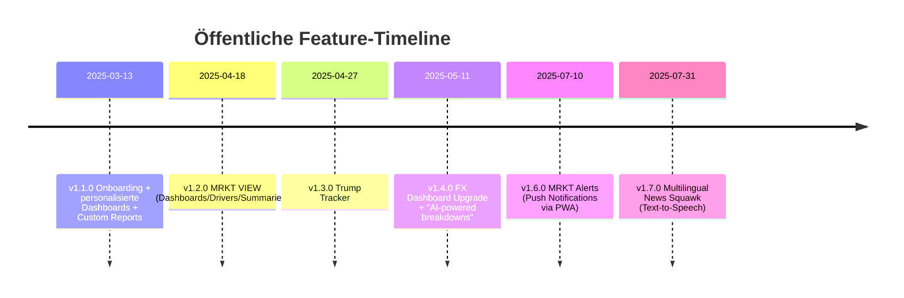

# MRKTEDGE.AI – Technische, UX- und AI/ML-Analyse auf Basis öffentlich verfügbarer Evidenz

> **Status (09. Maerz 2026):** Externer Benchmark / Referenzdokument. Kein
> aktives Architektur-Owner-Dokument. Relevante normative Ableitungen werden in
> Root-/Spec-Dokumente verteilt; diese Analyse bleibt als Recherche-Artefakt
> erhalten.

## Executive Summary

entity["company","MRKT AI","trading platform toronto, ca"] positioniert sich als browserbasierte, abonnementgetriebene „AI-powered“ Markt-Intelligence-Plattform, die **Fundamentals/Makro, Sentiment, Positionierung und News** zu einem **handlungsnahen Kontext-Layer** verdichtet („understand why markets move in seconds“). citeturn1view0turn23view0

Aus primären Artefakten auf der Domain lassen sich drei belastbare technische Eckpunkte ableiten:  
Erstens deutet der Einsatz von `/_next/image` (inkl. Parametern wie `q` und `w`) stark auf **Next.js**-Rendering/Image-Optimierung hin; zudem verweisen Blog-Bilder auf **Sanity CDN (`cdn.sanity.io`)** als Content-/Asset-Quelle, was ein Headless-CMS-Muster stützt. citeturn21view0turn24view0turn24view3  
Zweitens sind **Zahlungsabwicklung via Stripe** und **Nutzungsanalyse via Google Analytics** explizit in der Privacy Policy genannt. citeturn4view0  
Drittens nutzt die Marketing-Site eingebettete Medien über **Cloudflare Stream** (URLs auf `cloudflarestream.com`), was ein CDN-/Video-Delivery-Bauteil darstellt. citeturn18view0turn18view1

Die AI/ML-Nutzung ist funktional klar belegt (AI-generierte Summaries/Analysen aus öffentlich verfügbaren Informationen; u.a. Headlines, Economic Data, Central Bank Events, Earnings), aber **Modellnamen, MLOps-Mechanik, Trainings-Setup, Feature-Engineering und Monitoring** werden öffentlich nicht spezifiziert. citeturn3view2turn10search0

Für Hosting/Server-Infrastruktur existiert starke sekundäre Evidenz: ScamAdviser nennt als „Server/ISP“ **Vercel Inc** (inkl. IP/Registrar-Hinweisen). Das passt konsistent zur Next.js-Artifact-Lage, bleibt aber ohne eigene Header/DNS-Dumps eine Indikation, keine harte Primärmessung. citeturn26search0

## Evidenzbasis und Konfidenzrahmen

Die folgenden Quellenkategorien wurden ausgewertet: (a) offizielle Webseiteninhalte & Assets (Landing, Blog, Updates, Legal), (b) Social/Company-Profile & Posts, (c) Community-Signale (Reddit, Reviews), (d) Tech-Fingerprint-Dienste. Offizielle deutschsprachige Dokumente wurden in der Recherche nicht gefunden; die öffentlich zugänglichen Primary Sources sind überwiegend englisch. citeturn1view0turn4view0turn10search0turn31reddit24turn27search3

### Evidenzquellen und typische Aussagekraft

| Evidenzquelle | Typ | Was wurde extrahiert | Aussagekraft | Konfidenz |
|---|---|---|---|---|
| mrktedge.ai (Landing/Pages) | Primär | Positionierung, Pricing, Datenanbieter-Branding, Feature-Claims, Kontakt/Legal-Verlinkung | Hoch für Produkt-Selbstbeschreibung, mittel für „Data powered by“ (ohne Vertragsdetails) | Hoch–Mittel citeturn1view0 |
| Legal-Seiten (Privacy/Disclaimer) | Primär | Drittanbieter (Stripe/GA), PII-Kategorien, Retention, AI-Content-Hinweise | Hoch für rechtlich deklarierte Statements (Scope, Drittanbieter, AI-Disclaimer) | Hoch citeturn4view0turn3view2 |
| Blog/Updates (mrktedge.ai/blog, /updates) | Primär | Funktionsumfang, UI-Workflows, PWA/Push, TTS/Multilingual-Features, Zeitstempel der Releases | Hoch für Feature-Existenz & Timeline; mittel für technische Implementierungsdetails | Hoch citeturn12view2turn23view0 |
| Domain-Assets (Bild-URLs, `/_next/image`, Sanity-CDN, Cloudflare Stream) | Primär (Artefakte) | Framework-Indizien (Next.js), Headless-CMS-Indizien (Sanity), Video-Delivery (Cloudflare Stream) | Sehr hoch für „diese Technik ist eingebunden“; niedrig für „wie im Backend implementiert“ | Hoch citeturn24view0turn18view0 |
| Unternehmensprofil/Posts auf LinkedIn | Semi-Primär | Company Facts (Gründung, Standort), Release Notes (UX/Features), AI-Positionierung | Mittel (Marketing-/Recruiting-Sprache), aber zeitnah & konsistent | Mittel–Hoch citeturn10search0turn14search2 |
| Reddit-Threads | Community | Nutzerwahrnehmung, Skepsis, Feature-Beschreibungen, Community-Subreddit | Nützlich für „Voice of Customer“, aber nicht verifiziert | Niedrig–Mittel citeturn31reddit24turn33reddit47 |
| BuiltWith / ScamAdviser | Sekundär | Tech-Fingerprints, Hosting-Indizien, Tracker | Gut als Hypothesen-Generator; nicht audit-sicher | Mittel citeturn27search3turn26search0 |
| Trustpilot | Sekundär | Erfahrungsberichte, Support-/Pricing-Kritik, Scam-Impersonation-Warnungen | Subjektiv, kann jedoch Muster sichtbar machen | Niedrig–Mittel citeturn5search0turn14search6 |

### Konfidenzmatrix nach Untersuchungsdimension

| Dimension | Kurzfazit | Konfidenz |
|---|---|---|
| UI/UX-Design (Makro) | Aus Screens/Claims konsistent: Dark UI, Karten/Overlays, „Context-first“ Workflows, starke Informationsverdichtung | Mittel–Hoch citeturn3view1turn23view1turn10search0 |
| Frontend-Framework/CMS | Next.js-Image-Route + Sanity-CDN in Asset-URLs stark belegt | Hoch citeturn24view0turn21view0 |
| Backend/DB/Infra intern | Öffentliche Details fehlen; nur Hosting-Indizien via Vercel (sekundär) | Niedrig–Mittel citeturn26search0 |
| AI/ML-Use-Cases | AI-Summaries/Analyse öffentlich deklariert; konkrete Modelle/Frameworks nicht genannt | Mittel citeturn3view2turn10search0 |
| Security/Privacy | Privacy/Disclaimer decken Grundsatz ab; technische Controls (CSP, KMS, SOC2 etc.) nicht dokumentiert | Mittel citeturn4view0turn3view2 |

## UI/UX-Design, Komponenten und Accessibility

MRKT kommuniziert eine klar „execution-orientierte“ UX: Kontext-Interpretation (Bias/Drivers/Events) soll *vor* dem Entry/Trade im Vordergrund stehen („gap between information and interpretation“, „build bias“). Das zieht sich konsistent durch Home, Blog-Artikel und Updates. citeturn1view0turn23view2turn23view1

### Visuelle Design-Sprache und zentrale UI-Komponenten aus Screenshots

Die öffentlich eingebundenen Produkt-Screenshots auf der Landing Page liefern belastbare UI-Indizien (Layout, Komponentenarten, Informationsdichte). citeturn3view1turn3view0

**Beobachtete UI-Patterns (aus den MRKT-Assets):**
- **Dark-Mode-first** mit neon-/glowartigen Akzenten (v.a. violett), klare visuelle Kodierung für „bullish/bearish“ (grün/rot) und „hot/high-impact“ (orange). citeturn3view1turn3view0  
- **Card-/Overlay-UI**: mehrere „floating“ Panels über einem Chart (z.B. Headlines-Card, Bias/Drivers-Card, Event-Playbook-Card), passend zu „Context-at-a-glance“. citeturn3view1turn23view0  
- **Tab-/Chip-Komponenten**: Pill-Buttons, Filter-Chips (Asset/Tag-Auswahl), Badges („HOT“) und segmentierte Kategorien in News-Items. citeturn3view1turn12view2  
- **Daten-Grid/Table** im Economic Calendar (Spalten u.a. Event/Impact/Actual/Forecast/Min/Max/Bank Forecast) plus separater „Playbook“-Kasten (Outcome → Bias-Mapping). citeturn3view0turn4view1  

### Responsives Verhalten und PWA-Funktionalität

Aus dem Changelog ist eine explizite PWA-Strategie ableitbar: Push Notifications werden auf Desktop/Android und auf iOS **via PWA-Installation** („Add to Home Screen“) beschrieben. Das ist ein starkes Signal für Service Worker/Web Push und einen „always-on“-Alert-Kanal (wichtig für News/Market Events). citeturn12view2

Zusätzlich kommuniziert MRKT in Social Updates „improved mobile responsiveness“ und weitere UX-Minor-Fixes (z.B. fuzzy search, unlimited watchlist, delete symbols). Das deutet auf laufende Iteration am responsiven Layout und Interaktionsdetails hin. citeturn10search0

### Accessibility

Es gibt **keine** öffentlich sichtbare A11y-Dokumentation (z.B. WCAG-Statement, VPAT) auf mrktedge.ai. Die einzige konkrete (sekundäre) Spur ist BuiltWith, das **Radix UI** detektiert (eine React-Komponentenbibliothek, die Accessibility als Designziel adressiert). Das bleibt ohne DOM-/Bundle-Analyse eine Indikation. citeturn27search3

image_group{"layout":"carousel","aspect_ratio":"16:9","query":["MRKT AI terminal dashboard screenshot","MRKT economic calendar institutional ranges screenshot","MRKT candle analysis feature screenshot","MRKT alerts push notifications PWA screenshot"],"num_per_query":1}

### Extrahierte Asset-URLs als UI-Evidenz

Aus direkten Asset-Links (Landing/Blog/Updates) lassen sich sowohl UI-Screens (Design/Komponenten) als auch Stack-Indizien (Next.js/Sanity/Video-CDN) ableiten. citeturn3view0turn24view0turn18view0turn19view0

**Beispiel-Asset-URLs (aus der Domain extrahiert):**
```text
Landing-Screens (direkt, statische Pfade):
https://www.mrktedge.ai/features/home-hero.png
https://www.mrktedge.ai/features/home-trade-the-news.png

Blog-Images (Next.js Image Optimizer => Sanity CDN im url-Parameter erkennbar):
https://www.mrktedge.ai/_next/image?q=75&url=https%3A%2F%2Fcdn.sanity.io%2Fimages%2F...&w=3840

Marketing-Videos (Cloudflare Stream Thumbnails, customer-<id>.cloudflarestream.com):
https://customer-<...>.cloudflarestream.com/<...>/thumbnails/thumbnail.jpg

Changelog-Demos (GIFs; Link existiert, Abruf im Tool teils mit Cache-Miss/Statuscode):
https://www.mrktedge.ai/updates/tts.gif
https://www.mrktedge.ai/updates/mrkt-alerts-tutorial.gif
```
Diese URL-Muster stützen: (a) Next.js als Web-Framework, (b) Sanity als Asset/CMS-Backend für Blog-Inhalte, (c) Cloudflare Stream für Video-Delivery. citeturn24view0turn21view0turn18view0turn19view0

## Tech-Stack und Plattformbetrieb

### Komponenten: verifiziert vs. inferiert

Die folgende Tabelle trennt strikt zwischen (i) durch Primary Artefakte/Legal-Texte verifizierten Komponenten, (ii) stark indizierten Komponenten, und (iii) rein inferierten/sekundären Hypothesen.

| Layer | Komponente | Status | Evidenz | Kommentar |
|---|---|---|---|---|
| Frontend | Next.js (`/_next/image`) | Verifiziert (Artefakt) | URL-Muster in Blog-Image-Requests | Starkes Signal für Next.js Runtime/Image-Optimierung. citeturn24view0turn21view0 |
| Content/CMS (Blog) | entity["company","Sanity","headless cms"] (cdn.sanity.io) | Verifiziert (Artefakt) | `cdn.sanity.io` im `url`-Parameter | Spricht für Headless CMS mindestens für Blog/Assets. citeturn24view0turn21view0 |
| Hosting/Edge | entity["company","Vercel","hosting platform"] | Indiziert (sekundär) | ScamAdviser nennt ISP/Server „Vercel Inc“ (inkl. IP) | Konsistent zu Next.js, aber keine eigene Header-Messung. citeturn26search0 |
| Video Delivery | entity["company","Cloudflare","cdn and security company"] Stream | Verifiziert (Artefakt) | `cloudflarestream.com` Thumbnail-URLs | Nutzung zumindest für Marketing-Einbettungen. citeturn18view0turn18view1 |
| Payments | entity["company","Stripe","payments processor"] | Verifiziert (Legal) | In Privacy Policy explizit genannt | Payment/Checkout-Flow extern. citeturn4view0 |
| Web Analytics | entity["company","Google","technology company"] Analytics | Verifiziert (Legal) | In Privacy Policy explizit genannt | Consent/Policy-Details sonst nicht offengelegt. citeturn4view0 |
| Affiliate | entity["company","Tolt","affiliate software"] | Indiziert (Link + Fingerprint) | Affiliate-Link in Navigation; BuiltWith detektiert Tolt | Affiliate-Programm extern betrieben. citeturn1view0turn27search3 |
| Product Analytics | entity["company","PostHog","product analytics company"] | Sekundär | BuiltWith detektiert PostHog | Ohne Network/JS-Audit nicht verifiziert. citeturn27search3 |
| UI Components | Radix UI | Sekundär | BuiltWith detektiert „Radix UI“ | Plausibel in React/Next; A11y-Rückschluss nur bedingt. citeturn27search3 |
| Marketing Automation | Klaviyo | Sekundär | BuiltWith detektiert Klaviyo | Könnte Newsletter/CRM-Connector sein. citeturn27search3 |
| Data Providers | entity["organization","Reuters","news agency"]; entity["company","London Stock Exchange Group","financial markets company"]; entity["company","Nasdaq","stock exchange operator"]; entity["company","CME Group","derivatives marketplace"] | Claim (Marketing) | Branding „DATA POWERED BY“ | Vertrags-/Feed-Details öffentlich nicht spezifiziert. citeturn1view0 |

### Backend, Datenbanken, CI/CD, Observability

Für Backendsprache(n), Datenbanken, Queueing/Streaming, CI/CD sowie klassische Observability (Tracing/Metrics/Logs, Incident Response) gibt es **keine** öffentlich belastbaren Angaben auf mrktedge.ai oder im sichtbaren LinkedIn-Text. citeturn10search0turn12view0

Was sich dennoch ableiten lässt (als Hypothese, nicht verifiziert):  
Das Produktversprechen „real-time headlines“, „instant alerts“, PWA-Push und „click a candlestick to see what moved it“ impliziert serverseitige Komponenten für **Event-Ingestion**, **Stream-Verarbeitung**, **Indexierung/Lookup** und **Low-latency Notification Delivery**. Diese Architektur ist funktional plausibel, bleibt aber ohne API-/Header-/Bundle-Inspektion unspezifiziert. citeturn12view2turn23view0turn1view0

## AI/ML-Nutzung, Datenquellen und Governance

### Öffentlich deklarierte AI/ML-Funktionalität

MRKT beschreibt AI als Kernkomponente zur Generierung von „summaries and analysis“ aus öffentlich verfügbaren Informationen (u.a. Market Headlines, Economic Data, Central Bank Events, Earnings Reports). Gleichzeitig wird auf mögliche Ungenauigkeiten/Misinterpretationen hingewiesen. citeturn3view2

Im Unternehmensprofil wird zusätzlich von „advanced AI trained on industry-leading models“ gesprochen, mit konkreten Domänen: real-time headlines, sentiment analysis, central banking events und economic calendar releases. Konkrete Modellnamen/Provider werden nicht genannt. citeturn10search0

### Inference vs. Training, Cloud vs. On-Prem

- **Inference (Produktbetrieb)**: Stark nahegelegt/implizit belegt durch Features wie AI-News-Zusammenfassungen, Sentiment, „so what“-Einordnung, sowie TTS/Multilingual. citeturn3view2turn12view2turn23view0  
- **Training/Fine-Tuning**: Öffentlich **nicht spezifiziert**. Die Formulierung „trained on industry-leading models“ könnte von Prompting/RAG bis zu Fine-Tuning reichen, ist aber nicht auflösbar ohne Tech-Whitepaper, Job-Posts oder Repos. citeturn10search0  
- **On-Prem vs. Cloud**: Öffentlich **nicht spezifiziert**. Das Hosting-Indiz (Vercel) spricht für Cloud-Betrieb der Webschicht; ob AI-Inferenz intern, via API-Anbieter oder hybrid erfolgt, bleibt offen. citeturn26search0turn3view2  

### Feature Engineering, Modellmonitoring, Explainability

MRKT verspricht als Wert „Transparency“ mit der Aussage, Nutzer:innen sollen verstehen, „wie unsere AI zu ihren Schlussfolgerungen kommt“. Das ist ein klares Produkt-/Brand-Statement zur Explainability, ohne technische Details (z.B. Provenance, Shapley, rationale extraction, citation graphs). citeturn12view0

Konkrete Hinweise auf Monitoring/Guardrails:
- Der Disclaimer betont, dass User „original sources“ prüfen sollen und dass AI-Summaries keine exakten Reproduktionen sind. Das impliziert zumindest eine **Provenance-Idee** (Quellverweise), aber konkrete Mechanismen sind nicht dokumentiert. citeturn3view2  
- Community- und Team-Posts sprechen von „rebuild of how we process, categorize, and display these insights“ (Bias Key Factors) – das deutet auf eine Pipeline aus Klassifikation/Taxonomie/Scoring + UI-Aggregation hin, bleibt aber technisch unkonkret. citeturn10search0  

### Privacy/PII-Handling und Datenaufbewahrung

Die Privacy Policy nennt als erhobene Daten u.a. E-Mail, Vor-/Nachname, Cookies/Usage Data (inkl. IP-Adresse) sowie Retention „as long as necessary“ und mögliche grenzüberschreitende Transfers. Drittanbieter: Google Analytics und Stripe. citeturn4view0

Was **nicht** öffentlich dokumentiert ist (als explizite Lücke):
- Ob PII in AI-Prompts/Logs ausgeschlossen oder redigiert wird  
- Retention/Deletion-Mechanik für AI-Outputs & Prompt-Logs  
- Data Processing Addendums, Subprocessor-Liste über GA/Stripe hinaus  
- Security-by-design für AI (Prompt Injection, data exfiltration, output filtering)  

### Tabelle: Produktfeatures und AI-Einsatz

| Feature | AI-Anteil (bewertet) | Evidenz | Bemerkung |
|---|---|---|---|
| Live Headlines mit „so what“/Summaries | Hoch | Disclaimer nennt AI-Summaries aus Market Headlines | Kern-Use-Case: Verdichtung/Interpretation. citeturn3view2turn23view0 |
| Economic Calendar (Institutional ranges, playbooks, shock detection) | Mittel–Hoch | Economic Calendar Page + Blog beschreibt Kontext/Playbooks | Datenfeed + Regel-/Modelllogik möglich; genaue Methode offen. citeturn4view1turn23view0 |
| Candle Analysis („what moved it“) | Mittel–Hoch | Blog beschreibt Click-a-candle → Ursachen/Headlines | Erfordert Event-Attribution/Indexing; AI könnte Zusammenfassung liefern. citeturn23view0turn33search2 |
| AI Sentiment Index (0–100) & Drivers Dashboard | Hoch (als Claim) | Blog listet Sentiment Index/Drivers | Metrik-/Modell-Details fehlen. citeturn23view0 |
| Bias / Key Factors | Mittel | LinkedIn Update beschreibt „key forces supporting it“ + Pipeline-Rebuild | Taxonomie/Scoring; AI möglich, nicht exakt ausgewiesen. citeturn10search0 |
| Multilingual + News Squawk (TTS) | Hoch | Updates v1.7.0: TTS multilingual | Sprach-/TTS-Engine nicht spezifiziert. citeturn12view2 |
| Search & Jump-to-Headline | Niedrig–Mittel | LinkedIn Post | Könnte klassisch index/search sein; „fuzzy search“-Hinweis spricht für Search-Layer. citeturn14search2turn10search0 |

## Architektur, Integrationen, Deployment und Security-Praktiken

### Inferenzbasierte Architektur

Die Architektur unten ist aus Features (PWA Alerts, Candle Attribution, Live Headlines, Calendar, Subscription) sowie aus Stack-Indizien (Next.js, Sanity, Vercel, Stripe/GA, Cloudflare Stream) abgeleitet. Sie ist **hypothetisch** und markiert Lücken explizit. citeturn12view2turn24view0turn4view0turn26search0

```mermaid
flowchart LR
  U[User: Browser / PWA] -->|HTTPS| FE[Next.js Web App]
  FE -->|Auth session| AUTH[Auth / Identity Layer (unspezifiziert)]
  FE --> API[Backend API (unspezifiziert)]
  API --> BILL[Billing]
  BILL --> STRIPE[Stripe]
  FE --> ANALYTICS[Web/Product Analytics]
  ANALYTICS --> GA[Google Analytics]
  ANALYTICS --> PH[PostHog? (sekundär, unbestätigt)]

  subgraph ContentAndMedia[Content & Media]
    CMS[Sanity (Blog/CMS)] --> FE
    VID[Cloudflare Stream (Marketing Media)] --> FE
  end

  subgraph MarketData[Market Data & Event Layer (unspezifiziert)]
    VEND[Vendor Feeds / Data Providers] --> ING[Ingestion + Normalisierung]
    ING --> STORE[(Event/Time-series Store)]
    STORE --> INDEX[(Search/Attribution Index)]
  end

  INDEX --> AI[AI Inference Services (unspezifiziert)]
  AI --> API

  API --> PUSH[Push Notifications Service]
  PUSH --> U
```

### Integrationen und Partnerschaften

MRKT nennt Datenprovider-Branding (Reuters, LSE Group, Nasdaq, CME Group) und positioniert es als „DATA POWERED BY“. Konkrete API-Produkte, Lizenz-Scopes, Refresh-Raten oder Compliance-Constraints werden nicht publiziert. citeturn1view0

Eine als „brand-only partnership“ deklarierte Kooperation besteht mit entity["company","Dominion Markets","cfd broker mauritius"]; dort wird explizit festgehalten, dass MRKT kein Broker ist und keine Trades ausführt. Zudem wird die Lizenzierung durch die FSC von entity["country","Mauritius","country"] erwähnt. citeturn12view1

### Multi-Tenant-Design, Skalierung, Fault Tolerance

Öffentlich belegt sind Personalisierung/Onboarding („dashboard adapts … to your portfolio“) und PWA Alerts – das spricht funktional für ein Multi-User/Multi-Tenant-SaaS-Design mit user-spezifischen Settings, Watchlists und Notification Preferences. Konkrete Tenant-Isolation (DB-per-tenant vs. shared schema), Rate limiting oder Backpressure-Design sind nicht dokumentiert. citeturn12view2turn12view0

„Real-time push notifications“ sowie „tap to dive in“ implizieren eine Architektur, die bei Lastspitzen (News-Events) robust bleiben muss; ob dafür Queues/Streams genutzt werden, ist öffentlich nicht spezifiziert. citeturn12view2

### Deployment- und Security-Signale

- Privacy Policy nennt Standardthemen (Data transfer, retention, security measures), aber keine spezifischen technischen Kontrollen oder Zertifizierungen. citeturn4view0  
- ScamAdviser weist auf WHOIS-Privacy, Registrar/Server-Indizien (GoDaddy/Domains By Proxy/„Vercel“) hin. Das sind Umfeldsignale, nicht Security-Audits. citeturn26search0  
- Community/Reviews weisen auf Scam-Impersonation-Risiken in Discord hin; MRKT antwortet dort mit Sicherheitsratschlägen (kein technischer Beweis, aber operatives Trust-Thema). citeturn5search0turn36search4  

## Öffentliche Timeline und Tech-/Feature-Evolution

### Release-Historie aus „Updates“

Die Updates-Seite dokumentiert mehrere Versionen mit Datum (v1.1.0 bis v1.7.0) und benennt u.a. Personalisierung, MRKT VIEW, Trump Tracker, AI Breakdowns, Alerts (PWA Push) und Multilingual News Squawk (TTS). citeturn12view2



Ergänzend zeigen LinkedIn-Updates 2025/2026 eine fortlaufende UX-Iteration (Drag & Drop Assets auf Homepage, Candle explanations & comments, fuzzy search, mobile responsiveness). citeturn10search0turn14search2

### Historische Tech-Änderungen

Ein expliziter, historischer Stack-Wechsel (z.B. „migrated from X to Y“) ist in den öffentlichen Quellen nicht dokumentiert. BuiltWith erwähnt allerdings „historical technologies“ und einen Detektionszeitpunkt (Okt 2025), ohne die Change-Details offen zu legen. Das reicht nicht für eine belastbare Tech-Migration-Timeline. citeturn27search3turn12view2

## Verifikationslücken und empfohlene Follow-up-Aktionen

Die wesentlichen Lücken betreffen Backend/Infra, Security Controls und AI/ML-Implementierungsdetails. Um die wichtigsten Hypothesen sauber zu verifizieren, sind folgende Schritte (ohne NDA, rein technisch) am effizientesten:

**Header-/Edge-Fingerprinting (primär messen)**
- `curl -I https://www.mrktedge.ai/` und `curl -I https://app.mrktedge.ai/` (Server, cache headers, CSP/HSTS, `x-vercel-*`, `cf-ray` etc.). Hosting-Indizien aus ScamAdviser lassen sich damit bestätigen oder falsifizieren. citeturn26search0turn13view2  

**JS-Bundles und Abhängigkeiten (Framework/Libraries verifizieren)**
- `view-source:` oder DevTools → Network: `_next/static/chunks/...` und `_next/static/css/...` herunterladen; dann `grep` nach `radix`, `posthog`, `sentry`, `datadog`, `stripe`, `sanity`, i18n-Libs etc. Das wäre die Primärverifikation für BuiltWith-Hypothesen. citeturn27search3turn24view0  

**PWA-/Push-Implementierung (Service Worker & Push Provider)**
- Browser DevTools → Application: Service Worker, Manifest, Push Subscription Endpoint. Updates beschreiben PWA-Push, aber nicht den Provider (FCM/APNs via WebPush-Gateway etc.). citeturn12view2  

**Accessibility Audit**
- Lighthouse + axe-core auf öffentlichen Pages und (wenn möglich) dem Sign-in Flow: Keyboard-Navigation (Tab-Order), ARIA, Contrast, Reduced Motion. Es gibt keine A11y-Statements, daher ist ein Audit der schnellste Klarheitsgewinn. citeturn27search3turn1view0  

**AI/ML-Transparenz (Modelle, RAG, Monitoring, PII)**
- Nach einem technischen Whitepaper fragen oder prüfen, ob MRKT eine Subprocessor-Liste/AI-Policy bereitstellt. Kernfragen: Modellprovider, Prompt-Logging, PII-Redaction, Evaluation/Monitoring, Hallucination-Handling, Citation/Provenance. Der Disclaimer bestätigt AI-Nutzung, aber nicht deren Ausgestaltung. citeturn3view2turn4view0turn12view0  

**Job-Postings/GitHub/Patente (derzeit unauffindbar)**
- In der offenen Web-Recherche wurden keine eindeutig zuordenbaren öffentlichen Repositories oder Patente für MRKTedge.ai identifiziert; falls MRKT Hiring betreibt, sind Job-Posts der beste öffentliche Stack-Indikator (DB, Queue, Cloud, Observability). (Aktueller Status: **unspecified**.) citeturn28search0turn36search0  

### Quellenliste als klickbare Links

Alle Quellen sind im Text jeweils direkt nach den relevanten Aussagen zitiert (klickbar). Für eine kompakte Übersicht sind die wichtigsten Primary Sources: Landing Page, About, Privacy, Disclaimer, Economic Calendar, Updates, Blog sowie ausgewählte Social/Community/Tech-Fingerprint-Quellen. citeturn1view0turn12view0turn4view0turn3view2turn4view1turn12view2turn8search0turn10search0turn31reddit24turn27search3turn26search0