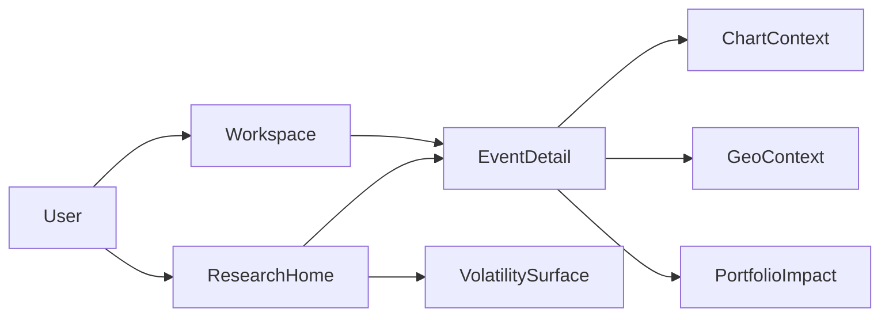

# MRKTEDGE.AI Benchmark 2026 - Technical Transfer Blueprint for tradeview-fusion

> Status (16 Mar 2026): External benchmark/reference document.  
> This file is not a root owner spec. It defines what should be adopted, adapted, deferred, or avoided, and where recommendations should live in active root/spec docs.

---

## 1. Purpose of This Rewrite

This rewrite replaces earlier mixed-format research text with a clean, actionable benchmark-to-implementation blueprint.

Goals:

- keep only high-signal benchmark findings
- separate verified facts from inferred assumptions
- provide concrete implementation guidance for `tradeview-fusion`
- recommend where each topic should be represented in existing root working docs
- include package/vendor recommendations with "now vs later" guidance

This step intentionally does **not** distribute changes across other docs yet.

Frontend extraction status (16 Mar 2026):

- Frontend deep-dive content has now been extracted into:
  - `docs/FRONTEND_INTELLIGENCE_CALENDAR.md`
  - `docs/FRONTEND_RESEARCH_HOME.md`
- This benchmark remains the cross-domain transfer reference.
- Backend dependencies required by those frontend docs are explicitly listed there as contract-level needs.

Additional frontend transfer note (16 Mar 2026):

- The strongest transferable MRKT pattern is not visual chrome but product sequencing:
  - `ResearchHome` is the context-first entry
  - `Calendar` is the operational event entry
  - both feed the same event-detail and execution drilldowns
- For `tradeview-fusion`, that means `Research` and `Calendar` should remain two entry surfaces into one decision model, not become isolated mini-products.

---

## 2. Evidence Refresh and Confidence Model

### 2.1 Primary pages checked live

- `https://www.mrktedge.ai/`
- `https://www.mrktedge.ai/economic-calendar`
- `https://www.mrktedge.ai/updates`
- `https://www.mrktedge.ai/privacy`
- `https://www.mrktedge.ai/disclaimer`
- `https://app.mrktedge.ai/manifest.webmanifest`
- `https://app.mrktedge.ai/sw.js`

### 2.2 Confidence labels used

- `verified`: directly visible in primary pages/assets/legal text
- `inferred`: strongly indicated by behavior/content but not formally documented
- `unknown`: not publicly verifiable from accessible sources

---

## 3. What Is Actually Verified vs Inferred

## 3.1 Verified (high confidence)

- Product positioning is context-first market intelligence, not broker execution.
- Economic calendar emphasizes institutional ranges, shock detection, and pre-event playbook framing.
- Public update history includes:
  - MRKT VIEW dashboard
  - Trump Tracker
  - PWA push alerts
  - multilingual TTS squawk
- Privacy page explicitly mentions Google Analytics and Stripe.
- Disclaimer explicitly states AI-generated summaries/analysis over public information, with possible inaccuracies.
- PWA artifacts are directly visible:
  - `display: "standalone"` in manifest
  - active service worker with push handlers, click navigation, and iOS-PWA keep-alive logic

## 3.2 Inferred (medium confidence)

- "Event-to-decision" is a core interaction pattern (not just information display).
- System likely requires ingestion, enrichment, indexing, and low-latency notification infrastructure.
- There is likely a layered stack split between marketing/public pages and app runtime services.

## 3.3 Unknown (must not be overclaimed)

- internal DB architecture, queue/workflow choices, CI/CD setup
- concrete AI model providers and training/fine-tuning strategy
- production observability design and SLO discipline
- formal AI redaction/retention/provenance controls beyond legal-level statements

---

## 4. Transfer Decisions for tradeview-fusion

## 4.1 Adopt now

- Event Intelligence as product core (not a simple calendar widget)
- Research/Decision Home as first-class entry surface
- PWA-first for notifications and cross-device continuity
- Generic Actor/Narrative/Event Volatility tracking (not person-specific hardcoding)
- explicit AI governance and provenance requirements in product/runtime decisions
- observability-driven release gates for event and alert reliability

## 4.2 Adapt carefully

- dashboard storytelling and card overlays (adapt to existing `tradeview-fusion` semantics)
- sentiment/bias framing (must be evidence-linked and confidence-scored)
- market-moving headline pipelines (must integrate geo/portfolio/context overlays)

## 4.3 Defer

- heavy growth stack (CRM, affiliate, aggressive lifecycle automation)
- complex payment orchestration before billing maturity
- media-heavy video infrastructure unless product strategy requires it

## 4.4 Avoid

- copying competitor stack assumptions as architecture truth
- black-box AI conclusions without citations/provenance
- adding new feature surfaces before event-quality and reliability gates are green

---

## 5. Detailed Implementation Blueprint (for Later Execution)

## 5.1 Product Surface Model

Recommended default navigation model:

- `/` -> `ResearchHome` (decision-first macro view)
- `/workspace` -> deep trading workspace (charts/orders/indicators)
- `/event/:id` -> event intelligence detail and playbook
- `/volatility` -> actor/narrative/event volatility surface

Design principle:

- research and execution are separate surfaces sharing the same context model
- no duplicate logic/state between home and workspace
- calendar should be treated as an event-operations surface inside that same model, not as a disconnected date-list feature



## 5.2 Event Intelligence Domain Model

Minimum event object (first production version):

```json
{
  "eventId": "evt_...",
  "title": "US CPI (YoY)",
  "region": "US",
  "category": "macro",
  "scheduledAt": "2026-04-10T12:30:00Z",
  "expectedRange": { "min": 2.7, "consensus": 2.9, "max": 3.1 },
  "actual": null,
  "surpriseScore": null,
  "impactScore": 0.0,
  "affectedAssets": ["DXY", "XAUUSD", "US10Y", "SPX"],
  "playbook": [
    { "scenario": "above_max", "bias": "hawkish_usd_up" },
    { "scenario": "in_range", "bias": "neutral_wait" },
    { "scenario": "below_min", "bias": "dovish_usd_down" }
  ],
  "sources": [{ "name": "provider_x", "url": "..." }],
  "confidence": 0.0
}
```

Required properties:

- expectation band, not only single forecast
- explicit scenario playbook
- affected assets and confidence fields
- source links for explainability
- pre-event and post-event rendering states should remain visibly distinct
- event detail should be the canonical bridge between research context and workspace actions

## 5.2a Frontend UI Transfer Addendum (Research + Calendar)

Directly transferable MRKT product patterns:

- `why this matters now` must be explicit on research cards
- event cards should privilege `range / surprise / impact / next action` over generic prose
- calendar and research should share the same event-detail route and return-context model
- local or fallback data modes should remain visible until product-grade live coverage exists

Do not over-transfer:

- do not copy visual style blindly if it breaks existing shell/navigation patterns
- do not make the calendar a standalone destination that duplicates research context
- do not hide uncertainty behind polished card language

## 5.3 Event Decision Engine (not just calendar rendering)

Minimum engine functions:

- normalize releases to canonical event schema
- compute surprise and impact score
- rank "what matters now"
- generate scenario cards with links to chart/geo/portfolio
- attach evidence bundle used for each summary

Algorithmic baseline:

- deterministic rules first
- bounded ML scoring second
- fully explainable outputs and fallback reasons

## 5.4 Volatility Tracker Generalization

Do not implement as one-off "Trump tracker".

Implement as:

- `actorVolatility`
- `narrativeVolatility`
- `eventVolatility`

with shared model:

- trigger source
- volatility probability
- affected assets
- scenario map
- geo linkage
- confidence and freshness

## 5.5 PWA + Notification Requirements

Given verified PWA patterns, recommended minimum for `tradeview-fusion`:

- manifest with proper install metadata
- service worker with stable push handler
- deep-link notifications (`event/:id`, `headline/:id`)
- reconnect strategy and idempotent notification dedupe
- explicit iOS behavior notes and user guidance

Operational gates:

- push delivery success rate
- notification click-through deep-link success
- stale event rate
- duplicate alert rate

## 5.6 AI Governance Requirements

Must-have runtime controls:

- prompt PII policy (allow/deny/redact classes)
- output retention classes with TTL
- source citation contract per AI summary
- confidence thresholds and low-confidence fallback UI
- human override path for sensitive outputs

Must-have policy events:

- redaction_applied
- citation_missing
- low_confidence_fallback
- policy_blocked_output

## 5.7 Observability and Release Gates

Treat observability as product functionality.

Required metrics:

- event ingestion latency
- event freshness
- impact score compute latency
- alert send and click latency
- summary generation latency
- citation completeness rate
- false/high-noise alert ratio

No major feature expansion before these gates are stable.

---

## 6. Package and Vendor Recommendations (Detailed)

Important: this is recommendation guidance, not a mandated stack lock.

## 6.1 Frontend, State, Validation

Adopt-first candidates:

- `@tanstack/react-query` for async server state and caching
- `zustand` or `jotai` for local interaction state
- `zod` for schema validation across UI/BFF boundaries
- `react-hook-form` + `zodResolver` for bounded input flows
- `date-fns` or `dayjs` for event-time handling

Design system/accessibility:

- `radix-ui` primitives + existing style system
- optional `cmdk` for command surfaces

PWA/notification support:

- `next-pwa` (if aligned with existing Next runtime decisions)
- web push integration at backend boundary, not directly from browser business logic

## 6.2 Search, Ranking, and Event Processing

Frontend/BFF-level:

- `fuse.js` for local fuzzy filtering (small lists)

Backend-level (conceptual guidance):

- dedicated event ranking service with deterministic baseline rules
- optional vector reranking later, only after baseline reliability

## 6.3 Analytics, Feature Flags, Replay

Now:

- privacy-first analytics baseline (`Plausible`, `Matomo`, or self-hosted option)
- explicit event taxonomy and consent gates

Later:

- product analytics depth (`PostHog`) if feature flags + funnels + experiments become core
- session replay only with strict masking/redaction in trading-sensitive surfaces

Avoid now:

- analytics sprawl with multiple overlapping trackers

## 6.4 Observability

Now:

- OpenTelemetry-compatible instrumentation
- SLO dashboard with explicit event/alert pipelines

Candidates:

- `Grafana + Loki + Tempo`
- `SigNoz`
- `OpenObserve`

Optional:

- `Sentry`/`GlitchTip` for frontend error aggregation if needed

## 6.5 Workflow/Queue/Async

Since product requires event-driven reliability:

- queue/workflow orchestration should be first-class before feature explosion
- choose one clear workflow model (for retries, dedupe, idempotency, DLQ)

Candidate families:

- managed queue + worker model
- workflow engines with retry semantics

Decision criterion:

- operational simplicity + replay safety + traceability

## 6.6 Payments, CMS, Media

Payments:

- now: only if billing launch is near-term
- baseline: Stripe is fastest integration path
- EU/CH alternatives can be layered later when regional methods require it

CMS:

- use only for content/education/marketing, not for trading core domain state
- candidates include headless CMS options (Sanity-family patterns are benchmark-relevant)

Media:

- keep optional until clear product need for persistent video workflows
- avoid over-investment in media infra if not a GTM driver

---

## 7. Root Working-Doc Recommendation Map (No File Edits in This Step)

This chapter maps recommendations to existing owner docs and two candidate docs.

## 7.1 Existing root/spec docs (primary targets)

| Doc | What should be represented | Minimum acceptance criteria |
|---|---|---|
| `docs/specs/ARCHITECTURE.md` | Event Intelligence and Research Home as first-class surfaces | Explicit route/surface defaults and dataflow boundaries |
| `docs/specs/FRONTEND_ARCHITECTURE.md` | shared state model between `/` and `/workspace`, drilldowns, PWA UX flows | route contracts, state ownership table, deep-link behavior |
| `docs/FRONTEND_COMPONENTS.md` | event cards, playbook cards, volatility widgets, confidence UI patterns | component taxonomy with evidence/citation affordances |
| `docs/UNIFIED_INGESTION_LAYER.md` | event normalization, impact scoring pipeline, dedupe/replay | canonical event schema + pipeline stages defined |
| `docs/specs/API_CONTRACTS.md` | event list/detail/playbook/alerts contracts | versioned payloads and validation rules |
| `docs/specs/AUTH_SECURITY.md` | AI prompt/output policy, consent, replay masking, retention classes | enforceable policy matrix and audit event requirements |
| `docs/AGENT_ARCHITECTURE.md` | bounded use of AI summaries and evidence-aware agent behavior | confidence thresholds and fallback paths |
| `docs/AGENT_TOOLS.md` | tool access constraints for event intelligence operations | read/write scope policies and blocked action classes |
| `docs/specs/ROLLOUT_GATES.md` | event/alert reliability gates and launch thresholds | measurable SLO gates and rollback criteria |
| `docs/references/status.md` | source/provider maturity and readiness for event pipelines | per-source reliability and freshness fields |

## 7.2 Focused frontend docs (created)

These documents do not replace existing owners; they reduce overload and keep frontend execution explicit.

### `docs/FRONTEND_INTELLIGENCE_CALENDAR.md`

Purpose:

- frontend-facing intelligence calendar behavior
- card logic, timeline views, surprise/impact visualization
- playbook rendering and user interactions

Must not own:

- backend ingestion mechanics
- cross-domain security policy

### `docs/FRONTEND_RESEARCH_HOME.md`

Purpose:

- IA and UX contract for `ResearchHome`
- route-level responsibilities and cross-surface drilldowns
- personalization blocks and "what matters now" ranking presentation

Must not own:

- deep workspace implementation details
- raw API contract ownership

Non-overlap rule:

- `FRONTEND_RESEARCH_HOME.md` owns entry IA and decision-flow UX
- `FRONTEND_INTELLIGENCE_CALENDAR.md` owns calendar/event surface behavior details

---

## 8. Do-Not-Forget Checklist

- do not ship event UI without source links and confidence
- do not ship push alerts without dedupe and deep-link validation
- do not mix marketing analytics with trading-sensitive replay by default
- do not present AI bias/sentiment without clear uncertainty cues
- do not add new feature surfaces while reliability gates are failing
- do not hardcode one political actor into architecture contracts
- do not treat benchmark stack clues as truth for internal design

---

## 9. Phased Execution Path (When Distribution Begins)

Phase 0: Foundation alignment

- lock canonical event schema
- lock route and surface boundaries
- lock policy and observability baselines

Phase 1: Event intelligence MVP

- event feed + detail + playbook
- impact score baseline rules
- first drilldown chain (`event -> chart/geo/portfolio`)

Phase 2: Volatility tracker and alert reliability

- actor/narrative/event tracker
- push quality controls and click-through reliability

Phase 3: AI governance hardening

- prompt/output policy enforcement
- provenance checks and confidence fallback UX

Phase 4: selective expansion

- only after stable quality gates
- evaluate advanced analytics/flags or regional billing/media needs

---

## 10. External Verification Backlog (Optional Ongoing)

For benchmark maintenance:

- periodic re-check of MRKT updates page for feature evolution
- periodic re-check of privacy/disclaimer changes
- optional manual browser audit of app service worker and notification behavior

This preserves benchmark relevance without overfitting architecture to competitor internals.

---

## 11. Final Position

MRKTEDGE is a strong product benchmark for:

- decision-first market UX
- event intelligence framing
- notification/PWA operating model

For `tradeview-fusion`, the winning strategy is:

- absorb the product principles
- enforce stronger architecture/governance rigor
- keep reliability and explainability as release gates

The benchmark should remain a reference artifact; implementation authority remains with active root/spec owner docs.
