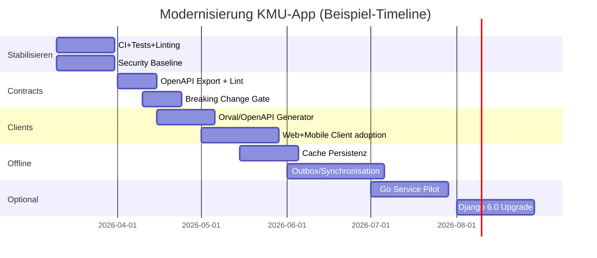

# Modernisierung einer KMU-Fullstack-App mit Django, PostgreSQL, React und React Native (Stand 06.03.2026)

## Zusammenfassung

Für eine KMU-ERP-App (viel CRUD, hohe Sicherheit, langfristige Wartbarkeit) ist **Django + PostgreSQL** im Jahr 2026 absolut sinnvoll und keineswegs “outdated” – aber: Es lohnt sich, die **Integrationsschichten** (API-Verträge, Type-Safety, Offline-Strategie) “state of the art” aufzusetzen, damit es sich nicht mehr schwer anfühlt. Der grösste Hebel ist fast immer **nicht** ein Rewrite in Go/TypeScript, sondern ein **konsequenter Contract-/Schema-Workflow** (OpenAPI → Client-Codegen), plus ein Repo-/Build-Setup, das Web und Mobile sauber mitzieht. citeturn23search2turn23search5turn18view2turn11search0turn14search1

Pragmatisch für 2026 (und für eine ERP-App sehr typisch) ist: **Django bleibt Kernsystem** (Auth, Permissions, Admin, ORM/Migrations, Business Rules, Auditing). Darüber wird ein **klar definiertes API-Layer** gelegt (Django Ninja oder DRF + drf-spectacular) und daraus werden **TypeScript-Clients** für React Web und React Native automatisch generiert. Das löst genau den Schmerz, den du beschreibst (“Django und React type-safe synchronisieren war mühsam”). citeturn21view0turn21view1turn18view0turn11search0

**Django 5.2 (LTS)** ist für ERP meistens die “Sweet Spot”-Wahl: langfristige Security-/Data-Loss-Fixes bis **April 2028**, neue Kernfeatures wie **Composite Primary Keys** und ein breites Python-Versionsfenster. Django 6.0 bringt spannende Bausteine (v.a. **CSP** und ein eingebautes **Tasks-Framework**), verlangt aber **Python ≥ 3.12** und hat kürzere Support-Zyklen. Für viele KMU-Backends ist daher: “erst modernisieren (Contracts, CI, Security), dann gezielt upgraden” die risikoärmste Route. citeturn23search5turn24view0turn23search1turn5view0turn6view1

**gRPC** ist für Mobile *manchmal* hervorragend (Streaming, sehr effiziente Übertragung auf HTTP/2, klare IDL/Typen), aber im Browser-Kontext bleibt **gRPC-Web** wegen Proxy-/Gateway-Anforderungen ein Stolperstein. Daher ist das Muster “**Aussen HTTP/JSON + OpenAPI**, innen optional gRPC” in 2026 weiterhin der pragmatische Standard – und wenn du Go ergänzen willst, passt das sehr gut in dieses Muster. citeturn12search4turn12search16turn12search13turn12search1turn13search6

## Zielarchitektur und Entscheidungsrahmen

### Annahmen

Ein paar Annahmen (bitte als “Default” lesen; wenn eine nicht stimmt, ändert sich die Empfehlung entsprechend):

Die App ist ein klassisches KMU-ERP mit rollenbasiertem Zugriff, Audit-Anspruch, vielen Formular-/CRUD-Flows, Integration zu Dritt-Systemen (E-Mail, Buchhaltung, etc.) und einer mobilen App mit zeitweise schlechter Konnektivität (Offline-/Retry-Bedarf). citeturn5view0turn20view4turn20view0

### Empfohlenes Zielbild

Das Zielbild ist “**Django als stabile Domäne** + **OpenAPI als Vertrag** + **automatischer Client-Codegen** + **Offline-fähige Clients**”.

```mermaid
flowchart LR
  subgraph Clients
    W[React Web]
    M[React Native / Expo]
  end

  subgraph Contract
    O[OpenAPI Spec<br/>/openapi.json]
    G[TS Client Codegen<br/>Orval / OpenAPI Generator]
  end

  subgraph Backend
    D[Django Core<br/>Auth, Permissions, ORM, Admin]
    A[API Layer<br/>Django Ninja oder DRF + drf-spectacular]
    T[Tasks<br/>Django Tasks (6.0+) oder Celery/RQ/Dramatiq/Huey]
  end

  subgraph Data
    P[(PostgreSQL)]
  end

  subgraph Optional
    S[Go Services<br/>reporting/import/export/search]
  end

  W -->|uses| G
  M -->|uses| G
  A --> O
  O --> G
  A --> D
  D --> P
  T --> P
  D -. HTTP/gRPC .-> S
  S --> P
```

Django ist im Zielbild nicht “Frontend”, sondern **System-of-Record** und Sicherheits-/Domänenkern. Der “leichte” Teil entsteht, weil **Web + Mobile** ihre Datenzugriffe *nicht mehr manuell tippen*, sondern aus OpenAPI generieren. citeturn18view0turn11search0turn21view0turn20view3

### Entscheidungs-Matrix

Bewertung: 1 = schwach, 5 = stark. (Diese Matrix ist bewusst “produkt-/team-orientiert” und nicht rein theoretisch.)

| Kriterium | Django Fullstack (Templates/Admin) | Django + React/RN (API-first) | Go + React/RN (API-first) |
|---|---:|---:|---:|
| CRUD-/ERP-Speed (End-to-End) | 5 | 4 | 3 |
| Admin/Backoffice out of the box | 5 | 5 | 1 |
| Mobile-Fit (Offline, UX) | 2 | 4 | 4 |
| End-to-End Type-Safety | 2 | 5 (mit OpenAPI+Codegen) | 5 (mit OpenAPI/gRPC+Codegen) |
| Security-Defaults (Auth/Sessions/CSRF) | 5 | 4 | 3 |
| Performance/Latency Potential | 3 | 4 | 5 |
| Ops-Komplexität | 3 | 3 | 2 (monolith) bis 5 (microservices) |
| Rewrite-Risiko (Zeit/Bugs) | 1–2 | 3–4 | 1–2 |

Wesentliche Begründungen: Django bringt **Admin + Permissions + Auth + Sessions** als integrierten Kern mit, und der Admin ist explizit als internes Management-Tool gedacht (perfekt fürs KMU-Backoffice). citeturn20view3turn20view4turn20view0  
Für Type-Safety ist der “Game Changer” nicht die Sprache, sondern **ein maschinenlesbarer API-Vertrag** (OpenAPI) und **Codegen** (z.B. Orval). citeturn11search10turn11search0turn18view0

## Backend-Modernisierung

### Django 5.2 (LTS) vs Django 6.0

**Django 5.2 (LTS)** (Release 02.04.2025) ist als LTS-Version mindestens drei Jahre mit Security-Updates eingeplant; offiziell ist für 5.2 LTS “End of extended support” aktuell **April 2028**. citeturn24view0turn23search5turn23search2  
Für eine ERP-App ist das extrem wertvoll: weniger “Pflicht-Upgrades”, mehr Planbarkeit.

**Django 5.2 Highlights, die für ERP real relevant sind:**

Composite Primary Keys sind jetzt im Core via `django.db.models.CompositePrimaryKey` möglich. Das kann bei manchen ERP-Domänenmodellen (z.B. “Mandant + Nummernkreis + Jahr”) sauberer sein als künstliche Surrogate – aber es ist ein Werkzeug, kein Muss. citeturn24view0  
5.2 erweitert ausserdem Async-/Auth-Interfaces (u.a. async Implementierungen für Auth Backends, um Context-Switching zu reduzieren) und erhöht Default-PBKDF2-Iterationen (Passworthärte). citeturn24view2turn11search37

**Django 6.0 Highlights (Release 03.12.2025):**

Django 6.0 verlangt **Python ≥ 3.12** (wichtig für deine Plattform-/Deploy-Entscheidung). citeturn23search1  
6.0 bringt **Content Security Policy (CSP)** nativ (Middleware + Settings, inkl. Nonce-Unterstützung). citeturn5view0turn6view0  
6.0 bringt ausserdem ein eingebautes **Tasks-Framework** (Definition/Enqueue/Result-Handling), betont aber klar: Django liefert **keinen Worker**, die Ausführung muss durch externe Infrastruktur passieren. citeturn6view1turn6view2

**Support-/Release-Realität (wichtig für den “sinnvoll in 2026?”-Teil):**  
Die offizielle Download-Tabelle zeigt: **5.2 LTS** ist bis **April 2028** in extended support, **6.0** bis **April 2027** (und hat kürzere Zyklen). citeturn23search5  
Für KMU-ERP ist 5.2 LTS häufig “vernünftiger Default”, und einzelne 6.0-Features (wie Tasks) kann man bei Bedarf gezielt adoptieren (z.B. via Backport `django-tasks` falls du *noch* auf <6.0 bist). citeturn6view1turn10search3

### API-Layer Empfehlung: Django Ninja vs DRF

**Django REST Framework (DRF)** ist nach wie vor sehr leistungsfähig und hat ein grosses Ökosystem. Aber: DRFs **eingebaute OpenAPI-Schema-Generierung ist deprecate**, und DRF empfiehlt explizit **drf-spectacular** als Replacement für OpenAPI 3 Schema-Generierung und Doku. citeturn21view0turn21view1  
Wenn du “weniger Schmerz” willst, ist diese Deprecation relevant: Du musst das “Schema-/Docs”-Thema *bewusst* lösen, statt es als selbstverständlich zu erwarten.

**Django Ninja** ist hier sehr direkt: Es liefert OpenAPI/Swagger-Doku automatisch, und das OpenAPI-Schema ist standardmässig unter **`/openapi.json`** verfügbar; du kannst die interaktive Docs-UI disable’n oder schützen, während der Schema-Endpunkt bestehen bleibt – sehr praktisch für Codegen. citeturn18view0turn18view2  
Für Auth/Authorization bietet Ninja einen klaren Mechanismus: du definierst pro Operation ein Auth-Objekt. citeturn11search3

**Empfehlung (2026, KMU-ERP, React + RN):**
- Wenn du bereits tief in DRF bist: **bleib** dort, aber modernisiere es konsequent mit **drf-spectacular** und einer sauberen OpenAPI→Codegen-Pipeline. citeturn21view0turn21view1  
- Wenn du “weniger Framework-Reibung” willst und sowieso modernisierst: **Django Ninja** ist ein sehr guter API-Layer, weil OpenAPI/Docs/Schema-Export “first-class” sind. citeturn18view0turn11search0

### Security-Baseline für ERP: Sessions, CSRF, Headers, CSP

Django hat einen sehr umfangreichen Security-Baukasten (XSS-Schutz über Template-Escaping, CSRF-Schutz, SQL-Injection-Schutz via parametrisierte Queries im ORM, Clickjacking-Protection, HTTPS/HSTS via SecurityMiddleware etc.). citeturn5view0turn7search2turn7search12  
Für ERP gilt: “sicher” ist nicht ein Setting, sondern **eine Konfiguration + kontinuierliche Checks** (z.B. Deployment-Checklist und System Checks). citeturn7search18turn7search12

Sessions: Django rotiert bei Login den Session-Key (`cycle_key`) als Mitigation gegen Session Fixation; zudem wird JSON-Serialisierung für Sessions stark empfohlen (Pickle kann bei Secret-Leak zu RCE eskalieren). Das ist für eine KMU-App eine sehr konkrete “Do/Don’t”-Regel. citeturn20view0

CSP (neu in Django 6.0): Aktivierung läuft über `ContentSecurityPolicyMiddleware` und Settings `SECURE_CSP` / `SECURE_CSP_REPORT_ONLY`; Nonce-Integration ist dokumentiert. In einer React-/SPA-Welt ist das besonders relevant, weil man häufig Script-Quellen und Inline-Skripte sauber whitelisten muss. citeturn6view0turn5view0

### Admin richtig nutzen (und richtig begrenzen)

Django Admin ist explizit als “quick, model-centric interface for trusted users” gedacht und die Doku warnt, ihn als komplettes Frontend zu missbrauchen; wenn du prozessorientierte UIs brauchst, sollst du eigene Views bauen. Für eine KMU-ERP-App ist das eine gute Leitplanke: Admin als internes “Backoffice-Tooling”, nicht als Ersatz für Web-/Mobile-UX. citeturn20view3  
Permissions: Django bringt ein Permission-System (Users/Groups, view/add/change/delete), und genau dieses Permission-Modell nutzt der Admin. Das ist extrem nützlich, wenn du “hohe Sicherheit” plus schnelle CRUD-Administration willst. citeturn20view4turn20view3

### Migrations als Produktfeature behandeln

Django-Migrations sind für ERP nicht Nebenprodukt, sondern Teil der “Lieferfähigkeit”. Django beschreibt den Workflow (z.B. `makemigrations`, initiale Migrationen, `migrate --fake-initial` für bestehende Tabellen) sehr klar. citeturn20view1  
Für komplexe Umbauten (z.B. M2M auf Through-Model) dokumentiert Django ausdrücklich `SeparateDatabaseAndState`, um Datenverlust zu vermeiden. citeturn20view2  
Für Performance-sensible Änderungen (z.B. Field mit Default hinzufügen) empfiehlt Django (über die Operations-Doku) ein zweistufiges Vorgehen, um teure Table-Rewrites auf älteren DBs zu vermeiden. citeturn8search1

### Tasks/Async: was in 2026 wirklich “state of the art” ist

Django 6.0 Tasks: Django positioniert Tasks als Möglichkeit, Arbeit ausserhalb des Request/Response-Zyklus zu definieren und zu enqueuen, betont aber, dass die Worker-Ausführung ausserhalb von Django stattfinden muss und die eingebauten Backends nur für Dev/Test sind. Das ist konzeptionell wichtig, weil es heisst: Auch “built-in” löst dir nicht automatisch Scheduling/Workers/Monitoring. citeturn6view1turn6view2

Wenn du robuste Production-Workers brauchst (Retries, Scheduling, Workflows), ist Celery weiterhin ein Standard: Celery beschreibt sich als “distributed task queue”, unterstützt Scheduling und hat eine explizite Django-Integration. citeturn10search0turn10search1  
Wenn du bewusst “lightweight” willst (weniger Ops), sind Alternativen wie RQ/Huey/Dramatiq dokumentiert und verbreitet (je nach Redis/RabbitMQ-Setup). citeturn9search0turn9search1turn9search2

## Datenbank und Persistenz

### PostgreSQL 17/18 Features, die für ERP spürbar sind

PostgreSQL 17 (Release 26.09.2024) bringt u.a. **SQL/JSON Features** inklusive **`JSON_TABLE()`**, das JSON in eine tabellarische Repräsentation transformiert. Das kann in ERP-Szenarien helfen, wenn du “semi-strukturierte” Daten brauchst, aber trotzdem relational queryen willst. citeturn4view1

PostgreSQL 18 (Release 25.09.2025) bringt mehrere Features, die in Alltagssystemen plötzlich sehr relevant werden:
- **Virtual generated columns** (neu Default für generated columns): berechnet beim Lesen statt beim Schreiben. citeturn19search16turn19search0  
- **UUIDv7** und native Unterstützung für UUIDv4/UUIDv7 im `uuid`-Typ: zeit-geordnet, kann bei Index-Lokalität/Insert-Pattern helfen (je nach Design). citeturn19search16turn19search5turn19search1  
- Zusätzlich nennt Release 18 u.a. OAuth Authentication Support sowie weitere DDL-/RETURNING-Erweiterungen. citeturn19search16turn19search9

Für eine KMU-ERP-App ist die wichtigste praktische Konsequenz: Du kannst (wenn du willst) mehr Logik konsistent auf DB-Level abbilden (z.B. generated columns für Such-/Sortierfelder), ohne gleich eine separate Such-Engine einzuführen. citeturn19search0turn19search3

### Full-Text Search als “ERP-Suche ohne Elasticsearch”

PostgreSQL hat eingebaute Full-Text-Search-Typen `tsvector` (Dokument) und `tsquery` (Query) und nutzt `@@` als Match-Operator. Das ist für ERP-Suche (Kund:innen, Belege, Artikeltexte) oft ausreichend, wenn du Ranking/Highlighting richtig aufsetzt. citeturn19search3turn19search23

### Schema-Strategie und Migrations-Disziplin

Wenn du DB-Änderungen “online” und risikoarm machen willst, ist das wichtigste nicht ein Tool, sondern ein Muster: **Migrationen so schreiben, dass Deployments “roll forward” und “roll back” tolerieren**. Django liefert dafür die Bausteine (z.B. `SeparateDatabaseAndState`) und beschreibt Fallstricke (z.B. ManyToMany → Through). citeturn20view2  
Für schrittweise Default-Änderungen (Spalte hinzufügen) ist der “Add nullable, dann Alter default”-Pfad in Django dokumentiert. citeturn8search1

## API-Verträge, Codegen und CI/CD

### Warum OpenAPI in 2026 der zentrale Hebel ist

OpenAPI ist eine sprach-agnostische Spezifikation, um HTTP-APIs so zu beschreiben, dass Menschen und Maschinen sie verstehen und Clients/SDKs daraus generieren können. Das ist die Grundlage für “Type-Safety ohne Handarbeit”. citeturn11search10turn11search6

Wichtig: Die Spezifikation ist nicht stehen geblieben. Aktuell dokumentiert die offizielle Seite **OpenAPI 3.2.0** mit Datum 19.09.2025. citeturn11search10

### OpenAPI in Django Ninja: Schema als Artefakt

Ninja stellt das Schema unter `/openapi.json` bereit und erlaubt, die interaktive UI zu verstecken, während das Schema für Codegen verfügbar bleibt. Es kann zudem eine Docs-Decorator-Auth gesetzt werden (z.B. “nur staff”). citeturn18view0turn18view2

Beispiel: Schema exportieren (CI oder lokal), ohne “manuell klicken”:

```bash
curl -sS https://dein-backend.example/api/openapi.json -o openapi.json
```

### Orval vs OpenAPI Generator: Empfehlung

**Orval** wirbt explizit damit, aus OpenAPI “type-safe TypeScript clients” zu generieren, inklusive Integrationen wie React Query (TanStack Query) und MSW-Mocks. Das ist für Web + React Native sehr attraktiv, weil du im Frontend wirklich bei *einer* Datenzugriffsschicht landest. citeturn11search0turn11search4

**OpenAPI Generator** ist ein breites, universelles Tool (viele Generatoren); der `typescript-fetch` Generator ist dokumentiert und für “plain fetch SDKs” geeignet. Wenn du ein neutraleres SDK willst (ohne React Query Hooks), ist das oft die bessere Wahl. citeturn11search1turn11search12

**Pragmatischer Entscheid:**
- React/TanStack Query-first: **Orval**.
- Framework-agnostisches SDK (oder mehrere Consumer): **OpenAPI Generator**.

### Contract-first im Alltag: Lint + Breaking Change Detection

Für “Contract-first” im Sinne von *stabilen Clients* brauchst du zwei Gates:

**Linting / Style / Governance:** Spectral ist ein YAML/JSON Linter, der ein Ruleset braucht; es gibt ein eingebautes OpenAPI Ruleset (`spectral:oas`). citeturn17search2turn17search3

**Breaking Changes:** oasdiff vergleicht OpenAPI Specs und listet Breaking Changes auf; es ist CI-ready und bietet explizite Commands wie `oasdiff breaking`. citeturn17search0turn17search4

Beispiel-Commands für CI:

```bash
# Lint OpenAPI
npx @stoplight/spectral-cli lint openapi.json

# Check breaking changes gegen main
oasdiff breaking openapi-main.json openapi-branch.json
```

### Codegen Workflow: minimal, aber robust

Ein Workflow, der sich in der Praxis bewährt:

1) Backend-PR generiert **aktuelles OpenAPI** (z.B. via Live-Endpunkt oder Management-Command, je nach Setup). citeturn18view0turn21view1  
2) `spectral lint` + `oasdiff breaking` laufen in CI. citeturn17search2turn17search4  
3) Wenn OK: Frontend-Package `@acme/api-client` wird (a) neu generiert und (b) im Repo versioniert (oder als Artefakt publiziert). Orval/OpenAPI Generator liefern dafür die Basiskomponenten. citeturn11search0turn11search1

Beispiel `orval.config.ts` (als Ausgangspunkt):

```ts
import { defineConfig } from "orval";

export default defineConfig({
  kmu: {
    input: "./openapi.json",
    output: {
      target: "./packages/api-client/src/generated.ts",
      client: "fetch",
      mode: "split",
    },
  },
});
```

## Frontend: React Web + React Native

### “Django Fullstack” vs “Django + React/RN” (Begriffsklärung)

Django “Fullstack” meint typischerweise: servergerenderte Templates + Forms + Sessions + Admin – also ein HTML-zentriertes Stack, in dem Django sehr viele Dinge zusammenspielt. React ist dagegen eine UI-Library, die Komponenten im Client rendert. In deiner Realität (React Web + React Native) nutzt du Django kaum als UI-Schicht, sondern als **API-Provider**. Genau dort entstehen dann die typischen Schmerzen: Auth-Flows, Type-Sync, Offline, API-Verträge. citeturn20view3turn14search0turn14search1

Die Frage ist daher weniger “ist Django outdated?”, sondern: **nutzt du Djangos Fullstack-Stärken (Admin/Auth/Migrations/Permissions) genug, um den Overhead zu rechtfertigen?** Für eine ERP-App ist die Antwort häufig ja – vor allem wegen Admin/Permissions/Migrations. citeturn20view3turn20view4turn20view1

### Mono-Repo vs Poly-Repo: Empfehlung für Web + RN

**Monorepo** hat einen sehr konkreten Vorteil: “single source of truth” für Codegen-Artefakte (OpenAPI, TS-Clients, shared UI/Domain). pnpm hat built-in Workspace-Support, inkl. `pnpm-workspace.yaml`. citeturn15search2turn15search8  
Expo beschreibt Monorepos als hilfreich für Code-Sharing und nennt “first-class support” via Workspaces (Bun/npm/pnpm/Yarn). citeturn15search3turn15search11

Wenn du React Native/Expo ernsthaft modernisierst, ist ein Monorepo besonders attraktiv, weil du dann **ein** `packages/api-client` für beide Apps hast, plus evtl. `packages/ui` oder `packages/domain`. citeturn15search3turn11search0

Tooling: Nx bietet explizite Plugins für React Native (und Expo) in einem Workspace; das hilft bei Generators/Tasks/Build-Graph. citeturn15search5turn15search25  
Turborepo ist ein Build-System mit Fokus auf JS/TS-Workflows und Caching – oft sehr gut für “schnellere CI”. citeturn15search0turn15search30

### Shared Types und Data Access

Die sauberste “Shared Types”-Story (ohne Magie) ist: **OpenAPI → generierte Types/Clients**. Orval ist dafür sehr explizit positioniert. citeturn11search0turn11search4

Für Server-State (CRUD-Daten) ist TanStack Query 5 ein etablierter Standard; die Doku sagt explizit, dass es mit ReactDOM **und** React Native funktioniert. citeturn14search33  
Für Offline/Cache-Persistenz bietet TanStack Query das `persistQueryClient` Plugin und spricht von “Persisters”, die den QueryClient-Cache in Storage ablegen können. citeturn14search6  
Offline Mutations sind ebenfalls dokumentiert (inkl. Hinweis, dass Resuming nach Reload eine Default-Mutation-Funktion braucht). citeturn14search13

### Offline-Sync: local persistence auf Mobile

React Native dokumentiert, dass Networking via Fetch API möglich ist (für REST/HTTP). citeturn14search1  
Für lokale Persistenz: React Native hat AsyncStorage aus dem Core entfernt und verweist auf Community-Packages. citeturn22search0turn22search9  
Wichtig für Sicherheit: Die RN Security-Doku sagt klar, Async Storage sei “unencrypted” und soll **nicht** für Token Storage/Secrets verwendet werden. citeturn22search32turn22search6  
Wenn du Expo nutzt, dokumentiert Expo die Installation des Community-AsyncStorage-Pakets, weist aber ebenfalls darauf hin, dass es “unencrypted” ist. citeturn22search3

Für “echtes Offline” (z.B. Aufträge erfassen, später syncen) ist eine lokale DB oft sinnvoller als Key-Value Storage. Expo SQLite dokumentiert sogar eine `localStorage`-Drop-in-Implementation, was Code-Sharing zwischen Web (localStorage) und Native (SQLite-backed) vereinfachen kann. citeturn22search1

Ein verbreitetes Muster (konzeptionell) ist ein **Outbox-Table** auf dem Device: Writes werden lokal gespeichert, im Hintergrund gesendet, und serverseitig über Idempotency Keys dedupliziert. (Das ist eher Architekturprinzip als Framework-Feature; die konkrete Implementierung hängt von deinem Domainmodell ab.)

### Repo-Layout Beispiel (Monorepo mit Codegen)

```text
repo/
  apps/
    web/                 # React Web
    mobile/              # React Native / Expo
  services/
    backend/             # Django (monolith)
    go-services/         # optional, später
  packages/
    api-client/          # generierter TS client (Orval / OpenAPI Generator)
    domain/              # shared domain types (keine API DTOs)
    ui/                  # shared UI primitives (optional)
  openapi/
    openapi.json         # “blessed” spec snapshot (optional)
  .github/workflows/
```

## gRPC und optionale Go-Services

### Wann gRPC (nur für Mobile) wirklich Sinn macht

gRPC positioniert sich als high-performance RPC-Framework, das auch für die “last mile” geeignet ist – explizit für Devices/Mobile Apps. citeturn12search4  
Für Android beschreibt Google gRPC als effizient auf HTTP/2 (Multiplexing, Header Compression, Flow Control) und hebt Bidirectional Streaming hervor, was gerade bei intermittierender Konnektivität und Live-Use-Cases nützlich sein kann. citeturn12search16

**Typische Mobile-gRPC Use-Cases in einer ERP-App:**
- Streaming / “live” Updates (z.B. Lagerbewegungen, Status-Feed)
- sehr chatty APIs (viele kleine Requests, bei denen HTTP-Overhead schmerzt)
- definierte, kompakte Payloads (Protobuf) statt JSON

Wenn deine Mobile-App aber primär klassische CRUD-Screens hat, die ohnehin gut mit Cache/Offline-Queue laufen, ist **HTTP/JSON + OpenAPI + TanStack Query** häufig “gut genug” – und deutlich einfacher zu debuggen. (Das ist eine pragmatische Einschätzung; der technische Kernpunkt ist: gRPC lohnt sich v.a. wenn du Streaming/Overhead/IDL wirklich brauchst.) citeturn12search16turn11search0turn14search6

### gRPC intern vs gRPC-Web und warum das im Browser heikel ist

gRPC nutzt standardmässig Protobuf als IDL/Payload-Struktur. citeturn12search28turn12search6  
gRPC-Web im Browser braucht typischerweise einen Proxy (z.B. Envoy), der Browser-Requests zu gRPC HTTP/2 übersetzt; das wird in gRPC-Web Material als normaler Bestandteil dargestellt. citeturn12search1turn12search13  
Auch Connects FAQ fasst das pragmatisch: Viele gRPC Implementierungen unterstützen gRPC-Web nicht direkt, sodass ein Proxy nötig wird. citeturn13search14

**Konsequenz:** Für Web-Frontends bleibt HTTP/JSON oft einfacher. Daher ist das Muster sinnvoll:
- **Extern (Web + Mobile default):** HTTP/JSON + OpenAPI
- **Intern (Service-zu-Service):** gRPC (oder Connect) dort, wo es wirklich Nutzen bringt

### Django “mit gRPC”: Optionen und Realitätscheck

Es gibt Libraries, die “gRPC mit Django” anbieten, z.B. “Django gRPC Framework”. Die Requirements in der Projektdoku sind jedoch deutlich bei sehr alten Django-/Python-Versionen (z.B. Django 2.2/3.0, Python 3.6–3.8). Das macht es für ein modernes Django 5.2/6.0 Setup riskant. citeturn13search25turn13search1  
gRPC Python selbst hat heute eine stabile AsyncIO API (`grpc.aio`). Wenn du in Python gRPC willst, ist ein **separater gRPC Service** (nicht “im Django WSGI/ASGI Prozess”) in der Regel die bessere technische Trennung. citeturn13search2turn13search29

### Protobuf vs JSON: Interop und “ProtoJSON”

Protobuf hat eine definierte JSON-Repräsentation (ProtoJSON). Das ist wichtig, weil du in der Praxis Mischwelten hast: Mobile gRPC, Web JSON, Logging/Debug JSON. citeturn12search2turn12search6

### Wo Go gut als Ergänzung passt (Blueprint)

Go lohnt sich im ERP-Kontext oft nicht als “Rewrite der gesamten Domäne”, sondern als **gezielt isolierter Service** für:
- Import/Export (grosses I/O, Streaming)
- Report-/PDF-Generierung und Batch-Jobs
- Integrations-Connectoren mit hohen Throughput-Anforderungen
- Search/Indexing Pipelines

Wenn du Go einsetzt, ist `sqlc` als type-safe SQL Codegen ein starker Baustein: `sqlc` beschreibt explizit, dass man SQL schreibt und daraus type-safe Go Code generiert. citeturn12search3turn12search7

**Interop Django ↔ Go:**
- HTTP/JSON: am einfachsten, nutzt sowieso OpenAPI und Orval/OpenAPI Generator.
- gRPC: gut für interne Services (klarer Vertrag, Streaming), Django als Client und Go als Server.

Mini-Beispiel `.proto` (intern / mobile, stark vereinfacht):

```proto
syntax = "proto3";

package kmu.v1;

message Customer {
  string id = 1;
  string name = 2;
}

message GetCustomerRequest {
  string id = 1;
}

service CustomerService {
  rpc GetCustomer(GetCustomerRequest) returns (Customer);
}
```

## Delivery, Dev-Ergonomie und Migrationsplan

### Tooling-Stack (2026) mit Fokus auf “weniger Reibung”

Python Code Quality: Ruff ist explizit “fast linter and code formatter” und kann als Formatter sogar Black-ähnlich fungieren (`ruff format`). citeturn16search0turn16search8  
Type Checking: mypy ist ein statischer Type Checker und beschreibt “type check without running code”. citeturn16search34turn16search5  
Dependency Auditing: `pip-audit` scannt Python Environments gegen bekannte Vulnerabilities (PyPA advisory DB) und es gibt sogar eine offizielle GitHub Action (`gh-action-pip-audit`). citeturn16search2turn16search31

Observability: OpenTelemetry zeigt für Python/Django Auto-Instrumentation (u.a. `opentelemetry-instrumentation-django`) und dokumentiert Setup-Schritte. citeturn16search7turn16search3turn16search28  
Django Logging basiert auf Pythons Logging-Modul. citeturn7search6

### CI/CD Template (Konzept)

Das Ziel ist, dass ein PR:
- Backend: Tests + Lint + Typecheck + Dependency Audit
- Contract: OpenAPI generieren + linten + breaking changes checken
- Frontend: Typecheck + Lint + (optional) generate client und prüfen, dass nichts “driftet”

Beispiel (GitHub Actions Skeleton, stark gekürzt, als Vorlage):

```yaml
name: CI

on:
  pull_request:

jobs:
  backend:
    runs-on: ubuntu-latest
    steps:
      - uses: actions/checkout@v4
      - uses: actions/setup-python@v5
        with:
          python-version: "3.12"
      - run: python -m pip install -r services/backend/requirements.txt
      - run: ruff check services/backend
      - run: ruff format --check services/backend
      - run: mypy services/backend
      - run: pip-audit -r services/backend/requirements.txt
      - run: pytest -q services/backend

  contract:
    runs-on: ubuntu-latest
    steps:
      - uses: actions/checkout@v4
      - run: curl -sS https://staging.example/api/openapi.json -o openapi-branch.json
      - run: npx @stoplight/spectral-cli lint openapi-branch.json
      - run: oasdiff breaking openapi-main.json openapi-branch.json

  frontend:
    runs-on: ubuntu-latest
    steps:
      - uses: actions/checkout@v4
      - uses: actions/setup-node@v4
        with:
          node-version: "20"
      - run: corepack enable
      - run: pnpm install --frozen-lockfile
      - run: pnpm -r typecheck
      - run: pnpm -r lint
      - run: pnpm -C packages/api-client generate
```

Die eingebauten Commands entsprechen den Tools: Spectral als Linter, oasdiff als Breaking-Change-Detektor, pip-audit als Vulnerability Scan. citeturn17search2turn17search4turn16search2turn16search31

### Migrationsplan in Phasen

| Phase | Ziel | Ergebnisartefakte | Risiko |
|---|---|---|---|
| Stabilisieren | Ist-Stand testbar und deploybar machen | Tests, CI, Security Checklist, Migrations-Disziplin | niedrig |
| Contracts einziehen | OpenAPI als Vertrag | `/openapi.json`, Spectral, oasdiff Gate | niedrig–mittel |
| Codegen und Clients vereinheitlichen | Type-Safety Web+Mobile | `packages/api-client` (Orval/OAG) | mittel |
| Offline und Sync professionalisieren | Mobile robust bei schlechter Verbindung | PersistQueryClient + lokale DB/Outbox | mittel |
| Optional: Go Services | Hotspots isolieren | gRPC/HTTP Interop, eigene Deployables | mittel–hoch |
| Optional: Upgrade auf Django 6.0 | CSP/Tasks/Neues nutzen | Python 3.12+, CSP, Tasks Infra | mittel |

Django liefert Checklisten für Deployment-/Security-Settings explizit als “must be set properly”. citeturn7search18turn7search12  
Die Migrations-Phase baut stark auf Djangos Migrations-Mechanik (`makemigrations`, `migrate --fake-initial`, `SeparateDatabaseAndState`) auf. citeturn20view1turn20view2

Zeitplan (Beispiel, anpassbar):



### Kritische Selbstprüfung (die dir vermutlich am meisten Geld/Zeit spart)

Wenn du wirklich “hand aufs Herz” kritisch hinschaust, sind diese Fragen die richtigen:

- Nutzt du den Django-Admin als echten KMU-Hebel (internes Management) – oder baust du Admin-Funktionalität in React nach? Wenn du ihn nutzt, ist Django fast nie “outdated”, sondern ein massiver Produktivitätsvorteil. citeturn20view3  
- Ist dein Schmerz wirklich “Django vs Go” – oder “kein sauberer Vertrag/Codegen”? Wenn du OpenAPI als first-class Vertrag etablierst (Ninja/DRF+dokumentierte Wege), verschwindet ein grosser Teil der manuellen TS-Sync-Arbeit. citeturn18view0turn21view0turn11search0  
- Brauchst du im Alltag wirklich gRPC, oder brauchst du “Offline/Retry/Caching” sauber? gRPC lohnt sich vor allem dann, wenn du von HTTP/JSON in konkrete gRPC-Features wechselst (Streaming/HTTP2 Effizienz/IDL). citeturn12search16turn12search13turn12search1  
- Passt dein Security-Modell zur Client-Welt (Web vs Mobile)? Django hat starke Defaults, aber Mobile braucht bewusstes Token/Storage-Design, weil Async Storage unverschlüsselt ist und nicht für Secrets gedacht ist. citeturn20view0turn22search32turn6view0