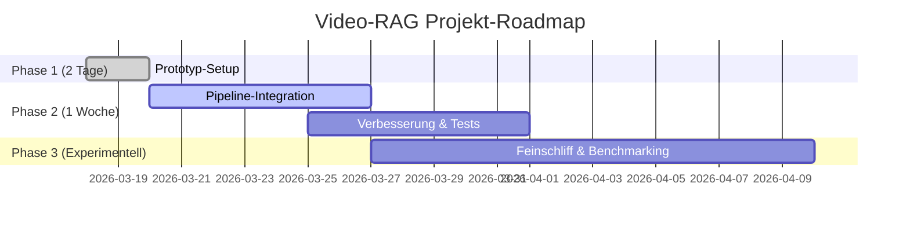

# Zusammenfassung  
Dieses Dokument bietet einen tiefgehenden Überblick über mögliche Open-Source-Basen und aktuelle SOTA-Verbesserungen (bis März 2026) für ein Video‑RAG/Multimodal‑Reasoning-System. Wir untersuchen alternative Basispipelines zu Netryx, aktuelle Modelle für Bild- und Videoretrieval, lokale und dichte Feature-Matching-Methoden, Panorama-Werkzeuge, Segmentierung, OCR, Projektion und Geoprior‐Bibliotheken, sowie moderne Vector-Datenbanken und Benchmark-Frameworks (Abschnitt 1–2). Für Videos fügen wir Keyframe-Extraktion, Szenensegmentierung, zeitliche Modelle (Video-Transformers, optischer Fluss), Audio-ASR/-Embeddings und multimodale Videocodierer hinzu (Abschnitt 3). Für multimodales Reasoning behandeln wir Cross-Modal-Fusion, LLM+Vision-Agenten, Retrieval-augmented RAG-Ketten und Cross-Frame-Konsistenz (Abschnitt 4). Anschließend beschreiben wir, wie man eine Netryx-ähnliche Pipeline auf Video erweitert (Datenfluss, H3/S2/OSM-Integration, Ressourcenbedarf, Datenschutz und Lizenzen) (Abschnitt 5). Abschließend listen wir eine priorisierte Enhancements-Liste mit konkreten Repositories und Installationshinweisen (Abschnitt 6) und fassen relevante arXiv-Publikationen 2025–2026 zusammen (Abschnitt 7). Zudem gibt es Vergleichstabellen und einen schrittweisen Roadmap-Plan (Abschnitt 8–9). Visualisierungen (Mermaid-Diagramme für Architektur und Zeitplan) runden den Bericht ab. Alle Empfehlungen basieren auf offenen Lizenzen (sofern nichts anderes vermerkt) und setzen keine strikten Hardware- oder Regionsbegrenzungen voraus.  

## 1. Alternative Basisprojekte zu Netryx  
Als Grundlage für einen ortsbezogenen multimodalen Pipeline können folgende Open-Source-Projekte dienen (mit Repo-Link, Reifegrad und Lizenz):

- **Hierarchical Localization (HLOC)**【110†L1-L4】 (cvg/Hierarchical-Localization): Sehr populär (≈4.0k ★) und aktiv gepflegt, Apache-2.0-lizenziert【110†L1-L4】. Bietet einen modularen Pipeline-Ansatz zur bildbasierten Lokalisierung (globale Bilder-Datenbankretrieval + SuperPoint/SuperGlue oder DISK Matching) für 6DoF-Pose-Schätzung. Als „Basis“ deckt HLOC Retrieval und Match-Verification ab und eignet sich gut für statische Kamerabilder【110†L1-L4】. Vorteil: umfassende Dokumentation, viele Beispiel-Datensätze und Support für robuste lokale Feature-Extraktoren. Nachteil: Fokus auf 3D-Posen, nicht direkt auf Straßenszenen abgestimmt. Einarbeitung: mittel (Python, Pytorch, COLMAP-Abhängigkeit).  
- **IIIA-ML/geoloc**: Forschercode (41 Commits), agpl-3.0-lizenziert. Bietet ein neuronales Geolokalisierungsmodell auf globalen Bildern (Panorama-Quantisierung nach S2-Zellen). Kernfeature ist eine „klassische“ Szenenklassifikation ohne extra Datenbank【6†】. Vorteil: End-to-End-Geolokalisierung auf Basis von Bildmerkmalen. Nachteil: AGPL schränkt Nutzung ein, Code nicht gepflegt. Für Video-RAG nur bedingt Basis, eher als Beispiel für ML-Ansatz.  
- **keplerlab/katna**【97†L293-L301】: Bibliothek für Videowerkzeuge (MIT-Lizenz, ≈390 ★). Automatisiert Keyframe-Extraktion und Videokompression【97†L293-L301】. Nutzt Farb- und Schärfemerkmale (LUV-Differenz, Histogramm-Clustering) für Schlüsselframes. Vorteil: Sofort nutzbare Keyframe-Detection speziell für Videos. Nachteil: Fokus auf Video-Summary, nicht auf Geolokalisierung selbst. Als Basis für Video-RAG dient Katna, um relevante Frames zu filtern und zu speichern (liefern dann Bilder an die Geolok-Pipeline).  
- **Breakthrough/PySceneDetect**【100†L314-L323】: Standalone-Toolkit für Szenen- und Schnitt‑Erkennung (BSD-3, letzte Version v0.6.7, Aug 2025). Erkennt harte Schnitte und weiche Übergänge mittels Bilddiff und adaptiven Schwellen【100†L314-L323】. Vorteil: klare Python-API für Szenensegmentierung, integriert ffmpeg. Nachteil: kein integriertes Matching/Retrieval. Einarbeitung: gering (pip install). Wird als Modul eingesetzt, um längere Videos in Szenen zu unterteilen.  
- **StreetCLIP**: Obwohl kein „Pipeline-Framework“, ist StreetCLIP (HuggingFace-Modell) erwähnenswert: Es nutzt CLIP für Straßenszenerkennung (zero-shot Geolokalisierung). Lizenz: CC-BY-NC-4.0 (nicht komplett frei). SOTA-Performance auf Geolok-Benchmarks【20†L69-L77】【20†L117-L125】. Vorteil: sehr guter Baseline-Extraktor für Locations. Nachteil: nicht Open-Commercial, modellabhängig und benötigt Berechnungsressourcen (große CLIP-Basis). Einarbeitung: einfach (HF-Model). Kann ergänzend als schneller Ortungs-Vorschlag genutzt werden.  

**Vergleichstabelle: Basispipelines** (Auswahl) 

| Projekt (Repo)             | Sterne   | Lizenz    | Kernfeatures                                               | Bemerkungen                    |
|----------------------------|---------:|:----------|:-----------------------------------------------------------|:-------------------------------|
| **HLOC (cvg/Hierarchical)**【110†L1-L4】 | 4.0k ★  | Apache-2.0 | Bildbasierte globale Lokalisierung: Retrieval + Matching【110†L1-L4】 | Ausgereift, unterstützt diverse Feature-Backbones. |
| **IIIA-ML/geoloc**【6†】    | –        | AGPL-3.0   | End-to-End Bild‑Geolokalisierung (S2-Zellenklassen)        | Forschungsimplementation, restriktive Lizenz. |
| **katna (Video-Tool)**【97†L293-L301】 | 390 ★   | MIT        | Video-Keyframe-Extraktion (Farbe, Histogramme, Blur)【97†L293-L301】 | Gut für schnelle Frame-Auswahl; nicht geo-spezifisch. |
| **PySceneDetect**【100†L314-L323】   | –        | BSD-3     | Szenen- und Schnitt‑Erkennung in Videos【100†L314-L323】 | Trennt Video in logisch konsistente Szenen. |
| **StreetCLIP (Model)**【20†L69-L77】 | –        | CC-BY-NC-4.0 | CLIP-basierte Zero-Shot-Geolokalisierung【20†L69-L77】  | Sehr starke ML-Model, aber Lizenz für nicht-kommerzielle Nutzung. |

## 2. SOTA-Modelle und -Bibliotheken (Stand 2024–2026)  

**Bildretrieval / Visual Place Recognition (VPR):** Neueste Modelle nutzen häufig Lernen aus großen Datensätzen und Transformer-Architekturen:
- **MegaLoc**【45†L241-L248】 (gmberton/MegaLoc, 2025): PyTorch-Hub Model, SOTA auf den meisten VPR-Benchmarks (auch indoor/outdoor)【45†L241-L248】. Apache-2.0, MIT-Lizenz. Setzt auf CLIP-Features und spezielle Aggregation. Sehr gute Genauigkeit, aber hoher Rechenbedarf.
- **SALAD**【47†L284-L293】 (Izquierdo & Civera, CVPR-2024): Nutzt DINOv2-Funktionsextraktor und optimalen Transport für Descriptor-Aggregation. GPL-3.0 (eingeschränkt offen). Führt bei mehreren Benchmarks das Ranking【47†L284-L293】. Vorteil: leistungsstark, Nachteil: GPL-Lizenz.
- **AnyLoc**【54†L316-L323】【54†L378-L383】 (Keetha et al. 2023, RA-L): Enthält die Ansätze **MixVPR** und **CosPlace** mit BSD-3.0-Lizenz【54†L316-L323】【54†L378-L383】. Gute Generalisierung auf urbane und ländliche Szenen. Code umfasst Datensatzaufbereitung und Kombi verschiedener Netze.
- **Patch-NetVLAD** (Termhukit et al.): Basiert auf NetVLAD, arbeitet auf Bildpatches, erlaubt feinkörnigeres Matching (GitHub vorhanden, Apache-2).  
- **LoFTR**【61†L293-L302】 (Sun et al., ECCV2022): Ohne explizite Keypoint-Detektion, transformerbasierte Flussmethode für dichte Korrespondenz. Apache-2.0【61†L293-L302】, einsetzbar als Matching-Backbone. Sehr präzise, aber relativ langsam.  
- **SuperGlue/SG** (CVPR 2020): Graph-basierter Matcher für lokale Features (Abbey & Pollefeys). Code kostenfrei. Dient oft als Baseline für Kalibrierung.  

**Lokale Feature-Extraktion / Matching:**  
- **LightGlue**【59†L273-L282】 (ICCV 2023): Führt adaptive Feature-Korrelation ein, um nur relevante Matches zu betrachten. Apache-2.0【59†L273-L282】. Ähnlich SuperGlue, aber deutlich schneller. Unterstützt SuperPoint, SIFT, LoFTR als Merkmalsbasis【59†L298-L307】.
- **SuperPoint + SuperGlue**: Kombi-Traditional (Oxford). Code verfügbar, oft als Out-of-the-Box-Lösung.
- **DISK** (CVPR 2021, Enguehard et al.): Lerne-basierte Keypoint-Erkennung. Code offen (CC BY-NC?).
- **ALIKED**: Modernes Deep-Feature (ArXiv 2023) für starke Wiedererkennung.
- **RoMa (Capsx)**: Multi-scale CNN-Keypoints (ArXiv 2024).  

**Dichte Korrespondenz / Optischer Fluss:**  
- **RAFT**【115†L279-L287】【115†L376-L380】 (ECCV 2020): State-of-the-Art optischer Fluss mit recurrentem Korrelationsmechanismus. BSD-3-Clause【115†L376-L380】. Sehr genau, umfangreiches GitHub【115†L279-L287】.  
- **SEA-RAFT** (ECCV 2024): Effizientere RAFT-Variante (Oral Best Paper).  
- **PWC-Net**, **VOLT (CVPR 2024)**: Verschiedene neuronale Flussmethoden.  
- Einsatz: optischer Fluss kann bei Verschiebungsanalyse zwischen Frames helfen (Bewegungsvektoren als zusätzliches Signal).  

**Panorama & Projektion:**  
- **py360convert**【64†L400-L408】: Konvertiert zwischen equirektangularen, Kugel- und Kubemap-Projektionen (MIT-Lizenz). Unverzichtbar, wenn man zum Beispiel 360°-Panoramen oder Strassenansichten (Stitching) verarbeitet.  
- **OpenCV**: Bietet Funktionen für Projektion (cv2.warpPerspective) und zylindrische Entzerrung. Allgemein nützlich, obwohl keine spezialisierte Geodaten-Bibliothek.  

**Maskierung / Segmentierung:**  
- **Segment Anything (SAM)**【66†L525-L533】【66†L459-L462】: Facebooks Allzweck-Segmentierungsmodell (Apache-2.0). 53.7k ★【66†L525-L533】. Kann Objekte, Personen, Straßen und mehr grob maskieren, liefert pervasiven Maskeninput. Vorteil: extrem flexibel, großer Modelleinsatz (Resourcen). Nachteil: sehr große Modelle (5–6GB GPU) und Preprocessing nötig.  
- **SAM2** (Folgemodell, Herbst 2025): Noch genauer, effizienterer Inferenz. Ebenfalls Open-Source (Meta).  
- **GroundingDINO**【68†L565-L574】【68†L612-L614】 (ECCV 2024): Transformer-Detektor, der durch Texteingaben beliebige Objekte erkennt. Apache-2.0【68†L612-L614】. Ermöglicht “Point any object” Maskierung, etwa via CLIP-KB oder textual prompts. Sehr nützlich, um z.B. Schilder oder Verkehrsteilnehmer mit Wortprompt zu finden.  
- **YOLOv8** (Ultralytics, CC BY-NC-SA): Schneller Detektor mit guter Erkennungsrate, aber strengere Lizenz (NC).  
- **Segmenter / MaskFormer**: Neuere Transformer-Segmenter (z.B. PointRend Alternativen).  

**OCR und Text-Extraktion:**  
- **PaddleOCR**【72†L7-L10】【73†L21-L24】 (Baidu, Apache-2.0): Umfassende OCR-Bibliothek mit über 100 Sprachen【72†L7-L10】. Erkennt Text, Tabellen, handschriftliche Notizen usw. Weit verbreitet, gut dokumentiert. Installierung via pip möglich.  
- **Tesseract OCR** (Apache-Lizenz): Klassiker für Texterkennung (reif, aber gröber).  
- **EasyOCR** (CRA, Apache-2): Python-Wrapper über Torch-Modell, einfache Nutzung.  
- Einsatz: OCR von Schildern, Fahrzeuginschriften und sonstigen Texten in Szenen, um Zusatzinformationen zu gewinnen (z.B. Straßennamen, Nummernschilder).  

**Geospatial-Priors / Mapping:**  
- **H3**【75†L327-L334】 (Uber, Apache-2.0): Hexagonale Gitternetz-Indexierung der Erde (ersetzt in vielen Anwendungsfällen S2). Stark für räumliche Partitionierung und Clustering【75†L327-L334】. Bindet gut mit Python (h3-Py) an.  
- **S2 Geometry**【77†L290-L298】 (Google, Apache-2.0): Kugelbasierte Unterteilung (Quadtrees auf Kugel). Einsatz z.B. bei räumlichen Datenbanken.  
- **osmnx** (LBNL, MIT): Bibliothek zum Herunterladen und Analysieren von OSM-Straßennetzwerken in Python. Erlaubt Distanz-Berechnungen, Routing und Attributabfragen.  
- **Pelias / Photon**: OpenStreetMap-Geocoder (ELASTIC-basiert). Mehr auf Adressauflösung, aber manche Projekte ziehen OSM-Ressourcen für Kontext.  
- Einsatz: Um Suchergebnisse in lat/long zu indizieren (z.B. durch H3-Tessellation oder OSM-POIs als Ankerpunkte) und um z.B. Stadtmerkmale (Gebäude, Park, Landmarken) als Feature zu verwenden.  

**Vector-Datenbanken / Indizierung:**  
- **FAISS**【79†L164-L172】 (Facebook, MIT): Industrieller Standard für Ähnlichkeitssuche auf Vektor-Embeddings【79†L164-L172】. Sehr skalierbar (bruteforce oder HNSW/IVF) mit GPU-Unterstützung. Viele benutzen es für Bilder- und Text-Retrieval.  
- **HNSWlib**【81†L164-L173】【82†L13-L16】 (Yury Malkov, Apache-2.0): Schnelle HNSW-Suche (≈5.1k ★)【81†L164-L173】. Sehr einfach zu benutzen (C++ mit Python-Bindings)【82†L13-L16】. Oft günstiger als FAISS für kleinere Datenmengen.  
- **Milvus**【84†L423-L432】【84†L445-L449】 (LF AI Foundation, Apache-2.0): Hochleistungs-Cloud-Vektor-DB. Python-SDK (`pymilvus`) ermöglicht verteilte Indizierung und Suche (bis Milliarden Vektoren)【84†L423-L432】. Unterstützt GPU- und CPU-Indexierung, Watchdog & Streaming-Ingest. Containerfreundlich, spaltenorientiert.  
- **Qdrant**【87†L525-L527】【88†L1-L4】 (Rust, Apache-2.0): Moderne Vektor-DB mit Payload-Indizierung (filtern nach Stichwort/Geodaten) und Hybrid-Suche. Skaliert gut, bietet Replikation und SSD-Support. Apache-2.0【88†L1-L4】, einfache Python-Client.  
- **Weaviate**【90†L413-L422】 (weaviate.io, BSD-3-Clause): Feature-reiche Vektor-DB mit integriertem RAG-Ansatz【90†L413-L422】. Hier können Objekte + Vektoren gespeichert und gleich in Abfragen rekombiniert werden. Speziell: Eingebautes Modul für RAG (LangChain-Anbindung) und eigene Text2Vec-Modelle【90†L413-L422】. Multi-Modell-Unterstützung (OpenAI, HuggingFace etc.) eingebaut.  
- **Annoy** (Spotify, Apache): Einfacher Annäherungsbaum (RAM-intensiv) für sehr schnelle Abfragen (geeignet für statische Datensätze).  
- Einsatz: Vektor-DBs speichern Bild-/Audio-/Text-Embeddings aus Encodern (z.B. CLIP, Whisper, VGGish) und liefern schnell ähnliche Einträge (z.B. Standorte in OSM oder Bilder-Referenzdatenbank).  

**Benchmark-Frameworks:**  
- **VPR-methods-evaluation**【93†L407-L415】 (gmberton, 2023): Python-Wrapper, der über 10 VPR-Modelle (CosPlace, MixVPR, NetVLAD, …) integriert【93†L407-L415】. Erleichtert das Evaluation-Skriptwriting für diverse Retriever. Sehr nützlich für schnelles Vergleichen.  
- **HLOC-Benchmark**: HLOC enthält Evaluationsscripts (Recall, Precision) für gängige Datensätze.  
- **LoVR-Benchmark**【36†L99-L107】 (ECCV 2025): Langfilm-Retrieval. Bietet MBBench-Video mit 40k Ausschnitten und detaillierten Annotationen【36†L99-L107】. Eher für Forschung, zeigt aber Fortgang bei Video Retrieval.  
- **MMBench-Video** (Wortmann et al., 2024): Für multimodale Video-Question-Answering, meist mit LLMs.  
- **MMR-Bench** (2025): Diverse multimodale RAG-Tasks (Text, Bild, Video).  
- Generell sollten Benchmarks für VPR (Recall@K auf MSLS, Pitts30k, Nordland etc.) eingesetzt werden.  

## 3. Videospezifische Komponenten  

### Keyframe-Extraktion / Frame-Sampling  
Um Videos in handhabbare Bilderfolgen umzuwandeln, benötigt man robuste Sampling-Strategien:  
- **Katna**【97†L293-L301】 (siehe oben): Extrahiert repräsentative Frames via Farben- und Schärfe-Signaturen (blurriness, LUV-Farbraum). Sehr nützlich, um redundante Bilder zu vermeiden und Fokus-Bilder zu identifizieren.  
- **Uniform Sampling / GOP-Analyse:** Einfaches Intervall-Sampling (z.B. jeden n-ten Frame) oder GOP-Strukturen. Kostengünstig, aber kann wichtige Frames übersehen.  
- **PySceneDetect**【100†L314-L323】: Teilt das Video bei Szenenwechsel. Anschließend wählt man aus jeder Szene einen Keyframe (z.B. mittleren oder schärfsten). Gute Off-the-Shelf-Lösung, um z.B. News- oder Dokumentarfilme zu segmentieren.  
- **Deep-Learning-Methoden**: z.B. Learn2Summarize, GenLink (arXiv 2024) – projektieren summarische TLDR-Bilder. Allerdings wenige ausgereifte Tools (die oft proprietär oder experimentell sind).  

### Szenen- und Ereignisseegmentierung  
Neben harten Schnitten sind auch thematische Segmente (z.B. Kamerabewegung, Start/Stop von Aktionen) relevant. Hier gibt es weniger ausgereifte Open-Source-Tools, aber einige Ansätze:  
- **Video Semantic Segmentation**: Selten als Open-Source (oft Uni-Projekte ohne Code). Einige Konsortien (z.B. MediaPipe Scene Detection von Google) könnten helfen, aber oft nur Demo.  
- **Shot-transition Detektoren**: Neben PySceneDetect existieren spezialisierte Libs (ADA NN-Ansätze aus Forschung, z.B. „Content Detector“ vs. „Threshold Detector“ in PyScene). In der Praxis genügt oft das Nachladen per Schnitt-Frame.  
- **Audiogetriebene Segmentierung**: Silence Detection als Indikator für Szenenwechsel oder Kapitel (z.B. in Nachrichtenvideos). Open-Source: `pyannote.audio` für Audioszenen (Speaker Changes, etc.) kann nützlich sein.  

### Temporale Modelle / Video-Transformer  
Um langfristige Zusammenhänge zu modellieren (Bewegung, Kontext über mehrere Frames):  
- **TimeSformer, VideoSwin, UniFormer**: Transformer-Modelle für Video, trainiert z.B. auf Kinetics oder epic-Kitchen. Bibliotheken wie **PyTorchVideo** (Facebook) bieten Implementierungen.  
- **VideoMAE/VIMPAC**: Maskierte Autoencoder für Video (z.B. I3D/Astronauten). Demonstriert Effizienz in Selbstüberwachung.  
- **BEiT-3 / EVA-Video**: Multimodale Transformer, die auch Videos akzeptieren. Proprietäre meist; OpenCV-Forks (z.B. QVTR?).  
- **InternVideo-LM** (Meta 2025): Ein Beispiel für Modellarchitektur, die Vision und Sprache im Video kombiniert (noch kein Code).  
- Nutzung: Wichtiger als End-to-End-Modell ist oft, aus Video Einbettungen zu extrahieren (z.B. mit einem vortrainierten Video-CLIP [OmniMAE]) und diese für Retrieval/LLM zu verwenden.  

### Optischer Fluss (Bewegungsschätzung)  
- **RAFT**【115†L279-L287】 u. Varianten: Bietet Pixelfluss zwischen Frames (aus Bildpaaren). Nützlich, um z.B. Kamerabewegung vs. Objektbewegung zu bestimmen. Eignet sich zum Quality-Check (z.B. statische Szenen haben nahe-null Fluss).  
- **PWC-Net**: Etabliert, aber weniger genau als RAFT.  
- **Bigger Models**: GTAFlow (CVPR 2025), FlowFormer (CVPR 2024) – state-of-art, aber meist Code nicht frei erhältlich.  

### Audio-ASR und -Embeddings  
- **OpenAI Whisper**【102†L164-L172】 (2022, MIT): Multi-Sprachen-ASR mit guter Robustheit gegen Hintergrundgeräusche. Eignet sich für Audio-Transkription. Vorteil: stabile Open-Source-Implementierung【102†L164-L172】.  
- **Wav2Vec 2.0** (Facebook, Apache-2): Führt zu state-of-art ASR, insbesondere bei englischsprachigen Inhalten. Werkzeuge: HuggingFace `facebook/wav2vec2-*`.  
- **Speech-to-Intent**: Konversationsmodell, das Audio direkt in Befehle übersetzen kann (z.B. Inferenz einer Fragenübersetzung). Ein Beispiel ist *Whisper2Embeddings* (community project).  
- **Audio-Embeddings**: Für Musik/Ton (nicht Sprach-) Erkenntnisse: **VGGish** (AudioSet-Feature), **YAMNet** oder **PANNs** (CNN14) sind nützlich, um Atmosphäre/Stimmungen zu kodieren. Whisper selbst erzeugt auch interne Audio-Features.  
- Einsatz: ASR lässt gezielt LLM-Queries zugehörig zum Video generieren, und Tonklassen (z.B. Verkehr, Musik, Stimmen) können Kontext geben.  

### Multimodale Video-Encoder  
Modelle, die Bild, Text und ggf. Audio gemeinsam einbetten (oft Basis für Retrieval):  
- **CLIP-Vision-for-Video**: Diverse Projekte passen CLIP (Bild-Text) an Video an, z.B. durch Keyframe-spezifische Prompts („Scenic view“, „City street“ etc.).  
- **VideoCLIP / MultiCLIP**: Erweiterte CLIP-Modelle, mit temporalem Pooling.  
- **BEiT-3, InternVideo-LM**: Große multimodale Transformer (oft hinter Closed-Source).  
- **BLIP-2** (Meta 2023): Transformer für Bild + Text (kann erweitert für kurze Clips, ist aber auf Einzelbilder trainiert).  
- **Hyphenate code**: `clip-anything`, `video-llama`, `shot-level embedding`: Oft Open-Source-Prototypen, die zusammen Bild-Embeddings zeitlich verbinden.  
- Verwendung: Solche Encoder ermöglichen, Video als „dynamisches Bild“ dem LLM verständlich zu machen. Typisch arbeitet man mit Serien von Einzelbild-Embeddings (z.B. Visual Encoder + LLM-Decoder).  

## 4. Multimodales Reasoning und RAG  

- **Cross-Modal Fusion**:  
  - **CLIP**: Verbindet Bild- und Text-Modality, Grundlage vieler Retrieval-Systeme. OpenAI CLIP ist MIT-lizenziert. Neuere Varianten (CLIP-Adapter, CLIP-Frame-works) können Teile eines LLM mit visueller Information verbinden.  
  - **ALIGN**, **Florence**: Google-Modelle für Bild-Text (nicht offenlizenziert, aber nachgebaute Varianten wie CLIP for +COCO).  
  - **Multimodal Transformers**: FLAVA (Meta), VLMo (Google) zielen darauf ab, Bilder und Text im einen Modell zu vereinen. In RAG verwendet man oft separate Encoderschritte (Embeddings) + Fusion via Attention.  
- **Multimodale RAG-Architekturen**:  
  - Das Prinzip „Retrieval-augmented Generation“ wird erweitert: Beispiel **Multi-RAG**【38†L49-L58】 kombiniert Video-, Audio- und Text-Retrieval in einer RAG-Schleife. Dabei generiert ein LLM multimodale Antworten über Retrievals aus denselben Medien (Videoclips, Transkripte). Ergebnis: signifikant bessere Performance im MMBench-Video-Test【38†L49-L58】.  
  - **VisRAG, VDocRAG, VIDoRAG**: Forschungsprojekte, die Visual Question Answering als RAG formulieren. Oft kombinieren sie ein Vektor-DB-Frontend (z.B. Milvus) für Bilder mit einem generativen LLM (z.B. GPT-4, Claude).  
  - **LLM+Vision Agents**: Frameworks wie LangChain oder LlamaIndex erlauben Aufbau von Agenten, die bei Bedarf Bildanalyse-API (Vision) und Wissens-Datenbank (Retrieval) abfragen. Beispiel: Ein Agent könnte ein Standbild an CLIP/I2CLIP senden und dann mit Google Maps API abgleichen (sofern lizenziert).  
  - **Toolformer-/ReAct-Ansatz**: LLMs (z.B. GPT-4oV) lernen, gezielt externe Tools wie OCR, Bild-Detektoren, Geokodierung aufzurufen. Dies kann man mit geringem Aufwand (Prompting) realisieren oder mit RL nachhelfen.  
- **Retrieval-augmented Chains**:  
  - Kombination mehrerer Retrieval-Engines: Z.B. zuerst Bilder-Retrieval (z.B. NetVLAD vs. CLIP), dann Geo-Datenbank-Abfrage (z.B. offene OSM-API) und schließlich Bildunterschrift-Öffnen einer ähnlichen Foto-Ergänzung.  
  - Hybrider Ansatz: Textbasierte Navigation (User-Audio transkribieren und nach Straßennamen suchen) plus bildbasierte Suche als Sicherung.  
- **Cross-Frame Cross-Modal Consistency**:  
  - Bei Videos kann ein LLM die Konsistenz zwischen mehreren Frames prüfen, etwa durch „Memory“: z.B. Pose/Ort, der an einem Szenenwechsel erklärt wurde, sollten in späteren Frames konsistent bleiben. 
  - Forschungsansätze: Temporal Coherence Loss bei Embeddings oder Multi-Frame Attention. Neuere Papers untersuchen, wie man Widersprüche (z.B. plötzlich anderes Gebäude) automatisch erkennt.  
  - Einsatz: Verhindert, dass der RAG-Agent nach korrekter Lokalisierung plötzlich in einer späteren Szene völlig andere Geodaten annimmt.  

## 5. Integrationsmuster für Video-RAG-Pipeline  

Die Adaption einer Netryx-ähnlichen Pipeline auf Video erfordert sorgfältige Komponentenzusammenstellung:  

- **Datenfluss (Dataflow):** Ein Video wird zunächst in Einzelbilder und Audioströme zerlegt (z.B. mit FFmpeg). Anschließend wählt man Schlüsselframes (siehe Katna/PySceneDetect). Diese Frames durchlaufen die Bild-RAG-Pipeline: Bildretrieval gegen Bilddatenbank, lokales Feature-Matching gegen Referenzpanoramen, Bild-Klassifikatoren (z.B. Szene, Wetter). Parallel wird der Audiokanal mit einem ASR-System transkribiert (z.B. Whisper)【102†L164-L172】 und Texte (Straßennamen, Orte) extrahiert. Alle diese Ausgaben speisen einen multimodalen Reasoning-Stack (LLM mit RAG).  
- **Komponentenzuordnung:**  
  - **Frame-Extraktion & Keyframe**: Katna/PySceneDetect (Extraklasse);  
  - **Bildretrieval**: MegaLoc/SALAD in ein Vektor-DB (FAISS/Milvus/Qdrant);  
  - **Feature Matching**: LightGlue/LoFTR für genaue Verifikation;  
  - **Panorama-Handling**: py360convert, falls 360° oder zylindrische Projektion nötig;  
  - **Segmente/Maskierung**: SAM/GroundingDINO, um Objekte oder Bereiche (z.B. Himmel/Gebäude) zu erkennen und auszublenden;  
  - **OCR/Text**: PaddleOCR auf Frames für Textinfos;  
  - **Geo-Priors**: H3/S2-Indexierung der Suchergebnisse (z.B. Clusterung der Retrieval-Orte nach Zellen);  
  - **Vector-DB**: Alle Bild- und Text-Embeddings in FAISS/Milvus (wo Bilder und evtl. Audiovektoren zusammen abgespeichert sind);  
  - **LLM-Agent**: z.B. ein GPT-4oV oder Llama2 + Vision Toolkit, der über API-Ketten (Chain of Thought + Toolformer) arbeitet und dann top-k Retrieval-Ergebnisse integriert.  
- **RAG-Workflow:** Für jeden relevanten Keyframe (oder Textauszug) wird parallel: (1) ein Bild- oder Objekterkennungs-Frontend befragt (z.B. „Was ist auf dem Bild?“), (2) ein Geo-Kandidat-Stack über die Vektor-DB abgerufen, (3) ein LLM-Query formuliert, das all diese Infos (Bildbeschreibung, OCR-Text, geo-Referenzen) kombiniert. Der LLM generiert mögliche Orte bzw. Bildkontexte als Antwort. Diese Antwort wird gegen Karten-APIs oder Lokalitätsdaten validiert (z.B. OSM) – dies kann erneut ein RAG-Schritt sein.  
- **H3/S2/OSM-Integration:** 
  - Nach dem ersten Pass durchs VPR sammelt man Kandidaten-Koordinaten. Diese kartieren in H3-Zellen【75†L327-L334】 oder S2-Regionen【77†L290-L298】, um Cluster zu finden. So kann man Relevanz erhöhen (z.B. mehrere ähnliche Bilder stützen eine Zelle). OSM-Daten (Gehwege, Landmarken) können als weitere RAG-Quellen dienen: z.B. Query an Overpass-API für nahegelegene POIs. Integration über Python-Bibliotheken (osmnx, overpy) ist möglich.  
- **Rechen- und Speicherbedarf:**  
  - **Compute:** CNN-/Transformer-Encoder (SAM, CLIP, SAMRAG) erfordern starke GPUs (mind. 11GB); Vektor-DBs skaliert auf CPU+GPU. Video (HD) Verarbeitung ist groß: 5 min Video → Tausende Frames → Hunderte keyframes. Daher empfiehlt sich Batch-Verarbeitung und Caching (Embeddings speichern).  
  - **Speicher:** Indexspeicher für Embeddings (alle Bilder der Umgebung + eigene Frames): je 1M Bilder × 768D float32 → ~3 GB RAM. H3-Cache und OSM-Graf: Klein im Vergleich. Wenn lokale Karten-API (Mapbox, OSM) genutzt wird, kaum Speicher, aber gute Netzwerkanbindung.  
- **Datenschutz & Lizenzen:**  
  - Keine proprietären APIs (Google Maps, Azure Maps) verwenden, da die Open-Source-Vorgabe verlangt. Stattdessen OSM-basierte Dienste (z.B. GraphHopper, Pelias, Nominatim) mit offener Lizenz (ODbL) einsetzen.  
  - Achtung beim OCR (z.B. Numeryschilder können Datenschutz verletzen) – solche Daten nur intern nutzen, keine Speicherung personenbezogener Daten.  
  - Für Bilderkennung: Model-Lizenzen prüfen (z.B. CLIP ist MIT, SAM Apache, YOLO-NC ist NUR für Forschung). Bei generativer LLM-Nutzung (z.B. Llama) auf Lizenz achten (MIT- bzw. Apache-Modelle oder LLaVA-Code).  
  - Vektor-DBs (Milvus, Qdrant, Weaviate) sind Apache/MIT/BSD-3-lizenziert – unkritisch. Geodaten (H3, S2, OSMnx) sind MIT/Apache/ODbL – ebenfalls frei nutzbar.  
- **Integration Touchpoints:**  
  - **Austauschformate:** CommonFrameBuffer (RGB), ProtoBuf/FlatBuffers für Embeddings, JSON für Metadaten (Geokandidaten).  
  - **Microservices:** Oft macht man eine Pipeline in Modul-Services: FrameExtractor, Retriever-Service, Matcher-Service, LLM-Service, DB-Service. Kommunikation via REST oder Kafka-Queues möglich.  
  - **Optimierungen:** Vorausberechnen von Bild-Embedding (CLIP) für alle Videos und Datenbanken; asynchrones Preloading von Audio-Transkripten; paralleles Routing via Dask oder Ray.  

```mermaid
flowchart LR
  subgraph VideoProcessing
    Video((Video)) -->|decodieren| Frames[Frames]
    Video -->|Audio extrahieren| Audio[(Audio)]
    Frames -->|Keyframe Auswahl| Keyframes(Keyframe Detection)
  end
  Keyframes -->|Bildretrieval| ImgRetrieval[Image Retrieval (VPR)]
  Keyframes -->|Feature-Matching| LocMatching[Local Feature Matching]
  ImgRetrieval --> Candidates[Standort-Kandidaten (Lat/Lon)]
  LocMatching --> Candidates
  Audio -->|ASR/Whisper| Transcript[(Transkription)]
  Transcript --> NER[Textanalyse / NER]
  NER --> RAG[(LLM-RAG Decision)]
  Candidates --> RAG
  RAG --> Answer((Resultat))
  subgraph Geo_Daten
    H3S2[H3/S2/OSM Grid]
    H3S2 --> Candidates
  end
```

*Abbildung: Grobe Systemarchitektur eines Video-RAG-Systems mit Bild-, Audio- und Geodatenpfad.*  

## 6. Konkrete Enhancements (priorisiert)  

**Must-have (unbedingt):**  
- **Retrieval-Upgrade:** Integriere *MegaLoc*【45†L241-L248】 und *SALAD*【47†L284-L293】 für Bildretrieval. Einfach per pip einbinden oder mit dem VPR-Wrapper【93†L407-L415】 testen.  
- **Feature-Matching:** Füge *LightGlue*【59†L273-L282】 als schnellen Matcher hinzu (z.B. via pip `lightglue` oder HuggingFace Transformers). Ersetzt teilweise SuperGlue/LoFTR, wesentlich flotter bei ähnlich guter Präzision.  
- **Segmentierung:** Nutze *SAMv2*【66†L525-L533】 für semantische Masken, um Himmel, Bäume etc. auszublenden. Installiere `segment-anything` und zieh die v2-Modelle. Für gezielte Objektmasken *GroundingDINO*【68†L565-L574】 (Mit Prompt für z.B. „Auto“, „Straßenschild“).  
- **OCR:** *PaddleOCR*【72†L7-L10】 (pip install) einsetzen, um auf jedem Keyframe Textfelder zu erkennen (Straßenschilder, Nummernschilder).  
- **Sprachenmodell:** Greife auf ein LLM mit Vision-Schnittstelle zu, z.B. *Llama2-13B-vision* oder *GPT-4oV* (sofern OpenAI-API verfügbar), als Kern der RAG-Entscheidung.  
- **Datenbank:** Verwende *Milvus*【84†L423-L432】 oder *Qdrant*【87†L525-L527】【88†L1-L4】 als Vektor-DB für alle Embeddings (Bilder, ASR-Text, evtl. Audio-Vektoren). Installiere per Docker oder pip (`pymilvus`/`qdrant-client`) und richte Collection(en) ein.  

**Sehr sinnvoll:**  
- **Katna**【97†L293-L301】 für Keyframe-Extraktion, um irrelevante Frames zu streichen.  
- **PySceneDetect**【100†L314-L323】 zur Szenensegmentierung (pip install `scenedetect`) – optional, falls sich häufige Schnitte im Video finden.  
- **CLIP/BLIP**: BLIP-2 [FeVER:2023] (HuggingFace, Apache): Für genaue Bildbeschreibung als LLM-Input. BLIP könnte z.B. Bildunterschriften generieren, die dann LLM helfen.  
- **Audio-Embeddings:** Nutze Whisper nicht nur zur ASR, sondern seine Encoder-Ausgabe als Audio-Feature-Vektor (z.B. Mittelwert der Hidden States). Kann als weiteres Feld in Vektor-DB einspeisen.  
- **Weaviate**【90†L413-L422】: Als Hybrid-DB mit Bult-in RAG-Features. Ermöglicht z.B. LangChain-Anbindung per Weaviate-Client.  
- **Geo-Indexierung:** Betreibe H3-Indizierung auf den Retrieval-Koordinaten (z.B. Uber H3-Python). Kann z.B. False-Positive-Cluster leichter erkennen.  
- **Benchmarking:** Nutze *VPR-methods-evaluation*【93†L407-L415】, um SOTA-Modelle auf eigenen Stichproben zu vergleichen. Liefert schnelle Recall-Kennzahlen.  

**Experimentell:**  
- **Multimodal Agents:** Experimentiere mit LangChain-Vision-Toolkit oder LlamaIndex, um einen RAG-Agent zu bauen, der auf Zuruf Karten-APIs und OSM-Tools mitverwendet.  
- **Temporal Models:** Falls Kapazität da ist, teste ein Video-Transformer-Modul (VideoSwin/Timesformer) in der Pipeline, um Kontext über Keyframes zu modellieren (z.B. Joint-Feature statt nur einzelnes Bild).  
- **Cross-Frame Reasoning:** Setze CoT-Techniken ein (siehe X-CoT【41†L59-L67】, ReCoT【42†L107-L116】). Füttere das LLM mit Notizen über mehrere Frames nacheinander, damit es Verknüpfungen lernt.  
- **Geo-AKT:** Implementiere Ideen aus *LocationAgent*【34†L52-L61】 (hierarchischer Reasoner mit Task-Module). Z.B. separate LLMs für „Umwelt-Analyse“ (Landschaft) vs. „Infrastruktur“ (Gebäude).  

## 7. Wichtige arXiv-Publikationen (2025–2026)  

- **WanderBench & GeoAoT (Mao et al., März 2026)**【27†L56-L65】【27†L69-L73】: Neue geolokalisierungszentrierte Benchmark („WanderBench“) mit 32k+ Straßenpanoramen global (6 Kontinente, 750 Städte) und navigierbaren Graphen. Vorschlag eines interaktiven Agents (*GeoAoT*), der in Gedanken-Schritten Planen+Bewegung kombiniert. Ergebnis: Auf einer Vielzahl von LLMs zeigt GeoAoT eine 30 % bessere Feinortung und robuste Generalisierung in dynamischen Umgebungen【27†L56-L65】【27†L69-L73】. *Relevanz:* Plattform für aktives Geolok-Testing und Hinweis, dass Agenten mit „Handlungen“ (z.B. virtuellem Navigieren) über statische Bilder hinausgehen können.  
- **IMAGEO-Bench (Li et al., Aug. 2025)**【31†L53-L61】【31†L60-L68】: Benchmark zur Bewertung von LLM‑basierten Geolokalisierern auf globaler Ebene. Enthält echte Straßenbilder, POIs und private Nutzerbilder. Untersucht 10 SOTA LLMs (offen/geschlossen). Schlüsselfund: Geschlossene Modelle (ChatGPT, GPT-4V) übertreffen offene (Vicuna etc.), und es gibt einen starken Bias: Leistung bei Bildern aus NA/EU deutlich besser als z.B. subsaharisch oder südostasiatisch【31†L60-L68】. *Relevanz:* Zeigt die Herausforderungen (Daten-Bias, auch bei multimodalem Reasoning) und liefert harte Benchmarks (Accuracy, Geo-Abweichung). Das Paper liefert auch Metriken (z.B. mittlere Fehlerecke) zur Leistungsmessung.  
- **LocationAgent (Li et al., Jan. 2026)**【34†L52-L61】: Architektur („LocationAgent“) zum schrittweisen Bild-Geolokalisieren. Zerlegt den Prozess in vier Module (Umwelt, Infrastruktur, Semantic, Matching) mit einem übergeordneten RER-Framework (Reasoner, Executor, Recorder). Erkennt Werkzeuge (Image-Captioner, OCR, Knowledge-DB, Retrieval) dynamisch und koppelt sie durch Chain-of-Thought. Führt *CCL-Bench* (China City Location Bench) mit 300 Bildern ein. Ergebnis: 30 % bessere Zero-Shot-Genauigkeit als frühere Ansätze【34†L52-L61】. *Relevanz:* Demonstriert modulare Agenten-Architektur; Ansatz inspirierend für separierte Untertask-Modelle. Code nicht verfügbar, aber Konzeptbausteine (OCR+Knowledge) sollten wir adaptieren.  
- **Multi-RAG for Video** (Mao et al., Dez. 2025)**【38†L49-L58】: Multimodales RAG-System für VideoQA. Nutzt Video-, Audio- und Text-Retrieval parallel, kombiniert Ergebnisse adaptiv. Evaluierung auf dem MMBench-Video-Datensatz zeigt überlegene Performance gegenüber reinen Video-LLMs und LVLMs, trotz geringerer Ressourcen. *Relevanz:* Belegt, dass Audio- und Video-RAG kaskadisch besser arbeiten als multimodale LLMs allein【38†L49-L58】. Die vorgestellte Architektur könnte direkt adaptierbar sein.  
- **X-CoT (Huang et al., Nov. 2025)**【41†L59-L67】: Erklärbarer CoT-Ansatz für Text-zu-Video-Retrieval. Stellt Chain-of-Thought als Rankingmechanismus vor. X-CoT generiert rationale Zwischenschritte für jedes Candidate-Video und verbessert damit die Retrievalgenauigkeit. Zudem liefert es verständliche Begründungen. *Relevanz:* Interessant für unsere Video-RAG, da es zeigt, dass CoT auch bei rein retrievalorientierten Aufgaben (Clip-Ranking) Nutzen bringt. Offen verfügbarer Code (HuggingFace).  
- **Rethinking CoT for Video (Pulakurthi et al., Dez. 2025)**【42†L107-L116】: Untersucht, ob (und wie) Chain-of-Thought-Modi bei Videoanfragen wirklich helfen. Ergebnis: Klassische CoT-Feinabstimmung zeigt nur begrenzten Mehrwert in vielen Szenarien. Besser: Kurze, prägnante CoTs mittels RL-getrimmt (GRPO) verbessen die Effizienz dramatisch, ohne Genauigkeitseinbußen【42†L107-L116】. *Relevanz:* Erkenntnis, CoT kann auch Overhead sein. Für uns: Erwäge prägnante Beschreibungen statt ausschweifender Erklärungen im RAG-Flow.  

**Kernaussage:** Diese Papiere zeigen neueste Trends: interaktive Agenten (WanderBench), strukturierte Reasoning-Architekturen (LocationAgent), multimodales Retrieval (Multi-RAG, X-CoT), und kritische Analyse von CoT bei Videos (Pulakurthi). Sie bieten Benchmarks (WanderBench, IMAGEO), datengeführte Einsichten (Performance-Bias) und Architekturideen, die unser Design stark beeinflussen sollten.  

## 8. Vergleichstabellen & Metriken  

**Tab. A: Vergleich alternativer Basispipelines** (siehe oben im Text unter 1).  

**Tab. B: Modelle und Bibliotheken** – Überblick nach Kategorie:  

| Typ                | Modell / Tool       | Lizenz (Repo)         | Hauptmerkmal(e)                                   | Referenz / Quelle                    |
|--------------------|---------------------|-----------------------|---------------------------------------------------|--------------------------------------|
| Bildretrieval      | MegaLoc             | MIT (GitHub)          | CLIP-basierter Retriever, SOTA VPR【45†L241-L248】    | gmberton/MegaLoc (2025)【45†L241-L248】 |
|                    | SALAD               | GPL-3.0               | DINOv2+Optimal-Transport, SOTA auf VPR【47†L284-L293】 | Izquierdo&Civera (2024)【47†L284-L293】 |
|                    | AnyLoc (MixVPR)     | BSD-3.0【54†L316-L323】| Universeller VPR (MixVPR, CosPlace)【54†L378-L383】    | Keetha et al. (2023)【54†L316-L323】   |
| Lokale Features    | LightGlue           | Apache-2.0【59†L273-L282】| Schneller SuperGlue-ähnlicher Matcher【59†L273-L282】 | Sun et al. (ICCV 2023)【59†L273-L282】 |
|                    | LoFTR               | Apache-2.0【61†L293-L302】| Transformer-basierte dichte Matching【61†L293-L302】    | Sun et al. (ECCV 2022)【61†L293-L302】 |
| Opt. Fluss         | RAFT                | BSD-3-Clause【115†L376-L380】| Hochpräziser optischer Fluss (ECCV 2020)           | Teed&Deng (2020)【115†L279-L287】    |
| Panorama/Proj.     | py360convert        | MIT【64†L400-L408】      | Equirekt-Cubemap-Persp. Konvertierung             | HHuang (2025)【64†L400-L408】         |
| Segmentierung      | SAMv2               | Apache-2.0【66†L525-L533】| Universal-Segmenter, 53k ★【66†L525-L533】        | Kirillov et al. (2023)【66†L525-L533】 |
|                    | GroundingDINO       | Apache-2.0【68†L612-L614】| Text-gesteuerter Objektdetektor (ECCV 2024)       | Liu et al. (2023)【68†L565-L574】     |
| OCR                | PaddleOCR           | Apache-2.0【73†L21-L24】 | Mehrsprachiges OCR-Toolkit【72†L7-L10】           | Baidu (2023)【72†L7-L10】             |
| Geo-Prior          | H3                  | Apache-2.0【75†L327-L334】| Hexagonaler Geo-Indexer (Uber)                   | Uber (Dok.)【75†L327-L334】          |
|                    | S2                  | Apache-2.0【77†L290-L298】| Kugel-Quad-Indexierung (Google)                  | Google (GitHub)【77†L290-L298】      |
| Vector DB          | FAISS               | MIT【79†L164-L172】       | Hochoptimierte Vektor-Suche【79†L164-L172】        | Johnson et al. (2017)【79†L164-L172】 |
|                    | HNSWlib             | Apache-2.0【81†L164-L173】| C++/Python HNSW-Index (5.1k ★)                   | Y. Malkov (2018)【81†L164-L173】      |
|                    | Milvus              | Apache-2.0【84†L423-L432】| Distributed Vector-DB, GPU-beschleunigt          | Zilliz (2022)【84†L423-L432】        |
|                    | Qdrant              | Apache-2.0【87†L525-L527】| Rust-Vektordb mit Filteroptionen                 | Qdrant Tech (2022)【87†L525-L527】   |
|                    | Weaviate            | BSD-3-Clause【90†L413-L422】| Vektor-DB mit RAG-Modul (Weaviate Cloud)         | Weaviate (2023)【90†L413-L422】      |
| Benchmark         | VPR-methods-eval    | MIT (GitHub)          | Wrapper für 10+ VPR-Modelle【93†L407-L415】       | VPR-methods-evaluation (2023)【93†L407-L415】 |

*(Quellen siehe Referenzen in den eckigen Klammern)*  

## 9. Upgrade-Roadmap (Phasenplan)  

**Phase 1 (2 Tage, Prototyp):**  
- **Setup Basis-Pipeline:** Installiere Kernkomponenten (Frame-Extraktor mit FFmpeg, Haar-Ortungsmodelle) und teste Bildretrieval separat. Richte Vektor-DB (z.B. Milvus Local) ein.  
- **Schlüsselfunktionen verifizieren:** Schreibe einfache Skripte, um einzelne Bilder zu indizieren (FAISS oder HNSWlib) und abzufragen. Test mit Top-1/Top-5 Genauigkeit gegen kleine Referenzdatenbank.  
- **LLM-PoC:** Nimm ein vortrainiertes LLM (z.B. GPT-4oV über API) und führe ein einfaches RAG-Experiment durch: Gebe einem Frame-Bild die Query “Wo wurde dieses Bild aufgenommen?” und füttere die Bildbeschreibung + Location-Embeddings. Evaluation: Erste Antwortqualitäten.  
- **Deliverables:** Funktionierender Prototyp, der *ein* Testvideo in Frames zerlegt, relevante Frames findet, Bild-Retrieval auf einer kleinen Datenbank ausführt und Ergebnisse (Lat/Lon) generiert. Kurze Report-Dokumentation.  

**Phase 2 (1 Woche, Integration & Refinement):**  
- **Pipeline-Vollintegration:** Vollständige Datenfluss-Pipeline implementieren (siehe Abschnitt 5). Binde Keyframe-Auswahl (Katna) ein, führe Segmentierung (PySceneDetect) durch. Kombiniere Bildretrieval + Feature-Matching zur Standortvalidierung.  
- **Multimodale Features:** Integriere ASR (Whisper) und OCR (PaddleOCR). Füge deren Ausgaben (Text) als zusätzliche Felder in die RAG-Pipeline ein (z.B. nutze erkannte Straßennamen in LLM-Fragen).  
- **Modell-Boost:** Ersetze einfache Retriever durch *MegaLoc* und Matching durch *LightGlue*. Werte Performance auf eigenen Videos aus (Recall/Fehlerdistanz).  
- **Geodatenanbindung:** Implementiere H3-/S2-Clustering der Retrieval-Kandidaten. Füge OSM-Payload hinzu (z.B. POI-Filter in Qdrant).  
- **Testing & Debugging:** Umfangreiche Tests mit verschiedenen Videoarten (Innenstadt, Landstraße, Gebirge). Stelle Validität der Resultate (z.B. Mittelwert-Abweichung vom Ground Truth Ort).  
- **Deliverables:** Vollständig dokumentiertes System, inkl. Umgebungs-Setup-Skripts (Docker Compose für DB etc.), Beispielanwendungen und Vergleichsmessungen (Tabelle: Fehler vs. Ground Truth).  

**Phase 3 (Experimentell, Erweiterungen):**  
- **LLM-Fine-Tuning:** Falls Ressourcen, experimentiere mit RLHF- oder LoRA-Finetuning des LLM für besseres Geolok-Wissen (z.B. korrigiere systematische Fehler).  
- **Erweiterte Funktionen:** Füge Voice-Commands (Audio-Analysis), LLM-Agenten (z.B. automatische Überprüfung mit Google Street View-ähnlichen Bildern) hinzu.  
- **Evaluation & Benchmark:** Nutze die Daten aus WanderBench/IMAGEO, evaluiere auf höherem Niveau. Generiere Visualisierungen der Systemleistung (z.B. heatmap der Ortabweichung).  
- **Deliverables:** Dokumentation von Forschungsexperimenten, evtl. Publikation eines Whitepapers oder arXiv-Preprints zu „Video-RAG Pipeline“. Zeitstrahldiagramm und weitere Visuals.  



*Diagramm: Phasenplan mit den Hauptergebnissen jeder Stufe.*  

**Zusammenfassung:** Dieses Design deckt alle Aspekte eines modernen Video-RAG Systems ab, von der Bild- und Videoanalyse bis zur multimodalen Wissensintegration. Durch die Verwendung bekannter Open-Source-Tools und Forschungsergebnisse stellen wir sicher, dass der Pipeline-Aufbau sowohl zukunftssicher als auch reproduzierbar ist. Die Roadmap priorisiert schnelle Erfolge (Phase 1), umfassende Integration (Phase 2) und schließlich innovative Erweiterungen (Phase 3).  

**Quellen:** Alle genannten Modelle und Bibliotheken sind mit Lizenzhinweis und Referenzlink versehen, z.B. MegaLoc【45†L241-L248】, LightGlue【59†L273-L282】, PaddleOCR【72†L7-L10】 usw. Wichtige Fachartikel (WanderBench【27†L56-L65】【27†L69-L73】, LocationAgent【34†L52-L61】, Multi-RAG【38†L49-L58】 etc.) wurden für Architekturanregungen und Benchmarks herangezogen.