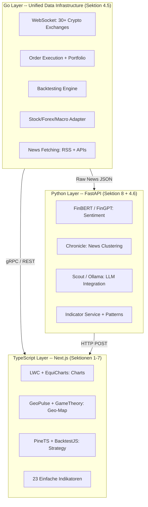

# Reference-Projekte: Open-Source Inspiration fuer Tradeview Fusion

> **Erstellt:** 14. Februar 2026
> **Zweck:** Sammlung aehnlicher Open-Source-Projekte, die als Referenz, Inspiration oder Code-Quelle fuer den beschleunigten Ausbau von Tradeview Fusion dienen koennen.

## Ueber Tradeview Fusion

Tradeview Fusion ist eine Trading-Plattform gebaut mit **Next.js 16 + React 19**, **Tailwind v4**, **shadcn/ui**, **Prisma (SQLite)** und **Zustand**. Kernfeatures:

- **Trading Dashboard** mit Custom Chart Engine (Canvas-basiert) + TradingView Lightweight Charts
- **Geopolitical Map** mit Event-Tracking, Kandidaten-Queue, Timeline und Zeichenwerkzeugen
- **13 Market-Data Provider** mit Circuit-Breaker und Fallback-Chain
- **Paper Trading** mit Orders, Stop-Loss/Take-Profit
- **Resizable Panel-Layout** mit Drag-and-Drop

### Umsetzungsstatus (15. Februar 2026)

- Go-Gateway Vertical Slice ist lokal lauffaehig: `/health`, `/api/v1/stream/market`, `/api/v1/quote`.
- GCT-Connector-Basis ist aktiv (Live-Call auf GCT-RPC), mit klarer Fehlerfuehrung wenn der Upstream nicht erreichbar ist.
- Lokaler Minimalbetrieb ist reproduzierbar (`go-backend/scripts/dev-stack.ps1`): 1 Exchange / 1 Pair, GCT TLS-Proxy + Gateway Quote-Contract (`200` fuer `BTC/USDT` verifiziert).
- SSE-Marktslice liefert echte Quote-Events aus GCT (`ready`/`quote`/`heartbeat`/`upstream_error`) und ist damit nicht mehr nur Heartbeat-Scaffold.
- Stream-Stabilisierung ist umgesetzt: langlaufender SSE-Feed wird nicht mehr durch den Connector-Request-Timeout beendet.
- Connector-Konfig ist gehaertet: `GCT_PREFER_GRPC=false` aktiviert nun sauber den HTTP-RPC-Fallback (E2E geprueft).
- Go-Qualitaets-Runner fuer den Slice sind verifiziert: `go test ./...`, `go vet ./...`, `go test -race ./...`.
- Hinweis fuer Windows-Race-Runner: `CGO_ENABLED=1` + `gcc` im `PATH` (z. B. `C:\msys64\ucrt64\bin`).
- Team-Runner vorhanden: `go-backend/scripts/test-go.ps1` fuer reproduzierbare Quality-Gates.
- Erster Nicht-Crypto-Adapter ist produktiv im Gateway: ECB-Forex-Quotes (`exchange=ecb`, `assetType=forex`) ueber offiziellen ECB-Feed.
- Finnhub-Referenz ist jetzt weitgehend produktiv umgesetzt: Go-Gateway liefert Equity-Quotes (`/api/v1/quote`) und Equity-Streams (`/api/v1/stream/market` via Finnhub-WS mit Polling-Fallback) fuer `exchange=finnhub`.
- FRED/ECB-Referenz ist jetzt erweitert produktiv umgesetzt: Go-Gateway liefert Macro-/Forex-Quotes und History (`GET /api/v1/macro/history`), ingest-orientierte Persistenz folgt.
- News-Referenzen (RSS/GDELT/Finviz) sind produktiv inkl. Hardening aktiv: `GET /api/v1/news/headlines` mit Retries, Normalisierung, Dedup und Source-Quota-Balancing.
- Pre-8 Portfolio-Slices sind im Next.js-Backend produktiv: persistente P&L-History (`/api/fusion/portfolio/history`), Risk-Sizing (`/api/fusion/risk/position-size`) und Trade-Journal (`/api/fusion/trade-journal`).
- GCT-Backtester-Referenz ist direkt im Gateway sichtbar: `GET /api/v1/backtest/capabilities` listet vorhandene `*.strat`-Beispiele aus dem Fork.

---

## Themen-Uebersicht: Was ist das Beste pro Bereich?

Schnell-Navigator -- fuer jedes Kernthema die wichtigste Ressource auf einen Blick.

### Chart Engine und Indikatoren

| Was | Beste Ressource | Warum | Docker? | Sektion |
|---|---|---|---|---|
| **Chart-Plugin System** | [LWC Plugin-System](https://github.com/tradingview/lightweight-charts) | Nutzen wir bereits (v5.1.0), Plugin-System ist der schnellste Weg fuer Indikatoren + Zeichentools | Nein, `npm`/`bun add` | 2 |
| **Custom Chart Referenz** | [EquiCharts](https://github.com/alenjohn05/EquiCharts) | Gleiche Architektur wie unser Engine (Pure TS + Canvas), Apache-2.0 | Nein, reines TS | 2 |
| **Indikator-Beschleunigung** | [PineTS](https://github.com/QuantForgeOrg/PineTS) | Pine Script in JS/TS ausfuehren, ersetzt ~820 Zeilen handgeschriebene Indikatoren | Nein, reines TS | 6 |

### Geopolitische Daten und Events

| Was | Beste Ressource | Warum | Docker? | Sektion |
|---|---|---|---|---|
| **Groesste offene Event-Datenbank** | [GDELT](https://www.gdeltproject.org/data.html) | 250M+ Events, alle 15 Min aktualisiert, Goldstein-Skala, kostenlose REST API | **Nein**, reine REST API | 8 |
| **Event-zu-Markt Korrelation** | [GeoPulse](https://github.com/group-geopulse/GeoPulse) | NLP + Sentiment + Knowledge-Graph, gleicher Stack (Next.js + Tailwind) | Nein, Python Skripte | 3 |
| **Spieltheorie + Impact-Scoring** | [GameTheory](https://github.com/sliuuu/GameTheory) | Nash-Equilibrium, Monte Carlo, Multi-Index-Korrelation | Hat Docker, **geht aber auch ohne** (`pip install` + `npm install`) | 3 |

### Finanzdaten und Market-Data APIs

| Was | Beste Ressource | Warum | Docker? | Sektion |
|---|---|---|---|---|
| **Groesste Multi-Exchange API** | [CCXT](https://github.com/ccxt/ccxt) | 100+ Boersen, Unified API, MIT, 40.900 Stars. **Uebergangs-Tool** bis Go-Adapter die TS-Provider ersetzen | **Nein**, `bun add ccxt` | 4 |
| **HTTP Client mit Circuit-Breaker** | [ffetch](https://github.com/gkoos/ffetch) | **Uebergangs-Tool** fuer bestehende TS-Provider-Calls, Retry, Dedup, Zero Dependencies | **Nein**, `bun add @fetchkit/ffetch` | 4 |
| **WebSocket Streaming (Stocks)** | [Finnhub WS](https://github.com/Alcapone-Fx/finnhub-websocket) | Referenz-Implementierung; im Gateway bereits als Finnhub-WS-Slice umgesetzt (SSE-Bridge + Polling-Fallback) | **Nein**, reines React + WS | 7 |
| **Forex/Macro Basis ohne API-Key** | [ECB eurofxref-daily.xml](https://www.ecb.europa.eu/stats/eurofxref/eurofxref-daily.xml) | Offizieller FX-Referenzfeed; bereits als erster Nicht-Crypto-Adapter im Go-Gateway integriert (`exchange=ecb`, `assetType=forex`) | **Nein**, direkte HTTP/XML Abfrage | 4.5 |

> **Langfristig:** Alle Daten-Beschaffung (Crypto, Stocks, Forex, Macro, News) wandert in die Go-Schicht. Die TS-Tools CCXT und ffetch dienen als Uebergangs-Loesung bis eigene Go-Adapter sie ersetzen.

### Backend Infrastructure / Unified Data Layer

| Was | Beste Ressource | Warum | Docker? | Sektion |
|---|---|---|---|---|
| **Crypto Exchange Backend** | [GoCryptoTrader](https://github.com/thrasher-corp/gocryptotrader) | 30+ Exchanges mit WebSocket, Order Execution, Backtesting, Portfolio, gRPC API | **Nein**, Go Binary (`go build`) | 4.5 |
| **Stock/Forex/Macro Go-Adapter** | Eigene Go-Adapter (im GCT-Fork) | Finnhub, Twelve Data, Polygon, Alpha Vantage, FRED, ECB als Go-Adapter. Unified Rate Limiting, Caching, Circuit Breaker in einem dauerlaufenden Service | **Nein**, Go Binary | 4.5 |
| **News Fetching (Go)** | Eigene Go-Adapter (im GCT-Fork) | RSS, REST APIs (GDELT, Finviz, Yahoo News). Go holt Rohdaten, Python (FinBERT/HDBSCAN) verarbeitet sie | **Nein**, Go Binary | 4.5 |
| **TS Exchange Fallback (Uebergang)** | [CCXT](https://github.com/ccxt/ccxt) | 100+ Exchanges als TS-native Uebergangs-Loesung bis Go-Adapter vollstaendig | **Nein**, `bun add ccxt` | 4 |

### AI/ML und Sentiment-Analyse

| Was | Beste Ressource | Warum | Docker? | Sektion |
|---|---|---|---|---|
| **Financial Sentiment (schnell)** | [FinBERT](https://huggingface.co/ProsusAI/finbert) | Standard-Modell, HuggingFace Inference API | **Nein** via HuggingFace API; oder `pip install` lokal | 8 |
| **News-Clustering fuer Events** | [Chronicle](https://github.com/dukeblue1994-glitch/chronicle) | Semantic Embeddings + HDBSCAN, fuer `news_cluster` Adapter | Hat Docker, **geht auch ohne** (`pip install` + `uvicorn`) | 8 |
| **Lokales LLM News-Monitoring** | [Scout](https://github.com/cas1m1r/Scout) | Ollama-basiert, RSS, Event-Clustering, fuer `social_surge` Adapter | **Nein**, `pip install` + Ollama | 8 |
| **Financial LLM (umfassend)** | [FinGPT](https://github.com/AI4Finance-Foundation/FinGPT) | 18.6k Stars, LoRA Fine-Tuning, Sentiment + Forecasting | **Nein**, HuggingFace API oder `pip install` | 8 |

### Indikatoren, Pattern Recognition & Performance

| Was | Beste Ressource | Warum | Docker? | Sektion |
|---|---|---|---|---|
| **Referenz-Buch (komplettes System)** | [Mastering Financial Markets with Python](./books/mastering-finance-python.md) | 6469 Zeilen, 12 Kapitel: Exotische MAs, Pattern Recognition, K's Collection, Backtesting Framework | **Nein**, Python (`pip install`) | 4.6 |
| **Pattern Recognition (Candlestick/Harmonic)** | Buch Kapitel 7+8 (L3849-4754) | Doji, R Pattern, Extreme Euphoria, ABCD, Gartley, Crab -- vollstaendige Python-Implementierungen | **Nein**, Python | 4.6 |
| **Composite Signal (eigene Architektur)** | [INDICATOR_ARCHITECTURE.md](./INDICATOR_ARCHITECTURE.md) Sektion 3 | "Dreier-Signal": 50-Day + Heartbeat + Volume -> ultimatives Buy/Sell Signal | **Nein**, Python FastAPI | 4.6 |
| **Performance Evaluation** | Buch Kapitel 12 (L5694-6067) | Sharpe, Sortino, Expectancy, Profit Factor + 3 Backtest-Beispiele | **Nein**, Python | 4.6 |

> **Detaillierter Blueprint:** Fuer die komplette Aufschluesselung aller Indikatoren, Patterns und Algorithmen mit Buch-Zeilenreferenzen siehe [`docs/INDICATOR_ARCHITECTURE.md`](./INDICATOR_ARCHITECTURE.md).

### Backtesting und Paper Trading

| Was | Beste Ressource | Warum | Docker? | Sektion |
|---|---|---|---|---|
| **Crypto Backtesting (primaer)** | [GoCryptoTrader](https://github.com/thrasher-corp/gocryptotrader) | Exchange-native Daten, eingebaute Backtest Engine, Portfolio Tracking | **Nein**, Go Binary | 4.5 |
| **TS Backtesting Engine** | [BacktestJS](https://github.com/backtestjs/framework) | TypeScript-natives Framework, Candle-Download, Strategy-Engine (ergaenzend zu GCT) | **Nein**, `npm install` | 6 |
| **Paper Trading Referenz** | [Foursight](https://github.com/h0i5/Foursight) | Fast identischer Stack (Next.js + TS + Tailwind + SQLite), MIT -- UI-Referenz | **Nein**, Next.js App | 5 |
| **Paper Trading + Prisma + Zustand** | [NeonDash](https://github.com/kalzimkholodros/next-tradingsystem) | Nahezu identischer Stack inkl. Prisma + Zustand, MIT -- UI-Referenz | **Nein**, Next.js App | 5 |

> **Fazit Docker:** Von 23+ Projekten braucht **keins** zwingend Docker. GoCryptoTrader kompiliert zu einer einzigen Go-Binary. Die meisten sind reine npm/pip-Installationen oder REST APIs. Chronicle und GameTheory bieten Docker als bequeme Option, laufen aber genauso mit `pip install` + direktem Start. Fuer AI-Modelle (FinBERT, FinGPT) ist die HuggingFace Inference API der einfachste Weg -- kein lokales Setup noetig.

### Drei-Schichten-Architektur: Projekt-Zuordnung

Alle Referenz-Projekte ordnen sich in eine von drei Schichten ein. Jede Sprache in ihrem Staerkebereich:



| Schicht | Sprache | Zustaendig fuer | Referenz-Sektionen |
|---------|---------|-----------------|-------------------|
| **Unified Data Layer + Trading** | Go (GoCryptoTrader + eigene Adapter) | Crypto WebSocket, Stock/Forex/Macro REST-Adapter, News Fetching, Order Execution, Backtesting, Portfolio | 4.5 |
| **AI/ML + Indicator Service** | Python (FastAPI) | Sentiment Analysis, News Verarbeitung (Clustering, NLP), Pattern Recognition, Composite Signals, Performance Eval | 8, 4.6 |
| **Frontend + Gateway** | TypeScript (Next.js) | Charts, Geo-Map, einfache Indikatoren (23), API Gateway, Geopolitical Pipeline | 1-7 |

> **Architektur-Prinzip:** Die Go-Schicht ist der **einzige Ort fuer Daten-Beschaffung** -- Crypto via GoCryptoTrader nativ, Stocks/Forex/Macro/News via eigene Go-Adapter im Fork. Die bestehenden 14 TS-Provider (`src/lib/providers/`) dienen als **Uebergangs-Loesung** bis die Go-Adapter sie ersetzen. Python verarbeitet und analysiert Daten, holt sie aber nie selbst. TypeScript rendert und stellt dar.

---

## 1. TradingView-Klone (Full-Stack Plattformen)

Projekte die versuchen, TradingView als Ganzes nachzubauen -- Frontend, Backend, Datenanbindung.

### GoChart

| | |
|---|---|
| **GitHub** | [github.com/laion01/GoChart](https://github.com/laion01/GoChart) |
| **Tech-Stack** | Next.js, React, Socket.js |
| **Stars / Forks** | 1 / 0 |
| **Lizenz** | Nicht angegeben |
| **Status** | Fruehes Stadium (18 Commits) |

TradingView-Nachbau in Next.js mit Component-basierter Architektur, State-Management via Store und Socket.js fuer Real-Time Datenstreaming. Noch relativ klein, aber strukturell nah an unserem Ansatz.

**Relevant fuer uns weil:**
- Socket-basiertes Streaming-Pattern kann als Vergleich zu unserer SSE-Architektur (`src/app/api/market/stream/route.ts`) dienen
- Component-Struktur und Store-Organisation als Alternative zu unserem Zustand-Setup

---

### StockTraderPro

| | |
|---|---|
| **GitHub** | [github.com/j4web/stocktraderpro](https://github.com/j4web/stocktraderpro) |
| **Demo** | [stock-trader-pro-tau.vercel.app](https://stock-trader-pro-tau.vercel.app) |
| **Tech-Stack** | Next.js (Frontend), Node.js (Backend) |
| **Lizenz** | MIT |
| **Status** | Aktiv, mit Live-Demo |

Stock Trading Plattform inspiriert von TradingView. Features Real-Time Marktdaten, Charting-Tools und Aktienanalyse. Getrennte Frontend/Backend Architektur mit Vercel-Deployment.

**Relevant fuer uns weil:**
- MIT-lizenziert -- Code kann direkt uebernommen werden
- API-Architektur mit getrenntem Backend als Vergleich zu unseren ~30 API Routes
- Charting-Tool Integration als Referenz

---

### react-next-tradingview

| | |
|---|---|
| **GitHub** | [github.com/evgenmam/react-next-tradingview](https://github.com/evgenmam/react-next-tradingview) |
| **Tech-Stack** | React, Next.js, API-Integration, Datenbank |
| **Stars / Forks** | Mittelgross |
| **Status** | 45 Commits, relativ ausgereift |

React/Next.js TradingView-Klon mit API-Integration, Custom Hooks und Datenbank-Setup. Einer der ausgereifteren Klone mit etablierter Commit-History.

**Relevant fuer uns weil:**
- Hook-Patterns fuer Marktdaten-Fetching als Vergleich zu unseren `@tanstack/react-query` Patterns
- Datenbank-Schema fuer Trading-Daten als Vergleich zu unserem Prisma-Schema
- Component-Architektur fuer Trading-UI-Elemente

---

### Divergex Platform

| | |
|---|---|
| **GitHub** | [github.com/divergex/platform](https://github.com/divergex/platform) |
| **Tech-Stack** | Python-Backend, Web-Frontend |
| **Lizenz** | Apache-2.0 |
| **Status** | Aktiv, Teil eines groesseren Oekosystems |

Interaktive Plattform fuer quantitative Trading-Strategien. Bietet dynamische Visualisierungen, Echtzeit-Strategie-Monitoring und Modell-Integrationen. Teil des Divergex-Oekosystems mit `dxforge` (Orchestrierung) und `dxlib` (Quant-Finance Library).

**Relevant fuer uns weil:**
- Strategie-Monitoring Features koennten unser Signal-Insights-System (`src/features/trading/SignalInsightsBar.tsx`) inspirieren
- Visualisierungs-Patterns fuer quantitative Daten
- Apache-2.0 Lizenz erlaubt kommerzielle Nutzung

**Verwandte Repos:**
- [github.com/divergex/dxforge](https://github.com/divergex/dxforge) -- Strategie-Orchestrierung
- [github.com/divergex/dxlib](https://github.com/divergex/dxlib) -- Quant-Finance Python Library

---

## 2. Chart-Engines und Libraries

Projekte die sich auf die Rendering-Engine fuer Finanz-Charts konzentrieren -- direkt relevant fuer unseren Custom Chart Engine in `src/chart/engine/`.

### EquiCharts

| | |
|---|---|
| **GitHub** | [github.com/alenjohn05/EquiCharts](https://github.com/alenjohn05/EquiCharts) |
| **Demo** | [alenjohn-charts.web.app](https://alenjohn-charts.web.app/) |
| **Tech-Stack** | Pure TypeScript, HTML5 Canvas, Zero Dependencies |
| **Stars / Forks** | 30 / 14 |
| **Lizenz** | Apache-2.0 |
| **Sprachen** | TypeScript 95.1% |

Open-Source Stock Charting Widget komplett in reinem TypeScript ohne externe Abhaengigkeiten. Nutzt HTML5 Canvas fuer performantes Rendering grosser Datasets. Features: Candlestick/Line/Bar Charts, Zoom, Pan, Annotations, responsive Design, erweiterbare Architektur.

**Relevant fuer uns weil:**
- **Architektonisch am naechsten** zu unserem Custom Chart Engine (`ChartRenderer.ts`, `CoordinateSystem.ts`, `Layers.ts`)
- Gleicher Ansatz: Pure TypeScript + Canvas, keine Framework-Abhaengigkeit
- Zoom/Pan/Annotation Implementation als direkte Referenz fuer unsere Erweiterungen
- Responsive Rendering Patterns fuer verschiedene Bildschirmgroessen
- Apache-2.0 erlaubt Code-Uebernahme

**Konkret uebertragbare Patterns:**
- Annotation-System fuer Chart-Zeichenwerkzeuge
- Canvas-Rendering-Pipeline und Layering
- Interaktives Zoom/Pan mit Touch-Support

---

### FirChart

| | |
|---|---|
| **GitHub** | [github.com/tradingcage/firchart](https://github.com/tradingcage/firchart) |
| **Tech-Stack** | Canvas-basiert |
| **Stars / Forks** | 3 / 0 |
| **Lizenz** | MIT |

Minimale Canvas-basierte Trading-Chart Library. Schlanke Implementierung ohne Overhead.

**Relevant fuer uns weil:**
- Minimalistische Referenz, wie Candlestick-Rendering mit wenig Code funktioniert
- Gut zum Vergleich unserer `ChartRenderer.ts` Rendering-Pipeline
- MIT-lizenziert -- uneingeschraenkt nutzbar

---

### TradingView Lightweight Charts (LWC)

| | |
|---|---|
| **GitHub** | [github.com/tradingview/lightweight-charts](https://github.com/tradingview/lightweight-charts) |
| **Docs** | [tradingview.github.io/lightweight-charts](https://tradingview.github.io/lightweight-charts/) |
| **Plugin-Beispiele** | [tradingview.github.io/lightweight-charts/plugin-examples/](https://tradingview.github.io/lightweight-charts/plugin-examples/) |
| **React-Tutorial** | [tradingview.github.io/lightweight-charts/tutorials/react/advanced](https://tradingview.github.io/lightweight-charts/tutorials/react/advanced) |
| **Tech-Stack** | TypeScript, HTML5 Canvas |
| **Stars / Forks** | 13.691+ / hoch |
| **Lizenz** | Apache-2.0 |

Die offizielle Open-Source Charting Library von TradingView selbst. Wir nutzen bereits `lightweight-charts` v5.1.0 als Dependency in `package.json`.

**Das Plugin-System ist der Schluessel zur Beschleunigung:**

Das LWC Plugin-System erlaubt drei Erweiterungs-Typen:
1. **Custom Series** -- Eigene Chart-Typen mit Custom Data Structures und Rendering
2. **Series Primitives** -- Custom Visualisierungen die an bestehende Series angedockt werden (Annotations, Markers)
3. **Pane Primitives** -- Custom Elemente die an Chart-Panes gebunden sind (Overlays, Indicators)

**Fertige Plugin-Beispiele die wir nutzen koennten:**
- Volume Profiles
- Tooltips
- Trend Lines und Zeichenwerkzeuge
- Alert-Markierungen
- Heatmaps
- Stacked Bars

**Scaffolding Tool:** `npx create-lwc-plugin` generiert ein fertiges Plugin-Projekt.

**Relevant fuer uns weil:**
- Wir haben LWC bereits als Dependency -- das Plugin-System ist der schnellste Weg, Indikatoren und Zeichenwerkzeuge zu implementieren statt alles im Custom Engine zu bauen
- React-Integration mit Component-basiertem Pattern ist dokumentiert
- Community-Plugins wie [github.com/safaritrader/lightweight-chart-plugin](https://github.com/safaritrader/lightweight-chart-plugin) erweitern die Funktionalitaet nochmal

> **Siehe auch:** PineTS in Sektion 6 (Backtesting) bietet einen alternativen Weg, TradingView Pine Script Indikatoren direkt in JS/TS auszufuehren -- potentiell als Ersatz fuer unsere ~820 Zeilen handgeschriebene Indikatoren in `src/lib/indicators/index.ts`.

---

## 3. Geopolitische Analyse und Mapping

Projekte die geopolitische Events analysieren und mit Finanzmaerkten korrelieren -- direkt relevant fuer unsere Geopolitical Map (`/geopolitical-map`).

> **Hinweis:** Die primaere offene Datenquelle fuer geopolitische Events (GDELT) sowie AI/ML-Modelle fuer Sentiment und Event-Detection sind in **Sektion 8 (AI/ML und SOTA 2025/2026)** dokumentiert. Dort findet sich auch die Mapping-Tabelle, die zeigt welche AI-Projekte unsere drei leeren Soft-Signal Adapter in `src/lib/geopolitical/adapters/soft-signals.ts` fuellen koennen.

### GeoPulse

| | |
|---|---|
| **GitHub** | [github.com/group-geopulse/GeoPulse](https://github.com/group-geopulse/GeoPulse) |
| **Demo-Video** | [youtu.be/Fa4aPGJKzLA](https://youtu.be/Fa4aPGJKzLA) |
| **Tech-Stack** | Next.js, React, Tailwind CSS, Python, MongoDB, Neo4j |
| **Stars / Forks** | 0 / 2 |
| **Sprachen** | Jupyter Notebook 97%, Python |
| **Herkunft** | University of Leeds, Group 8 |

AI-gesteuertes System das die Beziehung zwischen geopolitischen Events und Rohoel-Preisen analysiert. Integriert Finanzdaten, News-Sentiment-Analyse und Knowledge-Graph-basierte Insights. Nutzt NLP und Retrieval-Augmented Generation (RAG) fuer datengetriebene Einblicke.

**Relevant fuer uns weil:**
- **Fast identischer Feature-Scope** wie unsere Geopolitical Map, aber mit AI/ML Backend
- Gleicher Frontend-Stack (Next.js + Tailwind)
- Event-zu-Asset-Korrelation ist genau das, was unser `GeoEventRecord.assets` Feld modelliert
- Sentiment-Pipeline koennte unsere `CandidateQueue.tsx` und Event-Bewertung verbessern
- Knowledge-Graph Ansatz (Neo4j) als moegliche Erweiterung unserer SQLite-basierten Event-Speicherung

**Konkret uebertragbare Patterns:**
- NLP-basierte Event-Detection und Klassifikation
- Sentiment-Scoring fuer geopolitische Events
- RAG-basierte Abfragen ueber Events und deren Marktauswirkungen

---

### GeoInsight

| | |
|---|---|
| **GitHub** | [github.com/Ruthik27/GeoInsight-Global-Conflict-and-Crisis-Mapping](https://github.com/Ruthik27/GeoInsight-Global-Conflict-and-Crisis-Mapping) |
| **Tech-Stack** | Python-basiert |
| **Lizenz** | MIT |

Real-Time geopolitische Event-Analyse Plattform fuer Krisen- und Konflikt-Mapping. Fokus auf die finanziellen Auswirkungen von globalen Krisen.

**Relevant fuer uns weil:**
- Event-Klassifikation und Severity-Scoring als Referenz fuer unsere `GeoEventRecord.severity` und `GeoEventRecord.confidence` Felder
- Conflict-Mapping-Patterns fuer unsere `MapCanvas.tsx`
- MIT-lizenziert -- Code frei nutzbar

---

### Geopolitical Market Game Tracker (GameTheory)

| | |
|---|---|
| **GitHub** | [github.com/sliuuu/GameTheory](https://github.com/sliuuu/GameTheory) |
| **Tech-Stack** | Python 55.1%, TypeScript 42.6%, FastAPI, React 18+ |
| **Status** | Aktiv |

Wendet Spieltheorie auf geopolitische Events und deren Marktauswirkungen an. Real-Time Dashboard mit:
- Live-Tracking von S&P 500, Nikkei 225, DAX, TAIEX, Hang Seng
- Nash-Equilibrium Vorhersagen fuer 5 Laender (USA, China, Japan, Deutschland, Taiwan)
- Top 5 marktbewegende geopolitische Events mit News-Links
- Historisches Backtesting mit Genauigkeitsmetriken
- Sensitivitaetsanalyse via Monte Carlo Simulation

**Relevant fuer uns weil:**
- **Event-Impact-Scoring** ist genau was wir fuer die Geopolitical Map brauchen
- Backtesting-Ansatz fuer die Validierung von Event-zu-Markt Korrelationen
- FastAPI + React/TypeScript Stack koennte als separater Microservice neben unserem Next.js laufen
- Laeuft ohne Docker: `pip install` fuer Backend, `npm install` fuer Frontend

**Konkret uebertragbare Patterns:**
- Event-Impact-Score Berechnung
- Multi-Index Korrelation mit geopolitischen Events
- Monte Carlo basierte Sensitivitaetsanalyse
- News-Source Aggregation und Verlinkung

**Quick-Start (ohne Docker):**
```bash
# Backend
cd backend && pip install -r requirements.txt && uvicorn main:app --port 8001
# Frontend
cd frontend && npm install && npm run dev
# Frontend: http://localhost:3000 | Backend API: http://localhost:8001
```

> Docker Compose ist auch vorhanden (`docker-compose up -d`), aber nicht noetig.

---

## 4. Market-Data Provider Architektur

Projekte die sich auf die Aggregation und Normalisierung von Marktdaten aus mehreren Quellen konzentrieren -- relevant fuer unsere 13 Provider in `src/lib/providers/`.

### CCXT

| | |
|---|---|
| **GitHub** | [github.com/ccxt/ccxt](https://github.com/ccxt/ccxt) |
| **Docs** | [docs.ccxt.com](https://docs.ccxt.com/) |
| **Tech-Stack** | JavaScript/TypeScript, Python, C#, PHP, Go |
| **Stars / Forks** | 40.900+ / hoch |
| **Lizenz** | MIT |
| **Contributors** | 350+ |

Die Referenz-Library fuer Multi-Exchange Marktdaten-Aggregation. Unified API ueber 100+ Kryptoboersen mit normalisierter Datenstruktur (OHLCV, Orderbooks, Tickers, Trades).

**Relevant fuer uns weil:**
- **Architektur-Vorbild** fuer unsere Multi-Provider Normalisierung (`src/lib/providers/types.ts`)
- Zeigt wie man eine Unified API ueber dutzende verschiedene Datenquellen baut
- Exchange-Adapter Pattern ist analog zu unseren Provider-Dateien (alpha-vantage.ts, finnhub.ts, polygon.ts, etc.)
- Error-Handling und Rate-Limiting Patterns fuer API-Calls

**Konkret uebertragbare Patterns:**
- Unified Response Types (wie unser `types.ts` in providers, aber ausgereifter)
- Provider-Adapter Architektur mit einheitlicher Interface-Definition
- Automatische Rate-Limit Handhabung pro Provider
- Fallback-Logik wenn ein Provider ausfaellt

**Installation:**
```bash
bun add ccxt
```

---

### ffetch (@fetchkit/ffetch)

| | |
|---|---|
| **GitHub** | [github.com/gkoos/ffetch](https://github.com/gkoos/ffetch) |
| **npm** | [@fetchkit/ffetch](https://www.npmjs.com/package/@fetchkit/ffetch) |
| **Tech-Stack** | TypeScript, Zero Dependencies |
| **Stars** | 188 |
| **Lizenz** | Open Source |
| **Downloads** | ~1.1K/Woche |

Production-ready TypeScript-first Fetch-Wrapper mit eingebautem Circuit Breaker, Retry mit Exponential Backoff, Timeouts, Request-Deduplication und Hooks.

**Relevant fuer uns weil:**
- **Direkter Drop-in** fuer unsere Provider HTTP-Calls statt eigener Circuit-Breaker Logik
- Universal: Node.js, Browser, Cloudflare Workers, React Native
- Zero Dependencies, Dual ESM/CJS
- Per-Request Overrides fuer unterschiedliche Provider-Konfigurationen

**Konkret uebertragbar:**
Unsere Circuit-Breaker Logik in den Provider-Dateien koennte durch ffetch ersetzt werden:

```typescript
import createClient from '@fetchkit/ffetch'

const providerClient = createClient({
  timeout: 5000,
  retries: 3,
  dedupe: true,
  circuit: { threshold: 5, reset: 30000 }
})

// Statt eigener Circuit-Breaker Implementierung:
const response = await providerClient('https://api.polygon.io/v2/...')
```

**Installation:**
```bash
bun add @fetchkit/ffetch
```

---

## 4.5 Backend Infrastructure (Go)

Das fehlende Stueck: ein performanter Backend-Service der Exchange-Connectivity, Order Execution, Backtesting und Portfolio Management uebernimmt. Aktuell laufen alle 14 Market-Data Provider als REST-Calls in Next.js API Routes (single-process, kein WebSocket, kein Backtesting). GoCryptoTrader fuellt diese Luecken als headless Go-Service.

### GoCryptoTrader

| | |
|---|---|
| **GitHub** | [github.com/thrasher-corp/gocryptotrader](https://github.com/thrasher-corp/gocryptotrader) |
| **Docs** | [pkg.go.dev/github.com/thrasher-corp/gocryptotrader](https://pkg.go.dev/github.com/thrasher-corp/gocryptotrader) |
| **Tech-Stack** | Go, gRPC, WebSocket, PostgreSQL/SQLite |
| **Stars / Forks** | 2.700+ / hoch |
| **Lizenz** | MIT |
| **Contributors** | 90+ |
| **Status** | Aktiv, regelmaessige Releases |

Production-grade Cryptocurrency Trading Bot und Engine in Go. Unterstuetzt 30+ Exchanges (Binance, Kraken, Coinbase, Bitfinex, OKEX, Huobi, etc.) jeweils mit REST UND WebSocket. Headless betreibbar -- kein eigenes UI noetig.

**Verifiziert (14.02.2026, lokal gespiegelt):**
- Upstream-Source lokal eingebunden unter `go-backend/vendor-forks/gocryptotrader`.
- Feature-Set bestaetigt (gRPC, JSON-RPC Proxy, WebSocket, Portfolio, Backtester).
- Wichtiger Betriebs-Hinweis: `config_example.json` hat unsichere Remote-Control Defaults (`admin` / `Password`) und ist nur als Startpunkt zu sehen.
- Konsequenz fuer unsere Architektur: GCT als Engine-Layer, davor immer ein eigener Go-Gateway mit harten Contracts und Security-Guards.

**Kern-Features:**
- **30+ Exchange WebSockets** mit nativer Subscription-Verwaltung und Auto-Reconnect
- **Order Execution Engine** -- Place, Cancel, Modify auf jeder Exchange (Market, Limit, Stop)
- **Backtesting Engine** mit historischen Exchange-Daten
- **Portfolio Management** mit P&L, Drawdown, Unrealized PnL
- **gRPC API** mit automatischem REST-Gateway (HTTP/JSON)
- **Datenbank-Support** (PostgreSQL, SQLite)
- **Rate Limiting** pro Exchange eingebaut
- **Simulated Orders** (Paper Trading auf Exchange-Ebene)

**Relevant fuer uns weil:**
- **Schliesst die groessten Luecken** im Projekt: kein WebSocket, kein Backtesting, kein Portfolio Tracking, kein echtes Order-Routing
- Ersetzt fuer Crypto unsere REST-basierte SSE-Polling Architektur (`src/app/api/market/stream/route.ts`) durch native WebSocket Push (<100ms statt 1-5s)
- Order Execution hebt unser Paper Trading (`src/lib/orders/types.ts`) auf ein echtes Level -- Multi-Exchange, Simulated + Live
- Backtesting Engine fuellt eine komplett fehlende Funktionalitaet
- gRPC API dockt sauber an Next.js an via `@grpc/grpc-js` oder den eingebauten REST-Gateway
- MIT-lizenziert -- uneingeschraenkt nutzbar

**Was GoCryptoTrader NICHT abdeckt (und wofuer bestehende Projekte bleiben):**
- **Stocks/Forex/ETFs** -- dafuer bleiben Finnhub, Polygon, Alpha Vantage etc. (`src/lib/providers/`)
- **Wirtschaftsdaten** -- FRED, ECB bleiben eigenstaendig
- **AI/ML** -- Python-Schicht (Chronicle, FinBERT, Scout, FinGPT)
- **Chart-Rendering** -- TypeScript/LWC/Custom Engine
- **Geopolitical Pipeline** -- bleibt komplett in Next.js

**CCXT als Ergaenzung:** [CCXT](https://github.com/ccxt/ccxt) (Sektion 4) bleibt relevant als TS-native Library fuer Exchanges die GoCryptoTrader nicht abdeckt und als Fallback. Beide koennen parallel existieren -- GCT als primaerer Crypto-Backend-Service, CCXT als leichtgewichtige TS-Alternative fuer Edge Cases.

**Quick-Start (Fork, ohne Docker!):**
```bash
# 1. Fork auf GitHub erstellen (github.com/thrasher-corp/gocryptotrader -> Fork Button)
# 2. Fork klonen
git clone https://github.com/EUER-ORG/gocryptotrader.git
cd gocryptotrader

# 3. Upstream fuer spaetere Updates
git remote add upstream https://github.com/thrasher-corp/gocryptotrader.git

# 4. Go installieren (https://go.dev/dl/)
# 5. Binary bauen (eine einzige ausfuehrbare Datei)
go build -o gct ./cmd/gocryptotrader

# 6. Config generieren + starten
./gct --config genconfig
./gct --config config.json
```

**Kein Docker noetig.** Go kompiliert zu einer einzelnen Binary. MIT-Lizenz -- Fork uneingeschraenkt nutzbar. Details zur Fork-Strategie (was rauswerfen, was anpassen) siehe `project_audit2.md` Sektion 9.1.

**Integration mit Next.js:**
1. **Go-Gateway (empfohlen)** -- eigener Service zwischen Next.js und GCT (stabile API, Auth, Symbol-Normalisierung, Rate-Limits)
2. **gRPC-Client** -- Gateway spricht GCT via gRPC/JSON-RPC
3. **WebSocket Bridge** -- GCT Feed -> Go-Gateway -> SSE/WS fuer Next.js

**Konkret uebertragbare Patterns:**
- Exchange-Adapter Architektur (30+ Exchanges mit einheitlichem Interface)
- WebSocket Subscription Management mit Auto-Reconnect
- Order-Lifecycle Management (Created -> Submitted -> Partial -> Filled/Cancelled)
- Portfolio-Berechnung mit Unrealized P&L und Drawdown
- Backtesting mit historischen Candle-Daten und Strategy Execution

> **Architektur-Kontext:** GoCryptoTrader ist das Fundament der **Go-Schicht** in unserer Drei-Schichten-Architektur (siehe Themen-Uebersicht). Es uebernimmt alles was mit Exchange-Connectivity, Order-Routing, Portfolio und Backtesting zu tun hat. Die Python-Schicht (AI/ML + Indicator Service) und TypeScript-Schicht (Frontend) bleiben eigenstaendig. Ein Coding Agent kann die gRPC-zu-React Bridge in Minuten erstellen.

---

## 4.6 Referenz-Buch: Mastering Financial Markets with Python

| | |
|---|---|
| **Titel** | Mastering Financial Markets with Python |
| **Autor** | Sofien Kaabar, CFA |
| **Lokaler Pfad** | `docs/books/mastering-finance-python.md` (6469 Zeilen) |
| **Sprache** | Python (pandas, numpy, scipy, matplotlib) |
| **Lizenz** | Buchmaterial -- nicht oeffentlich, interne Referenz |
| **Typ** | Kein Open-Source-Projekt, sondern ein Lehrbuch als komplettes Algorithmus-Referenzwerk |

### Warum dieses Buch?

GoCryptoTrader (Sektion 4.5) liefert die **Muskeln** (Exchange-Connectivity, Order Execution, Backtesting-Engine). Dieses Buch liefert das **Gehirn** (Analyse-Algorithmen, Pattern Recognition, Signal-Generierung). GoCryptoTrader hat keine exotischen Indikatoren, keine Pattern Recognition und keine Performance-Evaluation-Metriken -- genau das deckt das Buch ab.

### Was das Buch abdeckt (12 Kapitel)

| Kapitel | Thema | Unsere Luecke die es schliesst | Zeilen |
|---------|-------|-------------------------------|--------|
| 1 | Classic vs Modern Analysis | Theorie-Hintergrund | L330-762 |
| 2 | Python + Data Import | FastAPI Service Setup-Referenz | L762-1558 |
| **3** | **Moderne Indikatoren** | **15+ Indikatoren die wir nicht haben (KAMA, ALMA, Rainbow, erweiterte BB/RSI)** | **L1558-2939** |
| 4 | Alternative Charting | Heikin-Ashi, Volume Candles, CARSI | L2939-3160 |
| **5** | **Fibonacci + swing_detect** | **`swing_detect()` = Basis fuer ALLE Pattern Recognition** | **L3160-3538** |
| 6 | Volatilitaet | Spike-Weighted Volatility, Volatility Index | L3539-3850 |
| **7** | **Candlestick Patterns** | **Doji, R Pattern, Extreme Euphoria (6 Patterns)** | **L3849-4314** |
| **8** | **Harmonic Patterns** | **ABCD, Gartley, Crab, FEIW (5 Patterns)** | **L4314-4754** |
| **9** | **Timing Patterns** | **TD Setup, Fibonacci Timing** | **L4753-4958** |
| **10** | **Price Patterns** | **Double Top/Bottom, H&S, Gaps** | **L4957-5242** |
| **11** | **K's Collection** | **6 neuartige Indikatoren (nirgends sonst verfuegbar)** | **L5241-5682** |
| **12** | **Performance Evaluation** | **Sharpe, Sortino, Backtesting Framework** | **L5681-6067** |

### Beziehung zu GoCryptoTrader

```
GoCryptoTrader (Go)              Python Indicator Service
├── 30+ Exchange WebSockets  ──>  empfaengt OHLCV-Daten
├── Backtesting Engine       <──  liefert Signal-Ergebnisse (Pattern, Indicators)
├── Portfolio Management     <──  liefert Performance-Metriken (Ch.12)
└── Order Execution          <──  empfaengt Buy/Sell Signals (Composite Signal)
```

**Die Python-Algorithmen aus dem Buch werden NICHT in Go uebersetzt**, sondern als eigener FastAPI-Service betrieben. Go liefert Daten, Python analysiert, TypeScript rendert.

### Docker-Bewertung

**Kein Docker noetig.** Der Python Indicator Service laeuft mit:
```bash
pip install fastapi uvicorn pandas numpy scipy pydantic
uvicorn main:app --port 8001
```

> **Detaillierter Blueprint:** [`docs/INDICATOR_ARCHITECTURE.md`](./INDICATOR_ARCHITECTURE.md) -- enthalt Architektur-Diagramm, funktionale Grenzen (TS vs Python vs Go), Composite Signal Architektur, Elliott Wave Plan, Buch-Referenz-Index mit exakten Zeilennummern, Python Service Struktur und 34 priorisierte Implementierungs-Todos.

---

## 5. Paper Trading und Portfolio

Projekte mit Paper-Trading Features -- relevant fuer unser `PaperOrderRecord` Modell und Order-Management. **UI-Referenzen** fuer die Darstellung von Paper Trading -- die Backend-Logik wird langfristig durch GoCryptoTrader (Sektion 4.5) ersetzt.

### Foursight

| | |
|---|---|
| **GitHub** | [github.com/h0i5/Foursight](https://github.com/h0i5/Foursight) |
| **Live** | [foursight.harshiyer.in](https://foursight.harshiyer.in) |
| **Tech-Stack** | Next.js 14, Hono, Cloudflare Workers/Pages, D1/KV, TypeScript 99.4%, Tailwind, Highcharts, JWT, SQLite |
| **Stars / Forks** | 29 / 17 |
| **Lizenz** | MIT |
| **Letztes Update** | Januar 2026 |

Paper Trading Plattform fuer den indischen Aktienmarkt. Live-Daten fuer 2000+ NSE-Aktien, interaktives Charting, Portfolio-Management, Watchlists und Top-Movers.

**Relevant fuer uns weil:**
- **Fast identischer Tech-Stack**: Next.js + TypeScript + Tailwind + SQLite
- Paper-Trading UX-Patterns (Order-Formular, Portfolio-Uebersicht, P&L Tracking)
- Watchlist-Implementation als Vergleich zu unserer `UserProfile.watchlists`
- Live-Demo verfuegbar zum Testen der UX

**Konkret uebertragbare Patterns:**
- Order-Management UI Flows (Buy/Sell Formulare, Order-Historie)
- Portfolio Dashboard mit Performance-Metriken
- Watchlist CRUD mit Real-Time Updates

---

### NeonDash (Next-TradingSystem)

| | |
|---|---|
| **GitHub** | [github.com/kalzimkholodros/next-tradingsystem](https://github.com/kalzimkholodros/next-tradingsystem) |
| **Tech-Stack** | Next.js 14, Prisma, PostgreSQL, Zustand, NextAuth.js, Chart.js, TypeScript 98.6%, Tailwind |
| **Stars / Forks** | 2 / 1 |
| **Lizenz** | MIT |

Virtuelles Kryptowaehrungs-Trading mit Analytics Dashboard, Portfolio-Management und Real-Time Marktsimulation via CoinGecko API. Neon-themed UI.

**Relevant fuer uns weil:**
- **Nahezu identischer Tech-Stack**: Next.js + Prisma + Zustand + NextAuth + TypeScript + Tailwind
- Direkteste Code-Referenz fuer Paper-Trading Flows in unserem Stack
- Prisma Schema fuer Trading-Daten als Vergleich zu unserem `PaperOrderRecord`
- Zustand Store Patterns fuer Trading State
- Chart.js Integration als Alternative/Ergaenzung zu unserem Recharts-Setup

**Konkret uebertragbare Patterns:**
- Prisma Models fuer Paper Trading (Orders, Portfolio, Positionen)
- Zustand Stores fuer Real-Time Trading State
- NextAuth Integration (wir haben es installiert aber deaktiviert -- deren Setup als Referenz wenn wir Auth aktivieren)

---

## 6. Backtesting und Strategie-Execution

Projekte die Backtesting-Engines und Strategy-Execution in JavaScript/TypeScript anbieten. Tradeview Fusion hat aktuell Paper Trading (`PaperOrderRecord`) und Signal Insights, aber **kein Backtesting**. Das ist die logische naechste Ausbaustufe.

> **Backtesting-Hierarchie seit GoCryptoTrader (Sektion 4.5):**
> - **Primaer fuer Crypto:** GoCryptoTrader Backtesting Engine -- direkt an Exchange-Daten angebunden, historische Candle-Daten, Portfolio-Metriken
> - **Sekundaer (TS-nativ):** BacktestJS / Backtest-Kit -- Frontend-nah, Strategy-Definition in TypeScript, UI-Integration
> - **Ergaenzend:** PineTS -- Pine Script Kompatibilitaet, Multi-Timeframe Analyse
>
> Fuer Crypto ist GoCryptoTrader die richtige Wahl weil Backtesting dort direkt an der Exchange-Datenquelle haengt. Fuer Stocks/Forex oder rein Frontend-basierte Strategy-Tests bleiben die TS-Frameworks relevant.

### PineTS

| | |
|---|---|
| **GitHub** | [github.com/QuantForgeOrg/PineTS](https://github.com/QuantForgeOrg/PineTS) |
| **Tech-Stack** | TypeScript, JavaScript |
| **Lizenz** | Open Source |

Open-Source Transpiler der TradingView Pine Script in JavaScript/TypeScript-Umgebungen ausfuehrt (Node.js, Browser). Bietet 60+ technische Indikatoren, Multi-Timeframe-Analyse und Real-Time Streaming. Volle 1:1 Syntax-Kompatibilitaet mit Pine Script.

**Relevant fuer uns weil:**
- **Game-Changer fuer Indikatoren:** Unsere `src/lib/indicators/index.ts` ist ~820 Zeilen handgeschriebener Code (SMA, EMA, RSI, MACD, Bollinger Bands, etc.). PineTS koennte viele dieser manuellen Implementierungen ersetzen durch Pine Script Ausfuehrung
- Direkt kompatibel mit unserem bestehenden LWC Setup (siehe Sektion 2)
- Multi-Timeframe Analyse die wir noch nicht haben
- Real-Time Streaming-Faehigkeit fuer Live-Indikator-Updates

**Konkret uebertragbare Patterns:**
- Pine Script Indikator-Ausfuehrung als Alternative zu manuellen Berechnungen
- Multi-Timeframe Indikator-Aggregation
- Streaming-Pipeline fuer Live-Indikator-Updates auf Charts

---

### BacktestJS

| | |
|---|---|
| **GitHub** | [github.com/backtestjs/framework](https://github.com/backtestjs/framework) |
| **Docs** | [backtestjs.com/documentation](https://backtestjs.com/documentation/) |
| **Tech-Stack** | TypeScript/JavaScript |
| **Stars / Forks** | 27+ |
| **Lizenz** | Apache-2.0 |
| **Commits** | 128+ |

Free, Open-Source CLI-Tool und Framework fuer das Downloaden von Candle-Daten und Backtesting von Trading-Strategien. Umfassende Dokumentation zu historischen Daten, Strategy-Writing, technischen Indikatoren und Ergebnis-Analyse. Unterstuetzt Multi-Symbol und Multi-Value Testing.

**Relevant fuer uns weil:**
- TypeScript-natives Backtesting Framework das direkt in unseren Stack passt
- Candle-Data Download Funktionalitaet koennte unsere OHLCV-API (`src/app/api/market/ohlcv/route.ts`) ergaenzen
- Strategy-Writing Patterns als Grundlage fuer eine kuenftige Strategy-Engine
- Apache-2.0 erlaubt kommerzielle Nutzung

---

### Backtest-Kit

| | |
|---|---|
| **Website** | [backtest-kit.github.io](https://backtest-kit.github.io/) |
| **Tech-Stack** | TypeScript |
| **Lizenz** | Open Source |

Umfassendes TypeScript Framework fuer Backtesting und Live-Trading. Multi-Asset (Crypto, Forex, DEX). Features: Crash-safe Persistence, Signal Validation, AI-Optimierung mit LLMs, Custom Order Types (Trailing Stops, Grid Orders, OCO Exits), Auto-generierte Reports mit Sharpe Ratio und Win Rate.

**Relevant fuer uns weil:**
- **CCXT-Anbindung** (siehe Sektion 4) fuer Datenquellen -- kann die gleichen Provider nutzen
- Custom Order Types (Trailing Stops, OCO) die wir fuer Paper Trading (`PaperOrderRecord`) brauchen
- Signal Validation Patterns die in unser Alert-System (`src/lib/alerts/index.ts`) integriert werden koennten
- **AI/LLM-Optimierung** fuer Strategien (Verbindung zu Sektion 8: AI/ML SOTA)
- Nahtloser Wechsel zwischen Backtest und Live-Modus

**Konkret uebertragbare Patterns:**
- Strategy-Definition und -Ausfuehrung Engine
- Performance-Metriken Berechnung (Sharpe Ratio, Drawdown, Win Rate)
- Order-Type Implementierungen (Trailing Stop, Grid, OCO)

---

## 7. Real-Time Streaming (WebSocket)

Unser aktuelles Market-Streaming in `src/app/api/market/stream/route.ts` nutzt Server-Sent Events (SSE). Fuer echtes Tick-Level Streaming mit niedrigerer Latenz und bidirektionaler Kommunikation sind WebSockets der naechste Schritt.

> **Scope-Aenderung durch Go Unified Data Layer (Sektion 4.5):**
> - **Crypto-WebSocket:** Wird vollstaendig von GoCryptoTrader abgedeckt (30+ Exchanges, native WebSocket, <100ms Latenz).
> - **Stocks/Forex-WebSocket:** Wird durch **Go-Adapter** abgedeckt; Finnhub-WS ist bereits als produktiver Gateway-Slice vorhanden (SSE-Bridge). Die folgenden TS-Projekte bleiben als Referenz fuer weitere Adapter (Twelve Data, Polygon etc.).
> - **Prinzip:** Alle persistenten Daten-Verbindungen (WebSocket, Long-Polling) gehoeren in die Go-Schicht -- dauerlaufender Service mit Goroutines ist dafuer ideal.

### Finnhub WebSocket

| | |
|---|---|
| **GitHub** | [github.com/Alcapone-Fx/finnhub-websocket](https://github.com/Alcapone-Fx/finnhub-websocket) |
| **Tech-Stack** | React, Finnhub API, WebSocket |
| **Lizenz** | Open Source |

React-App die Echtzeit-Aktiendaten ueber die Finnhub WebSocket API anzeigt.

**Relevant fuer uns weil:**
- **Direkt relevant:** Finnhub ist bereits einer unserer 13 Provider (`src/lib/providers/finnhub.ts`)
- Zeigt die WebSocket-Variante des gleichen Providers den wir aktuell per REST/SSE ansprechen
- Upgrade-Pfad: REST-Polling in unserem Provider durch persistente WebSocket-Verbindung ersetzen
- Minimalistische Referenz die leicht zu adaptieren ist

---

### Crypton

| | |
|---|---|
| **GitHub** | [github.com/marcos-aa/crypton](https://github.com/marcos-aa/crypton) |
| **Tech-Stack** | React, Node.js, MongoDB, WebSocket (Binance) |
| **Lizenz** | Open Source |

Customizable Real-Time Kryptowaehrungs-Marktdaten-Streamer fuer Binance. Trackt mehrere Crypto-Paare gleichzeitig mit: Preisvergleich zu historischen Daten, gecachte Ticker-Preise, Batch-Updates und JWT-Authentifizierung.

**Relevant fuer uns weil:**
- **Multi-Pair Concurrent Streaming** -- Muster fuer gleichzeitiges Tracken mehrerer Symbole ueber eine Verbindung
- Batch-Update Pattern fuer effizientes UI-Rendering bei vielen gleichzeitigen Preis-Updates
- Ticker-Caching als Vergleich zu unserem Memory-Cache in der News-Aggregation (`src/lib/news/aggregator.ts`)
- JWT-Auth Pattern falls wir `next-auth` spaeter aktivieren

**Konkret uebertragbare Patterns:**
- Multi-Symbol WebSocket Subscription Management
- Batch-Update Aggregation fuer React State Updates
- Connection Recovery und Reconnection Logic

---

## 8. AI/ML und SOTA 2025/2026 -- Geopolitik und Finance

Diese Sektion dokumentiert den State-of-the-Art in AI/ML fuer Financial Sentiment Analysis und Geopolitical Event Detection. Direkt relevant fuer unsere **drei leeren Soft-Signal Adapter** in `src/lib/geopolitical/adapters/soft-signals.ts`, die aktuell alle `emptyAdapter` (leere Arrays) zurueckgeben:

- `news_cluster` -- "Cluster cross-provider headlines into candidate events"
- `social_surge` -- "Detect social chatter surges for monitored regions/categories"
- `narrative_shift` -- "Identify multi-day narrative drift around geopolitical themes"

Ausserdem relevant fuer die Verbesserung des Confidence-Scorings in `src/lib/geopolitical/confidence.ts` und die Hard-Signal Datenquellen in `src/lib/geopolitical/adapters/hard-signals.ts`.

### Soft-Signal Adapter Mapping

Diese Tabelle zeigt, welches AI-Projekt welchen leeren Adapter fuellen kann:

| Adapter | Aktuell | SOTA-Loesung | Integration | Docker noetig? | Aufwand |
|---|---|---|---|---|---|
| `news_cluster` | `emptyAdapter` | **Chronicle** (Embeddings + HDBSCAN) | `pip install` + `uvicorn`, REST API | **Nein** (optional) | Mittel |
| `social_surge` | `emptyAdapter` | **Scout** (Ollama) + **GDELT** (Tone API) | `pip install` + Ollama / REST | **Nein** | Mittel |
| `narrative_shift` | `emptyAdapter` | **FinGPT** / **FinBERT** (Sentiment Drift) | HuggingFace Inference API | **Nein** | Hoch |

### Ziel-Architektur (Drei-Schichten-Modell)

```
┌──────────────────────────────────────────────────────────────┐
│                 FRONTEND: Next.js + React 19                  │
│          (Charts, UI, Geo-Map, API Gateway, Indicators)       │
│                       TypeScript                              │
└──────┬───────────────────┬───────────────────┬───────────────┘
       │                   │                   │
  gRPC / REST          REST/HTTP           REST/HTTP
       │                   │                   │
┌──────▼──────┐    ┌───────▼───────┐   ┌───────▼───────────────┐
│ GO BACKEND  │    │ PYTHON (Fast- │   │ NEXT.js API ROUTES    │
│ GoCrypto-   │    │ API)          │   │ (bestehend)           │
│ Trader      │    │               │   │                       │
│ (Sekt. 4.5) │    │ (Sekt. 8)    │   │ (Sekt. 1-7)          │
│             │    │               │   │                       │
│ - 30+ Exch. │    │ - FinBERT     │   │ - OHLCV fetch (REST)  │
│   WebSocket │    │ - Chronicle   │   │ - Order CRUD (Prisma) │
│ - Orders    │    │ - Scout       │   │ - Geo Pipeline        │
│ - Backtest  │    │ - FinGPT      │   │ - SSE Stream          │
│ - Portfolio │    │ - GDELT calls │   │ - Provider Manager    │
│ - gRPC API  │    │               │   │ - Stocks/Forex/Macro  │
└─────────────┘    └───────────────┘   └───────────────────────┘
```

**Geopolitical Pipeline im Detail:**
```
Tradeview Fusion (Next.js)
  |
  +-- Hard-Signal Adapter --------> GDELT Cloud API (REST, alle 15 Min)
  |                                 (src/lib/geopolitical/adapters/hard-signals.ts)
  |                                 Kein Setup noetig, nur REST-Calls
  |
  +-- Soft-Signal Adapters:
  |     |
  |     +-- news_cluster ----------> Chronicle (pip install, localhost:8000)
  |     |                            Semantic Embeddings + HDBSCAN Clustering
  |     |
  |     +-- social_surge ----------> Scout (pip install, localhost:5000)
  |     |                            Ollama LLM + RSS Feed Monitoring
  |     |
  |     +-- narrative_shift -------> FinGPT/FinBERT (HuggingFace Inference API)
  |                                  ODER lokales Modell via Ollama
  |
  +-- Confidence Scoring ----------> FinBERT Sentiment als zusaetzlicher Faktor
  |                                  (src/lib/geopolitical/confidence.ts)
  |
  +-- Market Data (Crypto) -------> GoCryptoTrader (gRPC, Sektion 4.5)
  |                                  WebSocket Feeds fuer Event-zu-Markt Korrelation
  |
  +-- Market Data (Stocks) -------> Bestehende REST Provider (Sektion 4)
                                     Finnhub, Polygon, Alpha Vantage etc.

Alles laeuft OHNE Docker.
Go: go build -> Binary. Python: pip install + uvicorn. HuggingFace: REST API.
```

---

### Tier 1: Sofort integrierbar (API-Calls, kein eigenes Training)

#### GDELT (Global Database of Events, Language, and Tone)

| | |
|---|---|
| **Website** | [gdeltproject.org](https://www.gdeltproject.org/data.html) |
| **Cloud API** | [docs.gdeltcloud.com](https://docs.gdeltcloud.com/) |
| **Tech-Stack** | REST API, BigQuery, CSV |
| **Kosten** | Kostenlos |
| **Update-Frequenz** | Alle 15 Minuten |
| **GitHub** | [github.com/gdelt](https://github.com/gdelt) |

Die groesste offene Datenbank globaler Events. Ueberwacht Nachrichten und Medien weltweit und extrahiert strukturierte Event-Daten in Echtzeit. Bietet:

- **10 abfragbare Tabellen:** gdelt_events (WHO-WHAT-WHERE-WHEN), gdelt_gkg (Artikel-Metadaten), Themes, Persons, Organizations, Locations
- **Goldstein-Skala** (-10 bis +10) fuer Konflikt/Kooperation -- direkt nutzbar als Severity-Input
- **Research Agent** fuer Natural Language Queries
- **MCP + LangChain Integration** vorhanden
- **Geographic Visualization** mit Map-basierter Event-Verteilung

**Relevant fuer uns weil:**
- **Primaere Datenquelle fuer den Hard-Signal Adapter** (`src/lib/geopolitical/adapters/hard-signals.ts`)
- Goldstein-Skala kann direkt in unser `GeoEventRecord.severity` Feld gemappt werden
- 15-Minuten Updates passen zu unserem Ingestion-Budget System (`src/lib/geopolitical/ingestion-budget.ts`)
- Actor-based Tracking (Regierungen, UN, Einzelpersonen) ergaenzt unsere Region-basierte Filterung (`src/lib/geopolitical/regions.ts`)
- REST API -- kein SDK noetig, direkt per fetch aufrufbar von unseren Next.js API Routes

**Konkret uebertragbar:**
```typescript
// Beispiel: GDELT Event Query fuer geopolitische Events
const gdeltUrl = 'https://api.gdeltproject.org/api/v2/doc/doc?query=' +
  encodeURIComponent('conflict OR sanctions OR military') +
  '&mode=artlist&format=json&maxrecords=50&sort=DateDesc';
const response = await fetch(gdeltUrl);
```

---

#### FinBERT

| | |
|---|---|
| **GitHub** | [github.com/ProsusAI/finBERT](https://github.com/ProsusAI/finBERT) |
| **HuggingFace** | [huggingface.co/ProsusAI/finbert](https://huggingface.co/ProsusAI/finbert) |
| **Tech-Stack** | Python, PyTorch, Transformers |
| **Stars** | 2.000+ |
| **Lizenz** | Open Source |

Das Standard-Modell fuer Financial Sentiment Analysis. Pre-trained BERT-Modell spezialisiert auf Finanz-Texte. Output: Positive/Negative/Neutral mit Confidence-Score.

**Modell-Vergleich (aus SOTA Research 2025):**

| Modell | Accuracy | Sharpe Ratio (L/S) |
|---|---|---|
| FinBERT | 72.2% | ~2.5 |
| BERT (vanilla) | 72.5% | ~2.3 |
| OPT (GPT-3 basiert) | 74.4% | 3.05 |
| Loughran-McDonald (Dictionary) | 50.1% | 1.23 |

**Relevant fuer uns weil:**
- Kann als **Python FastAPI Microservice** neben unserem Next.js laufen
- Sentiment-Score als zusaetzlicher Faktor in `src/lib/geopolitical/confidence.ts` -- aktuell basiert Confidence nur auf Source-Tier und Recency, FinBERT wuerde inhaltliche Analyse hinzufuegen
- HuggingFace Inference API fuer schnelle Integration ohne eigene GPU
- Kann News aus unserem `src/lib/news/aggregator.ts` direkt scoren

**REST API Beispiel (FastAPI Sidecar):**
- [github.com/giorgosfatouros/sentiment-analysis-for-financial-news](https://github.com/giorgosfatouros/sentiment-analysis-for-financial-news) -- Fertige REST API mit FinBERT
- [github.com/HARSHITHADONTHAMSHETTI/AI-Powered-Financial-News-Sentiment-Analysis](https://github.com/HARSHITHADONTHAMSHETTI/AI-Powered-Financial-News-Sentiment-Analysis) -- FastAPI + MongoDB + AWS Lambda

---

### Tier 2: Leichtgewichtig deploybar (pip install, minimales Setup)

#### Chronicle (Event Detection System)

| | |
|---|---|
| **GitHub** | [github.com/dukeblue1994-glitch/chronicle](https://github.com/dukeblue1994-glitch/chronicle) |
| **Tech-Stack** | Python, FastAPI, Sentence-Transformers, HDBSCAN, MinHash LSH, SQLite |
| **Lizenz** | MIT |
| **Deployment** | `pip install` + `uvicorn` (Docker optional) |

Production-ready Event Detection System das noisy Real-Time News Streams in kohaerente, geclusterte Timelines verwandelt. Kernkomponenten:

- **Semantic Embeddings** via Sentence-Transformers fuer hochwertige Vektor-Repraesentationen
- **HDBSCAN Clustering** mit automatischer Outlier-Detection und probabilistischen Membership-Scores, plus Agglomerative Fallback
- **MinHash LSH Deduplication** fuer Near-Duplicate Detection bei 85% Similarity Threshold mit sub-linearer Zeitkomplexitaet
- **FastAPI** Backend mit automatischer OpenAPI-Dokumentation
- **SQLite Storage** (gleich wie unsere Datenbank!)
- **Extractive Summarization** und Readability Extraction

**Relevant fuer uns weil:**
- **Exakt was unser leerer `news_cluster` Adapter braucht** -- nimmt News-Streams, clustert sie in Events, dedupliziert
- **Gleiche Datenbank** (SQLite) -- Ergebnisse koennten direkt in unsere `GeoCandidateRecord` Tabelle fliessen
- FastAPI REST API -- einfach von unseren API Routes ansprechbar
- MIT-lizenziert -- uneingeschraenkt nutzbar
- **Kein Docker noetig** -- laeuft direkt mit `pip install` + `uvicorn`

**Integration in unseren Stack (ohne Docker):**
```bash
# Chronicle Dependencies installieren
pip install -r requirements.txt
# FastAPI Server direkt starten
uvicorn main:app --host 0.0.0.0 --port 8000
# API erreichbar unter http://localhost:8000
```

> Docker Compose ist als Alternative vorhanden (`docker-compose up -d`), aber **nicht noetig**.

Der `news_cluster` Adapter in `soft-signals.ts` wuerde dann Chronicle's API aufrufen statt `emptyAdapter` zu returnen.

---

#### Scout (Real-Time News Monitoring)

| | |
|---|---|
| **GitHub** | [github.com/cas1m1r/Scout](https://github.com/cas1m1r/Scout) |
| **Tech-Stack** | Python, Flask, Ollama (lokale LLMs) |
| **Lizenz** | Open Source |

Real-Time News Monitoring System mit AI-gesteuerter Analyse. Trackt, clustert und alarmiert ueber Breaking-News Events. Features:

- **Smart News Discovery** via RSS Feeds
- **Event Extraction und Kategorisierung** mit lokalen LLMs (Ollama)
- **Multi-Story Event Clustering** mit Similarity Scoring
- **Interaktives Web Interface**
- **Komplett lokal** -- kein externer API-Key noetig, laeuft auf Consumer-Hardware

**Relevant fuer uns weil:**
- **Fuer den `social_surge` Adapter** -- erkennt Nachrichtenspitzen und Cluster-Formierung
- Ollama-basiert -- laeuft komplett lokal ohne API-Kosten oder Datenschutz-Bedenken
- RSS-Feed Monitoring passt zu unserem News-Aggregator Pattern (`src/lib/news/sources.ts`)
- Event-Kategorisierung kann direkt auf unsere `GeoCandidate.category` Felder gemappt werden

---

#### FinGPT (Open-Source Financial LLM)

| | |
|---|---|
| **GitHub** | [github.com/AI4Finance-Foundation/FinGPT](https://github.com/AI4Finance-Foundation/FinGPT) |
| **Research** | [github.com/AI4Finance-Foundation/FinGPT-Research](https://github.com/AI4Finance-Foundation/FinGPT-Research) |
| **HuggingFace** | FinGPT v3.1 (ChatGLM2), v3.2 (Llama2) |
| **Tech-Stack** | Python, PyTorch, LoRA/QLoRA, Jupyter Notebooks 88%, TypeScript 11.3% |
| **Stars** | 18.600+ |
| **Lizenz** | MIT |

Das fuehrende Open-Source Financial LLM Projekt. Demokratisiert Zugang zu Financial AI als Alternative zum proprietaeren BloombergGPT ($5M Trainingskosten). FinGPT nutzt LoRA/QLoRA fuer effizientes Fine-Tuning bei ~$416 pro Training.

**Kernfaehigkeiten:**
- **Automated Data Collection** aus 34 Internet-Quellen (News, Social Media, Regulatory Filings, Academic)
- **Sentiment Analysis** spezialisiert auf Finanz-Texte (Benchmarks verfuegbar)
- **Robo-Advisory** und Forecasting
- **RLHF** (Reinforcement Learning from Human Feedback)
- Multi-Market Support (US + China)

**Relevant fuer uns weil:**
- **Fuer den `narrative_shift` Adapter** -- erkennt mehrtaegige Narrative-Drifts in geopolitischen Themen
- Sentiment-Scoring das ueber FinBERT hinausgeht (kontextuelles Verstehen, nicht nur Klassifikation)
- Automated Data Collection aus 34 Quellen koennte unsere News-Source Liste (`src/lib/news/sources.ts`) massiv erweitern
- MIT-lizenziert, Modelle auf HuggingFace frei verfuegbar
- Fine-Tuning mit LoRA ist erschwinglich und koennte auf unsere spezifischen Geopolitik-Kategorien angepasst werden

**Erweitertes Confidence-Scoring:**
Unser `scoreCandidateConfidence()` in `src/lib/geopolitical/confidence.ts` nutzt aktuell nur Source-Tier-Gewichtung und Recency-Decay. FinGPT koennte einen dritten Faktor hinzufuegen: **inhaltliche Sentiment-Staerke** des Event-Textes.

---

### Tier 3: Research-Level (Papers, komplexer zu integrieren)

Diese Papers repraesentieren den absoluten SOTA und koennten in spaeteren Phasen als Grundlage fuer eigene Modelle dienen.

#### FinDPO (Direct Preference Optimization)

| | |
|---|---|
| **Paper** | [arxiv.org/html/2507.18417v1](https://arxiv.org/html/2507.18417v1) |
| **Methode** | Post-Training Human Preference Alignment |
| **Performance** | +11% ueber supervised Fine-Tuning, 67% Annual Returns, Sharpe 2.0 |

SOTA 2025 fuer Financial Sentiment via Direct Preference Optimization. Uebertrifft klassische supervised fine-tuned Modelle um 11% auf Standard-Sentiment-Benchmarks. Unter realistischen Trading-Kosten: 67% Annual Returns mit Sharpe Ratio 2.0.

**Relevant fuer spaetere Phasen:**
- Zeigt den naechsten Schritt nach FinBERT/FinGPT -- Preference Alignment statt nur Fine-Tuning
- Performance-Benchmark fuer unsere eigene Sentiment-Pipeline

---

#### Event-Aware Sentiment Factors

| | |
|---|---|
| **Paper** | [arxiv.org/html/2508.07408v1](https://arxiv.org/html/2508.07408v1) |
| **Methode** | LLM-augmented Financial Tweet Sentiment |
| **Fokus** | Transparenz und Reproduzierbarkeit |

Framework das LLM-basierte Sentiment-Faktoren aus Financial Tweets extrahiert. Betont Transparenz und "Demokratisierung des algorithmischen Trading Research" mit oeffentlich verfuegbarem Code. Event-gelabelte Sentiment-Signale mit Information Coefficients ueber 0.05.

**Relevant fuer spaetere Phasen:**
- Verbindet Event-Labels (wie unsere `GeoEventRecord.category`) mit Sentiment-Faktoren
- Transparent und reproduzierbar -- passt zu unserem Open-Source Ansatz

---

## 9. Top-7 Empfehlungen fuer beschleunigten Ausbau

### Prioritaet 1: GoCryptoTrader + Go Unified Data Layer

**Impact: Sehr Hoch | Aufwand: Mittel | Sektion: 4.5**

Fuellt die meisten Luecken in einem Schritt: WebSocket Streaming (30+ Crypto Exchanges), Order Execution Engine, Backtesting, Portfolio Management. Ersetzt die REST-basierte SSE-Polling Architektur fuer Crypto durch native WebSocket Push. Headless Go-Binary ohne Docker.

**Zusaetzlich** dient der GoCryptoTrader-Fork als Basis fuer die **gesamte Daten-Beschaffung**:
- **Stocks/Forex:** Eigene Go-Adapter fuer Finnhub, Twelve Data, Polygon, Alpha Vantage (REST + WebSocket)
- **Macro Data:** Go-Adapter fuer FRED und ECB (Scheduled Polling)
- **News Fetching:** Go-Adapter fuer RSS Feeds, GDELT, Finviz, Yahoo News (Rohdaten -> Python zur Verarbeitung)

**Konkret loest es:**
- Kein WebSocket -> 30+ Exchange WebSockets mit Auto-Reconnect
- Kein Backtesting -> Eingebaute Backtesting Engine mit historischen Candle-Daten
- Paper Trading = Stub -> Vollstaendige Order Lifecycle (Market, Limit, Stop, Simulated + Live)
- Kein Portfolio Tracking -> P&L, Drawdown, Unrealized PnL
- 14 fragile TS-Provider -> Go-Adapter mit eingebautem Rate Limiting, Caching, Circuit Breaker

**Architektur-Rolle:** Fundament und **einzige Daten-Beschaffungs-Schicht** der Drei-Schichten-Architektur. gRPC API an die Next.js andockt. Die bestehenden 14 TS-Provider (`src/lib/providers/`) bleiben als Uebergangs-Loesung bis Go-Adapter sie ersetzen. Ein Coding Agent erstellt die gRPC-zu-React Bridge in Minuten.

**Links:**
- GitHub: [github.com/thrasher-corp/gocryptotrader](https://github.com/thrasher-corp/gocryptotrader)

---

### Prioritaet 2: TradingView Lightweight Charts Plugin-System

**Impact: Hoch | Aufwand: Niedrig | Sektion: 2**

Wir nutzen `lightweight-charts` v5.1.0 bereits. Statt alle Indikatoren und Zeichenwerkzeuge im Custom Engine (`src/chart/engine/`) zu implementieren, koennten wir das LWC Plugin-System nutzen:

- `npx create-lwc-plugin` fuer schnelles Scaffolding
- Fertige Beispiele fuer Volume Profiles, Trend Lines, Tooltips
- React-Integration ist dokumentiert
- Community-Plugins erweitern die Funktionalitaet

**Links:**
- Plugin-Docs: [tradingview.github.io/lightweight-charts/docs/plugins/intro](https://tradingview.github.io/lightweight-charts/docs/plugins/intro)
- Plugin-Beispiele: [tradingview.github.io/lightweight-charts/plugin-examples/](https://tradingview.github.io/lightweight-charts/plugin-examples/)

---

### Prioritaet 3: Chronicle + GDELT fuer Soft-Signal Adapter

**Impact: Sehr Hoch | Aufwand: Mittel | Sektion: 8**

Die drei leeren Soft-Signal Adapter (`src/lib/geopolitical/adapters/soft-signals.ts`) sind die groesste funktionale Luecke auf der AI/ML Seite. Zwei Projekte fuellen sie am schnellsten:

- **GDELT** als zusaetzliche Datenquelle fuer den Hard-Signal Adapter (REST API, kostenlos, alle 15 Min, kein Setup)
- **Chronicle** fuer den `news_cluster` Adapter (Semantic Clustering, Dedup, FastAPI -- `pip install` + `uvicorn`, kein Docker noetig)

**Links:**
- GDELT: [gdeltproject.org/data.html](https://www.gdeltproject.org/data.html)
- Chronicle: [github.com/dukeblue1994-glitch/chronicle](https://github.com/dukeblue1994-glitch/chronicle)

---

### Prioritaet 4: GeoPulse + GameTheory fuer Geopolitical Map

**Impact: Hoch | Aufwand: Hoch | Sektion: 3**

Fuer die naechste Stufe der Geopolitical Map:

- **GeoPulse** liefert NLP/AI Event-Detection, Sentiment-Analyse, Event-Asset-Korrelation im gleichen Stack (Next.js + Tailwind)
- **GameTheory** liefert Event-Impact-Scoring, Multi-Index-Korrelation, Backtesting -- laeuft ohne Docker (`pip install` + `npm install`)

**Links:**
- GeoPulse: [github.com/group-geopulse/GeoPulse](https://github.com/group-geopulse/GeoPulse)
- GameTheory: [github.com/sliuuu/GameTheory](https://github.com/sliuuu/GameTheory)

---

### Prioritaet 5: PineTS + BacktestJS fuer Indikator- und Strategy-Tooling

**Impact: Hoch | Aufwand: Niedrig | Sektion: 6**

Ergaenzend zu GoCryptoTrader's Backtesting Engine (Crypto-fokussiert) bieten diese TS-nativen Tools Frontend-nahe Strategy-Definition:

- **PineTS** -- TradingView Pine Script Indikatoren direkt in JS/TS ausfuehren, 60+ Indikatoren, Multi-Timeframe Analyse
- **BacktestJS** -- TypeScript Strategy Engine mit Candle-Download, ideal fuer UI-integriertes Backtesting

Zusammen ergaenzen sie GoCryptoTrader: GCT fuer Exchange-nahes Backtesting mit echten Daten, PineTS/BacktestJS fuer Frontend-Strategy-Prototyping.

**Links:**
- PineTS: [github.com/QuantForgeOrg/PineTS](https://github.com/QuantForgeOrg/PineTS)
- BacktestJS: [github.com/backtestjs/framework](https://github.com/backtestjs/framework)

---

### Prioritaet 6: EquiCharts fuer Custom Chart Engine

**Impact: Mittel | Aufwand: Mittel | Sektion: 2**

Falls der Custom Chart Engine (`ChartRenderer.ts`, `CoordinateSystem.ts`, `Layers.ts`) weiter ausgebaut werden soll, ist EquiCharts die beste Referenz:

- Gleiche Architektur: Pure TypeScript + Canvas + Zero Dependencies
- Annotation-System, Zoom/Pan, responsive Rendering
- Apache-2.0 erlaubt Code-Uebernahme

> **Hinweis:** Durch GoCryptoTrader's Aufstieg auf Prioritaet 1 rutscht EquiCharts nach unten. Der Custom Engine ist weiterhin wertvoll, aber GoCryptoTrader schliesst deutlich mehr Luecken.

**Links:**
- GitHub: [github.com/alenjohn05/EquiCharts](https://github.com/alenjohn05/EquiCharts)

---

### Prioritaet 7: Mastering Financial Markets with Python -- Indikator-Algorithmen

**Impact: Sehr Hoch | Aufwand: Hoch | Sektion: 4.6**

Dieses Referenz-Buch (lokal: `docs/books/mastering-finance-python.md`, 6469 Zeilen) liefert das **komplette Analyse-Gehirn** das GoCryptoTrader fehlt. 12 Kapitel mit vollstaendigen Python-Implementierungen:

- **Pattern Recognition** die KEIN Open-Source-Projekt abdeckt: Candlestick (6), Harmonic (5), Timing (2), Price (3) Patterns
- **K's Collection**: 6 neuartige Indikatoren (nirgends sonst verfuegbar)
- **swing_detect()**: Fundamentale Pivot-Detection Funktion -- Basis fuer alle Pattern-Kapitel
- **Composite Signal ("Dreier-Signal")**: 50-Day SMA Slope + Heartbeat Pattern + Volume Power -> ultimatives Buy/Sell Signal (eigene Architektur basierend auf Buch-Algorithmen)
- **Performance Evaluation**: Sharpe, Sortino, Expectancy, Profit Factor + 3 Backtest-Beispiele

**Beziehung zu anderen Prioritaeten:**
- **Zu GoCryptoTrader (#1):** GCT liefert OHLCV-Daten, das Buch liefert die Analyse-Logik. Python als Brücke.
- **Zu LWC (#2):** Buch-Indikatoren werden von Python berechnet, per JSON an Frontend geschickt und von LWC/Custom Engine gerendert
- **Zu Chronicle+GDELT (#3):** Buch-Patterns als Confirmation-Layer zusaetzlich zu Sentiment-Signalen

**Links:**
- Blueprint: [`docs/INDICATOR_ARCHITECTURE.md`](./INDICATOR_ARCHITECTURE.md) -- 8 Sektionen, 34 Todos, alle Buch-Zeilen-Referenzen

---

## Quick-Reference Tabelle

| Projekt | Kategorie | Stack | Lizenz | Stars | Sektion | Schicht |
|---|---|---|---|---|---|---|
| **[GoCryptoTrader](https://github.com/thrasher-corp/gocryptotrader)** | **Backend Infrastructure** | **Go + gRPC** | **MIT** | **2.700+** | **4.5** | **Go** |
| [GoChart](https://github.com/laion01/GoChart) | TV-Klon | Next.js | - | 1 | 1 | TS |
| [StockTraderPro](https://github.com/j4web/stocktraderpro) | TV-Klon | Next.js + Node | MIT | - | 1 | TS |
| [react-next-tradingview](https://github.com/evgenmam/react-next-tradingview) | TV-Klon | Next.js + React | - | - | 1 | TS |
| [Divergex](https://github.com/divergex/platform) | Quant-Plattform | Python + Web | Apache-2.0 | - | 1 | Python |
| [EquiCharts](https://github.com/alenjohn05/EquiCharts) | Chart Engine | Pure TS + Canvas | Apache-2.0 | 30 | 2 | TS |
| [FirChart](https://github.com/tradingcage/firchart) | Chart Engine | Canvas | MIT | 3 | 2 | TS |
| [LWC](https://github.com/tradingview/lightweight-charts) | Chart Library | TS + Canvas | Apache-2.0 | 13.691 | 2 | TS |
| [GeoPulse](https://github.com/group-geopulse/GeoPulse) | Geo-Analyse | Next.js + Python | - | 0 | 3 | TS+Python |
| [GeoInsight](https://github.com/Ruthik27/GeoInsight-Global-Conflict-and-Crisis-Mapping) | Geo-Analyse | Python | MIT | - | 3 | Python |
| [GameTheory](https://github.com/sliuuu/GameTheory) | Geo + Markt | FastAPI + React/TS | - | - | 3 | Python+TS |
| [CCXT](https://github.com/ccxt/ccxt) | Data Provider | JS/TS/Python | MIT | 40.900 | 4 | TS (Fallback) |
| [ffetch](https://github.com/gkoos/ffetch) | HTTP Client | Pure TS | Open Source | 188 | 4 | TS |
| [Foursight](https://github.com/h0i5/Foursight) | Paper Trading UI | Next.js + SQLite | MIT | 29 | 5 | TS |
| [NeonDash](https://github.com/kalzimkholodros/next-tradingsystem) | Paper Trading UI | Next.js + Prisma + Zustand | MIT | 2 | 5 | TS |
| [PineTS](https://github.com/QuantForgeOrg/PineTS) | Backtesting | TypeScript | Open Source | - | 6 | TS |
| [BacktestJS](https://github.com/backtestjs/framework) | Backtesting | TypeScript | Apache-2.0 | 27 | 6 | TS |
| [Backtest-Kit](https://backtest-kit.github.io/) | Backtesting | TypeScript | Open Source | - | 6 | TS |
| [Finnhub WS](https://github.com/Alcapone-Fx/finnhub-websocket) | WebSocket (Stocks) | React + Finnhub | Open Source | - | 7 | TS |
| [Crypton](https://github.com/marcos-aa/crypton) | WebSocket (Stocks) | React + Node + WS | Open Source | - | 7 | TS |
| **Mastering Financial Markets (Buch)** | **Indikatoren + Patterns** | **Python (pandas/numpy)** | **Intern** | **--** | **4.6** | **Python** |
| [GDELT](https://www.gdeltproject.org/data.html) | AI/ML Daten | REST API | Kostenlos | - | 8 | Python |
| [FinBERT](https://github.com/ProsusAI/finBERT) | AI/ML Sentiment | Python + PyTorch | Open Source | 2.000+ | 8 | Python |
| [Chronicle](https://github.com/dukeblue1994-glitch/chronicle) | AI/ML Clustering | Python + FastAPI | MIT | - | 8 | Python |
| [Scout](https://github.com/cas1m1r/Scout) | AI/ML News | Python + Ollama | Open Source | - | 8 | Python |
| [FinGPT](https://github.com/AI4Finance-Foundation/FinGPT) | AI/ML LLM | Python + LoRA | MIT | 18.600 | 8 | Python |
