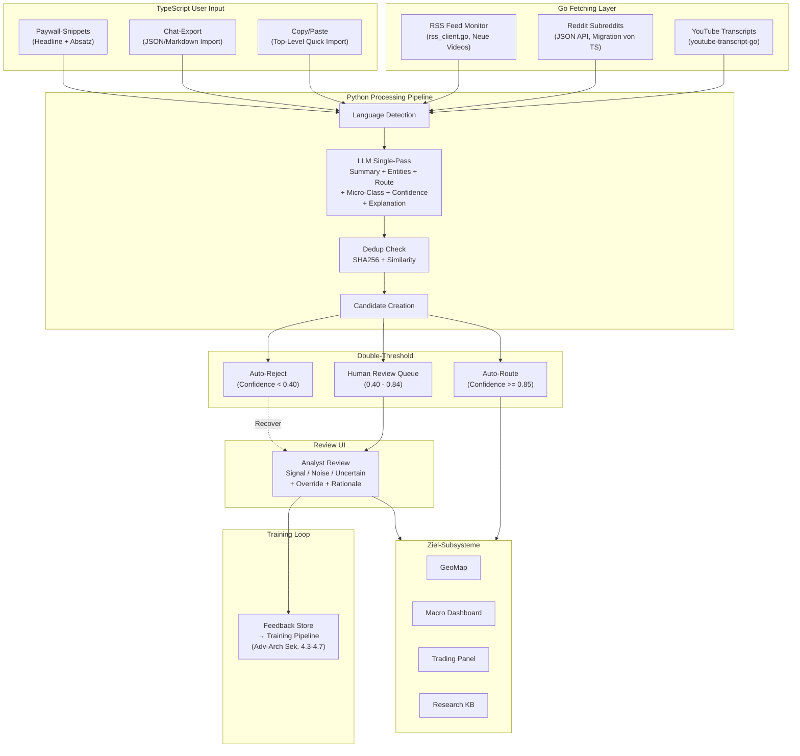

# Unified Ingestion Layer (UIL) -- Unstrukturierte Datenquellen

> **Stand:** 19. Februar 2026
> **Scope:** Architektur fuer die Aufnahme, Verarbeitung und Klassifizierung unstrukturierter Datenquellen (YouTube-Transcripts, Reddit, Copy/Paste, Chat-Exports, Paywall-Artikel). Hierarchische Klassifizierung, Double-Threshold Human-in-the-Loop Review, Training-Loop.
> **Status:** Konzept. Kein Code implementiert.
> **Prioritaet:** MITTEL. Setzt voraus dass Go Data Router (strukturierte Daten) und Soft-Signal Pipeline (GeoMap) stabil laufen.
> **Primaer betroffen:** Go-Backend (Fetching), Python-Backend (LLM-Processing), Frontend (Review-UI, Copy/Paste)
> **Sekundaer betroffen:** GeoMap (Consumer), Macro-Dashboard (Consumer), Trading-Panel (Consumer)

---

## Inhaltsverzeichnis

0. [Einleitung und Abgrenzung](#0-einleitung-und-abgrenzung)
1. [Sprachgrenzen-Vertrag](#1-sprachgrenzen-vertrag-language-boundary-contract)
2. [Quellen und Fetching-Architektur](#2-quellen-und-fetching-architektur)
3. [Hierarchische Klassifizierung (Macro + Micro)](#3-hierarchische-klassifizierung-macro--micro)
4. [LLM-Processing-Pipeline (Python)](#4-llm-processing-pipeline-python) (inkl. 4.5 Bias-Awareness + Annotation Quality)
5. [Human-in-the-Loop Review (Double-Threshold + Training-Loop)](#5-human-in-the-loop-review-double-threshold--training-loop)
6. [Copy/Paste als Top-Level Feature](#6-copypaste-als-top-level-feature)
7. [Datenfluss-Diagramm](#7-datenfluss-diagramm)
8. [Querverweise zu bestehenden Docs](#8-querverweise-zu-bestehenden-docs)

---

## 0. Einleitung und Abgrenzung

### Was die UIL ist

Die Unified Ingestion Layer verarbeitet **unstrukturierte** Datenquellen die nicht ueber standardisierte APIs in tabellarischer Form kommen. Stattdessen liefern sie Freitext, Transkripte oder manuell eingefuegte Inhalte die erst durch LLM/NLP-Verarbeitung strukturiert und klassifiziert werden muessen.

### Was die UIL NICHT ist

| Concern | Zustaendig | Dokument |
|---------|------------|----------|
| Strukturierte OHLCV/Macro-Daten (Finnhub, FRED, ECB, etc.) | **Go Data Router** | [`go-research-financial-data-aggregation-2025-2026.md`](./go-research-financial-data-aggregation-2025-2026.md) |
| News-Headlines von APIs (NewsData, GNews, Webz, GDELT) | **Go News Fetcher** (migriert von TS) | [`project_audit2.md`](./archive/project_audit2.md) L286 (archiviert), [`INDICATOR_ARCHITECTURE.md`](./INDICATOR_ARCHITECTURE.md) L397-398 |
| Indikator-Berechnung | **Python + Rust/PyO3** | [`INDICATOR_ARCHITECTURE.md`](./INDICATOR_ARCHITECTURE.md) |
| GeoMap Event-Persistenz und Timeline | **GeoMap Engine** | [`GEOPOLITICAL_MAP_MASTERPLAN.md`](./GEOPOLITICAL_MAP_MASTERPLAN.md) |

Die UIL ist die **Bruecke** zwischen rohen unstrukturierten Inhalten und den bestehenden Subsystemen. Sie produziert Candidates -- nie finale Daten.

### Gemeinsames Muster aller UIL-Quellen

```
1. Beschaffung     → Go (automatisch) oder TS (User-Input)
2. LLM-Verarbeitung → Python (Summarize, Extract, Classify, Score)
3. Dedup/Hash       → Python (SHA256, Similarity)
4. Review-Queue     → Frontend (Human-in-the-Loop)
5. Routing          → Ziel-Subsystem (GeoMap, Macro, Trading, Research)
```

---

## 1. Sprachgrenzen-Vertrag (Language Boundary Contract)

> Konsolidiert die ueber mehrere Dokumente verstreute Regel. Primaerquellen: [`project_audit2.md`](./archive/project_audit2.md) L160/210 (archiviert), [`REFERENCE_PROJECTS.md`](./REFERENCE_PROJECTS.md) L46, [`INDICATOR_ARCHITECTURE.md`](./INDICATOR_ARCHITECTURE.md) L397.

| Sprache | UIL-Verantwortung | Regel |
|---------|-------------------|-------|
| **Go** | Alles was automatisch von externen Quellen geholt wird: YouTube-Transcripts, Reddit-Posts, RSS-Feed-Monitoring | "Go ist der einzige Ort fuer alle externe Daten-Beschaffung" |
| **Python** | Alles was verarbeitet wird: LLM-Summarization, Entity Extraction, Classification, Confidence Scoring, Dedup | "Python holt KEINE Daten selbst. Alle Rohdaten kommen von der Go-Schicht. Python empfaengt und verarbeitet sie" |
| **TypeScript** | User-initiierter Input: Copy/Paste, Chat-Import, Paywall-Snippets. Plus Review-UI | User-Input ist kein "Fetching von externer Quelle" -- kein Verstoss gegen Go-Prinzip |
| **Rust** | Nicht in UIL v1. Spaeter: Dedup-Hashing, Similarity-Berechnung in rust-core | Erst wenn Performance-Bedarf messbar ist |

### Datenfluss pro Sprache

```
                      ┌───────────────────────────────────┐
                      │            Go (Fetch)              │
                      │                                    │
                      │  YouTube Transcripts (Go Library)  │
                      │  Reddit JSON API                   │
                      │  RSS Feed Monitoring               │
                      └──────────────┬─────────────────────┘
                                     │
                                     │ Raw Content (JSON)
                                     │
   ┌──────────────────┐              │
   │ TypeScript (UI)  │              │
   │                  │              │
   │ Copy/Paste       ├──────────────┤
   │ Chat-Import      │              │
   │ Paywall-Snippet  │              │
   └──────────────────┘              │
                                     │
                      ┌──────────────▼─────────────────────┐
                      │         Python (Process)            │
                      │                                     │
                      │  LLM Pipeline:                      │
                      │    Summary + Entities + Route        │
                      │    + Micro-Class + Confidence        │
                      │    + Explanation                     │
                      │  Dedup (SHA256 + Similarity)         │
                      │  Candidate Creation                  │
                      └──────────────┬──────────────────────┘
                                     │
                      ┌──────────────▼─────────────────────┐
                      │     TypeScript (Review UI)          │
                      │                                     │
                      │  Candidate Queue + Actions           │
                      │  Signal / Noise / Uncertain          │
                      │  Reclassify / Override               │
                      └──────────────┬──────────────────────┘
                                     │
                      ┌──────────────▼─────────────────────┐
                      │       Ziel-Subsysteme               │
                      │                                     │
                      │  GeoMap  │ Macro │ Trading │ Research│
                      └─────────────────────────────────────┘
```

---

## 2. Quellen und Fetching-Architektur

### 2.1 Go-Fetched (automatisch)

#### YouTube Transcripts

| Aspekt | Detail |
|--------|--------|
| **Go-Library** | `youtube-transcript-go` (rahadiangg) -- pure Go, keine externen Dependencies, Multi-Language, Auto-/Manual-Captions |
| **Alternative** | `youtube-transcript-api-go` (horiagug) -- MIT, JSON/Text Output, v0.0.13 (Sept 2025) |
| **Neue-Video-Erkennung** | RSS Feed pro Kanal: `https://www.youtube.com/feeds/videos.xml?channel_id={ID}` via bestehenden `rss_client.go` |
| **Polling-Intervall** | Default 1h (konfigurierbar). YouTube RSS aktualisiert ca. alle 15-30 Min |
| **Output** | `{ videoId, channelId, title, publishedAt, transcript: string, language: string }` |
| **Wo im Go-Backend** | Neuer Connector: `go-backend/internal/connectors/youtube/transcript_client.go` |

**Konfigurierte Kanaele (persistent, per Checkbox ein/ausschaltbar):**

| Kanal | Thema | Warum relevant | Kritische Bewertung |
|-------|-------|----------------|---------------------|
| Euro Dollar University | Macro, Dollar-System, Eurodollar-Markt, Liquiditaet | Einzige Quelle die Eurodollar-Mechanismen (Offshore-Dollar-Kreislaeufe) erklaert -- direkt relevant fuer Forex + Macro-Regime-Erkennung | Neigt zu Uebertreibung -- kritisch hinterfragen |
| Marc Friedrich | Macro, Gold, Wirtschaft, Inflation (DE) | Deutschsprachige Macro-Perspektive, Gold/Commodity-Kontext, ergaenzt die angelsaechsischen Quellen | Eher neutral, gelegentlich Gold-Bias |
| Blocktrainer | Bitcoin, Crypto, Geldtheorie (DE) | Crypto-Sentiment + On-Chain-Kontext fuer unser Crypto-Modul | Noch evaluieren |
| [Richard J Murphy](https://www.youtube.com/@RichardJMurphy) | Tax, Macro, MMT, Fiskalpolitik, Korruption/Secrecy (EN) | Fiskalpolitik-Kontext den kein OHLCV-Feed liefert: Steuerpolitik, Kapitalfluesse, Sektorenbilanzen. Blog = eigenstaendige Artikel-Quelle (RSS, siehe unten) | Oekonomie-Professor, Tax Research UK. ~7-8 Posts/Tag, Mehrheit reine Artikel (kein Video). Politisch links -- Perspektive einordnen |
| [Prof Steve Keen](https://www.youtube.com/@profstevekeen) | Post-Keynesian Economics, Debt Dynamics, Minsky-Modelle, Private Debt (EN) | Debt-Zyklen und Private-Debt-Dynamik als Fruehwarnsystem fuer Macro-Regime-Shifts. Sein Minsky-Framework erklaert Finanzkrisen bevor sie in Marktdaten sichtbar werden | Oekonomie-Professor, hohe akademische Qualitaet. Kann technisch dicht sein |
| [George Gammon / Rebel Capitalist](https://www.youtube.com/@GeorgeGammon) | Macro, Fed-Politik, Liquiditaet, Real Estate, Repo-Markt (EN) | Erklaert komplexe Macro-Mechanismen visuell (Whiteboard). Interviewt Top-Analysten (Lyn Alden, Brent Johnson). 700k+ Subs. Fokus auf Liquiditaet + Fed = direkt relevant fuer Markt-Regime | Populaer, manchmal vereinfachend. Eher libertaer -- Perspektive einordnen |
| [Lyn Alden](https://www.youtube.com/@LynAldenContact) | Macro, Liquiditaet, Schuldenzyklen, Fiscal Dominance, Bitcoin (EN) | Eine der besten Macro-Analytikerinnen. Verbindet Fiscal/Monetary Policy mit konkreten Asset-Implikationen. Ihr "Fiscal Dominance"-Framework erklaert warum Zinspolitik allein Maerkte nicht mehr steuert | Sehr hohe Qualitaet, datengetrieben. Newsletter ergaenzt YouTube |
| [Money & Macro](https://www.youtube.com/@MoneyMacro) | Geldpolitik, Zentralbanken, Wirtschaftsgeschichte (EN) | Akademisch fundiert, gut recherchiert. Erklaert historische Parallelen (Weimar, Bretton Woods, Volcker) die fuer Regime-Erkennung relevant sind | ~500k Subs, eher educational als tagesaktuell |
| [Patrick Boyle](https://www.youtube.com/@PBoyle) | Hedge Funds, Macro, Finanzmaerkte, Derivate (EN) | Ex-Hedge-Fund-Manager. Bruecke zwischen Theorie und Praxis. Erklaert wie institutionelle Investoren denken -- relevant fuer Smart Money Flow Interpretation | Trocken-witzig, sehr praezise. Eher selten (1-2x/Woche) |
| [Felix & Friends / Goat Academy](https://www.youtube.com/@FelixFriends) | Trading-Strategie, Technische Analyse, Volume, 50-Day SMA (EN) | **Direkte Quelle fuer unser Composite Signal:** Heartbeat + Volume + 50-Day Kombination stammt von Felix Prehns Methodik (siehe INDICATOR_ARCHITECTURE Sek. 3). Team inkl. 3 ex-Market-Makers (LME, Bear Stearns/Merrill, CBOE) | Kommerziell (Goat Academy, TradeVision AI-Alerts). Fuer uns als Strategie-Inspiration, nicht als Daten-Quelle via Transcript |
| [The Jack Mallers Show](https://www.youtube.com/@thejackmallersshow) | Bitcoin, Lightning Network, Macro, Monetary Policy, Geldtheorie (EN) | CEO von Strike (Lightning-Payments-Plattform). Top-Bitcoin-Analyst mit Macro-Tiefgang: Fed-Politik, Liquiditaet, Dollar-System, globale Geldpolitik. Hat El Salvadors Bitcoin-Adoption angekuendigt. Live jeden Montag ~5-6 PM EST | Frueher "Money Matters with Jack Mallers" -- gleicher Kanal, umbenannt. Co-Hosts: Bill Mallers Jr. (Vater), Dylan Lieteau. Kein Blog (strike.me/blog = Produkt-News, kein Macro). Stark Bitcoin-Maximalist -- Perspektive einordnen |

> Kanaele werden in einer Config-Datei oder DB gespeichert. Jeder Kanal hat ein `enabled: boolean` Flag. UI: Settings-Page mit Checkbox-Liste + "Kanal hinzufuegen" Input.

#### Reddit Subreddits

| Aspekt | Detail |
|--------|--------|
| **Ist-Zustand** | Aktuell in TypeScript (`src/lib/news/aggregator.ts` `fetchReddit()`), fetcht `r/StockMarket` und `r/investing` via Public JSON API |
| **Migration** | Geplant -- News-Fetching wandert in Go-Schicht (siehe [`go-research`](./go-research-financial-data-aggregation-2025-2026.md)) |
| **Go-Implementierung** | Neuer Connector: `go-backend/internal/connectors/reddit/client.go`. Public JSON API: `https://www.reddit.com/r/{subreddit}/hot.json?limit=25` |
| **Polling-Intervall** | Default 15 Min (konfigurierbar). Reddit Rate-Limit: 60 req/min ohne OAuth |
| **Output** | `{ subreddit, postId, title, selftext, author, score, numComments, createdUtc, url }` |

**Konfigurierte Subreddits (persistent, per Checkbox ein/ausschaltbar):**

| Subreddit | Thema |
|-----------|-------|
| r/StockMarket | Aktien allgemein |
| r/investing | Investment-Diskussionen |
| r/algotrading | Algorithmic Trading |
| r/Commodities | Rohstoffe |
| r/quant | Quantitative Finance |

#### RSS Feeds (bereits vorhanden)

Bestehender `rss_client.go` in `go-backend/internal/connectors/news/`. Wird fuer YouTube-Kanal-Monitoring wiederverwendet. Bestehende Market-News-RSS-Feeds (MarketWatch etc.) bleiben im Go News Fetcher, nicht in der UIL -- das sind strukturierte Headlines, kein Freitext.

#### Blog-RSS als eigenstaendige Quelle

| Blog/Newsletter | RSS | Thema | Warum relevant | Dedup-Hinweis |
|-----------------|-----|-------|----------------|---------------|
| [Tax Research UK](https://www.taxresearch.org.uk/Blog/) (Richard J Murphy) | Via `rss_client.go` | Tax, Macro, MMT, Fiskalpolitik | ~7-8 Posts/Tag, Mehrheit reine Artikel ohne Video. Fiskalpolitik + Kapitalfluesse + Sektorenbilanzen | **Kein Duplikat zu YT:** Blog-Posts zu Videos sind Summaries, nicht Transcripts. Eigenstaendige Artikel = Mehrwert |
| [fx:macro](https://www.fxmacro.info/) (Substack) | Substack RSS | Woechentliche Macro-Analyse, FX, Zentralbanken | Speziell fuer Trader geschrieben: Intermarket-Analyse + Zentralbank-Entscheidungen. Direkt verwertbar fuer Macro-Regime und Forex | -- |
| [MacroAnchor](https://macroanchor.substack.com/) (Andre Chelhot) | Substack RSS | Debt, Geopolitics, Regime Shifts, Waehrungskriege | Ex-Zentralbanker + Hedge Fund Manager. Fokus auf Schulden-Dynamik und geopolitische Regime-Shifts -- direkt relevant fuer GeoMap + Macro | -- |
| [Wolf Street](https://wolfstreet.com/) | Blog RSS | US-Wirtschaft, Fed, Housing, Inflation, Kredite | Taeglich, datengetrieben. Fokus auf US-Housing + Kreditmaerkte -- Fruehwarnsystem fuer Macro-Wenden | -- |

> **Regel fuer Blogs mit korrespondierendem YouTube-Kanal:** Beide Quellen behalten -- sie sind komplementaer, nicht redundant. YouTube-Transcript liefert den vollen Wortlaut. Blog-Post liefert kuratierte Zusammenfassung + Kontext/Links + eigenstaendige Artikel ohne Video. Die Pipeline verarbeitet beide, taggt sie aber mit `sourceType: "youtube_transcript"` vs `sourceType: "blog_rss"` damit die Review-UI den Zusammenhang erkennen kann (gleicher Autor + aehnlicher Titel + Zeitfenster = zusammengehoeriger Content, kein Duplikat).

### 2.2 User-Input (TypeScript)

#### Copy/Paste (Top-Level Feature)

| Aspekt | Detail |
|--------|--------|
| **Ist-Zustand** | In GeoMap als Sek. 35.15 geplant (GeoMap-spezifisch, `triggerType: "manual_import"`) |
| **Aenderung** | Wird Top-Level Feature. Nicht mehr GeoMap-spezifisch -- LLM bestimmt Routing |
| **UI** | Globales "Quick Import" Element (Sidebar, Command Palette, oder dedizierter Tab). Ctrl+V oder Drag&Drop |
| **Extraktion** | URL (falls vorhanden), Headline (erste Zeile), Datum (Regex/Heuristik), Snippet |
| **Evidence** | SHA256 Hash (wie GeoMap Evidence Bundle, Sek. 35.1) + Timestamp + optional URL |

#### Chat-Export-Import

Eigene ChatGPT/Gemini/Claude-Chats als Kontext importieren. Referenz: `NOTES-19.02.2026.md` Sek. H4.

| Aspekt | Detail |
|--------|--------|
| **Input** | JSON-Export (ChatGPT), Markdown, Plain Text |
| **Verarbeitung** | LLM extrahiert relevante Insights aus Chat-Verlauf, ignoriert Small-Talk |
| **Prioritaet** | NIEDRIG. Erst wenn UIL-Kernarchitektur steht |

#### Paywall-Artikel

Manuelle Snippets/Headlines von Quellen hinter Paywalls (FT, Bloomberg Terminal, WSJ).

| Aspekt | Detail |
|--------|--------|
| **Input** | Text-Paste (Headline + erste Absaetze) |
| **Verarbeitung** | Identisch zu Copy/Paste -- LLM klassifiziert |
| **Rechtlich** | Nur Metadata + Snippets speichern (analog GeoMap Sek. 22: metadata-first) |

### 2.3 Konfiguration

| Setting | Default | Wo |
|---------|---------|-----|
| YouTube-Kanaele | `[]` (leer, User fuegt hinzu) | DB/Config, Settings-UI |
| YouTube Polling-Intervall | 60 Min | ENV / Settings-UI |
| Reddit Subreddits | `[StockMarket, investing]` | DB/Config, Settings-UI |
| Reddit Polling-Intervall | 15 Min | ENV / Settings-UI |
| Enabled/Disabled pro Kanal/Subreddit | `true` (Checkbox) | Settings-UI |
| Auto-Route Threshold | 0.85 | ENV / Settings-UI |
| Auto-Reject Threshold | 0.40 | ENV / Settings-UI |

---

## 3. Hierarchische Klassifizierung (Macro + Micro)

Zweistufige Klassifizierung in einem LLM-Pass. Der LLM liefert beides plus Confidence und Explanation Bundle.

### 3.1 Macro-Routing (Wohin?)

Bestimmt welche(s) Subsystem(e) den Content erhalten. Kann mehrere gleichzeitig sein.

| Macro-Route | Subsystem | Beispiel |
|-------------|-----------|---------|
| **geo** | GeoMap (Geopolitical Events) | "US verschaerft Sanktionen gegen Iran" |
| **macro** | Macro-Economic Dashboard | "Fed signalisiert Zinspause im Maerz" |
| **trading** | Trading Panel / Alerts | "NVDA Earnings Beat, Guidance erhoeht" |
| **research** | Research / Knowledge Base | "Neue Methodik fuer Volatilitaets-Clustering" |

**Multi-Route:** Ein YouTube-Video ueber "Fed-Zinsentscheidung und deren Auswirkung auf Gold" geht an `macro` UND `trading` UND potentiell `geo`.

### 3.2 Micro-Klassifizierung (Was genau?)

Pro Macro-Route gibt es Sub-Kategorien. Diese sind erweiterbar.

**GeoMap** (aus [`GEOPOLITICAL_MAP_MASTERPLAN.md`](./GEOPOLITICAL_MAP_MASTERPLAN.md) Sek. 7.1):

| Micro-Kategorie | Beschreibung |
|-----------------|-------------|
| sanctions | Sanktionen, Exportkontrollen, Asset Freezes |
| conflict | Militaerische Konflikte, Eskalationen |
| election | Wahlen, Regierungswechsel |
| trade-war | Zoelle, Handelsabkommen, Embargos |
| energy | Oel, Gas, OPEC, Chokepoints |
| migration | Fluechtlingsbewegungen, Grenzen |

**Macro-Economic:**

| Micro-Kategorie | Beschreibung |
|-----------------|-------------|
| central-bank-rate | Zinsentscheidungen, Forward Guidance |
| fiscal-policy | Staatsausgaben, Steuerpolitik |
| gdp | BIP-Daten, Wachstumsprognosen |
| inflation | CPI, PPI, Inflationserwartungen |
| employment | Arbeitsmarktdaten, Jobless Claims |

**Trading:**

| Micro-Kategorie | Beschreibung |
|-----------------|-------------|
| earnings | Quartalsberichte, Guidance |
| sector-rotation | Branchenverschiebungen, Kapitalfluesse |
| technical-signal | Chart-Muster, Breakouts (aus Analyst-Kommentar) |
| sentiment-shift | Stimmungswechsel, Contrarian-Indikatoren |

**Research:**

| Micro-Kategorie | Beschreibung |
|-----------------|-------------|
| methodology | Neue Analyse-Methoden, Indikatoren |
| market-structure | Marktstruktur, Liquiditaet, Fragmentation |
| historical-pattern | Historische Parallelen, Analogien |

### 3.3 LLM Output-Schema

```json
{
  "summary": "2-3 Saetze Zusammenfassung",
  "entities": {
    "countries": ["US", "IR"],
    "companies": ["NVDA"],
    "assets": ["Gold", "Crude Oil"],
    "persons": ["Jerome Powell"]
  },
  "macroRoutes": ["geo", "macro"],
  "microClassifications": {
    "geo": "sanctions",
    "macro": "central-bank-rate"
  },
  "confidence": 0.78,
  "explanation": "Mentions new sanctions package targeting Iranian oil exports, with Fed commentary on inflation impact."
}
```

---

## 4. LLM-Processing-Pipeline (Python)

> Erweitert die bestehende Soft-Signals Pipeline. Bestehender Service: `python-backend/services/geopolitical-soft-signals/` (FastAPI, Port 8091).
> **Agent-Architektur:** Die hier beschriebene LLM-Pipeline folgt dem Extractor → Verifier → Guard → Synthesizer Pattern. Fuer die generelle Formalisierung, Behavioral Text Analysis (BTE/DRS), Speech Analysis und das Multimodale Dashboard siehe [`AGENT_ARCHITECTURE.md`](./AGENT_ARCHITECTURE.md).

### 4.1 Pipeline-Schritte

```
Raw Content (from Go / TS)
  │
  ▼
1. Language Detection (langdetect / fasttext)
  │
  ▼
2. LLM Processing (single pass):
   - Summary (2-3 Saetze)
   - Entity Extraction (Laender, Firmen, Assets, Personen)
   - Macro-Route (geo/macro/trading/research)
   - Micro-Classification (sub-category per route)
   - Confidence Score (0.0-1.0)
   - Explanation Bundle
  │
  ▼
3. Dedup Check:
   - SHA256 Hash (Content + Source)
   - Optional: Embedding-Similarity gegen letzte N Candidates
  │
  ▼
4. Candidate Creation → Review Queue
```

### 4.2 Neuer Endpoint

| Method | Path | Beschreibung |
|--------|------|-------------|
| POST | `/api/v1/ingest/classify` | Nimmt Raw Content, liefert klassifizierten Candidate |

**Request:**

```json
{
  "sourceType": "youtube_transcript" | "reddit_post" | "copy_paste" | "chat_export",
  "sourceId": "video_id / post_id / sha256",
  "sourceMeta": {
    "channelName": "Euro Dollar University",
    "videoTitle": "Fed Meeting March 2026",
    "publishedAt": "2026-02-19T10:00:00Z",
    "url": "https://youtube.com/watch?v=..."
  },
  "content": "Full transcript or pasted text...",
  "language": "en"
}
```

**Response:**

```json
{
  "candidateId": "uil-2026-02-19-001",
  "summary": "...",
  "entities": { ... },
  "macroRoutes": ["geo", "macro"],
  "microClassifications": { "geo": "sanctions", "macro": "central-bank-rate" },
  "confidence": 0.78,
  "explanation": "...",
  "dedup": { "isDuplicate": false, "similarCandidates": [] },
  "reviewAction": "human_review"
}
```

### 4.3 LLM-Anbindung

| Option | Beschreibung | Prioritaet |
|--------|-------------|------------|
| **Ollama (lokal)** | Llama 3, Mistral -- kostenlos, offline, datenschutzfreundlich | v1 (Default) |
| **OpenAI API** | GPT-4o-mini -- hoehere Qualitaet, kostet pro Call | v1 (Optional) |
| **Sentiment-Modell** (FinBERT, financial-roberta-large, FinGPT, XLM-R, FinBERT2-CN -- siehe [`GEOPOLITICAL_MAP_MASTERPLAN.md`](./GEOPOLITICAL_MAP_MASTERPLAN.md) Sek. 18.2 fuer Vergleichstabelle) | Fuer Sentiment-spezifische Sub-Tasks (nicht fuer Klassifizierung). Modulares Interface: Modell-Austausch = Config-Aenderung | v2 |

Bestehende Ollama-Integration: `python-backend/` nutzt bereits Ollama fuer lokale LLM-Calls.

### 4.4 Integration mit bestehender Soft-Signal Pipeline

Die UIL-Pipeline ist eine **Erweiterung** der bestehenden `geopolitical-soft-signals` Pipeline, kein Ersatz:

| Bestehend (bleibt) | Neu (UIL) |
|---------------------|-----------|
| `POST /api/v1/cluster-headlines` | `POST /api/v1/ingest/classify` |
| `POST /api/v1/social-surge` | -- |
| `POST /api/v1/narrative-shift` | -- |
| Input: News-Headlines (von Go/TS) | Input: Freitext (Transcripts, Paste) |
| Output: GeoCandidate (nur GeoMap) | Output: UIL-Candidate (Multi-Route) |
| Regelbasiert + TF-IDF | LLM-basiert |

Langfristig (v3): beide Pipelines koennten mergen wenn alle Quellen durch LLM laufen.

### 4.5 Bias-Awareness und Annotation Quality

> **Buch-Referenz (Emotion AI):** "Emotion and Facial Recognition in AI" (Slimani et al., Springer 2026), Kapitel "Navigating the Future of Emotion AI" -- Bias in Trainings-Daten, Inter-Annotator Agreement, Crowdsourced Labeling, und "Challenges, Opportunities, and the Road Ahead" -- Geographic Bias, Language Bias, Recency Bias, Confirmation Bias. Kapitel "Feature Aggregation for Efficient Continual Learning" warnt vor Catastrophic Forgetting bei Re-Training.

#### 4.5.1 Bias-Typen die unsere Pipeline betreffen

| Bias-Typ | Emotion-AI-Aequivalent | Unser Risiko | Mitigation |
|---|---|---|---|
| **Language Bias** | Emotion-Modelle erkennen Ausdruecke in westlichen Gesichtern besser als in asiatischen | Sentiment-Modelle (FinBERT etc.) performen besser auf EN Finanz-Jargon als auf DE/FR/CN. Langfristig: sprachspezifische Modelle (GeoMap Sek. 18.2) | Pro Sprache separate Confidence-Kalibrierung. Bei nicht-EN Input: Confidence-Abschlag + Flagging. v3: FinBERT2 (CN), XLM-R Fine-Tune (multilingual) |
| **Source Bias** | Annotations hauptsaechlich von MTurk-Workern (US-zentrisch) | Reddit/YouTube ueberrepraesentiert Retail-Sentiment, Bloomberg ueberrepraesentiert Institutional | Source-Typ als explizites Feature im Scoring: `source_class: retail|institutional|official|social`. Nie nur eine Source-Klasse fuer eine Entscheidung |
| **Recency Bias** | Neueste Emotionen werden staerker gewichtet als historische Baseline | Neueste News dominieren Candidate-Queue, aeltere (aber korrektere) Analysen sinken ab | Time-Decay nur auf Relevanz, nicht auf Qualitaet. Ein 3-Tage-alter Bloomberg-Artikel mit hoher Confidence schlaegt einen 1-Stunde-alten Reddit-Post mit niedriger Confidence |
| **Confirmation Bias** | Annotator labelt "happy" weil vorheriges Label "happy" war | LLM-Sentiment wird von vorherigem Context-Window beeinflusst (Priming-Effekt) | Jeder `classify`-Aufruf bekommt **keinen** vorherigen Kontext. Stateless per Design. Cross-Check ueber `dedup_hash` statt LLM-Gedaechtnis |
| **Survivorship Bias** | Nur "erfolgreiche" Emotionserkennung wird publiziert | Nur Candidates die Auto-Route passieren fliessen ins Dashboard -- abgelehnte Events verschwinden spurlos | **Abgelehnte Candidates loggen** (Sek. 5.1 `rejected_log` Tabelle). Regelmaessig Sample aus Rejected ziehen und manuell pruefen ob False Negatives dabei waren |

#### 4.5.2 Annotation Quality (Multi-Reviewer Konsistenz)

> **Buch-Referenz:** Inter-Annotator Agreement (Cohen's Kappa, Fleiss' Kappa) als Qualitaetsmass fuer Emotion-Labels. Crowdsourced-Ansaetze brauchen Konsens-Mechanismen um Label-Noise zu reduzieren.

**Uebertragung:** Sek. 5 definiert 3-5 Analysten im Review-Loop. Deren Uebereinstimmung bestimmt die Qualitaet der Training-Daten.

| Metrik | Berechnung | Schwellwert | Aktion bei Unterschreitung |
|---|---|---|---|
| **Pairwise Agreement** | % identische Signal/Noise-Entscheidungen zwischen zwei Reviewern | >75% | Reviewer-Pair bekommt Kalibrierungs-Session (gemeinsam schwierige Faelle durchgehen) |
| **Cohen's Kappa** (pro Paar) | Agreement bereinigt um Zufall | >0.6 (substantial) | Wenn <0.4 ("fair"): einer der Reviewer bekommt temporaer weniger kritische Reviews |
| **Fleiss' Kappa** (alle Reviewer) | Multi-Rater Agreement | >0.5 | Wenn <0.4: Review-Guidelines ueberarbeiten, mehr Beispiele definieren |
| **Override-Konsistenz** | Wenn gleicher Event-Typ mehrfach vorkommt: uebereinstimmende Overrides? | >60% | Wenn <40%: der Event-Typ ist zu ambig definiert -- Taxonomie verfeinern |

**Dashboard-Ansicht (v2, Admin-Panel):**
```
Reviewer Agreement Matrix
              Analyst_A  Analyst_B  Analyst_C
Analyst_A       --         0.72κ      0.65κ
Analyst_B     0.72κ        --         0.58κ
Analyst_C     0.65κ      0.58κ        --
Fleiss κ (gesamt): 0.61 (substantial agreement) ✓
```

#### 4.5.3 Bias-Propagation in der Training Pipeline

> **Buch-Warnung:** "Wenn Modelle auf ihrem eigenen Output re-trainiert werden, verstaerkt sich Bias exponentiell" (Emotion-AI-Buch, Continual Learning Kapitel).

**Risiko fuer uns:** Die Training-Pipeline (Sek. 5.3 + [`Advanced-architecture-for-the-future.md`](./Advanced-architecture-for-the-future.md) Sek. 4.6) nutzt Reviewer-Feedback als Ground Truth. Wenn Reviewer durch hohe System-Confidence beeinflusst werden (Anchoring-Effekt), entsteht eine Self-Reinforcing Loop.

**Gegenmassnahmen:**

1. **Blind Review (Stufe 2+):** Option, bei der Reviewer die System-Confidence **nicht** sehen bevor sie ihre eigene Einschaetzung abgeben. Erst nach Submit wird die System-Confidence eingeblendet. Reduziert Anchoring.
2. **Golden Set Evaluation:** Monatlich 50 manuell kuratierte Events (25 Signal, 25 Noise) durch das Modell laufen lassen. Performance auf diesem unabhaengigen Set zeigt echte Modell-Qualitaet, unabhaengig von Reviewer-Agreement.
3. **Disagreement Sampling:** Wenn Reviewer und System disagreeen, diese Faelle bevorzugt ins Training aufnehmen (Active Learning). Gerade die schwierigen Faelle verbessern das Modell am meisten.
4. **Bias Audit (quartalsweise):** Confusion Matrix nach Source-Typ aufschluesseln. Wenn das Modell fuer Reddit-Posts systematisch anders performed als fuer Bloomberg-Headlines, ist Source Bias im Training.

**Verbindung:** [`Advanced-architecture-for-the-future.md`](./Advanced-architecture-for-the-future.md) Sek. 4.3-4.7 (vollstaendige Training Pipeline), Sek. 8.3 (Continual Learning / Concept Drift), Sek. 8a (Privacy-Preserving ML).

---

## 5. Human-in-the-Loop Review (Double-Threshold + Training-Loop)

> Uebernimmt das Pattern aus [`GEOPOLITICAL_MAP_MASTERPLAN.md`](./GEOPOLITICAL_MAP_MASTERPLAN.md) Sek. 5.4 und [`Advanced-architecture-for-the-future.md`](./Advanced-architecture-for-the-future.md) Sek. 4.2-4.7.

### 5.1 Double-Threshold Routing

SOTA 2026 Pattern: Zwei Schwellwerte statt einem. Automatisiert was eindeutig ist, praesentiert dem Menschen was unklar ist.

| Confidence | Aktion | Mensch |
|------------|--------|--------|
| >= 0.85 | **Auto-Route** → Candidate geht direkt ans Ziel-Subsystem | Kann overriden (Review optional aber sichtbar) |
| 0.40 - 0.84 | **Human Review** → Candidate erscheint in Review Queue | Muss entscheiden |
| < 0.40 | **Auto-Reject** → Candidate wird verworfen | Kann recovern (in "Rejected" Tab sichtbar) |

Schwellwerte sind konfigurierbar (Sek. 2.3).

### 5.2 Review-Aktionen

| Aktion | Bedeutung | Training-Label |
|--------|-----------|---------------|
| **Signal** (bestaetigen) | Content ist relevant, Route korrekt | `confirm_signal` (Gewicht 1.0) |
| **Signal** + Route korrigieren | Content relevant, aber falsch geroutet | `reclassify_signal` (Gewicht 1.5) |
| **Noise** (ablehnen) + Grund | Content irrelevant oder zu niedrige Qualitaet | `confirm_noise` (Gewicht 0.5) |
| **Noise** → Signal (Override) + Grund | System lag falsch, Analyst erklaert warum | `reclassify_noise_to_signal` (Gewicht 1.5) |
| **Uncertain** (zurueckstellen) + Grund | Nicht genug Kontext, spaeter nochmal anschauen | `uncertain` (Gewicht 0.3) |
| **Reclassify** | Macro-Route oder Micro-Kategorie aendern | `reclassify` (Gewicht 1.5) |

Jede Aktion speichert: `{ action, overrideReason?, correctedRoute?, correctedMicroCategory?, analystId, timestamp }`.

### 5.3 Training-Daten Anbindung

Alle Review-Aktionen fliessen als Trainings-Datenpunkte in die Pipeline (Details in [`Advanced-architecture-for-the-future.md`](./Advanced-architecture-for-the-future.md) Sek. 4.3-4.7):

- **Phase 1 (v1.1):** Metriken-Dashboard (Precision, Recall, Override Rate, Time-to-Review)
- **Phase 2 (v2):** Policy-Tuning + Golden Set (Threshold-Anpassung basierend auf Metriken)
- **Phase 3 (v3):** ML Fine-Tuning (Supervised Training auf Feedback-Records, Platt Scaling fuer Confidence Calibration, Active Learning)

---

## 6. Copy/Paste als Top-Level Feature

> **Migration:** Von GeoMap-spezifisch ([`GEOPOLITICAL_MAP_MASTERPLAN.md`](./GEOPOLITICAL_MAP_MASTERPLAN.md) Sek. 35.15) zu globalem Feature.

### 6.1 Warum Top-Level?

Copy/Paste-Inhalte koennen alles betreffen:
- Ein NZZ-Artikel ueber Schweizer Sanktionen → GeoMap
- Ein FT-Absatz ueber Bank of England Rate Decision → Macro
- Ein Bloomberg-Snippet ueber NVDA Supply Chain → Trading
- Eine Forschungsnotiz ueber Volatilitaets-Clustering → Research

Das Routing soll der LLM bestimmen, nicht der User indem er es manuell in GeoMap einfuegt.

### 6.2 Workflow

```
1. User oeffnet "Quick Import" (globales Element, nicht GeoMap-spezifisch)
2. Paste via Ctrl+V, Drag&Drop, oder Textarea
3. System extrahiert automatisch:
   - URL (falls vorhanden, Regex)
   - Headline (erste Zeile oder <title>)
   - Datum (Regex/Heuristik, z.B. ISO-8601, "Feb 19, 2026")
   - Snippet (erste 200 Zeichen als Preview)
4. SHA256 Hash wird generiert (Evidence Bundle)
5. Content geht an Python LLM-Pipeline (/api/v1/ingest/classify)
6. LLM liefert: Summary, Entities, Route, Micro-Class, Confidence
7. Je nach Confidence: Auto-Route, Review Queue, oder Auto-Reject
8. Bei Review: Analyst sieht Summary + Explanation + vorgeschlagene Route
   und kann bestaetigen, ablehnen, oder reclassifyen
```

### 6.3 Abgrenzung zu GeoMap Sek. 35.15

GeoMap Sek. 35.15 beschreibt einen GeoMap-spezifischen Copy/Paste-Workflow mit manueller Category/Region/Severity-Angabe. Dieser wird durch die UIL ersetzt:

| Aspekt | Alt (Sek. 35.15) | Neu (UIL) |
|--------|-------------------|-----------|
| Scope | Nur GeoMap | Global (alle Subsysteme) |
| Klassifizierung | Manuell (User waehlt Category/Region/Severity) | LLM-automatisch + Human Review |
| Routing | Immer GeoMap | LLM bestimmt (geo/macro/trading/research) |
| triggerType | `manual_import` | `manual_import` (bleibt gleich) |
| Evidence Bundle | SHA256 + Timestamp | SHA256 + Timestamp + URL (identisch) |

> **GeoMap Sek. 35.15 wird Verweis:** "Copy/Paste Import ist jetzt ein Top-Level Feature. Siehe [`UNIFIED_INGESTION_LAYER.md`](./UNIFIED_INGESTION_LAYER.md) Sek. 6. Content der vom LLM als `geo` geroutet wird, erscheint weiterhin als GeoCandidate in der GeoMap."

---

## 7. Datenfluss-Diagramm



---

## 8. Querverweise zu bestehenden Docs

### Von diesem Dokument nach aussen

| UIL Sektion | Referenziert | Verbindung |
|-------------|-------------|------------|
| Sek. 0 (Abgrenzung) | [`go-research-financial-data-aggregation-2025-2026.md`](./go-research-financial-data-aggregation-2025-2026.md) | Go Data Router = strukturierte Daten. UIL = unstrukturierte Daten |
| Sek. 1 (Sprachgrenzen) | [`project_audit2.md`](./archive/project_audit2.md) L160, L210, L286 | Primaerquelle fuer Language Boundary Contract (archiviert) |
| Sek. 1 (Sprachgrenzen) | [`REFERENCE_PROJECTS.md`](./REFERENCE_PROJECTS.md) L46 | "Go ist der einzige Ort fuer Daten-Beschaffung" |
| Sek. 1 (Sprachgrenzen) | [`INDICATOR_ARCHITECTURE.md`](./INDICATOR_ARCHITECTURE.md) L397-398 | News-Rohdaten von Go, Verarbeitung in Python |
| Sek. 2.1 (Reddit Migration) | [`project_audit2.md`](./archive/project_audit2.md) L286 | "News-Fetching in src/lib/news/sources.ts wandert in die Go-Schicht" (archiviert) |
| Sek. 3.2 (GeoMap Micro) | [`GEOPOLITICAL_MAP_MASTERPLAN.md`](./GEOPOLITICAL_MAP_MASTERPLAN.md) Sek. 7.1 | Kategorie-Taxonomie fuer geopolitische Events |
| Sek. 5 (HITL Review) | [`GEOPOLITICAL_MAP_MASTERPLAN.md`](./GEOPOLITICAL_MAP_MASTERPLAN.md) Sek. 5.4 | Feedback-Driven Review System (Signal/Noise/Uncertain) |
| Sek. 5.3 (Training) | [`Advanced-architecture-for-the-future.md`](./Advanced-architecture-for-the-future.md) Sek. 4.2-4.7 | Human-AI Teaming Pipeline, Metriken, Policy-Tuning, ML Training |
| Sek. 6 (Copy/Paste) | [`GEOPOLITICAL_MAP_MASTERPLAN.md`](./GEOPOLITICAL_MAP_MASTERPLAN.md) Sek. 35.15 | Migriert von GeoMap-spezifisch zu Top-Level |
| Sek. 6 (Evidence) | [`GEOPOLITICAL_MAP_MASTERPLAN.md`](./GEOPOLITICAL_MAP_MASTERPLAN.md) Sek. 35.1 | Evidence Bundle Pattern (SHA256 + Timestamp) |
| Sek. 4.4 (LLM-ML Teaming) | [`Advanced-architecture-for-the-future.md`](./Advanced-architecture-for-the-future.md) Sek. 8 | UIL ist die konkrete Implementierung des LLM-ML Teaming Patterns |

### Von anderen Docs hierher (Updates noetig)

| Dokument | Sektion | Update |
|----------|---------|--------|
| [`GEOPOLITICAL_MAP_MASTERPLAN.md`](./GEOPOLITICAL_MAP_MASTERPLAN.md) | Sek. 35.15 | Verweis: "Copy/Paste ist jetzt Top-Level Feature in UIL Sek. 6" |
| [`REFERENCE_PROJECTS.md`](./REFERENCE_PROJECTS.md) | Neue Sektion | Unconventional Sources: YouTube Go-Libraries, Reddit Go Migration |
| [`NOTES-19.02.2026.md`](./NOTES-19.02.2026.md) | Sek. F | Markieren als "Extrahiert nach UNIFIED_INGESTION_LAYER.md" |
| [`go-research-financial-data-aggregation-2025-2026.md`](./go-research-financial-data-aggregation-2025-2026.md) | Einleitung | Abgrenzungs-Notiz: strukturierte vs. unstrukturierte Daten |
| [`Advanced-architecture-for-the-future.md`](./Advanced-architecture-for-the-future.md) | Sek. 12 (Querverweise) | Neuer Eintrag: UIL als Implementierung von Sek. 4, 8 |

---

## 8.1 Addendum (Phase 9): GeoMap Candidate/Review Backend Konsolidierung

> **Kontext (Stand nach Phase 4 / GeoMap v2.0):** Die GeoMap-Frontend-/Rendering-Arbeit ist weitgehend abgeschlossen, aber Teile der GeoMap-Domainlogik laufen noch ueber Next.js API-Routes + lokale Stores (transitional path), z. B. Candidates, Contradictions, Seed-Bootstrap und Review-Aktionen.
> **Ziel in Phase 9:** Diese Logik in den **UIL- und Go-Layer** ziehen, sodass Next.js fuer GeoMap nur noch Review-UI / Visualization / thin proxy ist.

### 8.1.1 Was migriert wird (GeoMap-spezifisch)

| Bereich | Ist (transitional) | Ziel (Phase 9) |
|---|---|---|
| Hard-/Soft Ingest Orchestration | Next.js server routes (TS) | Go orchestriert Fetch + Provider/Diff; Python verarbeitet Klassifizierung/Dedup/Scoring; UIL-Contracts |
| Candidate Truth Path | Lokale TS Stores / Next APIs | Go/Python (UIL) Source-of-Truth, Next nur Review-UI |
| Review-Aktionen (`accept/reject/snooze`) | Next.js API-Routes | Go Gateway Endpoints mit UIL-domain services |
| Contradictions + Evidence | Next.js file store + API | UIL-domain service (Go-owned contracts; Persistenz je nach Phase 6+ Stack) |
| Seed/Golden-Set Bootstrap | Next.js `/api/geopolitical/seed` | Test/fixture tooling im UIL/Go-Kontext (oder dedizierter admin-only helper) |

### 8.1.2 Sprachgrenzen (scharf)

- **Go**: Fetching, polling, provider auth, rate limits, scheduling, delta-checks, request tracing, routing endpoints
- **Python**: LLM-Classification, entity extraction, dedup/similarity, confidence scoring, explanations
- **Next.js / TypeScript**: Review UI, visualization, keyboard shortcuts, local optimistic UI, no source-of-truth for ingestion domain state

### 8.1.3 GeoMap-UIL Contracts (zusaetzlich zu UIL v1)

GeoMap braucht ueber den generischen UIL-Candidate-Flow hinaus ein paar spezifische Felder:

- `geoHints`: `regionHint`, `countryHints[]`, `symbol`, `category`, optional `hotspotIds[]`
- `evidenceRefs[]`: Source refs plus analyst-added evidence bundle links
- `contradictionRefs[]`: IDs verknuepfter Contradictions
- `reviewReason`: maschinenlesbare + menschenlesbare Explain-Why payloads (nicht nur Freitext)
- `auditMeta`: `requestId`, `provider`, `deltaReason`, `classifierVersion`, `dedupHash`

> **Wichtig:** Phase 4 hat bereits ein gutes `reviewNote`-Muster und Adapter-Stats-DTOs. Diese sollen als **Transitional Contract-Vorlage** fuer UIL-Go/Python-Endpunkte dienen, statt parallel neue Formate zu erfinden.

### 8.1.4 Migrationsreihenfolge (empfohlen, vertikal)

1. **Review-Aktionen zuerst** (`accept/reject/snooze`)
   - Geringes Risiko, klarer UI-Impact, wenig Provider-Abhaengigkeit
   - Next UI bleibt unveraendert, tauscht nur Route-Target/Response-Schema

2. **Contradictions/Evidence/Resolution API**
   - Bestehende Phase-4-Basisfunktion in Go/UIL contracts heben
   - Audit-Events + Evidence-Struktur beibehalten

3. **Hard/Soft ingest orchestration**
   - Next-TS routes werden thin proxies / deprecated
   - Dedup/scoring/delta contract outputs zentralisieren

4. **Seed/Golden-set tooling**
   - in admin/test tooling verschieben (nicht produktive UI-route als Truth Path)

### 8.1.5 Verify fuer Phase 9 (GeoMap-zusatz)

- GeoMap Candidate Queue verwendet Go/UIL-backed endpoints (keine lokalen TS truth stores)
- `accept/reject/snooze` erzeugt Audits mit `X-Request-ID` End-to-End
- Contradiction create/update/evidence/resolution bleibt funktional nach Go-Migration
- Delta/Dedup/Reason-Felder erscheinen in derselben oder kompatiblen Form im GeoMap-Review-UI

### 8.1.6 Phase-9 Startpaket (Best-Practice Rollout)

> **Leitprinzip:** Zuerst die **Wahrheitspfade** (Candidate Review + Contradictions), danach Ingest-Orchestration und Seed-Tooling. Das minimiert Rework im Frontend und schafft frueh echte `Frontend -> Go -> UIL` Vertikalschnitte.

#### Schrittfolge (konkret)

1. **Inventory + Contract Freeze**
   - Alle aktuellen Next-GeoMap-Routes inventarisieren (inkl. Methoden, Payloads, Antwortformen)
   - `API_CONTRACTS.md` fuer GeoMap-UIL Endpunkte festziehen (`v1alpha`)
   - Payload-Kompatibilitaet fuer bestehende Frontend-Components explizit festhalten

2. **Go Frontdoor Skeleton**
   - Neue Go-Endpunkte fuer GeoMap-Review/Contradictions/Ingest/Seed anlegen
   - `X-Request-ID`, Logging, Error Contract, RBAC-Hooks, Timeouts verdrahten
   - Noch ohne finalen UIL-Owner moeglich (passthrough / mock / feature flag)

3. **Vertical Slice A: Candidate Review Actions**
   - `accept/reject/snooze` zuerst auf Go umstellen
   - Frontend-Queue unveraendert lassen, nur Route-Targets + Response-Schema angleichen
   - Ziel: Next-TS nicht mehr Source-of-Truth fuer Review-Aktionen

4. **Vertical Slice B: Contradictions + Evidence + Resolution**
   - Create/List/Get/Patch ueber Go/UIL contracts
   - Audit-Events (`created/resolved/reopened/resolution_updated/evidence_updated`) beibehalten
   - Bestehende Phase-4-UI wiederverwenden

5. **Vertical Slice C: Ingest Trigger + Adapter Stats**
   - Hard/Soft ingest trigger/status via Go
   - Adapter-Stats-DTO (Phase 4 transitional contract) in Go/UIL uebernehmen
   - Next-TS ingest routes auf thin proxy / deprecated setzen

6. **Vertical Slice D: Seed / Golden-Set Tooling (dev/admin only)**
   - Seed-Bootstrap von Next.js Route in Go-admin/Testtooling verschieben
   - Nicht als produktiver Truth Path behandeln

7. **Shadow Run + Cutover**
   - Parallelbetrieb (dev/staging): alte Next-TS vs neue Go/UIL Pipeline vergleichen
   - Vergleiche: candidate count, deduped rate, contradictions count, review actions, audit trail
   - Danach Next-TS Domainroutes entfernen oder auf thin proxy reduzieren

#### Phase-1 Parallelisierung (empfohlen)

- **Phase 1 (Auth/Security)** kann parallel laufen.
- **Wichtiges Gating:** Der finale Cutover von **mutierenden Endpunkten** (`review`, `contradictions`, `seed/admin`) sollte erst erfolgen, wenn eine minimale RBAC-Baseline aktiv ist (mindestens Rollenpruefung + Audit + Request-ID).

### 8.1.7 GeoMap Migrationsmatrix (Next -> Go/UIL, Phase 9 Fokus)

| Bereich | Aktuelle Next-Route (transitional) | Ziel-Endpunkt (Go Frontdoor) | Owner hinter Go | Wave |
|---|---|---|---|---|
| Candidate Queue read | `GET /api/geopolitical/candidates` | `GET /api/v1/geopolitical/candidates` | UIL domain service | 9e-A |
| Candidate create/manual | `POST /api/geopolitical/candidates` | `POST /api/v1/geopolitical/candidates` | UIL domain service | 9e-C |
| Candidate accept | `POST /api/geopolitical/candidates/:id/accept` | `POST /api/v1/geopolitical/candidates/:id/accept` | UIL domain service | 9e-A |
| Candidate reject | `POST /api/geopolitical/candidates/:id/reject` | `POST /api/v1/geopolitical/candidates/:id/reject` | UIL domain service | 9e-A |
| Candidate snooze | `POST /api/geopolitical/candidates/:id/snooze` | `POST /api/v1/geopolitical/candidates/:id/snooze` | UIL domain service | 9e-A |
| Hard ingest trigger | `POST /api/geopolitical/candidates/ingest/hard` | `POST /api/v1/geopolitical/ingest/hard` | Go orchestration + UIL | 9e-C |
| Soft ingest trigger | `POST /api/geopolitical/candidates/ingest/soft` | `POST /api/v1/geopolitical/ingest/soft` | Go orchestration + UIL | 9e-C |
| Contradictions list/create | `GET/POST /api/geopolitical/contradictions` | `GET/POST /api/v1/geopolitical/contradictions` | UIL domain service | 9e-B |
| Contradiction detail/patch | `GET/PATCH /api/geopolitical/contradictions/:id` | `GET/PATCH /api/v1/geopolitical/contradictions/:id` | UIL domain service | 9e-B |
| Seed bootstrap (dev) | `POST /api/geopolitical/seed` | `POST /api/v1/geopolitical/admin/seed` | Go admin/test helper | 9e-D |
| Timeline read (Geo review audit) | `GET /api/geopolitical/timeline` | `GET /api/v1/geopolitical/timeline` | UIL/audit read model | 9e-B/C |
| SSE stream (compat bridge) | `GET /api/geopolitical/stream` | `GET /api/v1/geopolitical/stream` (oder Alias) | Go stream gateway | 9e-C |

> **Nicht Primärscope in 9e (separat behandeln):** `events/*`, `drawings/*`, `news`, `context`, `graph`, `alerts`, `regions`, `game-theory/impact`. Diese sind teils bereits Go-gebunden oder gehoeren funktional eher zu GeoMap CRUD/Analytics als zur UIL-Candidate-Truth-Migration.
> **Aktualisierung (23. Feb 2026, nach Cutover-Cleanup):** Diese Nicht-Primärscope-Routen sind weiterhin lokal in Next vorhanden und gelten **nicht** als offener 9e-Cutover-Fehler. Der 9e-Cutover bezieht sich auf Candidate/Review/Contradictions/Timeline/Ingest/Seed-Truth-Pfade. `sources/health` und `stream` bleiben ebenfalls separat zu behandeln (Ops/Streaming/UX-Kompatibilitaet).

### 8.1.8 GeoMap Shadow-Run & Cutover Runbook (Phase 9e)

> **Status (23. Feb 2026):** Infrastruktur fuer Shadow-Run/Cutover ist vorhanden (`/api/v1/geopolitical/ingest/runs`, `/api/v1/geopolitical/migration/status`, Mode-Flags, Next thin proxies) und ein **echter Shadow-Run (lokal/dev)** wurde ausgefuehrt. Ergebnis: In `next-proxy`-Modi zeigten die gesampelten `hard/soft` Runs konsistent `openCountDelta = 0`. Danach wurde der Gateway testweise auf `go-owned-gateway-v1` fuer `hard/soft/seed` umgeschaltet und per `migration/status` verifiziert. `soft` und `seed` liefen im go-owned Modus erfolgreich; `hard` wurde anschliessend so gehaertet, dass Provider-/Events-Fehler im go-owned Modus als `HTTP 200` mit Adapter-Fehlerstatus (`ok=false`) zurueckgegeben werden (statt Top-Level-`502`), sodass der Cutover-Pfad/Thin-Proxy stabil bleibt. Lokal beobachteter Beispiel-Fehler ohne ACLED-Credentials: `request /acled/read failed with status 401`. **Post-Cutover Cleanup:** Next-Aliase fuer `POST /api/geopolitical/candidates`, `POST /api/geopolitical/candidates/ingest/{hard|soft}` und `POST /api/geopolitical/seed` sind nun thin-proxy-only (keine lokale Domainlogik mehr); `ingest/seed` geben bei fehlendem `go-owned-gateway-v1` Mode bewusst `503` mit Cutover-Hinweis zurueck statt auf lokale Fallback-Implementierungen zurueckzufallen.

#### Ziel

- Cutover von Next-transitional GeoMap-Ingestpfaden auf Go-owned Frontdoor/UIL, ohne Frontend-Routen zu brechen
- Vergleichbarkeit der Open-Candidate-Counts und Run-Stats vor dem Umschalten

#### Voraussetzungen

1. Go Gateway laeuft mit GeoMap Frontdoor aktiv
2. `GEOPOLITICAL_INGEST_SHADOW_COMPARE=1` (fuer Shadow-Compare-Deltas)
3. RBAC-Baseline aus Phase 1 mindestens fuer mutierende Endpunkte aktiv (oder kontrollierte Dev-Umgebung)
4. Next-GeoMap-Routen sind fuer Go-owned Pfade als thin proxy verdrahtet; `GET /api/geopolitical/candidates` kann fuer Shadow-Compare bewusst lokal bleiben
5. Optional: `scripts/geomap-phase9e-shadow-run.ps1` fuer reproduzierbare Seed/Shadow-Run-Abfolge nutzen

#### Schrittfolge

1. **Modi in Shadow-Stellung setzen**
   - `GEOPOLITICAL_INGEST_HARD_MODE=next-proxy`
   - `GEOPOLITICAL_INGEST_SOFT_MODE=next-proxy`
   - `GEOPOLITICAL_ADMIN_SEED_MODE=next-proxy+go-sync` (oder `go-owned-gateway-v1`, wenn Seed bereits verglichen wurde)

2. **Baseline erstellen**
   - `POST /api/v1/geopolitical/admin/seed`
   - `GET /api/v1/geopolitical/migration/status` speichern (Store-Counts / letzte Runs / aktive Modi)

3. **Shadow-Runs ausfuehren**
   - Hard ingest mehrfach triggern (z. B. 5x)
   - Soft ingest mehrfach triggern (z. B. 5x, zeitlich verteilt)
   - Optional unterschiedliche Payloads/Filter fuer Soft-Ingest testen

4. **Auswertung**
   - `GET /api/v1/geopolitical/ingest/runs?limit=50`
   - Pruefen:
     - `success` / `statusCode`
     - `adapterStats`
     - `candidateSyncCount`
     - `openCountDelta` (wenn Shadow-Compare aktiv)
     - Fehler- oder Timeout-Muster

5. **Cutover**
   - `GEOPOLITICAL_INGEST_HARD_MODE=go-owned-gateway-v1`
   - `GEOPOLITICAL_INGEST_SOFT_MODE=go-owned-gateway-v1`
   - optional `GEOPOLITICAL_ADMIN_SEED_MODE=go-owned-gateway-v1`
   - Frontend benutzt weiterhin `/api/geopolitical/*`; Next thin proxy leitet auf Go um

6. **Post-Cutover Verifikation (manuell, ohne Browser-Automation zwingend)**
   - Candidate Queue laden
   - Review `accept/reject/snooze`
   - Contradictions create/patch/evidence
   - Timeline lesen
   - Ingest hard/soft triggern
   - Seed triggern (admin/dev)

7. **Rückbau / Stabilisierung**
   - Next-TS Domainlogik fuer bereits Go-owned Pfade entfernen oder als minimalen thin proxy belassen (Post-Cutover Status: `ingest/seed`, `POST /api/geopolitical/candidates` sowie Review/Contradictions/Timeline-Aliase sind bereits thin-proxy oder thin-proxy+Shadow-Compare-guarded)
   - Cutover-Flags und Betriebsmodus dokumentieren (`SYSTEM_STATE.md`, `EXECUTION_PLAN.md`)

---

*Recherche-Datum: Februar 2026. SOTA-Quellen: Double-Threshold Policy (arxiv 2601.05974), HITL Review Queues (alldaystech.com/guides), Hi-Guard Hierarchical Classification (arxiv 2508.03296).*
