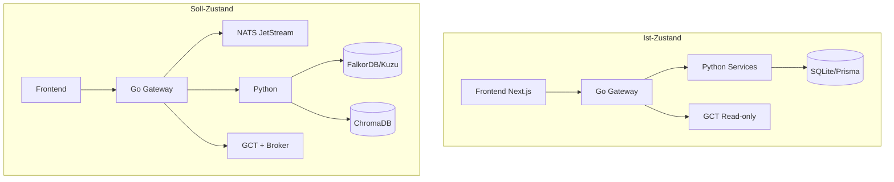

# Aladdin-Insights – Ist-Zustand, Soll-Zustand und Gap-Analyse

> **Archiv (März 2026):** Inhalte auf Root-MDs verteilt. Siehe Master_master, Portfolio-architecture, KG_MERGE, AGENT_ARCHITECTURE, ai_retrieval, INDICATOR_ARCHITECTURE, MEMORY_ARCHITECTURE, Advanced-architecture, GO_GATEWAY, go-gct-gateway-connections, MASTER_ARCHITECTURE_SYNTHESIS, UNIFIED_INGESTION_LAYER, SUPERAPP, FRONTEND_COMPONENTS, Master_master_diff_merge_matrix, README.

> **Stand:** 9. März 2026  
> **Quelle:** Gemini Deep Research – Architektonische und strategische Analyse von Enterprise-Portfolio-Management-Systemen (BlackRock Aladdin)  
> **Ziel:** Präziser Ist-/Soll-Zustand von tradeview-fusion, ausschließlich Open-Source-Stack, klare Gap-Analyse für Aladdin-ähnliche Software.

---

## 0. Präambel

### Scope

- **Produkt:** Retail-/Prosumer-Portfolio-Management und Research-Operating-System, nicht Enterprise-SaaS
- **Referenz:** BlackRock Aladdin verwaltet 21+ Billionen USD; wir übernehmen Prinzipien, nicht den Umfang

### Open-Source-Prinzip

**Alle Komponenten müssen Open Source sein.** Keine proprietären Tools:

- Kein Snowflake, Kafka, eFront, Preqin, Azure-spezifische Dienste
- Statt Kafka: **NATS JetStream** (bereits in [Master_master_architecture_2026_IMPORTANT.md](../Master_master_architecture_2026_IMPORTANT.md) §8.5 erwähnt)
- Statt Snowflake: DuckDB, Apache Iceberg, Delta Lake

### Quellen

- Gemini Deep Research (Aladdin-Analyse)
- [SYSTEM_STATE.md](../specs/SYSTEM_STATE.md) – Source of Truth für Ist/Soll Schichten
- [Portfolio-architecture.md](../Portfolio-architecture.md) – Portfolio-Architektur
- [Master_master_architecture_2026_IMPORTANT.md](../Master_master_architecture_2026_IMPORTANT.md) – normative Zielarchitektur

---

## 1. Ist-Zustand: tradeview-fusion

**Source of Truth für Schichtenzustand:** [SYSTEM_STATE.md](../specs/SYSTEM_STATE.md)

### 1.1 Architektur mit Open-Source-Stack

| Bereich | IST | Open-Source-Stack |
|---------|-----|-------------------|
| **Frontend** | Next.js 16, React 19, BFF | Next.js, React, Tailwind, shadcn/ui (Radix), TanStack Query |
| **Go Gateway** | Control Plane, MarketTarget, SSE | Go, gRPC |
| **Python** | indicator-service, memory-service, soft-signals | FastAPI, numpy, scipy, pandas, polars, hmmlearn, hdbscan, kuzu, chromadb, sentence-transformers |
| **Rust** | PyO3-Bridge | maturin, PyO3, tradeviewfusion-rust-core |
| **Storage** | SQLite/Prisma, JSON-Fallbacks | Prisma, SQLite |
| **GCT** | Read-only Slices, gRPC/JSON-RPC | GoCryptoTrader (OSS) |
| **Streaming** | Go-SSE, Snapshot, Alert-Bausteine | SSE (Go stdlib) |
| **Auth** | Auth.js, RBAC-Scaffolds | next-auth, @simplewebauthn |
| **Portfolio** | Paper (Prisma), GCT getrennt | – |

### 1.2 Portfolio-System

| System | Quelle | Status | Lücke |
|--------|--------|--------|-------|
| **GCT portfolioManager** | Exchange/Wallet Balances | Aktiv | Keine Bridge zum Frontend |
| **GCT Backtester** | Holdings, Risk, Size, Compliance, PNL | Aktiv | Nur im Backtest-Kontext, keine REST API |
| **Frontend Paper Trading** | Prisma, orders-store | Aktiv | Keine Verbindung zu GCT |

### 1.3 Datenfluss

- **Marktdaten:** REST-Polling (`/api/market/quote`, `/api/market/ohlcv`), Provider-Adapter (14+ Quellen)
- **Alerts:** Client-seitige Polling-Auswertung, Persistence in DB
- **Streaming:** ADR-001 vorgeschlagen (ws-ingestor, candle-aggregator, alert-engine) – noch nicht umgesetzt

### 1.4 Lücken im Ist-Zustand

- GCT ↔ Frontend: keine Bridge
- Streaming: ADR-001 nur vorgeschlagen
- NATS JetStream: vorbereitet, nicht dominant
- Graph DB: Kuzu in deps, FalkorDB in [KG_MERGE_AND_OVERLAY_ARCHITECTURE.md](../KG_MERGE_AND_OVERLAY_ARCHITECTURE.md) geplant
- Broker-Adapter: keine
- IBOR/ABOR: keine Trennung

---

## 2. Soll-Zustand: Aladdin-like (nur OSS)

**Prinzip:** Alle Komponenten Open Source. Kein Snowflake, Kafka, eFront, Preqin.

| Aladdin-Fähigkeit | Unser Soll (OSS) |
|-------------------|------------------|
| **Event-Backbone** | NATS JetStream |
| **Common Data Language** | Asset-Klassen, Symbol-Normalisierung, einheitliches Positions-Modell |
| **IBOR/ABOR** | Event-Sourcing-Muster, intent vs. settled |
| **Whole Portfolio** | GCT + Paper + Broker (Alpaca, IBKR) in einem Snapshot |
| **Pre-Trade Compliance** | Regel-Engine vor Order-Ausführung |
| **Graph (KG)** | FalkorDB oder Kuzu |
| **Vector/RAG** | ChromaDB, sentence-transformers, Hybrid-Retrieval |
| **Data Lakehouse** | DuckDB, Apache Iceberg oder Delta Lake (Medallion) |
| **Developer API** | OpenAPI, Codegen (z.B. openapi-generator) |
| **Streaming** | NATS für Ingestion, SSE/WebSocket für Delivery |

---

## 3. Gap-Analyse: Was fehlt (mit OSS-Libs)

Für jede Lücke: konkrete Open-Source-Library oder -Tool.

| Lücke | Beschreibung | Open-Source-Option | Priorität |
|-------|--------------|--------------------|-----------|
| **Event-Backbone** | Async Job-Queue, Replay, Fanout | NATS JetStream | Hoch |
| **GCT Bridge** | Go REST Endpoints, Next.js Proxy | – (eigener Code) | Hoch |
| **Streaming-Architektur** | ws-ingestor, candle-aggregator, alert-engine | gorilla/websocket, SSE (Go stdlib) | Hoch |
| **Broker-Adapter** | Alpaca, IBKR für Multi-Asset | alpaca-trade-api (Python), ib_insync (Python); Go: eigene Clients | Mittel |
| **IBOR/ABOR** | Event-Sourcing für Orders | Eventide, oder eigener Event-Store auf NATS/Postgres | Mittel |
| **Graph DB (KG)** | Canonical Graph, Fast Event Graph | FalkorDB (Redis-kompatibel) oder Kuzu (bereits in deps) | Mittel |
| **Pre-Trade Compliance** | Regel-Engine vor Order | Regeln in Go/Python, evtl. CEL (Common Expression Language) | Mittel |
| **Data Lakehouse** | Bronze/Silver/Gold für Analytics | DuckDB, Apache Iceberg, Delta Lake (OSS) | Niedrig |
| **RAG-Pipeline** | Agent-Portfolio-Berichte | LangChain, LlamaIndex, ChromaDB (bereits) | Niedrig |
| **Developer API/SDK** | OpenAPI, Python-SDK | OpenAPI 3.x, openapi-generator-cli | Niedrig |
| **Drawing Persistence** | Drawing Objects in DB | – (Prisma-Schema erweitern) | Niedrig |
| **Screener/Scanner** | Strategy Presets, Composite Signal | – (auf INDICATOR_ARCHITECTURE aufbauen) | Niedrig |

---

## 4. Architektur-Prinzipien (aus Gemini Research)

| Prinzip | Aladdin-Erkenntnis | Übertrag |
|---------|--------------------|----------|
| **Common Data Language** | Einheitliche Datenmodellierung über Front-, Middle-, Back-Office | Symbol-Normalisierung vorhanden; erweitern auf Asset-Klassen |
| **IBOR vs. ABOR** | IBOR = Echtzeit, ABOR = historisches Hauptbuch | Paper: Snapshot IBOR-ähnlich; fehlt: intent vs. settled bei Live |
| **Event-Driven Architecture** | Kafka als Event-Bus | **NATS JetStream** ersetzt Kafka (Master-Master §8.5) |
| **Single Source of Truth** | Doppelte Buchführung als Basis | Einheitliches Orders-/Positions-Modell; GCT + Paper aggregieren |
| **RAG vs. Fine-Tuning** | RAG für Echtzeit, RBAC | RAG für Agent-Berichte; Fine-Tuning nur für Tonalität |
| **Bounded AI** | Inhaltsfilter, keine unerlaubten Empfehlungen | Agent-Tools an Risk-Tiers (read-only, bounded-write, approval-write) |

---

## 5. Referenz-Matrix: Wo was ergänzen

| Thema | Primär-Doc | Ergänzung |
|-------|------------|-----------|
| Event-Backbone (NATS) | [Master_master_architecture_2026_IMPORTANT.md](../Master_master_architecture_2026_IMPORTANT.md) §8.5 | Bereits erwähnt; ALADDIN verweist darauf |
| GCT Bridge | [Portfolio-architecture.md](../Portfolio-architecture.md) | Phase 1–2; ALADDIN verweist |
| Streaming | [ADR-001-streaming-architecture.md](ADR-001-streaming-architecture.md) | ALADDIN: NATS statt Kafka ergänzen |
| KG/Graph | [KG_MERGE_AND_OVERLAY_ARCHITECTURE.md](../KG_MERGE_AND_OVERLAY_ARCHITECTURE.md) | FalkorDB vs. Kuzu; ALADDIN verweist |
| Broker-Adapter | [Portfolio-architecture.md](../Portfolio-architecture.md) §4.2 | Alpaca, IBKR; ALADDIN verweist |
| RAG/Retrieval | [ai_retrieval_knowledge_infra_full.md](../ai_retrieval_knowledge_infra_full.md) | LangChain/LlamaIndex; ALADDIN verweist |
| Compliance | [AGENT_ARCHITECTURE.md](../AGENT_ARCHITECTURE.md), [SUPERAPP.md](../other_project/SUPERAPP.md) | Pre-Trade Rules; ALADDIN verweist |
| Data Lakehouse | [ARCHITECTURE.md](../specs/ARCHITECTURE.md) | DuckDB/Iceberg/Delta; ALADDIN verweist |
| Developer API | [API_CONTRACTS.md](../specs/API_CONTRACTS.md) | OpenAPI/SDK-Strategie; ALADDIN verweist |
| Ist/Soll Schichten | [SYSTEM_STATE.md](../specs/SYSTEM_STATE.md) | ALADDIN als Aladdin-Vision-Referenz |

---

## 6. Nächste Schritte (priorisiert nach Gap-Analyse)

### Hoch

1. **GCT Bridge** – [Portfolio-architecture.md](../Portfolio-architecture.md) Phase 1–2
2. **Streaming-Architektur** – [ADR-001-streaming-architecture.md](ADR-001-streaming-architecture.md), NATS für Ingestion
3. **Event-Backbone** – NATS JetStream aktivieren ([Master_master_architecture_2026_IMPORTANT.md](../Master_master_architecture_2026_IMPORTANT.md) §8.5)
4. **Common Data Language** – Asset-Klassen, einheitliches Positions-Modell

### Mittel

5. **Broker-Adapter** – Alpaca, IBKR ([Portfolio-architecture.md](../Portfolio-architecture.md) §4.2)
6. **Graph DB** – FalkorDB oder Kuzu ([KG_MERGE_AND_OVERLAY_ARCHITECTURE.md](../KG_MERGE_AND_OVERLAY_ARCHITECTURE.md))
7. **Pre-Trade Compliance** – Regel-Engine ([AGENT_ARCHITECTURE.md](../AGENT_ARCHITECTURE.md))
8. **IBOR/ABOR** – Event-Sourcing bei Live-Trading

### Niedrig

9. **Data Lakehouse** – DuckDB/Iceberg/Delta ([ARCHITECTURE.md](../specs/ARCHITECTURE.md))
10. **RAG-Pipeline** – LangChain/LlamaIndex ([ai_retrieval_knowledge_infra_full.md](../ai_retrieval_knowledge_infra_full.md))
11. **Developer API/SDK** – OpenAPI, openapi-generator ([API_CONTRACTS.md](../specs/API_CONTRACTS.md))
12. **Drawing Persistence** – Prisma-Schema erweitern
13. **Screener/Scanner** – [INDICATOR_ARCHITECTURE.md](../INDICATOR_ARCHITECTURE.md)

---

## 7. Was wir bewusst nicht übernehmen

| Aladdin-Feature | Nicht übernehmen (Begründung) |
|-----------------|-------------------------------|
| Kafka-Enterprise-Scale | **NATS JetStream** ersetzt Kafka (bereits in Master-Master §8.5) |
| Snowflake Data Lakehouse | DuckDB, Apache Iceberg, Delta Lake (OSS) |
| Monte-Carlo mit 100k+ Sims | Erst bei institutionellem Risiko-Management |
| eFront/Preqin für Private Markets | Kein Fokus auf PE/Private Debt |
| Vollständige STP für alle Börsen | Broker-Adapter (Alpaca, IBKR) decken unseren Use Case |

---

## 8. Querverweise

| Thema | Dokument |
|-------|----------|
| Schichtenzustand (IST/SOLL) | [SYSTEM_STATE.md](../specs/SYSTEM_STATE.md) |
| Roadmap | [EXECUTION_PLAN.md](../specs/EXECUTION_PLAN.md) |
| Streaming-Architektur | [ADR-001-streaming-architecture.md](ADR-001-streaming-architecture.md) |
| Portfolio-Architektur | [Portfolio-architecture.md](../Portfolio-architecture.md) |
| KG Merge & Overlay | [KG_MERGE_AND_OVERLAY_ARCHITECTURE.md](../KG_MERGE_AND_OVERLAY_ARCHITECTURE.md) |
| Super-App / Governance | [other_project/SUPERAPP.md](../other_project/SUPERAPP.md) |
| Indikatoren | [INDICATOR_ARCHITECTURE.md](../INDICATOR_ARCHITECTURE.md) |
| Rust-Beschleunigung | [RUST_LANGUAGE_IMPLEMENTATION.md](../RUST_LANGUAGE_IMPLEMENTATION.md) |
| AI Retrieval | [ai_retrieval_knowledge_infra_full.md](../ai_retrieval_knowledge_infra_full.md) |
| API-Contracts | [specs/API_CONTRACTS.md](../specs/API_CONTRACTS.md) |
