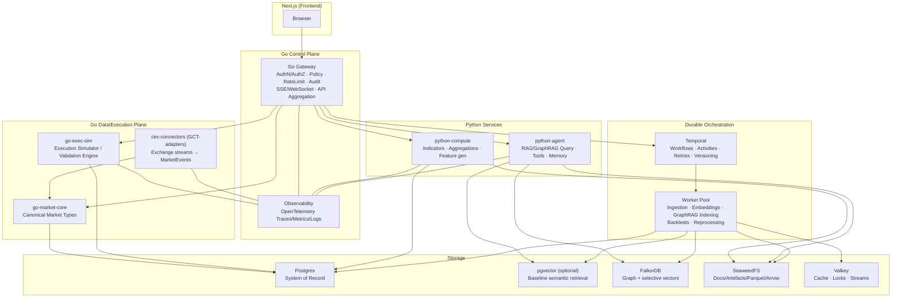

# SOTA-Architektur für dein Trading- und Research-Vorhaben am 14.03.2026

## Leitprinzipien und Zielbild

Dein Vorhaben hat zwei Naturen, die sich gut ergänzen, aber im Betrieb sehr unterschiedliche “Gesetze” haben: **Trading** (tiefe Latenz-/Korrektheitsanforderungen, deterministische Semantik, Risiko- und Compliance-Druck) und **Research** (hoher Durchsatz für Ingestion/Indexing, viel “Offline”-Arbeit, stark variierende Workloads, schnelle Iteration). Der SOTA-Ansatz 2026 ist, diese beiden Naturen nicht in einem einzigen Serverprozess zu vermischen, sondern in **klaren Ebenen** zu modellieren: *Control Plane* (Steuerung/Policy) vs. *Data/Compute Plane* (Berechnung, Retrieval, Pipelines). citeturn7search15turn4search3turn4search11

Ein **Go-Gateway “als Gehirn”** passt sehr gut als *Control Plane*, solange man es nicht zum “Alles-Monolith” werden lässt: API Gateways reduzieren Chattiness, kapseln die Partitionierung der internen Services und können Querschnittsfunktionen wie Auth, Routing und Aggregation zentralisieren. citeturn7search3turn7search15 Gleichzeitig warnen etablierte Architekturen explizit davor, ein Gateway zu einem monolithischen Orchestrator anwachsen zu lassen, der alle Services eng koppelt. Genau diese Gefahr ist real, wenn man “jede Datenbankoperation muss durchs Gateway” dogmatisch durchzieht. citeturn7search15

**Mein North-Star-Zielbild (SOTA 2026) für deinen Stack**:

- **Next.js = Frontend only** (UI/UX, keine Domänen-Wahrheit).
- **Go Gateway = einziges Public Entry + Policy/Steuerung** (Auth, Tenant-Kontext, Rate Limits, Audit, Request-Shaping, Streaming).
- **Go Market/Execution Core = kanonische Markt- und Execution-Semantik** (CEX/DEX/Aktien normalisieren; Execution-Simulator/Validation).
- **Python Compute Service = Indikatoren/Aggregationen/Research-Berechnungen**.
- **Python Agent/RAG Service = Agent-Orchestrierung + Retrieval (RAG/GraphRAG) + Tools** (inkl. Tracing).
- **Indexing/Worker Domain = Ingestion/Embedding/GraphRAG Offline-Pipelines**.
- **Temporal = durable Orchestrierung für lange/fehlertolerante Runs** (Indexing, Backtests, Reprocessing).
- **Postgres + Object Storage + Cache + Graph/Vector** als Polyglot-Persistence – aber mit **klarer Datenhoheit pro Domäne/Service**. citeturn4search3turn7search27turn1search4turn1search1turn3search2

## Go Gateway als Control Plane und “Gehirn”

### Kernverantwortungen des Gateways

SOTA 2026 definiert den Zweck eines Gateways nicht über Technologie, sondern über Grenzen: Es ist die Schicht, die **User-Identität und Rechte** kennt, Requests **validiert**, **policet** und **koordiniert**. Das passt exakt zu Patterns wie *API Gateway* und *Access Token*: Das Gateway authentisiert und gibt den internen Services einen mitgeführten Access Token (z.B. JWT oder interne Service-Tokens) mit, sodass Downstream-Services die Identität/Claims prüfen können. citeturn7search3turn7search19

Das Gateway sollte damit sehr konsequent:
- **AuthN/AuthZ** machen (Tenant, Rollen, Scopes).
- **Observability** durchziehen (Tracing-Korrelation, strukturierte Logs, Metriken).
- **Timeouts/Deadlines** erzwingen (damit “hängende” Requests nicht deine Plattform verstopfen).
- **SSE/WebSocket**/Streaming an den Client terminieren (Trading-UI profitiert massiv davon).
- **Orchestration**: interne Calls koordinieren, aber keine schwere Compute-Arbeit selbst rechnen.

Die Warnung ist wichtig: Gateways werden schnell zum Bottleneck oder zum verkappten Monolithen, wenn sie **(a)** die gesamte Businesslogik ansammeln oder **(b)** als “DB-Fassade” missbraucht werden. Genau davor wird in Gateway-Literatur explizit gewarnt (Bloat/Monolith-Risiko). citeturn7search15

### SOTA Package- und Repo-Struktur in Go

Die Go-Dokumentation empfiehlt für mehrere Programme in einem Repository eine Struktur mit getrennten Verzeichnissen pro Kommando und einer **top-level `internal/`** für gemeinsam genutzte (nicht öffentlich importierbare) Pakete. citeturn2search21turn2search21 Das ist für dich ideal, weil du sehr wahrscheinlich mehrere Go-Binaries haben wirst (Gateway, Exec-Sim, Connector-Worker, eventuell Ingestion-spezifische Tools).

Ein SOTA-Gerüst (als Beispiel) sieht so aus:

```text
repo/
  go.mod

  cmd/
    gateway/
      main.go
    exec-sim/
      main.go
    cex-connectors/
      main.go
    migrate/
      main.go

  api/
    proto/                # .proto Definitions (shared contracts)

  internal/
    gateway/              # HTTP/SSE endpoints, request orchestration
      http/
      middleware/
      handlers/
    auth/                 # JWT, sessions, RBAC, policy
    marketcore/           # canonical domain types (MarketEvent, OrderIntent, Fill, etc.)
    execution/            # routing, risk hooks, simulation glue (thin)
    clients/              # gRPC clients to python services and internal go services
    storage/
      postgres/
      seaweed/
      falkordb/
      valkey/
    observability/        # OpenTelemetry wiring, log correlation
    workflows/            # Temporal client + workflow starters (thin wrappers)
```

Das Ziel ist “**klarer Import-Graph**”: `cmd/*` ist dünn, `internal/*` enthält Implementation. Diese Art Struktur harmoniert auch mit etablierten Style-Guides wie dem (sehr verbreiteten) Uber Go Style Guide, der stark auf Verständlichkeit/Managebarkeit grosser Go-Codebasen abzielt. citeturn2search21turn3search3turn3search11

Zwei Go-Basics, die in deinem Stack besonders wichtig sind:
- **`context.Context`** konsequent: für Cancellation, Deadlines und request-scoped Werte über API-Grenzen hinweg. Das ist für Gateway→gRPC→DB/Storage essenziell. citeturn8search25turn8search5turn8search9
- **Fehler als Werte + sauberes Wrapping**: du willst im Gateway sehr gute Fehlersignaturen und Ketten (für Debugging/Audit). citeturn8search8turn8search12turn8search0

## Schnittstellen zu Python und interne Kommunikationsmuster

### gRPC + Protobuf als Default für Go↔Python

Für dein “Gateway als Gehirn”-Modell ist gRPC als interner Transport sehr passend, weil du damit klare Service-Contracts, Deadlines/Timeouts und verschiedene Streaming-Typen bekommst. gRPC definiert explizit vier RPC-Formen: Unary, Server-Streaming, Client-Streaming und Bidirectional Streaming. citeturn3search0turn3search4 Das ist genau das Set, das du für “Trading UI streamt Updates” und “Compute liefert grosse Resultate” brauchst.

**Protocol Buffers** sind dafür die naheliegende IDL/Wire-Format-Basis: sprachneutral, platformneutral, kompakt, generieren Bindings. citeturn3search1turn3search5

### Arrow Flight für grosse tabellarische Transfers

Wenn du grosse tabellarische Resultsets bewegst (Aggregationen, Feature-Matrizen, Backtest-Timeseries), ist der SOTA 2026-Ansatz oft: **nicht** JSON, sondern entweder:
- **gRPC Streaming** mit chunked/typed Messages oder
- **Arrow/Parquet über Objekt-Storage**.

Für “Data Services” ist **Arrow Flight** explizit als RPC-Framework für Arrow-Daten gebaut und basiert auf gRPC und dem Arrow IPC Format; es arbeitet mit Streams von Record Batches. citeturn4search2turn4search22

**Praktische Konsequenz**:
- “kleine Antworten” (Metadaten, Signale, Parameter): gRPC Unary/Streaming.
- “grosse Tensor-/Tabellenblöcke”: Arrow Flight oder Parquet-Artefakte in SeaweedFS + pointer/manifest via gRPC.

### Dürfen Python-Services direkt mit Stores sprechen?

Hier ist die wichtigste Architekturentscheidung: **Control Plane ≠ Data Plane**. SOTA-Microservices-Prinzipien sagen: ein Service soll “seine” persistenten Daten besitzen und andere Services sollen diese Daten nicht direkt anfassen (*Database per Service / Data Sovereignty*). citeturn7search27turn4search3turn4search39 Das heisst nicht zwingend “separate physische DB pro Service”, sondern: klare **Zuständigkeit/Ownership** (Schema, Migrations, Zugriff).

Für deinen Stack heisst das, sehr konkret:

- **Extern (Browser/Next) → immer via Go Gateway.** Das ist dein Public Entry, hier lebt Auth/Policy. citeturn7search15turn7search3
- **Intern (Service↔Store):**  
  - *Ja*, Python-Services dürfen direkt auf Stores zugreifen, **wenn** es “ihre” Stores sind, und du es sauber absicherst (Netzsegmentierung, dedizierte Credentials, Auditing/Tracing). Das stützt lose Kopplung und verhindert, dass dein Gateway zur DB-Pipeline wird. citeturn7search27turn4search3turn4search11  
  - *Nein*, andere Services sollten nicht “quer” in fremde Stores schreiben/lesen.

Der SOTA-Kompromiss, der gut zu “Gateway als Gehirn” passt, ist:

- Das Gateway ist der **Orchestrator** und der einzige, der den Client-Kontext kennt.
- Die fachlich zuständigen Services sind die **Owner** ihrer Daten/Indices und reden direkt mit den passenden Stores.
- Das Gateway redet mit Services (gRPC), nicht mit deren “internen” Tabellen/Indices.

Für Auth/Identity-Propagation ist das Access-Token-Pattern etabliert: Gateway authentisiert, Services validieren Token/Claims. citeturn7search19

## Storage-Schicht mit Postgres, SeaweedFS, FalkorDB und Valkey

image_group{"layout":"carousel","aspect_ratio":"16:9","query":["SeaweedFS S3 gateway architecture diagram","FalkorDB vector index cypher example","Temporal workflow event history diagram","GraphRAG pipeline diagram community summaries"],"num_per_query":1}

### Postgres und pgvector

Für “System of Record” Daten (User, Konten, Orders, Positionen, Strategies, Konfigurationen, Audit) ist Postgres weiterhin SOTA. Wenn du Vektor-Retrieval nahe an relationalen Daten halten willst, ist **pgvector** ein sehr verbreiteter Ansatz: Vektoren in Postgres speichern, mit ACID/PITR/Joins und den üblichen Postgres-Vorteilen. citeturn3search2turn3search14turn3search22

Die SOTA-Linie 2026 ist: **erst pgvector** (wenn die Daten wirklich eng am relationalen Modell hängen), und erst später separate Vektor-DBs, wenn du Last/Skalierung/Isolation brauchst. Das entspricht der pragmatischen Beobachtung, dass pgvector für viele reale Workloads “genug” ist, weil Embeddings und Metadaten in derselben Transaktion leben können. citeturn3search30turn3search2

### SeaweedFS als Objekt-/Artefakt-Store

SeaweedFS positioniert sich als verteiltes Storage-System für Blobs/Objects/Files/Data-Lake und nennt explizit S3 API/S3 Gateway als Features. citeturn1search4turn1search25 Für dich ist SeaweedFS ideal als:
- Source-of-truth für Rohdokumente (PDF/TeX/HTML),
- Artefaktablage (Parquet, Arrow, Backtest-Outputs),
- Index-Artefakte (Chunk-Exports, Community Summaries).

Technisch ist das S3-Interface auch in Go gut greifbar (es existiert ein `s3api` Package in SeaweedFS). citeturn1search0

Wichtig für Betrieb/Security: In SeaweedFS-Operator-Umgebungen wird IAM als embedded API im S3 Server (im Filer Pod) auf demselben Port wie S3 beschrieben (typisch 8333). citeturn7search2turn1search29 Das ist praktisch, aber du willst dann klare Netzwerkgrenzen (nur interne Netze) und ein sauberes Credential-Modell.

### FalkorDB für Knowledge Graph + selektive Vektoren

FalkorDB-Doku zeigt explizit **Vector Indexing** im Graph-Kontext (“CREATE VECTOR INDEX … OPTIONS {dimension, similarityFunction}”). citeturn1search1turn1search5 Das macht FalkorDB als GraphRAG/Agent-Memory-Store attraktiv, weil du:
- Graph-Traversals (Entitäten/Relationen/Communities) und
- Vektor-Ähnlichkeitssuche
in einer Engine kombinieren kannst.

SOTA 2026 heisst hier aber: **nicht alles doppelt speichern**. Entscheide bewusst:
- Entweder *pgvector* ist dein “Baseline Semantic Retrieval” und FalkorDB ist “Graph-Layer”,
- oder FalkorDB übernimmt sowohl Graph als auch bestimmte Embeddings (z.B. Entitäten/Communities), während Postgres die Business-Domäne hält.

### Valkey als Cache/Streams/Locks

Valkey-Doku ist sehr klar: Pub/Sub Channels sind **nicht persistent**; wenn niemand subscribed ist, ist die Message weg; für persistente Queues soll man Streams verwenden. citeturn0search2turn0search1  
Streams wiederum bieten Consumer Groups mit explizitem Ack (XACK) und Pending Entries List. citeturn0search10turn0search18

Für deinen Stack ist Valkey SOTA für:
- Caching (hot paths, UI snapshots),
- Rate-Limit Counters,
- Locks (kurzlebig),
- leichte Stream-Queues (z.B. “ingest task created”).

Für Security: Valkey hat ACLs, die Command- und Key-Scope einschränken; Auth kann via Username/Passwort oder TLS-Zertifikat erfolgen. citeturn7search5turn7search1

**Faustregel (SOTA):**
- Valkey = schnell/ephemeral + einfache Streams
- Temporal/Kafka/NATS JetStream = ernsthafte durable Orchestrierung / Event Store / Replay

## Durable Orchestrierung mit entity["company","Temporal","durable execution platform"]

Temporal ist nicht “einfach eine Queue”, sondern ein Modell von **durable execution**: Workflows können sehr lange laufen, überleben Crashes und rekonstruieren State über eine persistent gespeicherte Event History. citeturn0search9turn0search21turn0search3 Event History ist append-only, dient als Audit/Debug und hat praktische Limits (z.B. Warnung ab 10’240 Events, harte Termination bei grösseren Grenzen). citeturn0search0

Zentral für SOTA-Design: Workflow-Code muss deterministisch sein (Replay). Temporal-Doku und SDK-Docs betonen Determinismus/Idempotenz und bieten Versioning-Mechanismen, wenn du Workflow-Code änderst. citeturn4search20turn4search0turn4search12 Für lange Ketten nutzt man Muster wie **Continue-As-New**, um eine frische Event History zu starten und State weiterzugeben. citeturn0search24

### Wo Temporal bei dir “den grössten Hebel” hat

Für deine Plattform ist Temporal besonders SOTA in genau diesen Flows:

- **Paperwatcher/Researchwatcher Ingestion Pipelines** (multi-step: fetch → parse → chunk → embed → graph extract → community summaries → index publish): exakt der Fall “lange, fehlertolerante, resumable Prozesse”. citeturn6search10turn1search15turn4search12
- **(Re-)Backtesting / Exec Validation** (lange Läufe, Retry-Semantik, deterministische Wiederaufnahme bei Worker-Ausfällen). citeturn0search9turn4search4
- **Reprocessing/Backfills** (z.B. neue Fee-Modelle, “rebuild indicator caches”) – diese Workflows profitieren von Replay, Retry Policies, Auditbarkeit.

### Verhältnis zu Valkey Streams, Kafka, NATS JetStream

Valkey Streams sind solide, aber bleiben näher an “Queue/Stream” als an “Workflow as Code”. Pub/Sub ist nicht persistent, Streams sind persistent(er) mit Acks/Consumer Groups. citeturn0search2turn0search18  
Wenn du “nur” Tasks ausliefern willst, reichen Streams oft. Wenn du aber echte Workflow-Semantik brauchst (Branching, retries über Stunden/Tage, Activity-Timeouts, State machines, Human approval), ist Temporal SOTA. citeturn0search9turn0search21turn4search20

Als zusätzliche SOTA-Option (falls du später mehr Event-Sourcing/Replay willst):
- **Apache Kafka** beschreibt sich als Event Streaming Plattform, die Streams fault-tolerant und durable speichern kann. citeturn5search9turn5search33
- **NATS JetStream** ist ein Persistence Engine-Konzept, das Messages speichern und später replayen kann; JetStream Consumers können at-least-once liefern. citeturn5search4turn5search0

Für deinen aktuellen Stack ist es sehr plausibel, mit Temporal + Valkey zu starten und Kafka/NATS erst dann zu ziehen, wenn du echte “Event Store”-Anforderungen (Replay über lange Zeit, grosse Fanout-Streams, Integrationslandschaft) bekommst.

## Sinnvolle Einbettung von entity["organization","GoCryptoTrader","go crypto trading framework"] ohne Gateway-Monolith

GoCryptoTrader ist ein mächtiges Framework, aber die Upstream-Signale sind gemischt: Das Repo selbst warnt, es sei “under development” und “not ready for production”. citeturn2search0turn8search19 Zusätzlich markiert pkg.go.dev Backtester/Exchange-Packages als “active development” und weist darauf hin, dass Stabilität erst mit v1 angenommen wird (Stable-Version Indikator). citeturn2search1turn2search15turn2search34

Gleichzeitig ist der Backtester im Projekt explizit **event-driven** und soll historische oder custom data testen. citeturn2search10turn2search0 Das passt gut zu deiner Idee eines **Go Execution Simulators** (Validation Engine) – aber “GoCryptoTrader direkt in den Gateway-Kern kippen” ist der falsche Schnitt.

### SOTA-Muster: Adapter + Extraktion statt “Glue”

Die robuste Einbettung sieht 2026 so aus:

- Baue **deine kanonischen Domänen-Typen** (`MarketEvent`, `OrderIntent`, `Fill`, `FeeModel`, etc.) in `go-marketcore`.
- Baue **Adapter**, die GoCryptoTrader-Exchange/Stream-Modelle in diese kanonischen Typen übersetzen.
- Hoste GoCryptoTrader-basierte Teile als **separaten Go-Service/Binary** (z.B. `cex-connectors` oder `exec-sim`) – Gateway ruft das via gRPC/HTTP an.

Damit vermeidest du zwei Anti-Patterns:
1) “Gateway als grosse Trading-Engine” (Bloat/Monolith-Risiko im Public Entry). citeturn7search15turn7search3  
2) “Vendor Lock-in auf Library-Typen” (wenn überall im Code GoCryptoTrader-Typen durchsickern, wird Ablösung später extrem teuer).

Ein zusätzlich realistischer Grund für die Entkopplung: In GoCryptoTrader gibt es laufend Exchange-spezifische “moving targets” (z.B. Änderungen an Websocket-Endpoints, Rate-Limit Modellen, Fee-Handling). Das zeigt sich u.a. in Issues/Enhancements. citeturn2search27turn8search3 Du willst diese Turbulenz in einem Connector-/Adapter-Service isolieren, nicht im Gateway.

## Paperwatcher und Researchwatcher als Research-Subsystem und reales Trading-Upgrade

entity["company","OpenAI","ai lab, us"] hat 2026 mit Prism sehr sichtbar gemacht, wohin der Trend für Research-Plattformen geht: ein integrierter Workspace für wissenschaftliches Schreiben, der Literatur (z.B. arXiv) im Kontext der Arbeit sucht und einbettet. citeturn6search4turn7search0turn7search12 Das ist relevant für dich, weil du mit Paperwatcher/Researchwatcher einen ähnlichen “Research Mesh” baust – nur stärker auf Ingestion/Clustering/Bayesian RAG und weniger auf LaTeX-Editing.

### Ingestion-Quellen: arXiv und OpenReview

Für arXiv gibt es zwei wichtige Interfaces:
- OAI-PMH als Bulk/Harvesting-Idee; arXiv ist ein registrierter OAI-PMH Data Provider und aktualisiert Metadaten regelmässig (nachts nach neuen Submissions). citeturn1search3turn1search9
- Die arXiv API (Atom XML) für programmatic access/search. citeturn1search6  
arXiv erlaubt Metadaten-Reuse, verlangt aber, dass Full-Text-Links zurück zu arXiv zeigen (Policy). citeturn1search32

OpenReview ist API-seitig zweigleisig: Es gibt API v2 (current) und eine auslaufende API v1; die JSON-Formate unterscheiden sich und v1 wird schrittweise abgebaut. citeturn2search2turn2search20 Für Python existiert ein offizieller Client (`openreview-py`) und die Docs zeigen konkret, wie man einen API v2 Client instanziert. citeturn2search24turn2search32

### RAG/GraphRAG: was ist 2026 wirklich SOTA?

Microsofts GraphRAG wird explizit als **data pipeline und transformation suite** beschrieben: Es extrahiert strukturierte Daten aus unstrukturiertem Text mit LLMs, samt Hierarchien/Community Summaries. citeturn1search15turn6search10turn1search23 In Microsoft Research Blog Posts wird zudem die Trennung von global vs. lokalem Querying weiterentwickelt (z.B. dynamic community selection für global queries). citeturn6search6turn6search23

SOTA-Interpretation für Paperwatcher:
- **Indexing ist offline** (und teuer): extrahiere Entitäten/Relationen, baue Communities, schreibe Summaries, speichere Artefakte in SeaweedFS und strukturierte Indices in FalkorDB/pgvector. citeturn6search10turn1search4turn1search1turn3search2
- **Querying ist online** (und schnell): Agent-Service kombiniert lokale Graph-Expansion mit Vektor-Retrieval; GraphRAG Local Search beschreibt genau diese Kombination von strukturiertem KG-Wissen und unstrukturiertem Text, um Kontext zu augmentieren. citeturn6search35turn6search2

### Bayesian RAG: plausibel, aber gezielt einsetzen

“Bayesian RAG” ist 2026 kein reines Buzzword mehr: es gibt Arbeiten, die retrieval/generation uncertainty-aware machen oder Bayes-Ansätze zur Chunk-Qualitätsprüfung einsetzen. citeturn6search9turn6search1 Für Trading bedeutet das: weniger “schön klingende Halluzinationen” bei Research-Zusammenfassungen und mehr explizite Unsicherheits-/Konfidenzsignale – aber nur dann wertvoll, wenn du diese Unsicherheit im Produkt auch nutzt (z.B. UI-Warnungen, die Strategie-Entscheidungen beeinflussen).

### Gehört der arXiv/OpenReview-Zugriff durchs Go Gateway?

SOTA-Antwort: **nicht zwingend**.

Die bessere Trennung ist:
- Gateway startet/autorisiert Jobs und liefert User-Context (wer darf was sehen).
- Paperwatcher-Ingestion-Worker machen das eigentliche Fetching direkt (mit Rate Limits, Caches, Retries), orchestriert via Temporal.
- Resultate werden als Artefakte + Indices publiziert; Gateway/Agent-Service konsumieren diese.

Das ist konsistent mit “Gateway als Brain”, ohne es als Egress-Proxy für alles zu missbrauchen (sonst wird es wieder ein Monolith). citeturn7search15turn0search9turn4search4turn6search10

### Was ist “reines Research” vs. echter Trading-Mehrwert?

Research-only (gut, aber nicht automatisch Trading-Core):
- Manuskript-Workflows, LaTeX/Prism-like Features, “Paper schreiben im Tool” (kann später kommen). citeturn6search4turn7search12

Direkter Trading-Mehrwert (SOTA für eine Trading Fullstack App):
- Automatisches “Market Regime Research”: Paperwatcher findet neue Papers zu Volatility Modelling, Market Microstructure, Execution, Bayesian Calibration; clustert; liefert strukturierte Hypothesen.
- “Strategy Provenance”: Jede Strategie-Version verbindet sich mit Literaturevidence und Datensätzen (Researchwatcher), inkl. Audit Trail.
- “Risk/Execution Notes”: GraphRAG macht Multi-Hop-Antworten (“Welche Fee-Sensitivitäten wurden in ähnlichen Arbeiten beobachtet?”) statt nur Embedding-Snippets.

Das ist 2026 genau die Art “research-to-production loop”, die in vielen Teams als competitive edge gilt: nicht weil man mehr RAG hat, sondern weil man **reproduzierbare, auditierbare Wissenspfade** in der Entscheidungs- und Entwicklungslogik hat.

## Architekturdiagramm als Text-Blueprint



**Lesart**: Das Gateway ist der einzige Public Entry und der Policy-Knoten. Daten-/Index-Ownership liegt bei den jeweils zuständigen Planes/Services (Compute, Agent, Indexing), orchestriert über Temporal und abgesichert über Token/Policy-Propagation. Das ist die Konfiguration, die am stärksten “SOTA 2026” entspricht, ohne dein System in ein Gateway-Monolith zurückfallen zu lassen. citeturn7search15turn7search27turn0search9turn4search20turn6search10turn1search1turn1search4turn0search1