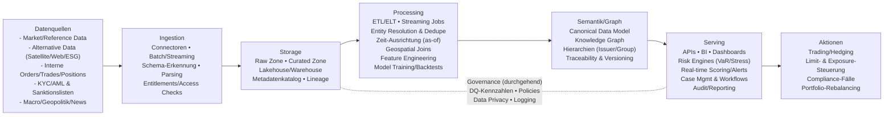

# Datenquellen und Datenfusion in Trading-, Risiko- und Makro-Systemen bei Palantir, BlackRock und J.P. Morgan

## Executive Summary

Grosse Finanz- und Geo-/Tech-Organisationen erzielen ihren Vorsprung selten durch *ein* einzelnes “geheimes” Dataset, sondern durch die Fähigkeit, **heterogene Datenströme (klassische Markt-/Referenzdaten, interne Transaktionsdaten, alternative/geospatiale Daten, regulatorische Listen, unstrukturierte Texte) in eine robuste, auditierbare und operative Entscheidungsmaschine** zu verwandeln. In den öffentlich einsehbaren Quellen der drei angefragten Firmen tauchen dafür wiederkehrende Muster auf: eine **kanonische Daten-/Semantikschicht** (Ontology / “semantic model”), **lineage & fein granulare Zugriffssteuerung**, sowie **automatisierte Normalisierung und Identifikatoren**, damit Risiko- und Investment-Workflows zuverlässig automatisiert werden können. citeturn7view1turn38view0turn19view0turn32view0turn32view1

Bei Palantir liegt der Schwerpunkt erkennbar auf einer Plattformlogik, die **Daten, Logik, Aktionen und Security** in einer Ontologie zusammenführt und damit operative Workflows (inkl. KI-Agenten) direkt an “real-world” Prozesse koppeln soll. Das wird sowohl im Geschäftsbericht als “decision-centric architecture” mit fein granularen Access Controls als auch in der Foundry-Architekturdokumentation (“four-fold integration of data, logic, action, security”) beschrieben; die Patentliteratur unterstreicht insbesondere **Entity Resolution / Deduplikation über Ontologie-Strukturen** als Kerntechnik. citeturn7view1turn38view0turn2search2turn38view3

Bei BlackRock ist öffentlich gut belegt, dass Aladdin als **End-to-end Investment- und Risiko-Plattform** betrieben wird und sich strategisch zu einem **Cloud-/Data-Layer** entwickelt hat: Aladdin Data Cloud wird als Snowflake-gestützte, mandantenfähige Datenablage beschrieben, die vorbeladene Aladdin-Datensätze mit proprietären und Drittanbieter-Daten kombinieren soll, inkl. “pipeline automation” und Normalisierung beim Ingest. In der 10-K-Berichterstattung wird explizit betont, dass Aladdin analytisch auf **Dateninputs Dritter** angewiesen ist und dass Vendor-Management/Controls zentral sind. Zudem ist die mehrjährige Datenintegration mit einem grossen Marktinfrastruktur- und Datenanbieter (Pricing/Reference) öffentlich kommuniziert. citeturn39view0turn39view1turn21view0turn39view3turn19view0

Bei J.P. Morgan sieht man zwei komplementäre Ebenen: (a) **Bank-intern** hochskalierte Risk-/Trading-Plattformen (z.B. “Athena” in einer AWS-Fallstudie) mit klaren Datenpipelines von Market/Positions/Historicals bis zu Risk Schedulers und ML-Inferenz, und (b) **kundenorientierte Datendienste** (Fusion), die explizit **Daten aus mehreren Vendoren und Administratoren ingestieren**, automatische Normalisierung anwenden und dafür sowohl **Graph-Technologie als auch AI/ML** nennen. In einem bankeigenen 10-K wird ausserdem sehr direkt formuliert, dass präzise, zeitgerechte und vollständige Daten u.a. für Risikoexposures, Fraud Detection, Compliance-Programme (inkl. Screening/Monitoring) und regulatorisches Reporting kritisch sind; daneben wird eine dedizierte, unabhängige Model-Risk-Governance-Funktion beschrieben. citeturn27view0turn27view1turn32view1turn24view0turn25view0

Wichtig als methodischer Befund: Was in den Quellen **nicht** auftaucht, sind vollständige, präzise Einkaufslisten aller Datenfeeds (oft NDA-/vertraglich geschützt). Selbst bei sehr transparenten Pressemitteilungen sieht man nur *Ausschnitte* (z.B. ESG-Provider oder Private-Markets-Feeds). Daher muss man strikt unterscheiden zwischen **öffentlich belegten** Daten-/Vendor-Beziehungen und **plausibel typischen** Industriepraxen. citeturn21view0turn24view0turn3search6turn3search16

## Rahmen und Dateninventar

Stellen Sie sich die Datenlandschaft grosser Finanzhäuser wie ein physikalisches “Mehrteilchensystem” vor: Jede Datenquelle ist ein Teilchen mit eigener Zeitauflösung, Messrauschen und Koordinatensystem. Der operative Wert entsteht erst, wenn man diese Teilchen in ein gemeinsames Bezugssystem bringt (Identitäten, Zeitachsen, Einheiten, Rechte). Genau diese “Koordinatentransformation” ist die Domäne skalierter Data-Fusion. citeturn38view0turn32view0turn39view1turn24view2

Im Kern lassen sich die relevanten Informationstypen (öffentlich/proprietär gemischt) in zehn Klassen strukturieren:

Erstens: **Markt- & Referenzdaten** (Preise, Kurven, Volatilitäten, Corporate Actions, Instrumentenstammdaten, Indizes). Diese sind für Trading, VaR/Stress, Pricing und Portfolio Construction fundamental; in grossen Häusern laufen sie in unterschiedlichen Frequenzen (Tick/Second/End-of-Day) und müssen zeitlich konsistent gemacht werden, sonst kollabieren Backtests und Risk Attribution. Dass tägliche Market-Data-Serien und unabhängig erhobene Drittanbieter-Inputs auseinanderlaufen können (z.B. für Price Testing), wird in einem 10-K explizit angesprochen. citeturn24view2turn25view0turn21view0

Zweitens: **Interne Handels-, Positions- und Transaktionsdaten** (Orders, Trades, Positions, Cashflows, Collateral, Limits, Kunden-/Kontenbeziehungen). Diese Daten sind proprietär und meist der “Ground Truth” für Risiko, P&L, Exposure und Compliance. Dass Datenqualität hier direkt Risiko-Reporting, Market-Making-Management und Kundenservices beeinträchtigen kann, wird in der bankeigenen Risikodarstellung ausdrücklich hervorgehoben. citeturn24view0

Drittens: **KYC/AML/Sanktions- und Financial-Crime-Daten**: Identitätsdaten, Beneficial Ownership, PEP-/Sanktionslisten, Transaktionsmonitoring-Alerts, Case-Management-Artefakte, Adverse Media. Diese Daten verknüpfen strukturierte Stammdaten mit stark unstrukturierten Texten (News, Reports) und benötigen besonders robuste Entity Resolution. Für die Rohlisten sind offizielle, regelmässig aktualisierte Datenquellen zentral (z.B. OFAC SLS, EU-Listen, SECO XML). citeturn34search0turn34search5turn34search2turn2search2

Viertens: **Makro- und Politik-/Geopolitik-Signale** (Zinsen, Inflation, Arbeitsmarkt, Zahlungsbilanzen, politische Ereignisse, Sanktionserweiterungen, Konflikteskalationen). Ein Teil davon ist öffentliche Statistik/Policy-Dokumentation, ein Teil wird via News/Text/Geospatial “nowcasted” und als Features in stress- und szenariobasierten Modellen verwendet. Regulatorische und Stabilitätsinstitutionen betonen, dass moderne Überwachung zunehmend hochdimensionale und textbasierte Daten (inkl. LLM-gestützte Extraktion) nutzt. citeturn3search7turn3search19turn3search8

Fünftens: **Alternative/Unstructured Data** (Web-scraped Daten, Social-Media-Signale, Transkripte/Earnings Calls, App/Traffic, Kreditkarten-/Zahlungsindikatoren, Mobility). Surveys zeigen, dass alternative und unstrukturierte Daten in Investmentprozessen breit genutzt werden; gleichzeitig sind Bias, Drift und Datenrechte wiederkehrende Risiken. citeturn3search6turn3search16turn3search19

Sechstens: **Geospatial/Satellite & Physical-Economy-Daten** (Satellitenbilder, AIS/Schiffs- und Flugbewegungen, Night Lights, Wetter/Climate Hazards, Infrastrukturnutzung). Diese Daten sind besonders relevant für Commodity-/Supply-Chain-Makro, Konflikt- und Sanktionsumgehungsanalyse, sowie Klimarisiko. citeturn3search23turn3search16turn3search19

Siebtens: **ESG-, Sustainability- und Klimadaten** (Ratings, Kontroversen, Emissionen, Scope-1/2/3, Lieferketten-Hinweise). Die öffentliche Evidenz zeigt, dass gerade ESG-Daten als “heterogen, inkonsistent, unvollständig” wahrgenommen werden und daher Normalisierung/Identifier-Mapping als Produktmerkmal verkauft wird. citeturn32view0turn3search29turn3search9

Achtens: **Supply-Chain-, Trade- und Private-Markets-Daten** (Zoll/Trade, Lieferanten-, Fund-Admin-, Private-Equity-/Real-Asset-Cashflows). Private Markets sind oft fragmentiert über PDFs und Admin-Feeds; hier wird in öffentlichen Mitteilungen explizit von Standardisierung und algorithmischer Verarbeitung gesprochen. citeturn32view1turn39view4turn5search6

Neuntens: **Graph-/Relationship-Daten** (Ownership, Counterparty Networks, Exposure Graphs). Graphen sind weniger “ein Datentyp” als eine **Fusionsform**: sie sind das Ergebnis von Entity Resolution + Linkage + Semantik. In den Quellen tauchen Graph-/Ontology-Ansätze explizit als technische Grundlage auf. citeturn38view0turn32view1turn2search2

Zehntens: **Operative Metadaten** (Lineage, Quality-Metriken, Versionen, Zugriffsrechte, Entitlements). Ohne diese Metadaten kann ein reguliertes Haus Daten nicht sauber operationalisieren (Audit, Reproduzierbarkeit). Das wird in Plattformdokumentation (Lineage/Markings) und in Risiko-/Vendor-Ausführungen (Controls, Vendor Management) stark betont. citeturn38view2turn38view3turn21view0turn25view0

## Drittanbieter, APIs und Datensätze

Was “verwendet” wird, hängt stark vom Use Case ab. In den öffentlich zugänglichen Quellen sehen wir drei Arten von Drittquellen: **(i)** klassische Markt-/Referenzanbieter, **(ii)** spezialisierte Alternative-/ESG-/Private-Markets-Anbieter, **(iii)** offizielle Listen/Regulatorikdaten (Sanktionen/AML). Die folgende Auswahl kombiniert (a) *in den Quellen explizit genannte* Provider (belegt) und (b) *branchenübliche Beispiele* (typisch), wobei letztere als typische Praxis zu verstehen sind, nicht als firmenspezifischer Einkaufsnachweis. citeturn32view0turn32view1turn39view0turn34search0turn3search6

**Markt-/Referenzdaten & Indizes (typisch; teils belegt):**  
Bloomberg, Refinitiv, IHS Markit, Quandl; ausserdem (belegt) entity["company","London Stock Exchange Group","market data & infra firm"] mit “Pricing and Reference Services” in Integration mit Aladdin sowie entity["company","FTSE Russell","index provider"] als lizenzierter Index-Provider in der BlackRock-Umgebung. citeturn39view3turn39view2turn21view0

**ESG/Sustainability-Daten (belegt via Fusion-Pressemitteilung):**  
Neben Bloomberg (oben) nennt eine Mitteilung explizit die Zusammenarbeit von Fusion mit entity["company","Equileap","gender equality data firm"], entity["company","FactSet","financial data provider"], entity["company","Institutional Shareholder Services","proxy & esg services firm"] (ISS ESG), entity["company","MSCI","index & analytics provider"], entity["company","RepRisk","esg risk analytics firm"], entity["company","Revelio Labs","workforce analytics firm"], entity["company","S&P Global","financial information firm"] sowie entity["company","Sustainalytics","esg ratings firm"]; gleichzeitig wird Normalisierung mit gemeinsamen Identifikatoren als Kernfeature hervorgehoben. citeturn32view0

**Private Markets / Alternatives (belegt):**  
BlackRock integriert entity["company","Preqin","private markets data firm"]-Daten und -Technologie in entity["company","eFront","private markets software platform"] und beschreibt “pre- und post-investment tech” auf einer Plattform, inkl. fund manager due diligence, cashflow modelling und liquidity planning. citeturn39view4turn19view0turn39view3  
Fusion nennt für Private Markets Datenintegration zusätzlich entity["company","Aumni","private capital data platform"], entity["company","Canoe Intelligence","alts data extraction firm"], entity["company","PitchBook","private markets data firm"] und “MSCI Private Capital Solutions” als Referenz-/Ergänzungsdaten; zudem wird algorithmische Korrektur von Diskrepanzen und das Anwenden standardisierter Identifikatoren beschrieben. citeturn32view1

**Sanktionslisten und offizielle Compliance-Daten (belegt):**  
Für Sanktionsscreening sind die Primärquellen selbst entscheidend: entity["organization","Office of Foreign Assets Control","us treasury sanctions office"] bietet einen “Sanctions List Service” (Downloads und API-Dokumentation), die EU stellt konsolidierte Finanzsanktionslisten als offizielle Ressource bereit, und entity["organization","State Secretariat for Economic Affairs","swiss sanctions authority"] publiziert seit Ende 2023 eine XML-Gesamtliste in neuem Format. citeturn34search0turn34search4turn34search5turn34search2

**Satellite/Geospatial/Location (typisch; Beispiele):**  
Planet Labs, Orbital Insight, SafeGraph. (Für diese Klasse gilt praktisch immer: sehr viel Aufwand in Georeferenzierung, Zeitaggregation, Bias-/Coverage-Analysen und rechtlicher Zulässigkeit; Institutionen diskutieren geospatiale Daten u.a. als Baustein für Klima-/Umweltrisiko-Indikatoren.) citeturn3search23turn3search19

**Blockchain/On-chain Analytics (typisch; Beispiel):**  
Chainalysis (v.a. für Krypto-Compliance, Scam-/Sanction-Tracing und risikobasierte Exposure-Analysen). (Welche On-chain-Provider ein konkretes Haus nutzt, ist oft nicht öffentlich.) citeturn3search19turn34search3

## Firmenspezifische Evidenz und beobachtbare Daten-Strategien

Bei Palantir ist öffentlich gut dokumentiert, dass die Plattformen auf **datengetriebene Operationalisierung** zielen: Der 10-K beschreibt Foundry als “data operations platform” (Data Management, Logic Authoring, Ontology, Analytics, Workflow Development) und betont, dass Daten/Analysen/Metadaten mit **fine-grained access controls** gesichert werden, die von Quelldaten zu abgeleiteten Analysen propagieren. Zusätzlich wird AIP als Ebene beschrieben, die “secure connectivity” zu Drittanbieter-LLMs und Governance/Evaluations für AI-Workflows in Produktion liefert. citeturn7view0turn7view1  
Die Foundry-Dokumentation ergänzt das Bild technisch: Data Integration umfasst Batch/Micro-batch/Streaming, integrierte Lineage und die Fähigkeit, “third-party compute runtimes” in einem Build-Framework zu mischen; Lineage wird als interaktives Tool für Pipeline-Transparenz dargestellt. Sicherheit wird u.a. über “Markings” illustriert, die entlang der Lineage propagieren und simuliert werden können, bevor man sie scharf schaltet (ein sehr praxisnahes Muster für regulated environments). citeturn38view1turn38view2turn38view3  
Für Finanzkriminalität gibt es zudem konkrete, produktnahe Beschreibungen: Foundry for AML wird als KYC-/Risk-Scoring-Ansatz mit integrierten Profilen, ML-Risikoscores und Real-time Re-Scoring bei Daten- oder Transaktionsänderungen beschrieben (inkl. “delegate-to-analyst” Mechanik, wenn die Automatisierung nicht entscheiden kann). citeturn35search1

Bei BlackRock ist das öffentlich sichtbare Bild zweigeteilt: (a) Aladdin als integrierte Investment-/Risk-/Ops-Plattform und (b) **aktives “Opening” der Daten- und Ökosystemschnittstellen**. In der 10-K-Darstellung wird Aladdin als SaaS “end-to-end” Plattform positioniert und eFront als Akquisitions-/Integrationsbaustein beschrieben; zudem wird ausdrücklich gesagt, dass BlackRock Aladdin “öffnet” und Connectivity zu “ecosystem providers and third-party technology solutions” (inkl. Trading Systems) schafft, um end-to-end Workflows zu ermöglichen. citeturn19view0  
Der Schritt zur skalierbaren Datenfusion ist bei Aladdin Data Cloud sehr konkret formuliert: Jede Kundin erhält einen unabhängigen, zentral verwalteten Datenspeicher mit vorbeladenen “front-to-back” Aladdin-Datasets, die mit proprietären und Drittanbieter-Daten ergänzt werden können; Aladdin Data Cloud wird als Snowflake-gestützt und auf Governance/Security ausgerichtet beschrieben. Die Produktseite betont zusätzlich “pipeline automation”, sowie Normalisierung und Mapping bereits beim Ingest. citeturn39view0turn39view1  
Bemerkenswert offen ist die Risikoformulierung in der 10-K: Aladdins analytische Fähigkeiten hängen explizit von Drittparteien ab, die Daten/Informationen als Inputs liefern; gleichzeitig wird Vendor Management als Control-Mechanik genannt (mit dem klaren Hinweis, dass Effektivität nicht garantiert werden kann). Das ist praktisch eine “öffentliche Blaupause”, *warum* Data Governance so zentral ist. citeturn21view0

Bei J.P. Morgan findet man öffentlich eine sehr greifbare “End-to-end”-Beschreibung der Datenoperationalisierung: Im 10-K wird erläutert, dass die Firma auf akkurate, zeitgerechte und vollständige Daten angewiesen ist, u.a. für Risikoexposures/Limits, Fraud/Cyber Detection, Modell- und Schätzverfahren, Compliance-Programme sowie regulatorische und finanzielle Berichte; Datenmängel werden als Risiko für risk reporting, transaction monitoring und customer screening adressiert. citeturn24view0turn25view0  
Auf der Modellseite beschreibt der 10-K eine dedizierte unabhängige Funktion (“Model Risk Governance and Review”) mit Review/Approval von neuen und geänderten Modellen vor Einsatz; zudem wird explizit erwähnt, dass Modelle auch ML/AI-Techniken umfassen können und für Kapital, Stress, Allowance for Credit Losses und Business Decisions genutzt werden. citeturn25view0  
Als konkrete Data-Fusion-Produktebene zeigt Fusion in Pressemitteilungen sehr spezifische Mechaniken: Für ESG wird Normalisierung über Provider hinweg, Enrichment mit common identifiers, Hierarchie-Propagation und scheduled screening genannt. Für Private Markets wird beschrieben: ingest aus J.P. Morgan Securities Services und Portfolio Administratoren, Ergänzung durch Referenzdaten von Vendoren, automatische Korrektur von Diskrepanzen durch proprietäre AI/ML, Standard-Identifier-Anwendung sowie ein “linked data model” für Public/Private Interoperabilität; zusätzlich werden Graph-Technologie und AI/ML als Kern hervorgehoben. citeturn32view0turn32view1  
Eine AWS-Fallstudie zeichnet parallel die bankinterne Skalierung nach (“Athena”): Datenpipeline aus “Market Data”, “Client Positions”, historischen Portfolios/Marktdaten/Resultaten, Notebook/ETL Grid, ML Training & Inference und Risk Scheduler bis Risk Results; die Architektur zeigt Cloud-Scale-Komponenten und Hybrid-Anbindung (On-prem Scheduler, Cloud Control Plane, Autoscaling). citeturn27view0turn27view1turn26view0

## Technische Methoden zur Aggregation, Fusion und Operationalisierung

Eine robuste Fusion-Pipeline muss (wie in der Experimentalphysik) drei Dinge gleichzeitig leisten: **(i) Kalibrierung** (Semantik/Einheiten/IDs), **(ii) Synchronisation** (Zeit/Versionen), **(iii) Kontrollierbarkeit** (Security/Audit). Die öffentlich beschriebenen Plattformmerkmale lassen sich entlang dieser Achsen strukturieren. citeturn38view1turn39view1turn32view1turn21view0

**Ingestion- und ETL/ELT-Schicht:**  
In den Quellen sehen wir sowohl klassische ETL/ELT-Motive als auch eine Ausweitung zu Streaming- und “mixed runtimes”. Foundry beschreibt explizit Batch/Micro-batch/Streaming und ein compute-agnostisches Build-System, das Drittanbieter-Runtimes integrieren kann; Aladdin Data Cloud nennt Normalisierung/Mapping bereits beim Ingest; Fusion beschreibt ingest aus mehreren Administratoren/Vendoren samt automatischer Korrektur. citeturn38view1turn39view1turn32view1

**Semantikschicht: Ontology/Semantic Model als “Bezugssystem”:**  
Palantir formuliert Ontology als Herzstück, das nicht nur Daten, sondern Entscheidungen modelliert: Objekte (“nouns”), Aktionen (“verbs”), Logik und Security werden integriert; zudem wird eine Architektur genannt, die sowohl high-scale SQL queries als auch real-time subscription und Change Data Capture (CDC) unterstützen soll. Fusion verwendet in der Produktkommunikation ebenfalls die Sprache eines “linked data model” und einer gemeinsamen semantischen Modellierung für Normalisierung. citeturn38view0turn32view1turn38view1

**Entity Resolution, Deduplikation und Record Linkage:**  
In regulierten Workflows (KYC/AML, Customer Screening, Counterparty Risk, Supply Chains) ist die Identitätsauflösung zentral. Palantirs Patentliteratur beschreibt explizit Entity Resolution über Ontology-Strukturen, inkl. Deduplikation, provenance tracking und Update-Handling; Foundry for AML spricht inhaltlich von integrierten Kundenprofilen und risikobasierter Automatisierung, die bei Unsicherheit an Analytiker eskaliert. citeturn2search2turn35search1turn38view0

**Zeitliche Ausrichtung und Versionierung:**  
Market Data, alternative Daten und interne Books bewegen sich auf verschiedenen Zeitgittern. Daher braucht man Versionen, Rebuilds und klare “as-of” Semantik. Palantir betont “full lineage of data versions” und Data Lineage als Tool, um Schema/Build-Zeit/Code zu inspizieren; in Bank-Risikoberichten wird zudem klar, dass unterschiedliche Datenquellen (tägliche Marktserien vs unabhängige Drittquellen) zu abweichenden Zeitreihen und damit Modellresultaten führen können. citeturn38view1turn38view2turn24view2

**Streaming, Real-time Scoring und Workflow-Loop:**  
Ein entscheidender Schritt zur Operationalisierung ist der “Read-Write Loop”: Erkenntnisse müssen in operative Systeme zurückfliessen (Case Management, Hedging, Rebalancing, Alerts). Palantirs Ontology-Dokumentation beschreibt genau diese read-write Schleifen und atomare Updates; Foundry for AML nennt Real-time Risikore-Scoring basierend auf Daten- und Transaktionsänderungen; das Athena-Beispiel zeigt einen Risk Scheduler, der Market State/Risk Models zu Risk Results orchestriert. citeturn38view0turn35search1turn27view0

**Governance: Lineage, Access Control, Vendor Controls, Quality-Metriken:**  
Governance ist nicht “Papier”, sondern ein technisches System: Palantir zeigt Markings, die entlang Lineage propagieren und simuliert werden; BlackRock betont Vendor Management und Abhängigkeit von Dritt-Dateninputs; J.P. Morgan betont Data-Management-Prozesse als Voraussetzung für risk/compliance/reporting. Auf EU-Ebene wird Data Governance als strategisches Ziel für Aufsichtsdatenplattformen explizit beschrieben, inkl. Katalogisierung und Governance-Frameworks. citeturn38view3turn21view0turn24view0turn3search9

## Architekturpatterns und operative Werkzeuge

Die “Standardform” grosser Finanzdatenarchitekturen ist heute meist eine **Lakehouse-/Warehouse-Kombination**, ergänzt durch Event-/Streaming-Schichten, eine Semantik-/Graph-Schicht sowie ML/MLOps für Scoring, Monitoring und Drift-Handling. Was in den Quellen auffällt: alle drei Akteure betonen *nicht* nur Storage/Compute, sondern die zusätzliche Ebene aus **Normalisierung, Semantik, Governance und operativer Integration**. citeturn39view1turn38view0turn32view1turn27view1

Konzeptionell lassen sich (von links nach rechts) fünf Zonen unterscheiden:

**Quellenzone:** Market/Reference, Alternative/Geospatial, interne Books/Payments, KYC/AML, regulatorische Listen. Offizielle Sanktionslisten werden zunehmend als maschinenlesbare Downloads/APIs angeboten (OFAC, EU, Schweiz). citeturn34search0turn34search5turn34search2

**Ingestionzone:** Connectoren, Batch/Streaming, Normalisierung und ID-Mapping. Foundry und Aladdin Data Cloud betonen Normalisierung und Mapping beim Ingest; Fusion nennt explizit Standard-Identifier und automatische Korrektur. citeturn38view1turn39view1turn32view1

**Storagezone:** Data Lake/Warehouse, getrennte “raw/curated/serving” Bereiche, plus Metadatenkatalog/Lineage. Ein Kernpunkt ist, dass Security/Access Controls und Lineage nicht nachträglich “drangeklebt” werden, sondern Plattformfunktion sind. citeturn38view2turn38view3turn21view0

**Processingzone:** Batch/Streaming Compute (z.B. Spark/Flink), Feature Engineering, Entity Resolution/Graph Build, Modelltraining, Backtesting, Stress- und Szenario-Rechnung. Die AWS-Athena-Darstellung zeigt eine Pipeline aus historischen Daten, ETL Grid, ML Training/Inference und Risk Scheduler als Operationalisierungsmuster. citeturn27view0turn27view2turn25view0

**Servingzone:** APIs, BI/Apps, Risk Dashboards, Alerting, Case Management, Trade-/Hedge-Vorschläge, Compliance Reporting. Fusion beschreibt Data Mesh/Drive, um Daten direkt in BI/Desk-Tools zu bringen; Palantir beschreibt read-write Workflows via Ontology; BlackRock betont Connectivity zu Ökosystem-Providern inkl. Trading Systems. citeturn32view1turn38view0turn19view0

## Organisation, Compliance und Risiken

Ein zentrales Organisationsmuster ist die Trennung von **domänennaher Entwicklung** (Trading/Risk/Compliance-Teams, die Modelle und Regeln bauen) und **unabhängiger Kontrolle** (Model Risk, Data Governance, Audit). In einem 10-K wird beispielsweise eine dedizierte unabhängige Model-Risk-Governance-Funktion beschrieben, die Modelle vor Einsatz prüft und genehmigt; gleichzeitig wird betont, dass Modelle auch ML/AI umfassen können und für zentrale Kapital-/Stress-/Accounting-Schätzungen genutzt werden. citeturn25view0

Regulatorisch/aufsichtlich steigen die Erwartungen an AI-/Data-Risk-Management: Internationale Gremien heben u.a. Modellrisiken, Datenabhängigkeiten, Drittparteirisiken und Governance-Fragen in Bezug auf AI hervor; IOSCO diskutiert AI in Capital Markets explizit als Feld mit neuen Risiken und Herausforderungen. Aus europäischer Perspektive zeigt sich zudem, dass AI-Investitionen stark bei grossen Firmen konzentriert sind, was systemische Konzentrations- und Abhängigkeitsfragen verstärken kann. citeturn3search19turn3search8turn3search13

Datenschutz und “privacy-preserving” Techniken sind bei diesen Datenlandschaften nicht optional, weil viele Daten direkt oder indirekt personenbezogen sind (KYC, Payments, Kommunikationsdaten, Standortdaten). Grundprinzipien wie Zweckbindung, Datenminimierung und Integrität/Vertraulichkeit sind rechtlich verankert (GDPR Art. 5; Schweizer DSG/FADP). Technisch werden als Werkzeuge u.a. Differential Privacy (NIST-Leitlinie) und Federated-Learning-/PET-Ansätze diskutiert, wobei NIST auch auf Privacy Attacks und Grenzen von “FL allein” hinweist. citeturn33search2turn33search1turn33search3turn33search7

Für KYC/AML ist zusätzlich wichtig, dass die “Ground Truth”-Listenmasse offizielle, regelmässig aktualisierte Quellen haben und dass die Pipeline Updates, Versionierung und nachvollziehbare Screenings unterstützt (Audit Trail). Dass Sanktionslisten als maschinenlesbare, aktualisierte Feeds verfügbar sind, ist für Automation entscheidend (OFAC, EU, SECO). citeturn34search0turn34search5turn34search2

Risiken und Limitierungen lassen sich in sieben Hauptklassen bündeln:

Datenqualitätsrisiken (inhomogene Coverage, fehlende IDs, Drift), Modellrisiken (Overfitting, Regimewechsel, “proxy”-Inputs), Drittparteirisiken (Ausfall/Entitlement-Änderungen), Cyber-/Insider-Risiken, rechtliche Risiken (IP/Data Rights, Datenschutz), ethische Risiken (Bias/Disparate Impact, Überwachung), sowie Governance-Risiken (fehlende Lineage, unklare Verantwortlichkeiten). Bemerkenswert ist, dass BlackRock diese Abhängigkeit von Drittparteien für Aladdin sehr explizit als Operations-Risiko beschreibt, inklusive Vendor-Management-Programm, aber ohne Garantie der Wirksamkeit. citeturn21view0turn3search19turn3search8turn38view3

## Vergleich, Fallbeispiele und weiterführende Quellen

| Organisation | Belegte Daten-/Provider-Beispiele | Belegte Fusionsmechaniken | Primäre Finance-Use-Cases (öffentlich sichtbar) | Grenzen der Offenlegung |
|---|---|---|---|---|
| Palantir | KYC/AML-Workflows als Produktnarrativ (integrierte Profile, Transaktionsüberwachung) | Ontology als Entscheidungs-/Semantikschicht; Data Lineage/Markings; Entity Resolution als patentiertes Kernproblemfeld | Compliance/Financial Crime, Risiko- und operative Entscheidungsworkflows | Kaum öffentliche, vollständige Listen konkreter Datenvendoren; Plattform ist oft “Bring your own data” |
| BlackRock (Aladdin) | Snowflake-basierte Data Cloud; Pricing/Reference-Integration via entity["company","London Stock Exchange Group","market data & infra firm"]; Private Markets via entity["company","Preqin","private markets data firm"] + entity["company","eFront","private markets software platform"] | Mandantenfähiger Data Store mit vorbeladenen Aladdin-Datasets + Dritt-/proprietäre Daten; Normalisierung/Mapping beim Ingest; Vendor Controls als explizite Abhängigkeit | Portfolio-/Risk-/Ops-Plattform, Whole-Portfolio (public+private), Data-as-a-platform | Einzelne Provider öffentlich, aber Detailtiefe zu internen Datenfeeds/Modellen begrenzt |
| J.P. Morgan | Fusion ESG: entity["company","Equileap","gender equality data firm"], entity["company","FactSet","financial data provider"], entity["company","Institutional Shareholder Services","proxy & esg services firm"], entity["company","MSCI","index & analytics provider"], entity["company","RepRisk","esg risk analytics firm"], entity["company","Revelio Labs","workforce analytics firm"], entity["company","S&P Global","financial information firm"], entity["company","Sustainalytics","esg ratings firm"]; Private Markets: entity["company","Aumni","private capital data platform"], entity["company","Canoe Intelligence","alts data extraction firm"], entity["company","PitchBook","private markets data firm"] | Normalisierung + common identifiers; Multi-hierarchy; Graph-Technologie + AI/ML für Korrektur/Linkage; bankinterne Model-Risk-Governance und Data-Management-Kritikalität explizit | Securities Services Datenprodukte, Risk/Analytics, Private Markets Transparenz, ESG Normalisierung; bankintern skalierte Risk/ML-Pipelines (Athena) | Vollständige Vendor- und Datenfeed-Landschaft nicht öffentlich; interne Plattformdetails nur ausschnittweise |

Quellenbasis für die Tabelle: Palantir 10-K und Foundry-Dokumentation sowie Patentliteratur; BlackRock 10-K, Aladdin Data Cloud / LSEG-Mitteilungen und Private-Markets-Integration; J.P. Morgan 10-K sowie Business-Wire-Mitteilungen und AWS-Fallstudie zu Athena. citeturn7view1turn38view0turn2search2turn19view0turn21view0turn39view0turn39view3turn39view4turn25view0turn32view0turn32view1turn27view1

**Beobachtbare Fallbeispiele (kurz):**  
Ein Beispiel für die “Kosten der Heterogenität” ist ESG: Fusion beschreibt explizit, dass Daten inkonsistent/unvollständig sein können und verkauft Normalisierung + Identifier + Hierarchiepropagation + automatisierte Screens als Lösung. citeturn32view0  
Ein zweites Beispiel ist Private Markets: Fusion beschreibt ingest aus mehreren Administratoren, Ergänzung durch Referenzdaten, automatische Diskrepanzkorrektur via AI/ML und ein verlinktes Datenmodell für public/private Transparenz. citeturn32view1  
Ein drittes Beispiel ist die Kombination aus Plattform + Governance: BlackRock beschreibt Aladdin als abhängig von Dritt-Dateninputs und betont Vendor Controls; Palantir zeigt technisch, wie Security-Markings über Lineage propagieren und vorab simuliert werden können – beides adressiert Auditierbarkeit in regulierten Umgebungen. citeturn21view0turn38view3

**Weiterführende, besonders belastbare Lektüre (Auswahl):**  
Für Alternative/Unstructured Data und praktische Risiken: CFA Institute Report zu Unstructured Data/AI (inkl. Nutzungszahlen). citeturn3search6  
Für systemische AI-Risiken und Governance in Finanzmärkten: FSB-Report zu AI in Finance sowie IOSCO-Report zu AI in Capital Markets. citeturn3search19turn3search8  
Für europäische Perspektive auf AI-Adoption und Konzentrationseffekte: ESMA Risk Analysis zu AI adoption in securities markets. citeturn3search13  
Für AML/Screening-Grundlagen und die Rolle offizieller Listen: OFAC Sanctions List Service, EU-Sanktionsressourcen, SECO XML-Sanktionslistenformat sowie FATF-Standards. citeturn34search0turn34search5turn34search2turn34search3  
Für Privacy Engineering / PETs: NIST SP 800-226 (Differential Privacy) und NIST-Hinweise zu Privacy Attacks im Federated Learning. citeturn33search3turn33search7