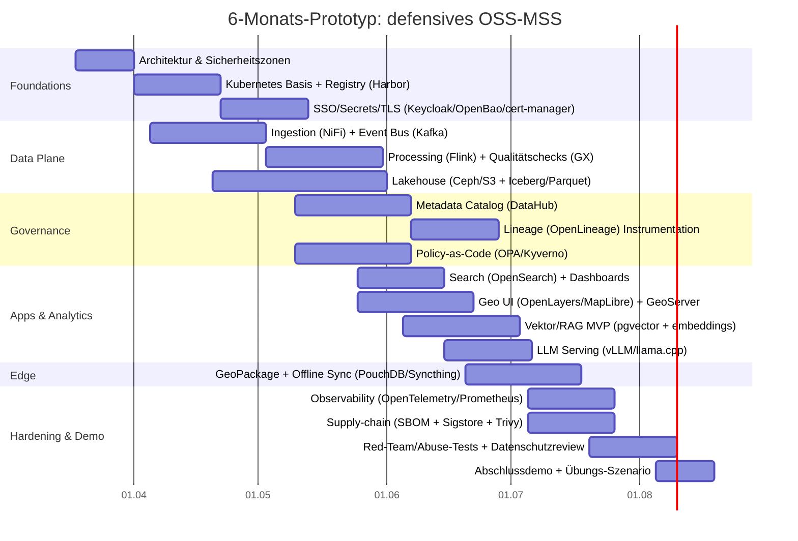

# Deep_research_addition_palantir

> **Archiviert:** 17. Maerz 2026
> **Status:** Root stub
> **Archivdatei:** `docs/archive/Deep_research_addition_palantir.md`
> **Extrakte uebernommen in:**
> - `docs/ARCHITECTURE_NEW_EXTENSION.md`
> - `docs/DATA_AGGREGATION_Master.md`

---

# Open-Source-Bausteine für ein defensives Maven‑ähnliches Smart System

## Executive Summary

Ein „Maven‑ähnliches“ Smart System lässt sich als **offene, integrierbare Daten‑ und Analyseplattform** verstehen, die heterogene Datenquellen (Geodaten, Lageberichte, Sensordaten, Logistikdaten, Dokumente) in eine gemeinsame Sicht („Common Operating Picture“) überführt, dort durchsuchbar macht, semantisch verknüpft (Knowledge Graph) und analytisch/ML‑gestützt auswertet – mit strikter Governance, Auditierbarkeit und Sicherheitszonen. Dieses Architekturprinzip wird im MSS‑Blogpost explizit als **„open, extensible architecture“** mit **Integration von Drittanbieter‑Lösungen** betont. citeturn39search0

Für eine **nicht‑offensive, defensive/analytische Variante** (z. B. zivile/koalitionäre Katastrophenhilfe, Trainings‑/Übungsbetrieb, Resilienz‑ und Lageanalyse) kann man ein leistungsfähiges System vollständig aus **freien/OSS‑Komponenten** bauen. Kernelemente sind: (a) zuverlässige Ingestion & Streaming, (b) ein Lakehouse‑Speicher mit Metadaten/Lineage/Qualität, (c) geospatial‑fähige Dienste und Viewer, (d) Such‑ & Vektor‑Retrieval, (e) Ontologien/Standards (W3C/OGC/OASIS‑Artefakte), (f) ML/LLM‑Serving on‑prem/edge, (g) „Policy‑as‑Code“ + Supply‑Chain‑Security, und (h) Edge/offline‑Synchronisation.

## Annahmen und Abgrenzung

Ausgangslage ist der aktuelle Blogpost von entity["company","Palantir","us software firm"] zum „Maven Smart System (MSS)“, der eine **offene und erweiterbare Architektur** sowie die **Integration mit Drittanbietern** hervorhebt. citeturn39search0

**Annahmen (vom Nutzer vorgegeben/impliziert):**
- Zielkontext: **koalitionäre zivil‑militärische Katastrophenhilfe** (z. B. Hochwasser, Waldbrand, Erdbeben), **humanitäre Logistik**, **Training/Übungen**, Lage‑/Risikoanalyse.
- Budget: **unbekannt → bevorzugt low‑cost OSS**, wo möglich Cloud‑agnostisch und on‑prem‑fähig.
- Region: **EU‑Rechtsraum** → Datenschutz nach **GDPR/DSGVO** als maßgeblicher Rahmen. citeturn40search1turn40search2

**Abgrenzung / Sicherheitsleitplanken (wichtig):**
- Ich liefere **keine** Anleitung zur Offensiv‑Nutzung, Zielauswahl, Waffenwirkung, autonomer/letal‑kritischer Entscheidungsautomation oder „war planning“.  
- Einige Bausteine (z. B. Motion‑Imagery‑Metadaten‑Parser, bestimmte Sensor‑/Video‑Standards, leistungsfähige GEO‑Fusion und CV‑Modelle) sind **Dual‑Use**. Ich markiere sie als solche und bespreche sie **nur** im Kontext legitimer defensiver/analytischer Anwendungen (z. B. Schadenserkundung, Evakuierungsplanung, Versorgungsketten). citeturn33search1turn34search5turn33search6

## Referenzarchitektur eines defensiven MSS

### Architekturidee in einem Satz

Ein defensives MSS ist ein **mehrzonenfähiger Daten‑ und Analyseverbund**, der Daten **sicher ingestiert**, **standardisiert**, **versioniert** (Lakehouse), **auffindbar** macht (Search + Graph), **qualitäts‑ und governance‑gesichert** verwaltet (Katalog/Lineage/Policy), **analytisch/ML‑gestützt** auswertet und **auch bei Netzstörungen** mit Edge‑Knoten weiterarbeitet (offline sync).

### Kernprinzipien, abgeleitet aus MSS‑Charakteristika

Der MSS‑Blogpost betont insbesondere (i) **offen/erweiterbar**, (ii) **Integration von Drittanbieter‑Lösungen**, (iii) schnelle Kombination neuer Technologien. citeturn39search0  
In einer OSS‑Variante werden diese Prinzipien typischerweise umgesetzt über: **standardisierte APIs** (OGC APIs, REST/GRPC), **Event‑Streaming**, **containerisierte Deployments**, **Policy‑as‑Code** und **austauschbare Analysekomponenten**.

### Referenz‑Datenfluss und Sicherheitszonen (Mermaid)

```mermaid
flowchart LR
  %% Security Zones
  subgraph Z1["Zone 1: Public/Partner Ingress (DMZ)"]
    S1[Open Data Quellen\n(Copernicus, OSM, GDACS, HDX)]
    S2[Partner Feeds\n(Sensor/IoT, Lageberichte, CSV/JSON)]
    IN[Ingestion Gateway\n(NiFi/HTTP/S3/FTP)]
  end

  subgraph Z2["Zone 2: Processing & Governance"]
    BUS[Event Bus\n(Kafka/Pulsar/NATS)]
    SP[Stream/Bulk Processing\n(Flink + dbt/Spark optional)]
    DQ[Data Quality\n(Great Expectations)]
    LIN[Lineage/Provenance\n(OpenLineage)]
    CAT[Metadata Catalog\n(DataHub)]
    POL[Policy-as-Code\n(OPA/Kyverno)]
  end

  subgraph Z3["Zone 3: Trusted Data Stores"]
    OLTP[(PostgreSQL/PostGIS)]
    OBJ[(Object Storage\n(Ceph / S3-compatible))]
    LKH[(Lakehouse Tables\n(Iceberg + Parquet))]
    SRCH[(Search/Analytics\n(OpenSearch))]
    KG[(Knowledge Graph\n(RDF triple store via Jena/Fuseki))]
    VDB[(Vector Store\n(pgvector/Qdrant/Milvus))]
  end

  subgraph Z4["Zone 4: Analytics & Applications"]
    UI[Web UI / Map UI\n(OpenLayers/MapLibre/Cesium)]
    BI[Dashboards\n(Superset)]
    WF[Workflow\n(Airflow/Argo Workflows/Node-RED)]
    AI[ML/LLM Serving\n(KServe + vLLM/llama.cpp)]
  end

  subgraph Z5["Zone 5: Edge/Offline Nodes"]
    EDGE[K3s Edge Cluster\n(Local cache + inference)]
    SYNC[Offline Sync\n(CouchDB/PouchDB, Syncthing, DTN optional)]
  end

  %% Flows
  S1 --> IN
  S2 --> IN
  IN --> BUS
  BUS --> SP
  SP --> DQ --> OBJ
  SP --> OLTP
  OBJ --> LKH
  LKH --> SRCH
  LKH --> KG
  LKH --> VDB
  CAT <--> LKH
  LIN --> CAT
  POL --> Z2
  SRCH --> UI
  KG --> UI
  VDB --> AI --> UI
  WF --> SP
  EDGE <--> SYNC
  EDGE --> UI
  EDGE --> AI
  SYNC <--> OBJ
```

**Interpretation:**  
- **Zone 1** ist bewusst „schmutzig“: nur kontrollierte Protokolle, Viren‑/SBOM‑/Signaturprüfungen und DLP‑Checks, bevor Daten „rein“ dürfen.  
- **Zone 2** ist die Transformations‑ und Governance‑Zone: hier entstehen normalisierte Events, Qualitätsreports, Lineage‑Events, Policy‑Entscheide.  
- **Zone 3** ist die Daten‑Zone: getrennte Speicher für OLTP (PostGIS), Lakehouse (Iceberg/Parquet), Search/Analytics (OpenSearch), Graph (RDF) und Vektoren.  
- **Zone 4** ist die Nutzer‑Zone: Karten‑UI, Dashboards, Workflows und ML/LLM‑Dienste.  
- **Zone 5** ist „degraded mode“: Edge‑Knoten arbeiten mit Teil‑Daten, synchronisieren später.

## Open-Source-Stacks nach Funktionsbereich

Die folgenden Tabellen sind **kuratiert** (nicht vollständig), mit Fokus auf: OSI‑kompatible Lizenzen **wo möglich**, On‑Prem/Edge‑Tauglichkeit, aktive Communities und klare Integrationspfade.

### Ingestion, Streaming und Telemetrie

| Projekt | Repo/Docs | Lizenz | Reifegrad | Kurzbeschreibung | Key Features | Integration Notes |
|---|---|---|---|---|---|---|
| Apache NiFi | `https://nifi.apache.org/` | Apache‑2.0 citeturn1search3 | hoch | Flow‑basierte Dateningestion & Routing | visuelle Flows; viele Connectoren; Backpressure | Typisch „Ingress‑Orchestrator“ in DMZ; publish nach Kafka/Pulsar |
| Apache Kafka | `https://kafka.apache.org/` | Apache‑2.0 citeturn3search0 | hoch | Distributed Event Streaming | durable Topics; Consumer Groups; große Ökosysteme | „System‑Backbone“ für Ereignisse/Commands; gut mit Flink/OpenSearch |
| NATS | `https://nats.io/` | Apache‑2.0 citeturn3search1 | hoch | Lightweight Messaging | sehr geringe Latenz; JetStream (Persistenz) | gut für Edge‑/Field‑Messaging, „control plane“ Events |
| Apache Pulsar | `https://pulsar.apache.org/` | Apache‑2.0 citeturn3search2 | hoch | Pub/Sub‑ und Streaming‑Platform | Multi‑Tenancy; Segmentierung; geo‑replication (typisch) | Alternative zu Kafka, wenn Multi‑Tenant/Geo‑Rep zentral ist |
| Fluent Bit | `https://github.com/fluent/fluent-bit` | Apache‑2.0 citeturn28search0turn28search8 | hoch | Telemetry Agent (Logs/Metrics/Traces) | sehr leichtgewichtig; CNCF‑Ecosystem; viele Outputs | Standard‑Collector am Rand; Export nach OpenSearch/OTel |

### Verarbeitung und Data‑Aggregation

| Projekt | Repo/Docs | Lizenz | Reifegrad | Kurzbeschreibung | Key Features | Integration Notes |
|---|---|---|---|---|---|---|
| Apache Flink | `https://flink.apache.org/` | Apache‑2.0 citeturn3search3 | hoch | Stream Processing | event‑time; stateful processing | Kafka/Pulsar rein/raus; erzeugt aggregierte „Situation Events“ |
| Apache Druid | `https://druid.apache.org/` | Apache‑2.0 citeturn4search0 | hoch | Real‑time OLAP & Aggregation | hohe Ingest‑Raten; rollups; timeseries | Ideal für Lage‑Zeitreihen, „what changed where“ Dashboards |
| Trino | `https://trino.io/` | Apache‑2.0 citeturn4search1 | hoch | Distributed SQL Query Engine | Query‑Federation | „Single SQL“ über Lakehouse, PostGIS, etc.; gut für Ad‑hoc‑Analyse |
| ClickHouse | `https://clickhouse.com/` | Apache‑2.0 citeturn4search2 | hoch | Columnar OLAP DB | sehr schnelle Aggregationen | Alternative/Ergänzung zu Druid; gut für „hot analytics“ |
| dbt Core | `https://github.com/dbt-labs/dbt-core` | Apache‑2.0 citeturn8view0 | mittel‑hoch | Transformation (ELT) als Code | Versionierung von SQL‑Transforms; Tests | Für reproduzierbare „Gold Tables“ im Lakehouse/DB |
| DuckDB | `https://duckdb.org/` | MIT citeturn9search0turn9search12 | hoch | In‑process OLAP Engine | Parquet/SQL; portable | Sehr gut für Offline‑Analyse & Edge‑„Taschen‑Analytics“ |

### Speicher, Lakehouse und Suche

| Projekt/Standard | Repo/Docs | Lizenz | Reifegrad | Kurzbeschreibung | Key Features | Integration Notes |
|---|---|---|---|---|---|---|
| PostGIS | `https://postgis.net/` | GPL (copyleft) citeturn1search1 | hoch | Spatial Extension für PostgreSQL | Geometrien; räumliche Indizes | Stark für „Operational GIS“ (Assets, Einsatzorte, Routen) |
| Ceph | `https://github.com/ceph/ceph` | LGPL 2.1/3.0 (dual) citeturn36search2 | hoch | Distributed Object/Block/File Storage | skalierbar; replizierend | Robust für On‑Prem S3‑ähnlichen Storage‑Backbone |
| MinIO (Achtung Lizenz) | `https://github.com/minio/minio` | AGPLv3 citeturn36search3turn36search7 | mittel | S3‑kompatibler Object Store | performant; S3 API | **AGPL** kann für Behörden/Partner heikel sein; Alternative: Ceph‑RGW |
| Apache Iceberg | `https://iceberg.apache.org/` | Apache‑2.0 (Projekt) citeturn36search4turn36search0 | hoch | Open Table Format („Lakehouse“) | Snapshots; Schema‑Evolution; „time travel“ | Ermöglicht versionierte, auditierbare Datenprodukte |
| Apache Parquet | `https://parquet.apache.org/` | Apache‑2.0 citeturn36search1turn36search17 | hoch | Columnar File Format | starke Kompression; schnelle Scans | De‑facto Standard für Analytics‑Files im Lakehouse |
| OpenSearch | `https://opensearch.org/` | Apache‑2.0 citeturn1search0 | hoch | Search, Observability, Analytics | Volltext; Aggregationen; Vectors (Plugin/Features) | Zentrale Suche über Texte, Logs, Metadaten, Geo‑Felder |

### Geospatial OSS: Formate, Server, Viewer, Indexierung

| Projekt/Standard | Repo/Docs | Lizenz | Reifegrad | Kurzbeschreibung | Key Features | Integration Notes |
|---|---|---|---|---|---|---|
| GDAL | `https://gdal.org/` | MIT‑style citeturn33search14turn1search2 | hoch | Raster/Vector Format‑„Schweizer Taschenmesser“ | viele Treiber; CLI + Lib | Grundlage für ETL: Reprojektion, Konvertierung, Raster‑Ops |
| PROJ | `https://proj.org/` | MIT (X/MIT) citeturn20search1turn20search4 | hoch | CRS‑Transformationen | ISO‑19111‑konform (praktisch) | In jeder Geo‑Pipeline nötig (CRS‑Hygiene) |
| GeoServer | `https://geoserver.org/` | GPLv2+ citeturn19search4turn19search0 | hoch | OGC‑Server (WMS/WFS/WMTS/…) | OGC‑zertifiziert; Erweiterungen | Publiziert PostGIS/Lake‑Derivate als Standardschnittstellen |
| GeoPackage | `https://www.ogc.org/standards/geopackage/` | Standard (OGC) citeturn37search0turn37search4 | hoch | Offline‑fähiges SQLite‑Geoformat | Vektor+Tiles+Metadaten | Ideal für Feldbetrieb (ein File), schwache Konnektivität |
| Tegola | `https://tegola.io/` | MIT citeturn37search1turn37search12 | hoch | Vector‑Tile Server | PostGIS/GeoPackage Provider | Schnelles Tile‑Serving; passt gut zu MapLibre/OpenLayers |
| TileServer GL | `https://github.com/maptiler/tileserver-gl` | BSD‑2‑Clause citeturn37search2turn37search6 | mittel | Tiles & GL‑Styles Server | Vektor → Raster Rendering möglich | Praktischer „Map‑Server“ für Web/WMTS‑Clients |
| OpenLayers | `https://openlayers.org/` | BSD‑2‑Clause citeturn19search1turn19search9 | hoch | Web‑Mapping Library | WMS/WFS/GeoJSON/Tiles | Für „Operations‑Map UI“; gut mit GeoServer |
| MapLibre GL JS | `https://github.com/maplibre/maplibre-gl-js` | BSD‑3‑Clause citeturn19search3turn19search7 | hoch | Vector‑Tile WebGL Maps | moderne Styles; performance | Gute Basis für rasche COP‑Karten & Overlays |
| CesiumJS | `https://github.com/CesiumGS/cesium` | Apache‑2.0 citeturn19search2turn20search3 | hoch | 3D‑Globus/3D‑Geo‑Viz | WebGL; große Datensätze | Für 3D‑Lagebilder, Infrastruktur‑Modelle, Terrain |
| QGIS (Desktop) | `https://github.com/qgis/QGIS` | GPLv2+ citeturn20search8turn20search20 | hoch | Desktop GIS | ETL, Styling, QA | Ideal für Analysten‑Workstations & Trainingsumgebungen |
| H3 Index | `https://github.com/uber/h3` | Apache‑2.0 citeturn37search3turn37search7 | hoch | Hex‑Indexierung | hierarchisch; Aggregation | Sehr nützlich für Heatmaps, Rasterisierung, „zone stats“ |

### Knowledge Graph, Ontologie‑Toolchain und Metadaten

| Projekt/Standard | Repo/Docs | Lizenz | Reifegrad | Kurzbeschreibung | Key Features | Integration Notes |
|---|---|---|---|---|---|---|
| Apache Jena | `https://github.com/apache/jena` | Apache‑2.0 citeturn10search8 | hoch | RDF/SPARQL Framework | RDF APIs; SPARQL | Kern für RDF‑KG; optional Jena Fuseki als SPARQL Endpoint |
| Protégé | `https://protege.stanford.edu/` | BSD‑2‑Clause citeturn10search2turn10search6 | hoch | Ontologie‑Editor | OWL‑Modeling; Community | Für Domänenmodelle (Katastrophen‑Assets, Rollen, Prozesse) |
| SHACL | `https://www.w3.org/TR/shacl/` | Standard (W3C) citeturn10search3 | hoch | RDF‑Validierung/Constraints | Shapes; Datenqualität | „Schema‑Guard“ für KG‑Daten, v. a. bei Multi‑Partner‑Feeds |
| DCAT v3 | `https://www.w3.org/TR/vocab-dcat-3/` | Standard (W3C) citeturn38search0 | hoch | Katalog‑Vokabular | Dataset/Service‑Metadaten | Brücke zwischen DataHub/Portalen/Interoperabilität |
| DCAT‑AP | `https://ec.europa.eu/isa2/solutions/dcat-application-profile-data-portals-europe_en` | Spezifikation (EU) citeturn38search1turn38search5 | hoch | EU‑Profil für Portale | Austausch von Dataset‑Beschreibungen | Praktischer Standard, wenn mit EU‑Behörden/Portalen integriert |
| Ontop | `https://github.com/ontop/ontop` | OSS (Repo) citeturn38search2 | hoch | „Virtual Knowledge Graph“ / OBDA | SPARQL→SQL; R2RML mappings | Koppelt PostGIS/OLTP direkt an KG‑Abfragen ohne Datenkopie |
| RMLMapper | `https://github.com/RMLio/rmlmapper-java` | MIT citeturn38search7turn38search3 | mittel | Mapping (RML)→RDF | Multi‑Source Linked Data | Für „Batch‑KG‑Builds“ aus CSV/JSON/XML; speichersensitiv |
| OpenLineage | `https://openlineage.io/` | Open Standard/OSS citeturn9search3turn9search11 | hoch | Lineage‑Events Standard | Jobs/Runs/Datasets model | Liefert nachvollziehbare „Daten‑Beweiskette“ in der Pipeline |
| DataHub | `https://github.com/datahub-project/datahub` | Apache‑2.0 citeturn9search2 | hoch | Metadata‑Platform | Discovery; Governance; Observability | „Systemkatalog“: wer nutzt was, lineage, ownership, policies |

### ML/AI: Training, Serving, Embeddings, Vektor‑Retrieval, Edge‑Runtimes

| Projekt | Repo/Docs | Lizenz | Reifegrad | Kurzbeschreibung | Key Features | Integration Notes |
|---|---|---|---|---|---|---|
| MLflow | `https://mlflow.org/` | Apache‑2.0 citeturn12search0turn12search12 | hoch | ML‑Lifecycle & Registry | Tracking; Model Registry; GenAI/Agents Fokus | Zentrales Model‑/Prompt‑/Run‑Register für Audit & Repro |
| KServe | `https://github.com/kserve/kserve` | OSS (Repo) citeturn12search1turn12search5 | hoch | K8s‑Inference Platform | autoscaling; Multi‑Framework; Standardprotokolle | Standard‑Serving auf Kubernetes; Proxy/Ingress + Auth davor |
| vLLM | `https://github.com/vllm-project/vllm` | Apache‑2.0 citeturn16view0turn12search2 | hoch | High‑throughput LLM Serving | effizienter GPU‑Memory; API Serving | On‑prem LLM‑Serving (z. B. Zusammenfassung/Übersetzung) |
| llama.cpp | `https://github.com/ggml-org/llama.cpp` | MIT citeturn12search3turn12search7 | hoch | Lightweight LLM Runtime | CPU‑/Edge‑fähig | Für Offline‑Assistenten, wenn GPU nicht verfügbar |
| Ollama | `https://github.com/ollama/ollama` | MIT citeturn13search1 | mittel‑hoch | Lokales Model‑Packaging/Runtime | einfache Installation | Praktisch für Prototypen/Edge; Modell‑Lizenzen separat prüfen |
| MLC LLM | `https://github.com/mlc-ai/mlc-llm` | OSS (Repo) citeturn13search2turn13search18 | mittel | Deployment Engine | native runtimes; multi‑platform | Für Edge‑Optimierung (WebGPU/Devices) geeignet |
| Transformers | `https://github.com/huggingface/transformers` | Apache‑2.0 citeturn13search3turn13search7 | hoch | Modell‑Framework | breite Modellvielfalt | Für klassische NLP‑Pipelines; „offline“ Fine‑tuning möglich |
| sentence‑transformers | `https://github.com/huggingface/sentence-transformers` | Apache‑2.0 citeturn13search15 | hoch | Text‑Embeddings | viele Embedding‑Modelle | Basis für semantische Suche/RAG über Einsatzberichte |
| pgvector | `https://github.com/pgvector/pgvector` | PostgreSQL‑Lizenz citeturn18view0turn17search0 | hoch | Vector Search in Postgres | ANN + exact; viele Dists | „Einfachster“ Start: Vektoren neben OLTP‑Daten |
| Qdrant | `https://github.com/qdrant/qdrant` | Apache‑2.0 citeturn14search5turn17search2 | hoch | Vektor‑DB/Engine | Quantisierung; disk‑storage | Gute Option für große RAG‑Indizes; REST/gRPC üblich |
| Milvus | `https://github.com/milvus-io/milvus` | Apache‑2.0 citeturn14search2turn14search6 | hoch | Distributed Vector DB | massive scale; ANN libs | Für sehr große Vektor‑Workloads; mehr Ops‑Komplexität |
| FAISS | `https://github.com/facebookresearch/faiss` | MIT citeturn17search1turn17search4 | hoch | Similarity Search Library | GPU/CPU Indexe | Als „Engine“ unter Milvus/OpenSearch; auch offline nutzbar |

### DevOps/Infra, CI/CD, SSO, Secrets, Service Mesh, Runtime‑Security

| Projekt/Standard | Repo/Docs | Lizenz | Reifegrad | Kurzbeschreibung | Key Features | Integration Notes |
|---|---|---|---|---|---|---|
| Kubernetes | `https://kubernetes.io/` | OSS citeturn21search4turn21search8 | sehr hoch | Container‑Orchestrator | Autoscaling; RBAC; Operators | Standardplattform für modulare MSS‑Dienste |
| Argo (GitOps/Workflows) | `https://www.cncf.io/projects/argo/` | OSS citeturn22search19turn22search6 | hoch | GitOps & Workflows | reconcile‑Loop; self‑healing | Argo CD für Deployments; Argo Workflows für Pipelines |
| Tekton | `https://tekton.dev/` | OSS citeturn28search3turn28search7 | hoch | Kubernetes‑native CI/CD | CRDs; Pipeline Runs | Build/Scan/Sign‑Pipelines für air‑gapped Umgebungen |
| Harbor Registry | `https://goharbor.io/` | Apache‑2.0 citeturn22search3turn22search17 | hoch | Artifact Registry | Policies; Scanning; Signatures | Für Images + Modelle (OCI Artifacts) als Distribution‑Hub |
| Keycloak | `https://github.com/keycloak/keycloak` | Apache‑2.0 citeturn26view0turn22search1 | hoch | IAM/SSO | OIDC/SAML; Federation | Zentraler Identity‑Provider; koppelt UI + APIs |
| OpenBao | `https://openbao.org/` | MPL‑2.0 citeturn21search3turn22search0 | mittel | Secrets‑Management | KV secrets; PKI; Audit | OSS‑Alternative nach Vault‑Lizenzshift; gut für air‑gapped |
| cert‑manager | `https://cert-manager.io/` | Apache‑2.0 citeturn28search2turn30view0 | hoch | X.509/TLS Automatisierung | Issuers; Renewals | Basis für mTLS und Ingress TLS |
| OPA | `https://openpolicyagent.org/` | OSS citeturn21search1turn21search9 | hoch | Policy‑Engine | Rego; einfache APIs | Authorisierung & Compliance‑Regeln zentralisieren |
| Kyverno | `https://github.com/kyverno/kyverno` | Apache‑2.0 citeturn21search2 | hoch | Policy‑as‑Code in K8s | validate/mutate/generate | Abwehr gegen Fehlkonfigurationen + Supply‑Chain‑Policies |
| Istio | `https://istio.io/` | Apache‑2.0 citeturn23search1turn23search5 | hoch | Service Mesh | mTLS; Traffic Mgmt | Für strikte Service‑to‑Service‑Policies; Ops‑Aufwand höher |
| Linkerd | `https://linkerd.io/` | Apache‑2.0 citeturn23search2turn23search6 | hoch | Lightweight Mesh | mTLS; observability | Alternative zu Istio, oft einfacher |
| OpenTelemetry | `https://www.cncf.io/projects/opentelemetry/` | OSS citeturn23search3turn23search16 | hoch | Observability‑Standard | traces/metrics/logs | Einheitliche Telemetrie + Audit‑Anreicherung |
| Prometheus | `https://www.cncf.io/projects/prometheus/` | OSS citeturn24search5turn24search1 | hoch | Monitoring/TSDB | PromQL; Alerting | Betriebs‑Monitoring und SLOs für kritische Lage‑Services |
| Falco | `https://falco.org/` | OSS citeturn24search3turn24search11 | hoch | Runtime Threat Detection | Kernel events rules | Schutz der Plattform gegen Container‑Missbrauch |
| Trivy | `https://github.com/aquasecurity/trivy` | Apache‑2.0 citeturn28search13turn28search5 | hoch | Vulnerability/SBOM Scanner | Image/FS/IaC/K8s | Pflicht in CI/CD + Registry‑Policy |
| Sigstore | `https://www.sigstore.dev/` | OSS citeturn27search0turn27search8 | hoch | Signing/Verifikation | einfache Signaturen; transparency log | Signiere Images/Modelle/Manifeste in Pipeline |
| SLSA | `https://slsa.dev/` | Framework/Spec citeturn27search1turn27search5 | hoch | Supply‑Chain Controls | Level‑Modell; provenance | „Roadmap“ für Build‑Integrität |
| SPDX | `https://spdx.dev/` | Standard citeturn27search2turn27search6 | hoch | SBOM‑Austauschformat | ISO/IEC 5962:2021 citeturn27search6 | „Was steckt drin?“ für Compliance & Incident‑Response |
| CycloneDX | `https://cyclonedx.org/` | Standard citeturn27search3turn27search7 | hoch | SBOM‑Standard | full‑stack BOM | Alternative/Ergänzung zu SPDX, v. a. DevSecOps‑Tooling |

**Lizenz‑Hinweis (praxisrelevant):** Für Behörden/Allianzen sind **AGPL/GPL‑Komponenten** oft möglich, erfordern aber juristische Klarheit zur Verteilung/Netzwerk‑Interaktion. Beispiele: GeoServer (GPLv2+) citeturn19search4, MinIO (AGPLv3) citeturn36search3, Grafana‑Stack teils AGPL (z. B. Loki) citeturn24search6turn24search2. In vielen Fällen sind Apache/MIT/BSD‑Komponenten organisatorisch reibungsärmer.

### Edge/Offline Sync und Disruption‑Toleranz

| Projekt/Standard | Repo/Docs | Lizenz | Reifegrad | Kurzbeschreibung | Key Features | Integration Notes |
|---|---|---|---|---|---|---|
| CouchDB Replication | `https://docs.couchdb.org/` | OSS citeturn31search0turn31search13 | hoch | Dokument‑Replikation | inkrementell; Konflikte möglich | Sehr gut für „store‑and‑sync“ von Lage‑Dokumenten/Forms |
| PouchDB | `https://pouchdb.com/guides/replication.html` | OSS citeturn31search1 | hoch | Browser/Mobile DB | offline first; sync | Edge‑Clients in Web/Mobile; repliziert zu CouchDB |
| Syncthing | `https://github.com/syncthing/syncthing` | MPL‑2.0 citeturn31search2turn31search11 | hoch | File Synchronisation | End‑to‑End verschlüsselt | Für „Datei‑Artefakte“ (GeoPackages, Modelle, Reports) |
| ION‑DTN | `https://ion-dtn.readthedocs.io/` | OSS citeturn31search3turn31search6 | mittel | Delay/Disruption‑Tolerant Networking | BPv7/LTP Implementationen | Nur bei extremen Link‑Störungen; erhöht Komplexität deutlich |

## Ontologien, Knowledge‑Graph‑Tools und Standards

### OWL/RDF‑Toolchain und Validierung

- **RDF/SPARQL** als Interop‑„Klebstoff“: Apache Jena bietet das klassische Java‑Framework, um RDF‑Graphen zu verarbeiten und SPARQL‑Endpoints zu betreiben. citeturn10search8  
- **Ontologie‑Entwicklung**: Protégé ist ein verbreiteter, freier Editor für Ontologien/Domain‑Modelle. citeturn10search2turn10search6  
- **Constraints/Schema‑Qualität**: SHACL ist ein entity["organization","W3C","web standards body"]‑Standard zur Validierung von RDF‑Graphen gegen „Shapes“. citeturn10search3

Praktisch heißt das: In einem Multi‑Partner‑System kann man **Datenverträge** als SHACL‑Shapes formulieren („jedes Incident‑Objekt muss … haben“), und automatische Gatekeeper‑Checks vor dem Merge in den KG ausführen.

### Metadaten‑ und Katalog‑Vokabulare (EU‑kompatibel)

- **DCAT v3** ist ein RDF‑Vokabular zur Interoperabilität von Datenkatalogen. citeturn38search0  
- **DCAT‑AP** ist ein EU‑Applikationsprofil für öffentliche Dataportale; es ist explizit als gemeinsame Spezifikation zum Austausch von Dataset‑Beschreibungen in Europa positioniert. citeturn38search1turn38search5  

Damit lässt sich ein MSS‑Katalog (z. B. DataHub) strukturell an öffentliche Portale, Behördenmetadaten und Interop‑Austauschformate anbinden.

### Geospatial Standards und praktische Interop

- **GeoPackage** (OGC) ist ein offenes SQLite‑basiertes, portables Format für Vektor‑Features, Raster/Tiles und Metadaten – besonders wertvoll bei schwacher Konnektivität. citeturn37search0turn37search4  
- **OGC API – Features** ist ein moderner Web‑API‑Standard für Feature‑Zugriff (Alternative/Weiterentwicklung zu klassischen WFS‑Mustern). citeturn2search3  
- **STAC** (SpatioTemporal Asset Catalog) ist ein offener Standard zur Katalogisierung von EO‑Assets (Satelliten‑/Rasterdaten). citeturn2search2  
- **GeoServer** implementiert und publiziert klassische OGC‑Dienste wie WMS/WFS/WCS/WMTS. citeturn19search0  
- **Open‑Source Geospatial Libraries**: GDAL (MIT‑style) und PROJ (MIT) decken Konvertierung und CRS‑Transformation ab. citeturn33search14turn20search1  

Wenn du (realistisch) viele Datenquellen hast, ist der wichtigste Gewinn: **früh standardisieren** (CRS, Zeitstempel, Geometrie‑Typen, STAC‑Metadaten), damit Search/KG/Analytics später nicht „kaputt‑interpretiert“ werden.

Ergänzend: Die Standardarbeit liegt bei entity["organization","Open Geospatial Consortium","geospatial standards body"]. citeturn37search17

### Sensor‑/Observation‑Semantik

- **SOSA/SSN** bietet ein Standard‑Modell, um Beobachtungen, Sensoren und Messungen semantisch zu beschreiben. citeturn2search0  
In defensiven Szenarien ist das extrem hilfreich bei heterogenen Sensoren (Wetterstationen, Pegel, mobile Messpunkte, IoT‑Stromnetz‑Sensorik), weil man Auswertungen „sensoragnostisch“ formulieren kann.

### Alerting/Incident‑Kommunikation

- **OASIS CAP 1.2** (Common Alerting Protocol) ist ein weit verbreiteter Standard zur Übermittlung von Warnungen/Alerts. citeturn2search1  
Für Katastrophenmanagement kann CAP als „front‑door“ für Warnungen dienen, die dann geocodiert, versioniert und in COP‑Dashboards verteilt werden.

### MISB/STANAG/NITF – Parser & Implementationen (Dual‑Use markiert)

Hier gilt: Diese Standards stammen teils aus militärischen Ökosystemen; Parser sind jedoch auch defensiv legitim (z. B. Analyse von Drohnen‑Videos für Schadenslage, Entwaldung, Überschwemmungskarten). Ich gebe **keine** Hinweise zur Waffennutzung, sondern nur zu Format‑Interoperabilität.

- **NITF in GDAL**: GDAL unterstützt Lesen/Schreiben von NITF‑Varianten und dokumentiert auch fortgeschrittene Optionen. citeturn33search6turn33search2  
- **pynitf**: OSS‑Library für Lesen/Schreiben von NITF‑Dateien. citeturn33search3  
- **jMISB**: Open‑Source Java‑Library zur Implementierung verschiedener MISB‑Standards; MIT‑lizenziert. citeturn33search0turn34search5  
- **klvdata**: Python‑Library für MISB ST 0601 KLV‑Streams (MIT‑Lizenz). citeturn33search1turn34search4  
- **libklv**: C++‑Library, die sich an SMPTE 336M KLV orientiert; MIT‑Lizenz. citeturn33search16turn34search2  

**Praxis‑Hinweis:** In einem defensiven MSS empfiehlt es sich, solche Video‑/Sensor‑Pipelines in **separaten Datenklassifizierungs‑Zonen** zu halten und nur aggregierte, nicht‑sensitive Derivate (z. B. „Schadensindex pro H3‑Zelle“) in breite Lage‑Dashboards zu geben.

## Security, Governance, Policies und EU‑Rechtsrahmen

### Datenschutz und GDPR‑Relevanz

Die GDPR/DSGVO ist als EU‑Verordnung der zentrale Rechtsrahmen für personenbezogene Daten. citeturn40search1turn40search2  
Für ein defensives MSS sind besonders relevant:
- **Datensparsamkeit/Minimierung & Zweckbindung** (operationalisiert als Daten‑Policies, Löschfristen, Zugriffsebenen). citeturn40search2  
- **Risiko‑basierter Sicherheitsansatz** (z. B. Verschlüsselung, Zugriffskontrolle) sowie die Möglichkeit/Notwendigkeit einer **Data Protection Impact Assessment** bei hohem Risiko. citeturn40search0turn40search2  

In der Technik spiegelt sich das in: Data classification labels, getrennten Safety‑Zonen, Audit‑Logs, und einem klaren „Records of Processing Activities“‑Ansatz (auch wenn das organisatorisch ist, muss die Plattform dafür Daten liefern). citeturn40search0

### Policy‑as‑Code, Zugriffskontrolle, Auditierbarkeit

- **Open Policy Agent (OPA)** ist ein allgemeiner Policy‑Engine‑Ansatz, um Richtlinien als Code (Rego) mit einfachen APIs durchzusetzen – quer über Microservices, Kubernetes und CI/CD. citeturn21search1turn21search21  
- **Kyverno** ist ein Kubernetes‑nativer Policy‑Engine‑Ansatz (YAML/CEL‑orientiert) und kann u. a. Supply‑Chain‑Policies (Signaturprüfung) enforce‑en. citeturn21search2  
- **Keycloak** bietet zentrale IAM‑Funktionen; die Lizenzdatei belegt Apache License 2.0. citeturn26view0  

Audit/Telemetrie: OpenTelemetry liefert einen Standardansatz für Instrumentation/Export von Telemetrie. citeturn23search16turn23search3  
Monitoring: Prometheus ist CNCF‑graduated und stellt einen etablierten TSDB‑/Alerting‑Stack bereit. citeturn24search5  

### Secrets, Zertifikate, mTLS, Netzwerk‑Policies

- **OpenBao** ist ein OSS‑Fork von Vault unter Linux‑Foundation‑Governance; Lizenz MPL‑2.0 ist im Repo ausweisbar. citeturn21search3turn22search0  
- **cert‑manager** automatisiert X.509‑Zertifikate in Kubernetes; Lizenz Apache 2.0 im Repo. citeturn30view0turn28search2  
- **Service Mesh**: Istio ist Apache‑2.0 lizenziert; Linkerd ist ebenfalls Apache‑2.0 und beschreibt sich als CNCF‑graduated. citeturn23search1turn23search2turn23search6  

Für ein MSS mit Partner‑/Edge‑Knoten ist mTLS (Mesh oder „manuell“) ein starkes Default‑Pattern, um nicht auf „vertrauenswürdige Netze“ angewiesen zu sein.

### Supply‑Chain Security und OSS‑Compliance

Ein defensives MSS wird häufig in Krisenlagen sehr schnell erweitert – genau dann sind Supply‑Chain‑Risiken am gefährlichsten. Hier helfen OSS‑Standards:

- **Sigstore**: OSS‑Projekt zur Vereinfachung digitaler Signaturen und Verifikation. citeturn27search0turn27search4  
- **SLSA**: Framework/Checkliste für Supply‑Chain‑Controls und Prove­nance. citeturn27search1turn27search5  
- **SBOM‑Formate**: SPDX (Linux‑Foundation‑Projekt; internationaler Standard) und CycloneDX (OWASP; ECMA‑424). citeturn27search2turn27search6turn27search3turn27search7  
- **Trivy**: OSS‑Scanner (Apache 2.0) für Vulnerabilities/SBOM/Config‑Checks. citeturn28search13turn28search5  

**Konkrete Policy‑Operationalisierung:**  
- „Kein Container/Modell‑Artifact ohne SBOM + Signatur“ (Sigstore + SPDX/CycloneDX).  
- „Keine Deployment‑Änderung ohne GitOps‑Review“ (Argo CD). citeturn22search2turn22search6  
- „Keine Kubernetes‑Workloads ohne minimale SecurityContext‑Policies“ (Kyverno/OPA). citeturn21search2turn21search1  

## Implementierung: Betriebsmodelle, Performance und Fahrplan

### Deployment‑Optionen

- **On‑Prem/Private Cloud**: besonders passend bei sensiblen Partnerdaten oder wenn Datenlokation kritisch ist. Kubernetes + Ceph ist ein gängiges Fundament (Ceph: LGPL dual; K8s: CNCF‑Maturity). citeturn36search2turn21search8  
- **Hybrid**: Public‑Open‑Data (Copernicus/OSM) kann in Cloud gecacht werden; sensitive Partnerfeeds bleiben on‑prem. Copernicus betont, dass große Teile der Daten „free, full, and open“ bereitgestellt werden. citeturn32search0  
- **Edge/Offline**: GeoPackage als Offline‑Container (OGC) plus PouchDB/CouchDB‑Replikation für strukturierte Dokumente; Syncthing für Dateien; bei extremen Störungen DTN‑Option. citeturn37search0turn31search1turn31search11turn31search3  

### Performance‑/Skalierungsnotizen (praktisch)

- **Latenz**: Für „near‑real‑time“ COP‑Anzeige ist Event‑Streaming (Kafka/NATS) + Stream‑Processing (Flink) der Standardpfad. citeturn3search0turn3search3turn3search1  
- **Skalierbarkeit**: Druid/ClickHouse sind typische OLAP‑Engines für hohe Aggregationslast. citeturn4search0turn4search2  
- **Resilienz**: Lakehouse‑Tabellen (Iceberg) ermöglichen Snapshot‑Semantik und sind robust für wiederholbare Pipelines/„time travel“‑Analysen. citeturn36search4turn36search0  
- **LLM‑Serving**: vLLM zielt auf hohe Throughput‑Serving‑Effizienz; llama.cpp zielt auf minimale Abhängigkeiten/Edge. citeturn12search2turn12search7turn16view0  

### Empfohlener Minimal‑Prototyp‑Stack (6 Monate, low‑cost orientiert)

**Ziel:** Ein „MSS‑Kern“, der (a) Daten ingestiert, (b) geospatial speichert/visualisiert, (c) search + semantische Suche bietet, (d) saubere Governance/Lineage/Policy demonstriert und (e) einen Edge‑Offline‑Modus zeigt.

| Baustein | Minimalwahl | Aufwand |
|---|---|---|
| Ingestion | NiFi → Kafka | medium |
| Processing/Aggregation | Flink (klein starten) + dbt Core | medium |
| Storage | PostGIS + Ceph (oder S3‑compatible) + Iceberg/Parquet | high |
| Search | OpenSearch | medium |
| Katalog/Lineage/Qualität | DataHub + OpenLineage + Great Expectations | high |
| Geo‑Serving/UI | GeoServer + OpenLayers oder MapLibre | medium |
| LLM/Embeddings | sentence‑transformers + pgvector + vLLM/llama.cpp | medium |
| Auth/Policy/Secrets | Keycloak + OPA/Kyverno + OpenBao + cert‑manager | medium‑high |
| CI/CD & Supply Chain | Tekton + Argo CD + Trivy + Sigstore + SBOM | medium‑high |
| Edge/offline | GeoPackage + PouchDB/CouchDB + Syncthing | medium |

### Mermaid‑Gantt für einen 6‑Monats‑OSS‑Prototyp



## Quellen und Links

**Hinweis:** Die wichtigsten Repos/Docs sind zusätzlich in den Tabellen verlinkt. Unten ist ein **kompaktes, kommentiertes Link‑Verzeichnis** (Primärquellen/Standards + zentrale OSS‑Repos), mit Fokus auf direkte Projektseiten.

### MSS‑Ausgangstext

- Palantir MSS Blogpost: `https://blog.palantir.com/maven-smart-system-innovating-for-the-alliance-5ebc31709eea` (Primärquelle für „open, extensible architecture“ und Drittanbieter‑Integration). citeturn39search0

### EU‑Recht

- GDPR/DSGVO (EUR‑Lex, konsolidierter Text): `https://eur-lex.europa.eu/eli/reg/2016/679/oj/eng` (Primärrecht; DPIA‑/Security‑Recitals u. a.). citeturn40search1turn40search2

### OGC/W3C/OASIS‑Standards

- DCAT v3: `https://www.w3.org/TR/vocab-dcat-3/` (Katalog‑Metadaten‑Vokabular). citeturn38search0  
- DCAT‑AP (EU): `https://ec.europa.eu/isa2/solutions/dcat-application-profile-data-portals-europe_en` (EU‑Profil). citeturn38search1  
- SHACL: `https://www.w3.org/TR/shacl/` (RDF‑Validierung). citeturn10search3  
- GeoPackage Standard (OGC): `https://www.ogc.org/standards/geopackage/` (offline‑Geo‑Container). citeturn37search0  
- OGC API – Features: (Standardreferenz via Suche) citeturn2search3  
- STAC Spec: `https://github.com/radiantearth/stac-spec` (EO‑Asset‑Katalogisierung). citeturn2search2  
- SOSA/SSN: (Standardreferenz via Suche) citeturn2search0  
- CAP 1.2 (OASIS): (Standardreferenz via Suche) citeturn2search1  

### Zentrale OSS‑Plattformbausteine

- Apache NiFi: `https://nifi.apache.org/` citeturn1search3  
- Apache Kafka: `https://kafka.apache.org/` citeturn3search0  
- Apache Flink: `https://flink.apache.org/` citeturn3search3  
- Apache Druid: `https://druid.apache.org/` citeturn4search0  
- Trino: `https://trino.io/` citeturn4search1  
- ClickHouse: `https://clickhouse.com/` citeturn4search2  
- dbt Core Lizenz/Repo: `https://github.com/dbt-labs/dbt-core` citeturn8view0  
- DuckDB: `https://duckdb.org/` citeturn9search0  
- DataHub: `https://github.com/datahub-project/datahub` citeturn9search2  
- OpenLineage: `https://openlineage.io/` citeturn9search3  
- Great Expectations (GX Core): `https://greatexpectations.io/gx-core/` citeturn9search1  
- OpenSearch: `https://opensearch.org/` citeturn1search0  

### Geospatial OSS

- PostGIS: `https://postgis.net/` citeturn1search1  
- GDAL: `https://gdal.org/` citeturn33search14  
- PROJ: `https://proj.org/` citeturn20search1  
- GeoServer: `https://geoserver.org/` (Lizenz: `https://geoserver.org/license/`) citeturn19search0turn19search4  
- OpenLayers: `https://openlayers.org/` citeturn19search1  
- MapLibre GL JS: `https://github.com/maplibre/maplibre-gl-js` citeturn19search3  
- CesiumJS: `https://github.com/CesiumGS/cesium` citeturn19search6turn20search3  
- Tegola: `https://tegola.io/` citeturn37search1  
- TileServer GL: `https://github.com/maptiler/tileserver-gl` citeturn37search2turn37search6  
- H3 Index: `https://github.com/uber/h3` citeturn37search3  

### Knowledge Graph & Mapping

- Apache Jena: `https://github.com/apache/jena` citeturn10search8  
- Protégé: `https://protege.stanford.edu/` citeturn10search2  
- Ontop: `https://github.com/ontop/ontop` citeturn38search2  
- RMLMapper Java: `https://github.com/RMLio/rmlmapper-java` citeturn38search7  

### ML/LLM und Vektor‑Retrieval

- MLflow: `https://mlflow.org/` citeturn12search0  
- KServe: `https://github.com/kserve/kserve` citeturn12search1  
- vLLM: `https://github.com/vllm-project/vllm` citeturn16view0  
- llama.cpp: `https://github.com/ggml-org/llama.cpp` citeturn12search3  
- Ollama: `https://github.com/ollama/ollama` citeturn13search1  
- Transformers: `https://github.com/huggingface/transformers` citeturn13search3  
- sentence-transformers: `https://github.com/huggingface/sentence-transformers` citeturn13search15  
- pgvector: `https://github.com/pgvector/pgvector` citeturn17search0turn18view0  
- Qdrant: `https://github.com/qdrant/qdrant` citeturn14search5  
- Milvus: `https://github.com/milvus-io/milvus` citeturn14search6  
- FAISS: `https://github.com/facebookresearch/faiss` citeturn17search1  

### Security, Governance, Supply‑Chain

- Kubernetes (CNCF Projektseite): `https://www.cncf.io/projects/kubernetes/` citeturn21search8  
- Argo (CNCF): `https://www.cncf.io/projects/argo/` citeturn22search19  
- Harbor: `https://goharbor.io/` citeturn22search3  
- Keycloak: `https://github.com/keycloak/keycloak` citeturn26view0  
- OpenBao: `https://openbao.org/` citeturn21search3turn22search0  
- OPA: `https://openpolicyagent.org/` citeturn21search1  
- Kyverno: `https://github.com/kyverno/kyverno` citeturn21search2  
- Istio Lizenzhinweis: `https://istio.io/latest/about/faq/general/` citeturn23search1  
- Linkerd Lizenzhinweis: `https://linkerd.io/2-edge/overview/` citeturn23search2  
- OpenTelemetry (CNCF): `https://www.cncf.io/projects/opentelemetry/` citeturn23search3  
- Prometheus (CNCF): `https://www.cncf.io/projects/prometheus/` citeturn24search5  
- Falco (CNCF): `https://www.cncf.io/projects/falco/` citeturn24search11  
- Trivy Repo: `https://github.com/aquasecurity/trivy` citeturn28search13  
- Sigstore: `https://www.sigstore.dev/` citeturn27search0  
- SLSA: `https://slsa.dev/` citeturn27search1  
- SPDX: `https://spdx.dev/` citeturn27search2turn27search6  
- CycloneDX: `https://cyclonedx.org/` citeturn27search3turn27search7  

### Freie Datenquellen (für nicht‑offensive Use‑Cases)

- Copernicus Datenzugang (free/full/open): `https://www.copernicus.eu/en/access-data` citeturn32search0  
- OpenStreetMap Lizenz (ODbL 1.0): `https://osmfoundation.org/licence` citeturn32search9  
- GDACS (UN + EU‑Kooperation): `https://gdacs.org/` citeturn32search3  
- HDX (Humanitarian Data Exchange): `https://data.humdata.org/` citeturn32search2turn32search6
