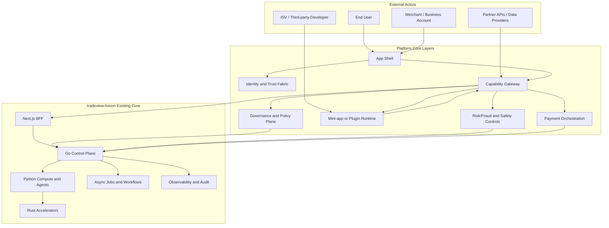

# SUPERAPP CONTEXT (Strategic Reference, not Product Scope)

> Stand: 27 Feb 2026  
> Zweck: Strategische Referenz fuer Super-App-Architekturen (v. a. China-Modelle) und deren uebertragbare Muster auf `tradeview-fusion`.

---

## 1) Kontext und Positionierung

Dieses Dokument ist **kein** Bauplan fuer eine klassische "alles-in-einer-App" Plattform.  
Es dient dazu, Architekturentscheidungen so zu treffen, dass:

- heutige Produktziele nicht verwässert werden,
- aber langfristige Plattformoptionen offen bleiben.

Kurz:

- **Nicht-Ziel:** Vollstaendige Super-App bauen.
- **Ziel:** Die sinnvollen Architekturprinzipien uebernehmen (capabilities, governance, trust, orchestration).

---

## 2) Was "China Super-App" architekturmaessig ausmacht

Typische Architekturmerkmale (aus WeChat/Alipay Oekosystem-Perspektive):

1. **App Shell + Mini-app Runtime**  
   Eine Kern-App hostet viele vertikale Dienste/mini-programs.
2. **Capability-Gating statt freier Zugriff**  
   Module bekommen nur explizit freigegebene Plattformfaehigkeiten.
3. **Rollenmodell fuer Oekosystem**  
   User, Merchant, ISV, Platform Operator mit unterschiedlichen Rechten.
4. **Identity + Payments als Core-Infrastruktur**  
   Sign-in/Trust/Payment sind nicht Feature-Details, sondern Plattformkerne.
5. **Governance-by-design**  
   Review, Versionierung, Rollback, Compliance und Audit als Standardprozess.

---

## 3) Gesamtgraph (Super-App Referenz ueber eure Architektur gelegt)

Interpretation:

- **Vorhanden (heute):** `NX/GO/PY/RU/AJ/OB`
- **Schnittmenge (naechster logischer Schritt):** `CG/GV/ID/RS`
- **Optionale Plattform-Erweiterung:** `MV/PO` (nur wenn Produkt-Use-Case es rechtfertigt)

---

## 4) Schnittmenge und Erweiterungsmenge

| Menge | Inhalt | Prioritaet |
|---|---|---|
| `A` (heute) | Next->Go->Python/Rust, async jobs, audit, policy baseline | Hoch (stabilisieren) |
| `A∩B` (shared) | Capability-Gating, stronger governance, trust fabric, risk controls | Sehr hoch (gezielt aufbauen) |
| `B\\A` (neu) | Mini-app runtime, ISV ecosystem, payment orchestration at platform level | Optional, use-case-getrieben |

---

## 5) Was fuer euren Use Case sinnvoll ist

### 5.1 Klar sinnvoll (jetzt einplanen)

- Capability-Registry (API/Tool scopes, versioniert)
- Governance Workflows (review/deploy/revoke)
- Trust-Fabric (user/service/agent identity mapping)
- Risk-tiered mutation gates (approval nach Risiko)
- **Aladdin-Prinzip (Bounded AI):** Inhaltsfilter, keine unerlaubten Empfehlungen. Agent-Tools an Risk-Tiers (read-only, bounded-write, approval-write). Pre-Trade Compliance: Regel-Engine vor Order. Siehe AGENT_ARCHITECTURE §3.

### 5.2 Spaeter evaluieren

- Mini-app/plugin runtime fuer erweiterbare Oberflaechen
- Payment orchestration als eigene Domain, wenn echte Multi-Processor-/Multi-Channel-Anforderungen auftreten

### 5.3 Bewusst out-of-scope

- "Alles in einer App" als Produktstrategie
- Ungesteuerte Drittmodule ohne Policy/Review
- Direkte Side-effect Tools ohne Audit + Idempotenz

---

## 6) Architekturprinzip fuer "nicht Super-App bauen, aber vorbereitet sein"

Das Leitmuster ist:

- **Core-first:** Bestehenden Kern robust machen.
- **Platform-ready:** Schnittmengenfaehigkeiten standardisieren.
- **Optional expansion:** Neue Plattformmengen nur KPI-/Use-case-getrieben aktivieren.

Formel:

`Future-ready = (Core reliability) + (Policy and trust) + (Composable extension points)`

---

## 7) Konkrete naechste Schritte fuer tradeview-fusion

1. Capability contracts in Go als erste Klasse modellieren.
2. Agent tools an risk tiers koppeln (read-only, bounded-write, approval-write).
3. Governance events als verpflichtende Audit-Events ablegen.
4. Identity claims ueber User/Service/Agent vereinheitlichen.
5. Optionalen Plugin-Pilot nur internal-only und reversible starten.

---

## 8) Quellen

### 8.1 Super-app / ecosystem references

- [WeChat Mini Program Platform Capabilities](https://developers.weixin.qq.com/miniprogram/dev/platform-capabilities/en/)
- [WeChat WMPF Technical Principle](https://developers.weixin.qq.com/doc/oplatform/en/Miniprogram_Frame/principle.html)
- [WeChat DevTools Stable Changelog](https://developers.weixin.qq.com/miniprogram/en/dev/devtools/stable.html)
- [Alipay+ ISV model](https://miniprogram.alipay.com/docs-alipayconnect/miniprogram_alipayconnect/platform/isv-overview)

### 8.2 Platform and governance references (2026)

- [NIST CAISI RFI on securing AI agent systems](https://www.nist.gov/news-events/news/2026/01/caisi-issues-request-information-about-securing-ai-agent-systems)
- [NIST AI Agent Standards Initiative](https://www.nist.gov/caisi/ai-agent-standards-initiative)
- [Federal Register RFI 2026-00206](https://www.federalregister.gov/documents/2026/01/08/2026-00206/request-for-information-regarding-security-considerations-for-artificial-intelligence-agents)
- [Kubernetes Ingress NGINX retirement statement](https://kubernetes.io/blog/2026/01/29/ingress-nginx-statement/)
- [Istio ambient multinetwork/multicluster beta](https://istio.io/latest/blog/2026/ambient-multinetwork-multicluster-beta/)

### 8.3 Rust and runtime strategy references (2026)

- [Rust 1.93.0](https://blog.rust-lang.org/2026/01/22/Rust-1.93.0/)
- [Rust 1.93.1](https://blog.rust-lang.org/2026/02/12/Rust-1.93.1/)
- [Rust 2026 project goals (reference)](https://rust-lang.github.io/rust-project-goals/2026/reference.html)
- [Rust 2026 highlights](https://rust-lang.github.io/rust-project-goals/2026/highlights.html)
- [Rust "Just add async" roadmap](https://rust-lang.github.io/rust-project-goals/2026/roadmap-just-add-async.html)
- [Rust high-level ML optimizations (proposed)](https://rust-lang.github.io/rust-project-goals/2026/high-level-ml.html)
- [Rust in safety-critical systems (2026)](https://blog.rust-lang.org/2026/01/14/what-does-it-take-to-ship-rust-in-safety-critical/)

