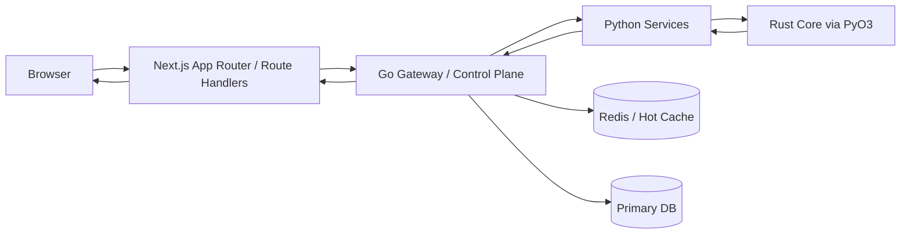
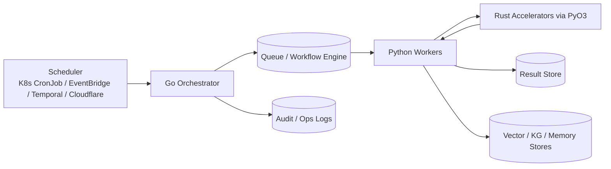
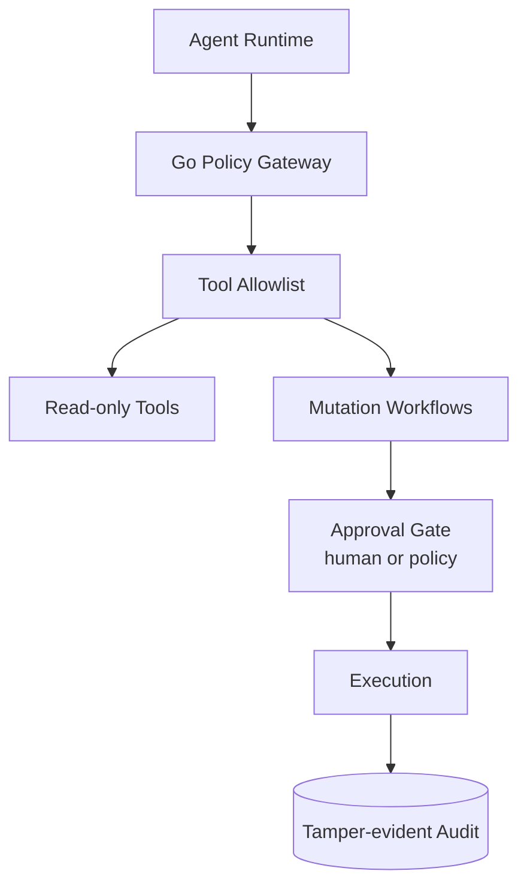

# ARCHITECTURE (SOTA 2026)

> Stand: 27 Feb 2026  
> Zweck: Verbindliche Zielarchitektur fuer `tradeview-fusion` inkl. Sync/Async-Datenpfade, Agent-Guardrails, Betriebsregeln und Quellenlage (2026).

---

## 1) Executive Summary

Die Plattform folgt einem **dual-path** Modell:

- **Sync Path:** User Request/Response fuer interaktive Nutzung  
  `Browser -> Next.js -> Go -> Python/Rust -> Go -> Next.js -> Browser`
- **Async Path:** Vorverarbeitung, Ingestion, Enrichment, Batch-Jobs  
  `Scheduler -> Go Orchestrator -> Queue/Workflow -> Python/Rust Worker -> Stores/Cache`

Leitprinzip:

- Next.js bleibt BFF/Thin-Proxy.
- Go ist zentrale Control Plane (Policy, AuthZ, Rate-Limit, Audit, Routing).
- Python ist Compute/ML/Agentic Processing.
- Rust ist Performance-Layer hinter Python (PyO3), kein eigener externer Service in v1.

---

## 2) Verbindliche Architekturprinzipien

1. **Single Entry Policy Layer:** Externe und mutierende Requests laufen ueber Go.
2. **No Direct Python from Browser:** Frontend spricht keine Python-Services direkt.
3. **No External Fetch in Python (prod):** Externe Source-Fetches liegen in Go-Connectors.
4. **Domain Writes are Go-owned:** RBAC/Rate-Limit/Audit fuer Mutationen zentral in Go.
5. **Dual-path by default:** User-Flow (sync) und Vorverarbeitung (async) werden getrennt betrieben.
6. **Contracts first:** Alle Route-/Payload-Contracts versioniert und testbar.
7. **Idempotency everywhere:** Mutationen und Jobs sind idempotent und replay-safe.
8. **Traceable by design:** End-to-end Request-/Job-Trace mit Correlation IDs.

---

## 3) Sync Request Path (User-facing)

### Sync Path Regeln

- Next.js fungiert als BFF und transportiert Request-Kontext (`X-Request-ID`, Auth-Context).
- Go erzwingt:
  - AuthN/AuthZ (Rollen + Scope)
  - Rate Limits (global + endpoint + actor)
  - Audit Events (mutierend und sicherheitsrelevant)
  - Input/Output Contract Validation
- Python liefert Compute-Ergebnisse, aber keine unkontrollierten Side Effects ohne Go-Policy-Gate.

---

## 4) Async Processing Path (Ingestion/Precompute)

### Async Path Regeln

- Keine langen Jobs im HTTP Request-Thread.
- Job-Trigger sind deklarativ, versioniert, mit Retry- und Timeout-Policy.
- Jeder Job besitzt:
  - `jobId`
  - `idempotencyKey`
  - `dedupHash` (falls inhaltlich relevant)
  - `traceId` / `requestId` (wenn aus User-Aktion entstanden)
- Fehlschlaege gehen in DLQ/Failure-Queue; keine stillen Drops.

---

## 5) Agent Architecture and Guardrails

### Agent-Sicherheitsregeln (verbindlich)

- Agenten sind **untrusted orchestrators**, keine direkten DB/Admin-Clients.
- Tool Calls laufen nur ueber policy-gepruefte Go-Endpunkte.
- Mutationen brauchen:
  - Scope-Pruefung
  - Idempotency Key
  - ggf. Approval-Gate (risk-tier-basiert)
- Prompt-Injection-resistente Tool-Policy:
  - least privilege
  - deny-by-default
  - explicit allowlists

---

## 6) Data and Ownership Matrix

| Concern | Owner | Pflichtregeln |
|---|---|---|
| API Edge / BFF | Next.js | Keine Domain-Truth-Logik in UI-Routen |
| Policy / Routing / AuthZ / Audit | Go | Zentral erzwingen, keine Bypaesse |
| ML/Analytics/Inference | Python | Compute-only, kontrollierte Side Effects |
| High-Performance Kernels | Rust via PyO3 | Deterministische Inputs/Outputs, Benchmarks |
| Scheduling/Batch | Scheduler + Go Orchestrator | Retry/DLQ/Idempotenz verpflichtend |
| Secrets | Go-side Secret Management | Keine Frontend- oder Client-Leaks |

---

## 7) Operational Controls (Muss-Zustand)

### 7.1 Reliability

- Circuit Breaking und Timeouts pro Downstream.
- Retries mit Backoff und Jitter (keine hot loops).
- Bulkheads fuer Compute-heavy Endpoints.

### 7.2 Observability

- OTel Traces/Metrics/Logs in allen Services.
- W3C Trace Context ueber Sync und Async Grenzen.
- Log-Dedup fuer repetitive Fehler-/Health-Loglines.
- Golden Signals pro Service: latency, errors, saturation, throughput.

### 7.3 Security

- Patch-Policy fuer Node/Go/Dependencies.
- Mandatory upgrade windows fuer kritische Advisories.
- RBAC + signed audit trail fuer mutierende Flows.

---

## 8) Scheduling Best Practices (2026)

1. **Start simple:** K8s CronJob/EventBridge Scheduler fuer klare periodische Jobs.
2. **Promote to workflow engine** (z. B. Temporal), wenn noetig:
   - lange Laufzeiten
   - komplexe Retries
   - Backfill/Replays
   - pausieren/resumieren/versionierte Schedules
3. **Kein Service-lokales Wildwuchs-Cron** fuer kritische Domain-Jobs.
4. **Jeder Schedule beobachtbar:** SLA, Drift, Queue-Backlog, DLQ-Rate.

---

## 9) Performance Strategy

- Standardpfad:
  - Go fuer IO, Routing, Control.
  - Python fuer ML/Analytics.
  - Rust fuer Hot Paths (numerisch/iterativ/parallel).
- Rust nur dort einsetzen, wo Profiling einen echten Bottleneck belegt.
- Optimierungspyramide:
  1. Algorithmen/Batching
  2. Caching/Data locality
  3. Concurrency/parallelism
  4. Native acceleration (Rust)

---

## 10) Rollout Plan (Kurz)

1. **Freeze Contracts** fuer Kernrouten (sync + async events).
2. **Harte Go ownership** fuer mutierende Domainpfade.
3. **Async Job Plane** fuer Ingestion/Enrichment aktivieren.
4. **Agent Guardrails** (allowlists, approval, audit) hard-enforce.
5. **OTel baseline** inkl. async context propagation vollstaendig machen.
6. **Performance gates** mit Benchmark-Schwellen fuer Rust-Hot-Paths.

---

## 11) Quellen (2026, primaer)

- Go:
  - [Go 1.26 is released](https://go.dev/blog/go1.26)
  - [Go 1.26 Release Notes](https://go.dev/doc/go1.26)
  - [Go Release History](https://go.dev/doc/devel/release)
- Next.js:
  - [Next.js Blog (2026 entries)](https://nextjs.org/blog)
  - [Building Next.js for an agentic future (Feb 2026)](https://nextjs.org/blog/agentic-future)
  - [Inside Turbopack incremental computation (Jan 2026)](https://nextjs.org/blog/turbopack-incremental-computation)
  - [Next.js Backend for Frontend Guide](https://nextjs.org/docs/app/guides/backend-for-frontend)
- Kubernetes / Gateway:
  - [Experimenting with Gateway API using kind (Jan 2026)](https://kubernetes.io/blog/2026/01/28/experimenting-gateway-api-with-kind/)
  - [Ingress NGINX retirement statement (Jan 2026)](https://kubernetes.io/blog/2026/01/29/ingress-nginx-statement/)
  - [Gateway API concept docs](https://v1-34.docs.kubernetes.io/docs/concepts/services-networking/gateway/)
- OpenTelemetry:
  - [Improving Async Workflow Observability in Dapr (Jan 2026)](https://opentelemetry.io/blog/2026/dapr-workflow-observability/)
  - [OpenTelemetry eBPF Instrumentation 2026 Goals](https://opentelemetry.io/blog/2026/obi-goals/)
  - [OpenTelemetry Collector Follow-up Survey (Jan 2026)](https://opentelemetry.io/blog/2026/otel-collector-follow-up-survey-analysis/)
  - [Log Deduplication Processor (Jan 2026)](https://opentelemetry.io/blog/2026/log-deduplication-processor/)
  - [OpenTelemetry 2026 index](https://opentelemetry.io/blog/2026/)
- Node.js / Runtime Security:
  - [Node.js DOS mitigation advisory (Jan 2026)](https://nodejs.org/en/blog/vulnerability/january-2026-dos-mitigation-async-hooks)
- AI Agent Security / Standards:
  - [NIST CAISI RFI on Securing AI Agent Systems (Jan 2026)](https://www.nist.gov/news-events/news/2026/01/caisi-issues-request-information-about-securing-ai-agent-systems)
  - [Federal Register RFI 2026-00206](https://www.federalregister.gov/documents/2026/01/08/2026-00206/request-for-information-regarding-security-considerations-for-artificial-intelligence-agents)
  - [NIST AI Agent Standards Initiative (Feb 2026)](https://www.nist.gov/caisi/ai-agent-standards-initiative)
  - [NIST Initiative Announcement (Feb 2026)](https://www.nist.gov/news-events/news/2026/02/announcing-ai-agent-standards-initiative-interoperable-and-secure)
- Scheduling / Ops:
  - [Temporal Schedule docs (Schedules over Cron Jobs)](https://docs.temporal.io/schedule)
  - [Temporal Cron Job docs (recommends Schedules)](https://docs.temporal.io/cron-job)
  - [Cloudflare Cron Triggers](https://developers.cloudflare.com/workers/configuration/cron-triggers/)
  - [Cloudflare Trigger Workflows](https://developers.cloudflare.com/workflows/build/trigger-workflows/)
  - [AWS EventBridge Scheduler resource metrics (Feb 2026)](https://aws.amazon.com/about-aws/whats-new/2026/02/amazon-eventbridge-scheduler-resource-metrics/)
  - [AWS EventBridge pattern best practices](https://docs.aws.amazon.com/eventbridge/latest/userguide/eb-patterns-best-practices.html)
  - [AWS EventBridge rules best practices](https://docs.aws.amazon.com/eventbridge/latest/userguide/eb-rules-best-practices.html)

---

## 12) Rust Strategy 2026/27 (No-Julia-first ADR)

### 12.1 Entscheidung

Die Plattform verfolgt bis auf Weiteres eine **No-Julia-first** Strategie:

- Primarer Compute-Stack bleibt `Python + Rust (PyO3)`.
- Rust ist der bevorzugte Pfad fuer performance-kritische Produktionslogik.
- Julia ist optionaler Spezialpfad fuer eng abgegrenzte numerische Use Cases.

### 12.2 Begruendung

- Bestehender Stack ist bereits auf `Go -> Python -> Rust` ausgerichtet.
- Laufzeit-, Build- und Betriebskomplexitaet bleiben geringer als bei einer vierten Kernsprache.
- 2026 Rust-Schwerpunkte adressieren zentrale Zukunftsthemen:
  - Cross-language interop
  - async/network services
  - safety-critical & supply-chain
  - Wasm Components

### 12.3 Trigger, wann Julia trotzdem sinnvoll wird

Julia darf in Betracht gezogen werden, wenn **alle** Punkte erfuellt sind:

1. Der Bottleneck ist nachweislich numerisch-algorithmisch (Profiling + reproduzierbarer Benchmark).
2. Rust-Implementierung oder Rust-Optimierung erreicht Ziel-SLO nicht.
3. Ein klarer Business-Impact ist quantifiziert (z. B. Latenz-/Kostenhebel pro Monat).
4. Betriebsmodell ist geklaert (Packaging, Security, Monitoring, Oncall-Faehigkeit).
5. Es gibt einen Exit-/Portierungsplan zur Vermeidung von langfristigem Lock-in.

### 12.4 Bevorzugte Upgrades vor Julia

1. Rust-Hot-Path Ausbau (SIMD/parallel/no-copy boundaries).
2. PyO3 Boundary-Hardening (strict schemas, error contracts, perf counters).
3. Wasm-Component Plugin-Pfade fuer kontrollierte Erweiterbarkeit.
4. Async-/Trait-Ergonomie-Verbesserungen aus Rust 2026 Roadmaps adaptieren.
5. Supply-chain Hardening (trusted publishing, advisory scanning, reproducible builds).

---

## 13) Super-App Readiness Model (A, B, A∩B, B\\A)

### 13.1 Mengen

- `A` = heutige Kernarchitektur von `tradeview-fusion`
- `B` = Plattformfaehigkeiten typischer Super-App-Oekosysteme
- `A∩B` = bereits vorhandene Schnittmenge
- `B\\A` = potentielle Erweiterungsmenge

### 13.2 A (heute)

- `A1` Control Plane (`Next -> Go -> Python/Rust`)
- `A2` Policy Enforcements (RBAC, Rate-Limit, Audit)
- `A3` Async Ingestion + Enrichment
- `A4` Agent Guardrails (baseline)
- `A5` Domain-centric Contracts

### 13.3 B (Super-App-Referenz)

- `B1` Mini-app Runtime + Capability-Gating
- `B2` Ecosystem Roles (Merchant/ISV/Template/Marketplace)
- `B3` Unified Identity & Trust Fabric (Human + Service + Agent)
- `B4` Payment Orchestration + Routing + Reconciliation
- `B5` Discovery/Recommendation/Growth Layer
- `B6` Platform Governance (review flows, policy tiers, app lifecycle)
- `B7` Risk/Fraud Decisioning
- `B8` Region/Compliance/Data-Residency planes

### 13.4 A∩B (starke Ausgangsbasis)

- Zentrale Policy Engine im Gateway
- Nachvollziehbare Audit-/Tracing-Pfade
- Event-/Job-basierte Async-Architektur
- Multi-domain Routing mit klaren Ownership-Grenzen

### 13.5 B\\A (gezielte Option, kein Muss)

- Capability Model fuer externe/halbexterne Module
- Ecosystem-/Partnerrollen mit klaren Vertragsgrenzen
- Payment-Control-Domain als eigene Schicht
- Trust-Fabric ueber User, Service und Agentenidentitaeten

---

## 14) Platform Expansion Principles (ohne Scope-Creep)

1. **Product-first statt Super-App-first:** Keine Voll-Super-App als Ziel.
2. **Capability-first:** Erweiterungen nur ueber versionierte Capabilities, nie via direkten Core-Zugriff.
3. **Governance-first:** Neue Flows nur mit Policy, Audit, Rollback und Owner.
4. **Domain-first Payments:** Zahlungs- und Risiko-Logik als eigene Control Domain.
5. **Trust-first Agents:** Agenten nur ueber least-privilege Tools, approval gates fuer side effects.
6. **Composable Architecture:** Neue Faehigkeiten als additive Layer, kein Rewrite-Zwang.

---

## 15) Evolution Plan (90/180/360 Tage)

### 15.1 90 Tage (Foundation)

- `A∩B` stabilisieren: tracing, idempotency, audit, async reliability.
- Capability Registry fuer interne Module einziehen (versioniert + allowlist).
- Agent tool policy contracts formalisieren.

### 15.2 180 Tage (Selective Expansion)

- Payment-Orchestration Domain als optionalen Adapter-Layer vorbereiten.
- Partner-/ISV boundary model als Spezifikation aufsetzen (noch ohne Marketplace).
- Trust-Fabric Backlog konkretisieren (user/service/agent identity mapping).

### 15.3 360 Tage (Platform Optionality)

- Optionales Mini-app/plugin runtime pilotieren (zunaechst internal-only).
- Governance workflows fuer plugin lifecycle (review, deploy, revoke) erproben.
- Nur nach KPI-Nachweis auf externe Oekosystemoefnung gehen.

---

## 16) Scope-Hinweis fuer dieses Dokument

Dieses Dokument ist die Zielarchitektur-Referenz. Detaillierte route-by-route Zuordnung bleibt in:

- `docs/specs/UIL_ROUTE_MATRIX.md`
- `docs/specs/API_CONTRACTS.md`
- `docs/PROXY_CONVENTIONS.md`
- `docs/specs/SYSTEM_STATE.md`
- `docs/specs/EXECUTION_PLAN.md`
- `docs/SUPERAPP.md`

