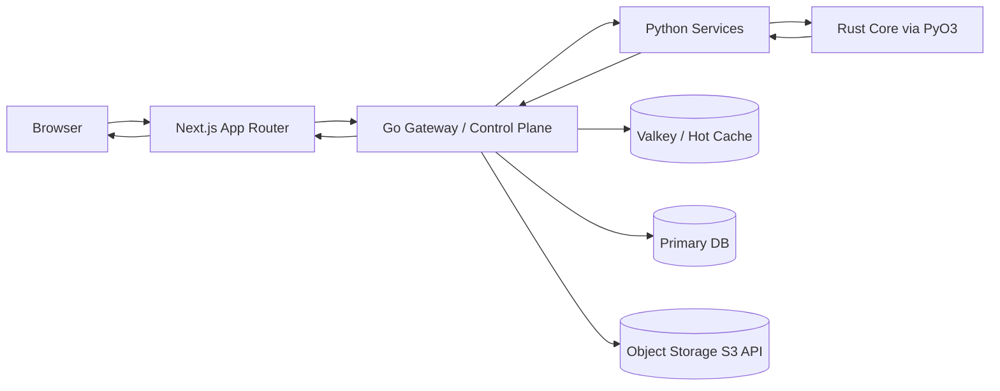
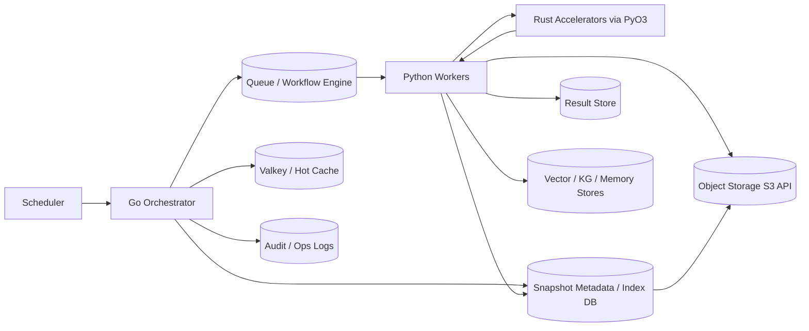

# ARCHITECTURE BASELINE

> **Stand:** 17. Maerz 2026  
> **Zweck:** Aktueller Architektur-IST, verbindliche Prinzipien, Sync/Async-Pfade,
> Operational Controls, Performance-Strategie, Service Blueprint und
> Platform-Expansion-Prinzipien. Stack-spezifische Details leben in den Owner-Specs.
> **Source-of-Truth-Rolle:** Autoritativ fuer Architekturgrenzen und Verantwortlichkeiten.
> Detail-Contracts liegen in den spezialisierten Owner-Specs.

---

## 1. IST-Zustand (kompakt)

- `Next.js` ist UI plus BFF-Schicht (`/api/*`).
- `Go Gateway` ist zentrale Frontdoor fuer viele Kernpfade (`/api/v1/*`) mit
  Policy/Auth/Audit/Rate-Limits/Streaming.
- Python-Services laufen als getrennte Domains:
  - `finance-bridge`, `indicator-service`, `geopolitical-soft-signals`
  - `memory-service`, `agent-service`
- Data-Layer heute:
  - Relational lokal stark Prisma/SQLite-gepraegt
  - KG aktuell `Kuzu` (mit SQLite-Fallback)
  - Vector aktuell `ChromaDB`
  - Object Storage ueber Filesystem/S3-kompatiblen Pfad (SeaweedFS lokal)
  - Cache in-memory, Redis-kompatibel optional
  - NATS JetStream optional vorhanden

---

## 2. Verbindliche Architekturprinzipien

1. **Single Entry Policy Layer:** Externe und mutierende Requests laufen ueber Go.
2. **No Direct Python from Browser:** Frontend spricht keine Python-Services direkt.
3. **No External Fetch in Python (prod):** Externe Source-Fetches liegen in Go-Connectors.
4. **Domain Writes are Go-owned:** RBAC/Rate-Limit/Audit fuer Mutationen zentral in Go.
5. **Dual-path by default:** User-Flow (sync) und Vorverarbeitung (async) werden getrennt betrieben.
6. **Contracts first:** Alle Route-/Payload-Contracts versioniert und testbar.
7. **Idempotency everywhere:** Mutationen und Jobs sind idempotent und replay-safe.
8. **Traceable by design:** End-to-end Request-/Job-Trace mit Correlation IDs.

Leitprinzip Sprachschnitt:

- **Next.js:** BFF/Thin-Proxy; keine Domain-Truth-Logik in UI-Routen.
- **Go:** Control Plane — Policy, AuthZ, Rate-Limit, Audit, Routing.
- **Python:** logisch getrennt in `compute`, `agent` und `indexing`.
- **Rust:** gezielter Hot-Path-Compute-Layer via PyO3; Einsatz nur mit Profiling-Nachweis.

---

## 3. Sync Request Path

**Sync Path Regeln:**

- Next.js fungiert als BFF und transportiert Request-Kontext (`X-Request-ID`, Auth-Context).
- Go erzwingt: AuthN/AuthZ, Rate Limits, Audit Events, Input/Output Contract Validation.
- Objektzugriffe (Upload/Download) laufen ueber signierte, kurzlebige Go-Pfade.
- Python liefert Compute-Ergebnisse — keine unkontrollierten Side Effects ohne Go-Policy-Gate.

---

## 4. Async Processing Path (Ingestion/Precompute)

**Async Path Regeln:**

- Keine langen Jobs im HTTP Request-Thread.
- Job-Trigger sind deklarativ, versioniert, mit Retry- und Timeout-Policy.
- Jeder Job besitzt: `jobId`, `idempotencyKey`, `dedupHash`, `traceId`.
- Artefakte (PDF, Audio, Parquet) werden object-first gespeichert.
- Source-Pipeline trennt: raw blob -> Snapshot-Metadaten (relational) -> normalisierte Outputs -> KG/vector.
- Fehlschlaege gehen in DLQ; keine stillen Drops.

---

## 5. Target Planes (Sollbild)

| Ebene | Rolle |
|:------|:------|
| Frontend Layer | Next.js UI/UX; begrenzte BFF-Aufgaben |
| Control Plane | Go Gateway — Public Entry, Auth, Policy, Audit, Streaming |
| Compute Plane | Python — Indicators, Aggregation, Feature Engineering, Backtesting-nahe Analytics |
| Agent Plane | Python — Retrieval, Context Assembly, Verification, Tooling, Simulation |
| Indexing Plane | Python — Parse/Normalize/Chunk/Embed/Graph-Extract/Reindex |
| Data/Execution Plane (Go intern) | marketcore/execution/adapters getrennt vom Public Gateway |
| Data/Knowledge Plane | Postgres + pgvector + FalkorDB + SeaweedFS + Valkey + DuckDB |
| Execution/Worker Plane | NATS JetStream + flow-spezifische Workflow-Orchestrierung |

---

## 6. Verbindliche Architekturentscheidungen

1. **Go bleibt Control Plane.** Public Entry, AuthN/AuthZ, Policy, Audit, Streaming bleiben Go-owned.
2. **BFF-Drift wird reduziert.** Next-BFF bleibt fuer frontend-nahe Aufgaben, nicht als zweite Domain-Truth.
3. **Data/Knowledge Zielbild ist klar.** `Postgres` bleibt SoR; `pgvector` ist baseline semantic retrieval fuer dokumentnahe Embeddings; `FalkorDB` ist graph-/entity-zentrierte Retrieval- und Memory-Schicht.
4. **Kuzu bleibt Uebergang/Fastlane**, nicht Zielsystem.
5. **Valkey ist Cache-Default.** Redis-Kompatibilitaet bleibt.
6. **NATS ist Messaging**, nicht komplette Workflow-Semantik. Langlaufende Flows brauchen Workflow-Schicht.
7. **Service Ownership bleibt strikt.** Kein unkontrolliertes Cross-Service-Schreiben in fremde Stores.
8. **Large payloads object-first.** Grosse Ergebnisse als Artefaktpfad statt riesiger JSON-Responses.
9. **Tabellarische Data Plane ist standardisiert.** `DuckDB + Polars + Arrow + Parquet` bilden die Default-Linie fuer Worker-, Replay- und Analysepfade.
10. **Analytics-Stufen bleiben getrennt.** `DuckDB` zuerst, `MotherDuck` nur bei echter Concurrency-/Cloud-Stufe, `Druid` nur fuer spaetere verteilte Realtime-Analytics.

---

## 7. Operational Controls (Muss-Zustand)

### 7.1 Reliability

- Circuit Breaking und Timeouts pro Downstream.
- Retries mit Backoff und Jitter (keine hot loops).
- Bulkheads fuer Compute-heavy Endpoints.

### 7.2 Observability

- OTel Traces/Metrics/Logs in allen Services.
- W3C Trace Context ueber Sync und Async Grenzen.
- Log-Dedup fuer repetitive Fehler-/Health-Loglines.
- Golden Signals pro Service: latency, errors, saturation, throughput.

### 7.3 Security

- Patch-Policy fuer Node/Go/Dependencies.
- Mandatory upgrade windows fuer kritische Advisories.
- RBAC + signed audit trail fuer mutierende Flows.

---

## 8. Performance-Strategie

- Standardpfad: Go fuer IO/Routing/Control -> Python fuer ML/Analytics -> Rust fuer Hot Paths.
- Rust nur dort einsetzen, wo Profiling einen echten Bottleneck belegt.
- Optimierungspyramide:
  1. Algorithmen/Batching
  2. Caching/Data locality
  3. Concurrency/Parallelism
  4. Native acceleration (Rust)

---

## 9. Rust-Strategie ADR

> Vollstaendige Rust-ADR (No-Julia-first, PyO3-Regeln, Kernel-Module, Einsatz-Kriterien):
> **`docs/specs/architecture/RUST_COMPUTE_LAYER.md`**

Kurzfassung: Plattform verfolgt No-Julia-first. Rust ist selektiver Hot-Path-Layer via PyO3,
Einsatz nur mit Profiling-Nachweis. Standardpfad: Go → Python → Rust.

---

## 10. Migrationsphasen

### Phase A (kurzfristig)

- API-Kanten stabilisieren; P0-Contract-Drifts schliessen (agent/chat, portfolio/order, Capability-Enforcement).
- BFF-Drift reduzieren; Valkey als Cache-Default verankern.
- Bestehende Python-/GCT-Pfade mit stabilen Contracts weiterfuehren.

### Phase B (mittelfristig)

- Postgres als zentrale Persistenz verankern.
- pgvector produktiv aufnehmen.
- FalkorDB als produktiven Graph-Layer einfuehren.
- Ingestion/Indexing als getrennten Worker-Tier etablieren.

### Phase C (erweitert)

- Workflow-Schicht fuer komplexe Flows finalisieren.
- NATS + Workflow kombiniert betreiben.
- End-to-end Observability fuer kritische Pfade vollziehen.

---

## 11. Service Blueprint (verbindliche Modulgrenzen)

> Normative Schnittordnung innerhalb der bestehenden Struktur — keine Pflicht zur sofortigen Microservice-Zerlegung.

### 11.1 Frontend Surface

> Vollstaendige Frontend-Architecture-Spec: **`docs/specs/architecture/FRONTEND_ARCHITECTURE.md`**

Surfaces: `app-shell`, `geomap-surface`, `review-studio`, `simulation-workbench`,
`portfolio-workspace`, `notes-journal`. Tech Stack: Next.js 16, React 19, TanStack Query 5,
Zustand, Tailwind 4 + shadcn/ui. BFF-Schicht — keine Domain-Truth im Client.

### 11.2 Go Control Plane

- `gateway` (public API, auth/authz, rate limit, correlation, contracts)
- `connector-router` (provider dispatch, fallback, retry, quota)
- `stream-hub` (SSE/WebSocket multiplexing)
- `job-controller` (async jobs, status, cancellation, checkpoint)
- `promotion-gate` (policy/review gates fuer write-nahe Promotion)
- `audit-timeline` (append-only audit and mutation timeline)

### 11.3 Python Intelligence Plane

#### Python Compute

- `indicator-runtime` (indicators, aggregations, feature engineering)
- `research-analytics` (batch analytics, replay, backtesting-nahe Forschung)

#### Python Agent

- `retrieval-orchestrator` (federated retrieval ueber APIs/graph/vector/web)
- `verifier` (claim decomposition, evidence collection, stance/confidence)
- `agent-runtime` (planner/executor/replanner, tool invocation, policy hooks)
- `simulation-core` (rollouts, branch generation, scoring)
- `context-assembler` (M1-M5 assembly, budgets, freshness/degradation flags)

#### Python Indexing

- `labeling-pipeline` (extract/classify/dedup/route fuer UIL)
- `indexing-workers` (parse, normalize, chunk, embed, graph-extract, publish)

### 11.4 Rust Acceleration Plane

> Vollstaendige Rust-Spec: **`docs/specs/architecture/RUST_COMPUTE_LAYER.md`**

Kernel: `graph-kernels`, `spatial-kernels`, `ode-kernels`, `mc-kernels`, `indicator-kernels`.
Alle via PyO3; Einsatz nur mit Profiling-Nachweis.

---

## 12. Platform-Expansion-Prinzipien

1. **Product-first statt Super-App-first.** Keine Voll-Super-App als Ziel.
2. **Capability-first.** Erweiterungen nur ueber versionierte Capabilities.
3. **Governance-first.** Neue Flows nur mit Policy, Audit, Rollback und Owner.
4. **Domain-first Payments.** Zahlungs- und Risiko-Logik als eigene Control Domain.
5. **Trust-first Agents.** Agenten nur ueber least-privilege Tools; approval gates fuer side effects.
6. **Composable Architecture.** Neue Faehigkeiten als additive Layer, kein Rewrite-Zwang.

**Evolution (grob):**

- **90 Tage:** P0-Contract-Drifts schliessen; Capability Registry verankern; Agent Tool Policy formalisieren.
- **180 Tage:** Payment-Adapter Layer vorbereiten; Partner-/ISV-Boundary-Modell als Spec aufsetzen.
- **360 Tage:** Optionales Plugin-Runtime pilotieren; Governance Workflows erproben.

---

## 13. Querverweise

- `docs/specs/ARCHITECTURE.md` (Umbrella/Navigation)
- `docs/specs/SYSTEM_STATE.md`
- `docs/specs/architecture/FRONTEND_ARCHITECTURE.md`
- `docs/specs/architecture/RUST_COMPUTE_LAYER.md`
- `docs/specs/architecture/GO_GATEWAY_BOUNDARY.md`
- `docs/specs/architecture/AGENT_RUNTIME_ARCHITECTURE.md`
- `docs/specs/architecture/MEMORY_AND_STORAGE_BOUNDARIES.md`
- `docs/specs/architecture/ORCHESTRATION_AND_MESSAGING.md`
- `docs/specs/architecture/DOMAIN_CONTRACTS.md`
- `docs/specs/data/DATA_ARCHITECTURE.md`
- `docs/specs/data/AGGREGATION_IST_AND_GAPS.md`
- `docs/ARCHITECTURE_NEW_EXTENSION.md`
